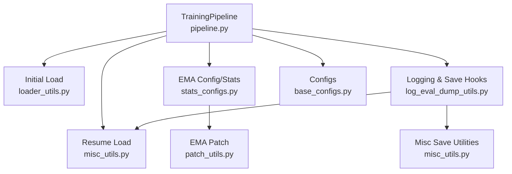
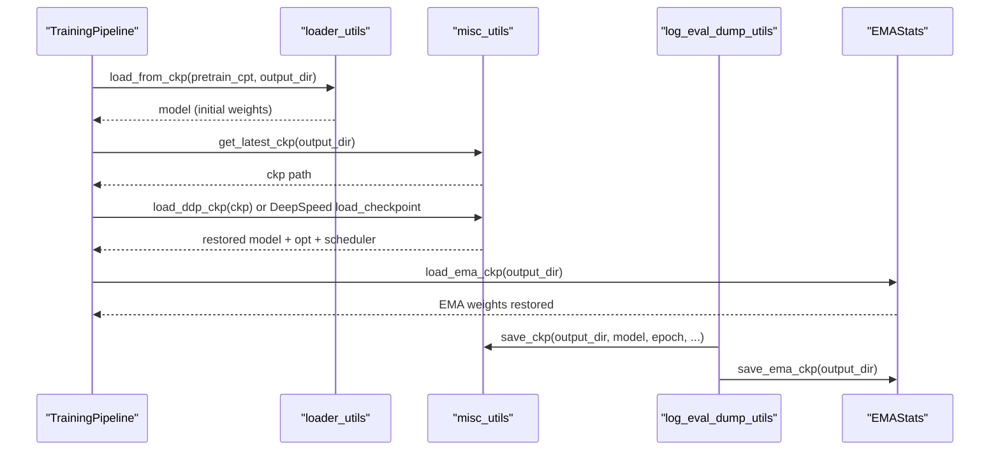
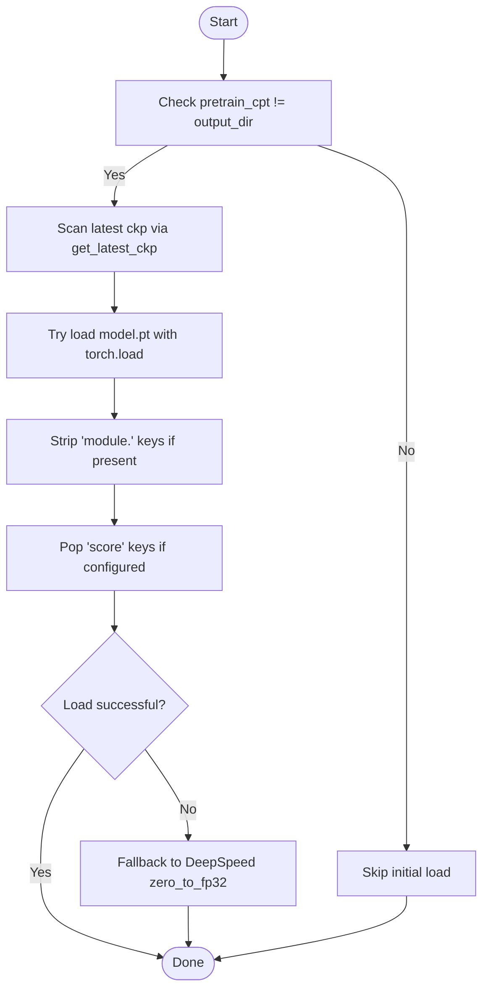
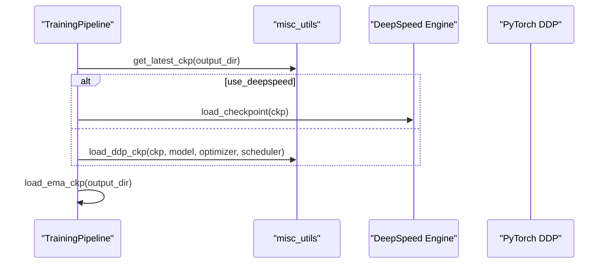
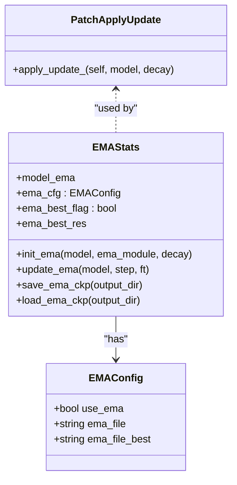
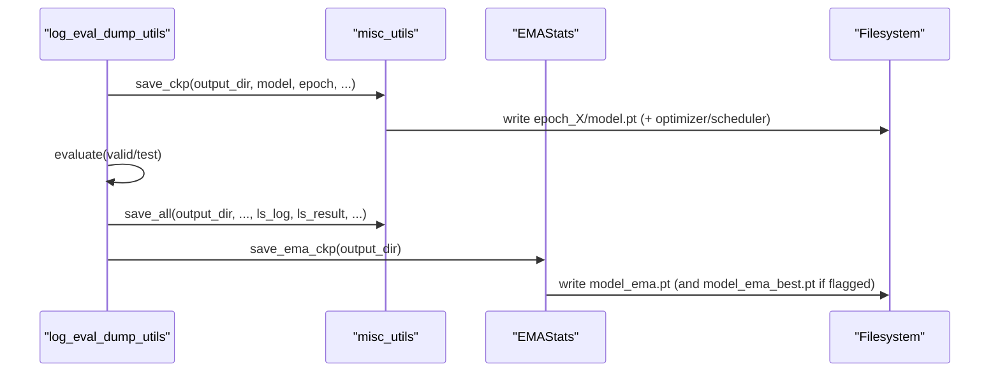
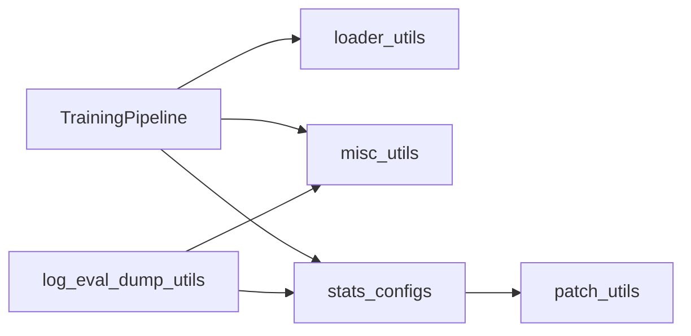

# Checkpoint Management

<cite>
**Referenced Files in This Document**
- [pipeline.py](file://src/training/pipeline.py)
- [loader_utils.py](file://src/utils/loader_utils.py)
- [misc_utils.py](file://src/utils/misc_utils.py)
- [stats_configs.py](file://src/conf/stats_configs.py)
- [log_eval_dump_utils.py](file://src/utils/log_eval_dump_utils.py)
- [base_configs.py](file://src/conf/base_configs.py)
- [patch_utils.py](file://src/utils/patch_utils.py)
- [train_pretrain.py](file://examples/train_pretrain.py)
- [train_supervised.py](file://examples/train_supervised.py)
</cite>

## Table of Contents
1. [Introduction](#introduction)
2. [Project Structure](#project-structure)
3. [Core Components](#core-components)
4. [Architecture Overview](#architecture-overview)
5. [Detailed Component Analysis](#detailed-component-analysis)
6. [Dependency Analysis](#dependency-analysis)
7. [Performance Considerations](#performance-considerations)
8. [Troubleshooting Guide](#troubleshooting-guide)
9. [Conclusion](#conclusion)
10. [Appendices](#appendices)

## Introduction
This document explains the checkpoint management system used throughout the training pipeline. It covers how checkpoints are saved and loaded, including initial loading from pre-trained models, resuming training, and managing Exponential Moving Average (EMA) checkpoints. It also documents file formats, storage locations, naming conventions, and the resume process including optimizer and scheduler state restoration. Practical examples, validation tips, and troubleshooting advice are included, along with best practices for maintenance and backups.

## Project Structure
Checkpoint management spans several modules:
- Training orchestration and lifecycle: pipeline
- Utilities for saving/loading and scanning checkpoints: misc_utils
- Initial pre-trained model loading: loader_utils
- EMA configuration and management: stats_configs and patch_utils
- Logging and evaluation hooks that trigger saves: log_eval_dump_utils
- Configuration for training and optimizer flags: base_configs
- Example entry points: train_pretrain.py, train_supervised.py

**Diagram sources**
- [pipeline.py:15-216](file://src/training/pipeline.py#L15-L216)
- [loader_utils.py:161-220](file://src/utils/loader_utils.py#L161-L220)
- [misc_utils.py:69-122](file://src/utils/misc_utils.py#L69-L122)
- [stats_configs.py:94-147](file://src/conf/stats_configs.py#L94-L147)
- [log_eval_dump_utils.py:565-647](file://src/utils/log_eval_dump_utils.py#L565-L647)
- [base_configs.py:132-164](file://src/conf/base_configs.py#L132-L164)
- [patch_utils.py:10-42](file://src/utils/patch_utils.py#L10-L42)

**Section sources**
- [pipeline.py:15-216](file://src/training/pipeline.py#L15-L216)
- [loader_utils.py:161-220](file://src/utils/loader_utils.py#L161-L220)
- [misc_utils.py:69-122](file://src/utils/misc_utils.py#L69-L122)
- [stats_configs.py:94-147](file://src/conf/stats_configs.py#L94-L147)
- [log_eval_dump_utils.py:565-647](file://src/utils/log_eval_dump_utils.py#L565-L647)
- [base_configs.py:132-164](file://src/conf/base_configs.py#L132-L164)
- [patch_utils.py:10-42](file://src/utils/patch_utils.py#L10-L42)

## Core Components
- TrainingPipeline orchestrates checkpoint lifecycle:
  - Initial pre-trained model loading via loader_utils
  - Resume loading via misc_utils
  - EMA initialization and management via stats_configs and patch_utils
  - Save triggers via log_eval_dump_utils hooks
- EMAStats encapsulates EMA configuration and provides save/load/update helpers
- MiscUtils provides save/load utilities for DDP and DeepSpeed, plus checkpoint scanning
- LoaderUtils provides robust loading with fallbacks to DeepSpeed zero-to-fp32
- Log/Eval utilities coordinate periodic saves and evaluation

Key responsibilities:
- Storage layout: epoch-based directories with per-step subdirectories for DeepSpeed
- File naming: model.pt, optimizer and scheduler state files, EMA files
- Resume detection: presence of log.csv determines resume vs. initial load

**Section sources**
- [pipeline.py:166-202](file://src/training/pipeline.py#L166-L202)
- [stats_configs.py:94-147](file://src/conf/stats_configs.py#L94-L147)
- [misc_utils.py:41-49](file://src/utils/misc_utils.py#L41-L49)
- [loader_utils.py:176-220](file://src/utils/loader_utils.py#L176-L220)
- [log_eval_dump_utils.py:565-647](file://src/utils/log_eval_dump_utils.py#L565-L647)

## Architecture Overview
The checkpoint system integrates with the training loop and evaluation hooks. Periodic training iterations trigger evaluation and saving. The pipeline decides whether to resume from an existing output directory or initialize from a pre-trained checkpoint.

**Diagram sources**
- [pipeline.py:166-202](file://src/training/pipeline.py#L166-L202)
- [loader_utils.py:161-220](file://src/utils/loader_utils.py#L161-L220)
- [misc_utils.py:41-49](file://src/utils/misc_utils.py#L41-L49)
- [log_eval_dump_utils.py:565-647](file://src/utils/log_eval_dump_utils.py#L565-L647)
- [stats_configs.py:125-146](file://src/conf/stats_configs.py#L125-L146)

## Detailed Component Analysis

### Initial Checkpoint Loading from Pre-trained Models
- Purpose: Load pre-trained weights when resuming from an existing output directory or when a separate pretrain_cpt is provided.
- Mechanism:
  - Scans pretrain_cpt for latest epoch directory
  - Attempts to load model.pt via PyTorch load
  - Strips “module.” prefix if present
  - Falls back to DeepSpeed zero_to_fp32 conversion if PyTorch load fails
- Behavior:
  - Skips keys containing “score” when instructed
  - Supports EMA-based loading from ../model_ema_best.pt when requested

**Diagram sources**
- [loader_utils.py:161-220](file://src/utils/loader_utils.py#L161-L220)
- [misc_utils.py:41-49](file://src/utils/misc_utils.py#L41-L49)

**Section sources**
- [loader_utils.py:161-220](file://src/utils/loader_utils.py#L161-L220)
- [misc_utils.py:41-49](file://src/utils/misc_utils.py#L41-L49)

### Resume Checkpoint Functionality
- Detection:
  - Resume occurs when pretrain_cpt equals output_dir and mode allows resume
  - Presence of log.csv in output_dir overrides pretrain_cpt to resume from output_dir
- Loading:
  - DeepSpeed: uses engine.load_checkpoint
  - DDP: loads model.pt, optimizer state, and scheduler state via load_ddp_ckp
- EMA:
  - After resume, EMA checkpoint is loaded from output_dir/model_ema.pt

**Diagram sources**
- [pipeline.py:179-202](file://src/training/pipeline.py#L179-L202)
- [misc_utils.py:208-228](file://src/utils/misc_utils.py#L208-L228)

**Section sources**
- [pipeline.py:129-202](file://src/training/pipeline.py#L129-L202)
- [misc_utils.py:208-228](file://src/utils/misc_utils.py#L208-L228)

### EMA Checkpoint Management
- Configuration:
  - EMAConfig defines use_ema and filenames for EMA checkpoints
- Initialization:
  - EMAStats creates ModelEmaV3 wrapper around model.module
  - Patch ensures dtype alignment for EMA updates in mixed precision environments
- Update:
  - EMAStats.update_ema invoked per step or epoch depending on mode
- Save/Load:
  - EMA state saved to model_ema.pt and optionally model_ema_best.pt when flagged

**Diagram sources**
- [stats_configs.py:94-147](file://src/conf/stats_configs.py#L94-L147)
- [patch_utils.py:10-42](file://src/utils/patch_utils.py#L10-L42)

**Section sources**
- [stats_configs.py:94-147](file://src/conf/stats_configs.py#L94-L147)
- [patch_utils.py:10-42](file://src/utils/patch_utils.py#L10-L42)

### Save and Logging Hooks
- Trigger conditions:
  - Pretraining: periodic steps based on schedule.steps_per_saving
  - Finetuning: at epoch end
- Actions:
  - Save model checkpoint (epoch_X), optimizer, scheduler
  - Evaluate and compute metrics on valid/test sets
  - Write logs (log.csv), results (result.csv), and predictions
  - Save EMA checkpoint to output_dir

**Diagram sources**
- [log_eval_dump_utils.py:565-647](file://src/utils/log_eval_dump_utils.py#L565-L647)
- [misc_utils.py:69-176](file://src/utils/misc_utils.py#L69-L176)
- [stats_configs.py:138-146](file://src/conf/stats_configs.py#L138-L146)

**Section sources**
- [log_eval_dump_utils.py:565-647](file://src/utils/log_eval_dump_utils.py#L565-L647)
- [misc_utils.py:69-176](file://src/utils/misc_utils.py#L69-L176)
- [stats_configs.py:138-146](file://src/conf/stats_configs.py#L138-L146)

### Configuration and Flags
- TrainingConfig controls:
  - pretrain_cpt, output_dir, use_deepspeed, schedule parameters
- OptimizerConfig controls:
  - use_ema, ema_decay
- These flags drive EMA initialization and save/load behavior

**Section sources**
- [base_configs.py:132-164](file://src/conf/base_configs.py#L132-L164)
- [base_configs.py:76-88](file://src/conf/base_configs.py#L76-L88)

## Dependency Analysis
- TrainingPipeline depends on:
  - loader_utils for initial load
  - misc_utils for resume and save utilities
  - stats_configs for EMA configuration and stats
  - log_eval_dump_utils for periodic save and evaluation
- EMAStats depends on:
  - timm.utils.ModelEmaV3 and load_checkpoint/get_state_dict/unwrap_model
  - patch_utils for dtype-aware EMA updates

**Diagram sources**
- [pipeline.py:15-216](file://src/training/pipeline.py#L15-L216)
- [loader_utils.py:161-220](file://src/utils/loader_utils.py#L161-L220)
- [misc_utils.py:69-176](file://src/utils/misc_utils.py#L69-L176)
- [stats_configs.py:94-147](file://src/conf/stats_configs.py#L94-L147)
- [log_eval_dump_utils.py:565-647](file://src/utils/log_eval_dump_utils.py#L565-L647)
- [patch_utils.py:10-42](file://src/utils/patch_utils.py#L10-L42)

**Section sources**
- [pipeline.py:15-216](file://src/training/pipeline.py#L15-L216)
- [stats_configs.py:94-147](file://src/conf/stats_configs.py#L94-L147)
- [patch_utils.py:10-42](file://src/utils/patch_utils.py#L10-L42)

## Performance Considerations
- Mixed precision and EMA:
  - The EMA patch ensures model parameters are cast to the same dtype as EMA buffers, preventing silent updates in fp16 environments.
- Checkpoint frequency:
  - steps_per_saving and epoch-based saves balance I/O overhead against recovery safety.
- Distributed training:
  - DeepSpeed handles global step directories; rank coordination avoids race conditions on directory creation.

[No sources needed since this section provides general guidance]

## Troubleshooting Guide
Common issues and remedies:
- Resume vs. initial load confusion:
  - If log.csv exists in output_dir, resume is automatically selected over pretrain_cpt.
- Missing model.pt:
  - The loader falls back to DeepSpeed zero_to_fp32; ensure ckp points to a valid DeepSpeed checkpoint directory.
- EMA not updating:
  - Verify use_ema is enabled and EMAStats.update_ema is called during training.
- Incompatible shapes or missing keys:
  - When loading with strict=False, missing/unexpected keys are reported; adjust model heads accordingly.
- Backup and cleanup:
  - Old checkpoints are pruned after saving; ensure sufficient disk space and offload older backups externally.

**Section sources**
- [pipeline.py:129-136](file://src/training/pipeline.py#L129-L136)
- [loader_utils.py:176-220](file://src/utils/loader_utils.py#L176-L220)
- [stats_configs.py:131-136](file://src/conf/stats_configs.py#L131-L136)
- [misc_utils.py:69-122](file://src/utils/misc_utils.py#L69-L122)

## Conclusion
The checkpoint system provides robust support for initializing from pre-trained models, resuming training, and maintaining EMA checkpoints. It integrates tightly with training loops and evaluation hooks to ensure reliable progress tracking and recoverability. Following the naming conventions and storage layout described here will help maintain a healthy checkpoint ecosystem.

[No sources needed since this section summarizes without analyzing specific files]

## Appendices

### File Formats, Storage Locations, and Naming Conventions
- Regular checkpoints:
  - Directory: epoch_X
  - Files: model.pt, optimizer state, scheduler state
- DeepSpeed checkpoints:
  - Directory: epoch_X/global_stepY
  - Saved via engine.save_checkpoint
- EMA checkpoints:
  - Files: model_ema.pt, model_ema_best.pt (when best flag is set)
- Logs and metrics:
  - CSV files: log.csv, result.csv, loss.csv
  - Prediction dumps: train_valid_test results per epoch

**Section sources**
- [misc_utils.py:69-176](file://src/utils/misc_utils.py#L69-L176)
- [stats_configs.py:94-146](file://src/conf/stats_configs.py#L94-L146)
- [log_eval_dump_utils.py:624-633](file://src/utils/log_eval_dump_utils.py#L624-L633)

### Practical Examples

- Manual checkpoint operations:
  - Save a checkpoint: call save_ckp with output_dir, model, epoch, and optional optimizer/scheduler
  - Load a checkpoint (DDP): call load_ddp_ckp with ckp directory and components
  - Load a checkpoint (DeepSpeed): call load_checkpoint on engine with ckp directory
  - Load EMA: call load_ema_ckp on EMAStats with output_dir
  - Paths to review:
    - [save_ckp:69-93](file://src/utils/misc_utils.py#L69-L93)
    - [load_ddp_ckp:208-228](file://src/utils/misc_utils.py#L208-L228)
    - [load_from_ckp_with_try:176-220](file://src/utils/loader_utils.py#L176-L220)
    - [load_ema_ckp:125-129](file://src/conf/stats_configs.py#L125-L129)

- Checkpoint validation:
  - Confirm epoch_X exists and contains model.pt
  - For DeepSpeed, confirm epoch_X/global_stepY exists
  - Verify optimizer and scheduler state files exist when used
  - Paths to review:
    - [get_latest_ckp:41-49](file://src/utils/misc_utils.py#L41-L49)
    - [save_all:124-176](file://src/utils/misc_utils.py#L124-L176)

- Resume training:
  - Ensure output_dir contains log.csv to trigger resume
  - For DDP: load_ddp_ckp restores model + optimizer + scheduler
  - For DeepSpeed: engine.load_checkpoint restores full state
  - Paths to review:
    - [resume logic:179-202](file://src/training/pipeline.py#L179-L202)
    - [load_ds_ckp:231-252](file://src/utils/misc_utils.py#L231-L252)

- Relationship between regular and EMA checkpoints:
  - Regular checkpoints preserve training dynamics; EMA checkpoints smooth weights for improved generalization
  - EMA is saved separately and can be kept alongside regular checkpoints
  - Paths to review:
    - [EMA save/load:138-146](file://src/conf/stats_configs.py#L138-L146)
    - [EMA update:131-136](file://src/conf/stats_configs.py#L131-L136)

- Best practices for maintenance and backups:
  - Keep recent N epochs plus EMA checkpoints
  - Back up output_dir externally; prune old ckps to manage disk usage
  - Use model_ema_best.pt for best validation performance
  - Paths to review:
    - [old ckp deletion:147-148](file://src/utils/misc_utils.py#L147-L148)
    - [best EMA flag:106-107](file://src/conf/stats_configs.py#L106-L107)
