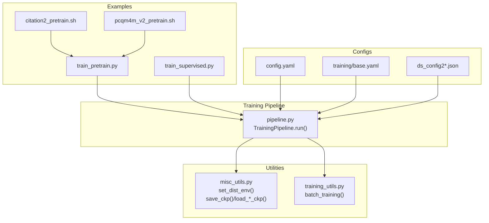
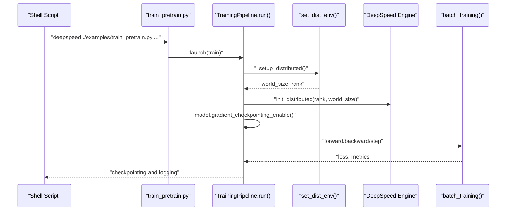
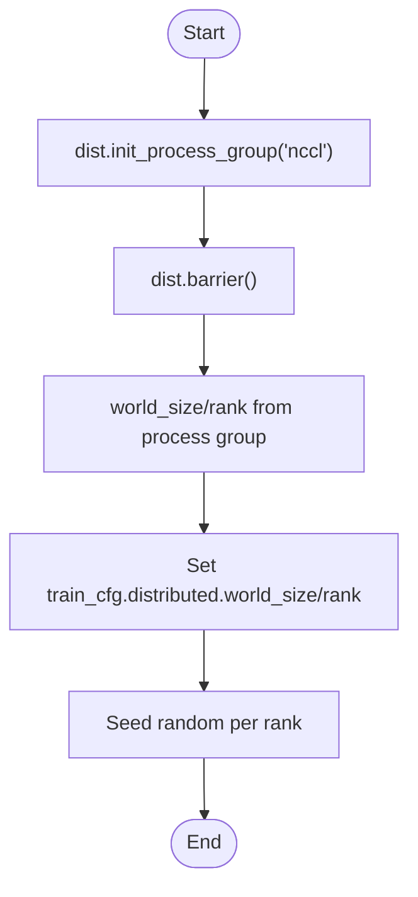
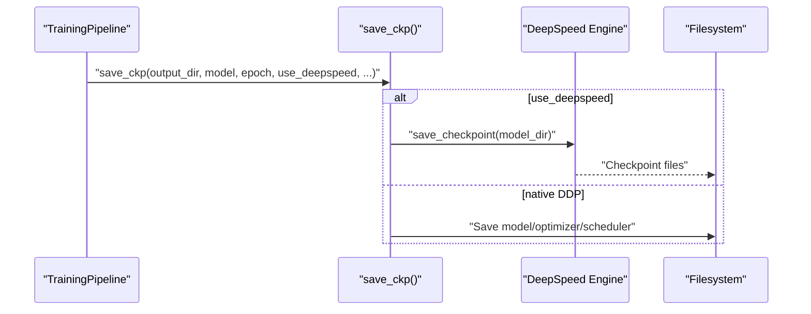
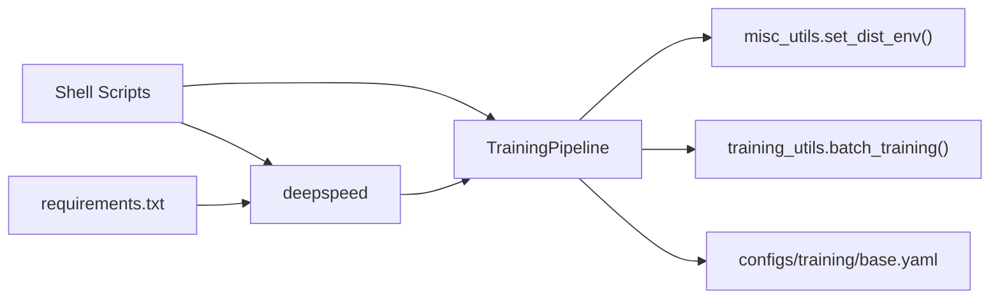

# Distributed Training Integration

<cite>
**Referenced Files in This Document**
- [examples/ds_config2.json](file://examples/ds_config2.json)
- [examples/ds_config2_bf16.json](file://examples/ds_config2_bf16.json)
- [examples/ds_config2_pt.json](file://examples/ds_config2_pt.json)
- [examples/ds_config2_pt_bf16.json](file://examples/ds_config2_pt_bf16.json)
- [examples/train_pretrain.py](file://examples/train_pretrain.py)
- [examples/train_supervised.py](file://examples/train_supervised.py)
- [src/training/pipeline.py](file://src/training/pipeline.py)
- [src/utils/training_utils.py](file://src/utils/training_utils.py)
- [src/utils/misc_utils.py](file://src/utils/misc_utils.py)
- [configs/config.yaml](file://configs/config.yaml)
- [configs/training/base.yaml](file://configs/training/base.yaml)
- [requirements.txt](file://requirements.txt)
- [examples/edge_lvl/citation2_pretrain.sh](file://examples/edge_lvl/citation2_pretrain.sh)
- [examples/graph_lvl/pcqm4m_v2_pretrain.sh](file://examples/graph_lvl/pcqm4m_v2_pretrain.sh)
</cite>

## Table of Contents
1. [Introduction](#introduction)
2. [Project Structure](#project-structure)
3. [Core Components](#core-components)
4. [Architecture Overview](#architecture-overview)
5. [Detailed Component Analysis](#detailed-component-analysis)
6. [Dependency Analysis](#dependency-analysis)
7. [Performance Considerations](#performance-considerations)
8. [Troubleshooting Guide](#troubleshooting-guide)
9. [Conclusion](#conclusion)
10. [Appendices](#appendices)

## Introduction
This document explains how distributed training is integrated with DeepSpeed in the project. It covers environment setup, world size initialization, rank assignment, DeepSpeed configuration files and their impact on performance, mixed precision training with BF16 and FP32, practical job launch examples, GPU resource configuration, progress monitoring, gradient checkpointing and memory optimizations, and fault tolerance mechanisms. It also provides guidance for common distributed training issues, debugging strategies, and performance tuning.

## Project Structure
The distributed training integration spans several areas:
- Example training entry points that bootstrap the training pipeline and launch mechanism
- A unified training pipeline orchestrating shared setup and delegated mode-specific behavior
- Utilities for distributed environment setup, checkpointing, and logging
- Configuration files controlling training schedules, optimizer settings, and DeepSpeed integration
- Shell scripts demonstrating how to launch distributed jobs with DeepSpeed and configure mixed precision

**Diagram sources**
- [examples/train_pretrain.py:1-19](file://examples/train_pretrain.py#L1-L19)
- [examples/train_supervised.py:1-19](file://examples/train_supervised.py#L1-L19)
- [examples/edge_lvl/citation2_pretrain.sh:1-201](file://examples/edge_lvl/citation2_pretrain.sh#L1-L201)
- [examples/graph_lvl/pcqm4m_v2_pretrain.sh:1-311](file://examples/graph_lvl/pcqm4m_v2_pretrain.sh#L1-L311)
- [src/training/pipeline.py:1-258](file://src/training/pipeline.py#L1-L258)
- [src/utils/misc_utils.py:507-539](file://src/utils/misc_utils.py#L507-L539)
- [src/utils/training_utils.py:1-206](file://src/utils/training_utils.py#L1-L206)
- [configs/config.yaml:1-20](file://configs/config.yaml#L1-L20)
- [configs/training/base.yaml:1-78](file://configs/training/base.yaml#L1-L78)
- [examples/ds_config2.json:1-43](file://examples/ds_config2.json#L1-L43)

**Section sources**
- [examples/train_pretrain.py:1-19](file://examples/train_pretrain.py#L1-L19)
- [examples/train_supervised.py:1-19](file://examples/train_supervised.py#L1-L19)
- [src/training/pipeline.py:1-258](file://src/training/pipeline.py#L1-L258)
- [src/utils/misc_utils.py:507-539](file://src/utils/misc_utils.py#L507-L539)
- [src/utils/training_utils.py:1-206](file://src/utils/training_utils.py#L1-L206)
- [configs/config.yaml:1-20](file://configs/config.yaml#L1-L20)
- [configs/training/base.yaml:1-78](file://configs/training/base.yaml#L1-L78)
- [examples/ds_config2.json:1-43](file://examples/ds_config2.json#L1-L43)
- [examples/ds_config2_bf16.json:1-38](file://examples/ds_config2_bf16.json#L1-L38)
- [examples/ds_config2_pt.json:1-48](file://examples/ds_config2_pt.json#L1-L48)
- [examples/ds_config2_pt_bf16.json:1-43](file://examples/ds_config2_pt_bf16.json#L1-L43)
- [examples/edge_lvl/citation2_pretrain.sh:1-201](file://examples/edge_lvl/citation2_pretrain.sh#L1-L201)
- [examples/graph_lvl/pcqm4m_v2_pretrain.sh:1-311](file://examples/graph_lvl/pcqm4m_v2_pretrain.sh#L1-L311)

## Core Components
- TrainingPipeline orchestrates the entire lifecycle: extracting configs, setting up distributed environments, preparing data/model/optimizer, resuming checkpoints, and running training loops.
- Distributed environment setup initializes NCCL via PyTorch’s process group and sets world_size/rank. It also supports fallback to local CPU testing.
- DeepSpeed integration toggles via a configuration flag and initializes DeepSpeed engines. It enables gradient checkpointing and disables model cache for memory efficiency.
- Mixed precision training is controlled by DeepSpeed configuration files supporting FP16 and BF16 modes.
- Checkpointing utilities handle DeepSpeed and native DDP saving/loading, including ZeRO stage and optimizer state persistence.

Key responsibilities:
- Environment and rank initialization: [src/utils/misc_utils.py:507-539](file://src/utils/misc_utils.py#L507-L539)
- Pipeline orchestration and DeepSpeed toggle: [src/training/pipeline.py:119-165](file://src/training/pipeline.py#L119-L165)
- Batch training with DeepSpeed vs native AMP: [src/utils/training_utils.py:29-90](file://src/utils/training_utils.py#L29-L90)
- DeepSpeed config files: [examples/ds_config2.json:1-43](file://examples/ds_config2.json#L1-L43), [examples/ds_config2_bf16.json:1-38](file://examples/ds_config2_bf16.json#L1-L38), [examples/ds_config2_pt.json:1-48](file://examples/ds_config2_pt.json#L1-L48), [examples/ds_config2_pt_bf16.json:1-43](file://examples/ds_config2_pt_bf16.json#L1-L43)

**Section sources**
- [src/training/pipeline.py:119-165](file://src/training/pipeline.py#L119-L165)
- [src/utils/misc_utils.py:507-539](file://src/utils/misc_utils.py#L507-L539)
- [src/utils/training_utils.py:29-90](file://src/utils/training_utils.py#L29-L90)
- [examples/ds_config2.json:1-43](file://examples/ds_config2.json#L1-L43)
- [examples/ds_config2_bf16.json:1-38](file://examples/ds_config2_bf16.json#L1-L38)
- [examples/ds_config2_pt.json:1-48](file://examples/ds_config2_pt.json#L1-L48)
- [examples/ds_config2_pt_bf16.json:1-43](file://examples/ds_config2_pt_bf16.json#L1-L43)

## Architecture Overview
The distributed training architecture integrates DeepSpeed with a unified training pipeline. The flow begins with a launcher script invoking the training entry point, which in turn calls the pipeline. The pipeline sets up distributed environment variables, initializes DeepSpeed if configured, prepares the model with gradient checkpointing, and runs training loops with either DeepSpeed or native AMP depending on configuration.

**Diagram sources**
- [examples/edge_lvl/citation2_pretrain.sh:197-197](file://examples/edge_lvl/citation2_pretrain.sh#L197-L197)
- [examples/train_pretrain.py:12-18](file://examples/train_pretrain.py#L12-L18)
- [src/training/pipeline.py:60-95](file://src/training/pipeline.py#L60-L95)
- [src/utils/misc_utils.py:507-539](file://src/utils/misc_utils.py#L507-L539)
- [src/utils/training_utils.py:29-90](file://src/utils/training_utils.py#L29-L90)

## Detailed Component Analysis

### Distributed Environment Setup and Rank Initialization
- The environment setup routine initializes NCCL process groups and derives world_size and rank from the distributed backend. It also seeds randomness per rank for reproducibility and handles local CPU fallback.
- World size and rank are propagated into the training configuration for downstream use.

**Diagram sources**
- [src/utils/misc_utils.py:520-539](file://src/utils/misc_utils.py#L520-L539)

**Section sources**
- [src/utils/misc_utils.py:507-539](file://src/utils/misc_utils.py#L507-L539)

### DeepSpeed Configuration Files and Impact
- Four DeepSpeed configuration variants are provided:
  - FP16 with OneCycleLR: [examples/ds_config2.json:1-43](file://examples/ds_config2.json#L1-L43)
  - BF16 with OneCycleLR: [examples/ds_config2_bf16.json:1-38](file://examples/ds_config2_bf16.json#L1-L38)
  - FP16 with WarmupDecayLR: [examples/ds_config2_pt.json:1-48](file://examples/ds_config2_pt.json#L1-L48)
  - BF16 with WarmupDecayLR: [examples/ds_config2_pt_bf16.json:1-43](file://examples/ds_config2_pt_bf16.json#L1-L43)
- Key impacts:
  - Precision: fp16/bf16 toggles mixed precision training
  - Optimizer: Adam parameters and learning rate scheduling
  - ZeRO: Stage 2 with communication overlap improves memory and throughput
  - Activation checkpointing: reduces activation memory at the cost of recomputation
  - FLOPs profiler: optional profiling for performance analysis

**Section sources**
- [examples/ds_config2.json:1-43](file://examples/ds_config2.json#L1-L43)
- [examples/ds_config2_bf16.json:1-38](file://examples/ds_config2_bf16.json#L1-L38)
- [examples/ds_config2_pt.json:1-48](file://examples/ds_config2_pt.json#L1-L48)
- [examples/ds_config2_pt_bf16.json:1-43](file://examples/ds_config2_pt_bf16.json#L1-L43)

### Mixed Precision Training Support (BF16 and FP32)
- Mixed precision is configured via DeepSpeed JSON files. BF16 enables native BF16 training, while FP16 uses dynamic loss scaling. FP32 is implicitly used when DeepSpeed is disabled (native AMP path).
- The training loop detects DeepSpeed usage and routes to DeepSpeed’s backward/step or native AMP scaling/backward/step accordingly.

**Section sources**
- [src/utils/training_utils.py:29-90](file://src/utils/training_utils.py#L29-L90)
- [examples/ds_config2.json:3-10](file://examples/ds_config2.json#L3-L10)
- [examples/ds_config2_bf16.json:3-5](file://examples/ds_config2_bf16.json#L3-L5)

### Gradient Checkpointing and Memory Optimization
- Gradient checkpointing is enabled during model creation in the pipeline to reduce activation memory footprint.
- Additional memory optimizations include disabling model cache and using ZeRO stage 2 with communication overlap.

**Section sources**
- [src/training/pipeline.py:163-163](file://src/training/pipeline.py#L163-L163)
- [examples/ds_config2.json:36-40](file://examples/ds_config2.json#L36-L40)
- [examples/ds_config2_bf16.json:31-35](file://examples/ds_config2_bf16.json#L31-L35)

### Fault Tolerance and Checkpointing
- DeepSpeed checkpointing saves model, optimizer, and scheduler states. The utility ensures only rank 0 deletes older checkpoints while coordinating across ranks.
- Resuming from checkpoints uses DeepSpeed APIs when available; otherwise falls back to native DDP loading.

**Diagram sources**
- [src/utils/misc_utils.py:69-103](file://src/utils/misc_utils.py#L69-L103)

**Section sources**
- [src/utils/misc_utils.py:69-103](file://src/utils/misc_utils.py#L69-L103)
- [src/utils/misc_utils.py:185-229](file://src/utils/misc_utils.py#L185-L229)
- [src/utils/misc_utils.py:231-252](file://src/utils/misc_utils.py#L231-L252)

### Practical Launch Examples and GPU Resource Configuration
- Edge-level pretraining example demonstrates launching with DeepSpeed and selecting a BF16 configuration:
  - Script: [examples/edge_lvl/citation2_pretrain.sh:197-197](file://examples/edge_lvl/citation2_pretrain.sh#L197-L197)
  - DeepSpeed config selection: [examples/edge_lvl/citation2_pretrain.sh:50-50](file://examples/edge_lvl/citation2_pretrain.sh#L50-L50)
- Graph-level pretraining example shows passing Hydra overrides and conditional CPU/GPU execution:
  - Script: [examples/graph_lvl/pcqm4m_v2_pretrain.sh:302-307](file://examples/graph_lvl/pcqm4m_v2_pretrain.sh#L302-L307)
  - Overrides: [examples/graph_lvl/pcqm4m_v2_pretrain.sh:253-295](file://examples/graph_lvl/pcqm4m_v2_pretrain.sh#L253-L295)

GPU resource configuration:
- World size and rank are derived from the distributed environment; scripts can control the number of processes and devices via DeepSpeed launcher and environment variables.
- Training configuration supports world_size and rank fields for explicit control when needed.

**Section sources**
- [examples/edge_lvl/citation2_pretrain.sh:50-50](file://examples/edge_lvl/citation2_pretrain.sh#L50-L50)
- [examples/edge_lvl/citation2_pretrain.sh:197-197](file://examples/edge_lvl/citation2_pretrain.sh#L197-L197)
- [examples/graph_lvl/pcqm4m_v2_pretrain.sh:253-295](file://examples/graph_lvl/pcqm4m_v2_pretrain.sh#L253-L295)
- [examples/graph_lvl/pcqm4m_v2_pretrain.sh:302-307](file://examples/graph_lvl/pcqm4m_v2_pretrain.sh#L302-L307)
- [configs/training/base.yaml:61-63](file://configs/training/base.yaml#L61-L63)

### Monitoring Distributed Training Progress
- Logging and checkpointing are coordinated by the pipeline and utilities. Logs and metrics are written to CSV files in the output directory.
- The distributed environment prints world_size and rank for visibility.

**Section sources**
- [src/utils/misc_utils.py:149-176](file://src/utils/misc_utils.py#L149-L176)
- [src/utils/misc_utils.py:535-535](file://src/utils/misc_utils.py#L535-L535)

## Dependency Analysis
The distributed training stack depends on:
- DeepSpeed for engine initialization, ZeRO, optimizer states, and checkpointing
- PyTorch distributed for NCCL initialization and synchronization
- Hydra/OmegaConf for configuration composition and overrides
- Shell scripts for job launch and environment variable propagation

**Diagram sources**
- [src/training/pipeline.py:119-165](file://src/training/pipeline.py#L119-L165)
- [src/utils/misc_utils.py:507-539](file://src/utils/misc_utils.py#L507-L539)
- [src/utils/training_utils.py:29-90](file://src/utils/training_utils.py#L29-L90)
- [configs/training/base.yaml:1-78](file://configs/training/base.yaml#L1-L78)
- [requirements.txt:7-7](file://requirements.txt#L7-L7)

**Section sources**
- [requirements.txt:7-7](file://requirements.txt#L7-L7)
- [src/training/pipeline.py:119-165](file://src/training/pipeline.py#L119-L165)
- [src/utils/misc_utils.py:507-539](file://src/utils/misc_utils.py#L507-L539)
- [src/utils/training_utils.py:29-90](file://src/utils/training_utils.py#L29-L90)
- [configs/training/base.yaml:1-78](file://configs/training/base.yaml#L1-L78)

## Performance Considerations
- Mixed precision:
  - Prefer BF16 on platforms with native BF16 support for improved throughput and stability.
  - FP16 requires careful loss scaling; monitor for instability and adjust scaling parameters if needed.
- ZeRO optimization:
  - Use ZeRO stage 2 with communication overlap to reduce memory footprint and improve throughput.
- Activation checkpointing:
  - Enable partitioned and contiguous memory optimizations to balance memory savings and recomputation overhead.
- Scheduler choice:
  - OneCycleLR can accelerate convergence; WarmupDecayLR offers stable long-horizon training.
- Data pipeline:
  - Increase num_workers and adjust batch sizes to saturate GPUs without causing OOM.
- Logging and profiling:
  - Enable FLOPs profiler for targeted performance analysis and bottleneck identification.

[No sources needed since this section provides general guidance]

## Troubleshooting Guide
Common issues and remedies:
- Version mismatch across workers:
  - Ensure consistent DeepSpeed versions across nodes to prevent initialization deadlocks.
- NCCL initialization failures:
  - Verify network connectivity and environment variables; confirm NCCL backend availability.
- Checkpoint loading errors:
  - Use DeepSpeed’s zero-to-fp32 utilities when loading ZeRO checkpoints; ensure strictness settings match model structure.
- OOM during training:
  - Reduce micro-batch size, enable gradient checkpointing, or switch to BF16.
- Logging and progress:
  - Confirm output directory permissions and CSV writing; check world_size/rank logs for correctness.

**Section sources**
- [requirements.txt:2-4](file://requirements.txt#L2-L4)
- [src/utils/misc_utils.py:231-252](file://src/utils/misc_utils.py#L231-L252)
- [examples/ds_config2.json:24-27](file://examples/ds_config2.json#L24-L27)

## Conclusion
The project integrates DeepSpeed seamlessly into a unified training pipeline, enabling robust distributed training with mixed precision, memory optimizations, and resilient checkpointing. By leveraging the provided configuration files and shell launchers, users can efficiently scale training across multiple GPUs and nodes while maintaining strong performance and reliability.

[No sources needed since this section summarizes without analyzing specific files]

## Appendices

### Appendix A: Configuration Reference
- Training configuration fields influencing distributed training:
  - deepspeed_conf_file: Path to DeepSpeed JSON configuration
  - use_deepspeed: Toggle for DeepSpeed usage
  - output_dir: Directory for checkpoints and logs
  - pretrain_cpt: Resume checkpoint path
  - distributed.world_size/rank: Explicit world size and rank
  - schedule/logging_steps: Logging cadence
  - optimizer: Learning rate, weight decay, eps, max_grad_norm

**Section sources**
- [configs/training/base.yaml:2-78](file://configs/training/base.yaml#L2-L78)

### Appendix B: Example Launch Commands
- Edge-level pretraining with BF16:
  - [examples/edge_lvl/citation2_pretrain.sh:197-197](file://examples/edge_lvl/citation2_pretrain.sh#L197-L197)
- Graph-level pretraining with overrides:
  - [examples/graph_lvl/pcqm4m_v2_pretrain.sh:302-307](file://examples/graph_lvl/pcqm4m_v2_pretrain.sh#L302-L307)

**Section sources**
- [examples/edge_lvl/citation2_pretrain.sh:197-197](file://examples/edge_lvl/citation2_pretrain.sh#L197-L197)
- [examples/graph_lvl/pcqm4m_v2_pretrain.sh:302-307](file://examples/graph_lvl/pcqm4m_v2_pretrain.sh#L302-L307)
