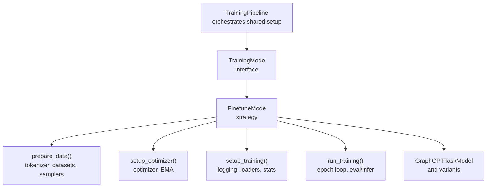
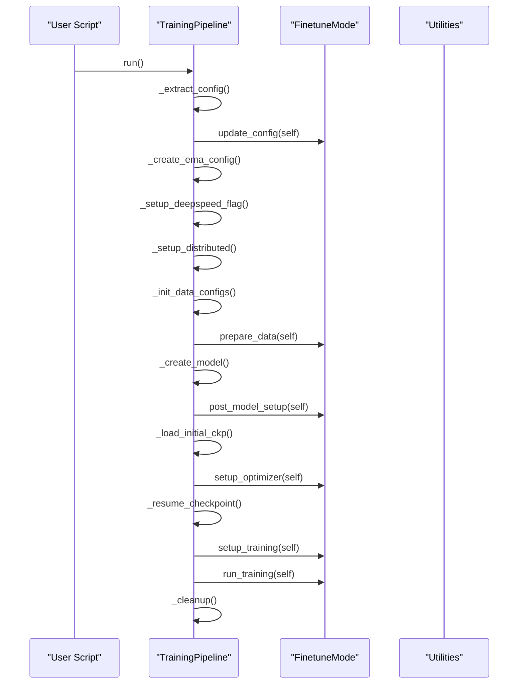
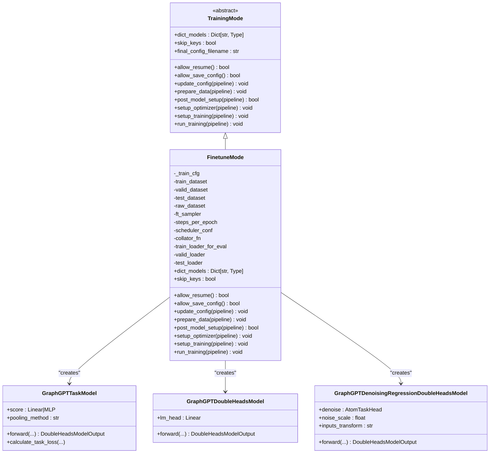
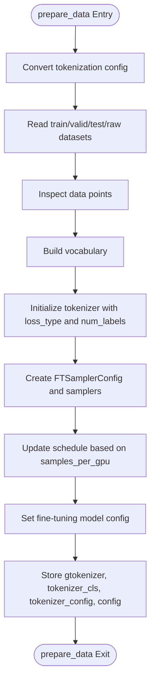
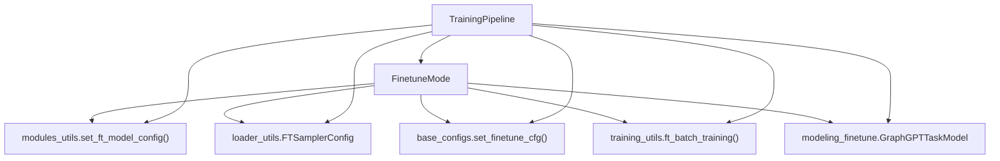

# Fine-tuning Mode

<cite>
**Referenced Files in This Document**
- [finetune_mode.py](file://src/training/finetune_mode.py)
- [mode.py](file://src/training/mode.py)
- [modeling_finetune.py](file://src/models/graphgpt/modeling_finetune.py)
- [modules_utils.py](file://src/utils/modules_utils.py)
- [loader_utils.py](file://src/utils/loader_utils.py)
- [base_configs.py](file://src/conf/base_configs.py)
- [model_configs.py](file://src/conf/model/model_configs.py)
- [configuration_graphgpt.py](file://src/models/graphgpt/configuration_graphgpt.py)
- [pipeline.py](file://src/training/pipeline.py)
- [train_supervised.py](file://examples/train_supervised.py)
- [base.yaml](file://configs/training/base.yaml)
- [reddit.yaml](file://configs/tokenization/graph_lvl/reddit.yaml)
- [ogbl_ppa.yaml](file://configs/tokenization/edge_lvl/ogbl_ppa.yaml)
</cite>

## Table of Contents
1. [Introduction](#introduction)
2. [Project Structure](#project-structure)
3. [Core Components](#core-components)
4. [Architecture Overview](#architecture-overview)
5. [Detailed Component Analysis](#detailed-component-analysis)
6. [Dependency Analysis](#dependency-analysis)
7. [Performance Considerations](#performance-considerations)
8. [Troubleshooting Guide](#troubleshooting-guide)
9. [Conclusion](#conclusion)
10. [Appendices](#appendices)

## Introduction
This document explains the Fine-tuning Mode implementation within the training modes strategy. It details how the generic training pipeline is adapted for supervised downstream tasks, focusing on:
- Task-specific model heads and loss computation
- Evaluation-only and inference-only modes
- Checkpoint loading and resume behavior
- Mode-specific methods: prepare_data(), setup_optimizer(), setup_training(), and run_training()
- Overrides to base class behaviors (allow_resume(), allow_save_config(), and final_config_filename)
- Practical workflows for graph-level, edge-level, and node-level tasks with concrete configuration examples

## Project Structure
Fine-tuning Mode is implemented as a concrete strategy class that adheres to the TrainingMode interface. The pipeline orchestrates shared setup and delegates mode-specific logic to FinetuneMode.



**Diagram sources**
- [pipeline.py:60-96](file://src/training/pipeline.py#L60-L96)
- [mode.py:5-90](file://src/training/mode.py#L5-L90)
- [finetune_mode.py:43-459](file://src/training/finetune_mode.py#L43-L459)
- [modeling_finetune.py:64-327](file://src/models/graphgpt/modeling_finetune.py#L64-L327)

**Section sources**
- [pipeline.py:15-96](file://src/training/pipeline.py#L15-L96)
- [mode.py:5-90](file://src/training/mode.py#L5-L90)
- [finetune_mode.py:43-459](file://src/training/finetune_mode.py#L43-L459)

## Core Components
- FinetuneMode: Implements the supervised fine-tuning strategy, including data preparation, optimizer setup, training preparation, and the training loop.
- TrainingMode: Base interface defining the contract for training modes.
- GraphGPTTaskModel and variants: Task-specific heads for classification/regression and optional auxiliary heads.
- Utilities: Modules for model configuration, sampler configuration, and training utilities.

Key behaviors:
- allow_resume() returns False when eval_only is True
- allow_save_config() returns False when eval_only is True
- final_config_filename is "config.yaml" (overriding the base "config_final.yaml")

**Section sources**
- [finetune_mode.py:76-81](file://src/training/finetune_mode.py#L76-L81)
- [mode.py:38-43](file://src/training/mode.py#L38-L43)
- [modeling_finetune.py:64-327](file://src/models/graphgpt/modeling_finetune.py#L64-L327)

## Architecture Overview
The fine-tuning pipeline follows a staged flow: shared configuration extraction, mode-specific data preparation, model creation, optimizer initialization, optional resume, training preparation, and the training loop. During training, evaluation and inference can be executed according to configuration flags.



**Diagram sources**
- [pipeline.py:60-96](file://src/training/pipeline.py#L60-L96)
- [finetune_mode.py:86-459](file://src/training/finetune_mode.py#L86-L459)

## Detailed Component Analysis

### FinetuneMode Implementation
FinetuneMode overrides the base TrainingMode to adapt the generic pipeline for supervised downstream tasks.

- Dictionary of model classes: supports "graphgpt" and "graphgpt-denoise".
- allow_resume(): disables resume when eval_only is True.
- allow_save_config(): disables saving config when eval_only is True.
- final_config_filename: "config.yaml" (overrides base "config_final.yaml").

Data preparation:
- Builds tokenizer configuration from the training config.
- Reads train/valid/test/raw datasets.
- Inspects data points and builds vocabulary.
- Initializes tokenizer and sets up FTSamplerConfig with train/valid/test samplers.
- Computes steps_per_epoch and updates schedule.
- Sets model configuration for fine-tuning and stores pipeline artifacts.

Post-model setup:
- Optionally freezes LLaMA layers based on configuration.
- Prints trainable parameters.

Optimizer setup:
- Sets fine-tune ratios (task_ratio, aux_ratio).
- Creates optimizer (DeepSpeed or DDP) and initializes EMA.

Training preparation:
- Initializes logging configuration for fine-tuning.
- Creates DataCollatorForGST for evaluation.
- Builds eval loaders for train/valid/test.
- Optionally evaluates before training if not eval_only.
- Handles eval_only and infer_only modes.

Training loop:
- Iterates epochs and batches.
- Performs training steps and EMA updates.
- Logs statistics periodically.
- Supports inference-only dump to ODPS writer.



**Diagram sources**
- [mode.py:5-90](file://src/training/mode.py#L5-L90)
- [finetune_mode.py:43-70](file://src/training/finetune_mode.py#L43-L70)
- [modeling_finetune.py:64-327](file://src/models/graphgpt/modeling_finetune.py#L64-L327)

**Section sources**
- [finetune_mode.py:43-459](file://src/training/finetune_mode.py#L43-L459)
- [mode.py:5-90](file://src/training/mode.py#L5-L90)
- [modeling_finetune.py:64-327](file://src/models/graphgpt/modeling_finetune.py#L64-L327)

### Data Preparation Workflow
The prepare_data() method performs the following:
- Converts tokenization configuration to a legacy form and adjusts semantics entries if embeddings are disabled.
- Reads train/valid/test/raw datasets and stores the training dataset for dictionary bounds propagation.
- Inspects a few data points from each dataset.
- Builds vocabulary from the raw dataset.
- Initializes the tokenizer with loss_type and num_labels from model configuration.
- Constructs FTSamplerConfig and sets up train/valid/test samplers.
- Updates schedule based on samples per GPU.
- Sets fine-tuning model configuration and prints the final model configuration.



**Diagram sources**
- [finetune_mode.py:116-199](file://src/training/finetune_mode.py#L116-L199)
- [modules_utils.py:84-92](file://src/utils/modules_utils.py#L84-L92)

**Section sources**
- [finetune_mode.py:116-199](file://src/training/finetune_mode.py#L116-L199)
- [modules_utils.py:84-92](file://src/utils/modules_utils.py#L84-L92)

### Optimizer and EMA Setup
- Sets fine-tune ratios via set_finetune_cfg().
- Creates optimizer (DeepSpeed or DDP) and initializes EMA statistics.
- Stores optimizer and device on the pipeline.

**Section sources**
- [finetune_mode.py:218-258](file://src/training/finetune_mode.py#L218-L258)
- [base_configs.py:178-184](file://src/conf/base_configs.py#L178-L184)

### Training Preparation and Logging
- Initializes logging configuration for fine-tuning and determines epoch and step starts.
- Creates DataCollatorForGST for evaluation.
- Builds eval loaders for train/valid/test.
- Optionally evaluates before training if not in eval_only mode.
- Initializes TensorBoard writer and TrainingStats.

**Section sources**
- [finetune_mode.py:263-358](file://src/training/finetune_mode.py#L263-L358)

### Training Loop Execution
- Sets model to train mode.
- Saves config.yaml unless in eval_only mode.
- Iterates epochs; for each epoch:
  - If not eval_only, creates train loader at epoch start and runs training batches.
  - Updates EMA after each batch.
  - Logs training statistics periodically.
  - If eval_only, loads checkpoints per epoch and disables EMA.
  - If infer_only, dumps predictions to ODPS writer.
  - Periodically logs and dumps evaluation statistics.

```mermaid
sequenceDiagram
participant Pipe as "TrainingPipeline"
participant Mode as "FinetuneMode"
participant Model as "Model"
participant Stats as "TrainingStats"
participant Opt as "OptimStats"
participant EMA as "EMAStats"
participant TB as "TB Writer"
Pipe->>Mode : run_training(self)
Mode->>Model : train()
alt not eval_only
Mode->>Mode : initialize_ft_train_loader_at_epoch_start()
loop for each batch
Mode->>Model : forward(data)
Mode->>Opt : backward and step
Mode->>EMA : update_ema()
opt_stats.lr_scheduler.step()
Mode->>TB : log_ft_training_stats()
end
else eval_only
Mode->>Mode : load_from_ckp_with_try()
Mode->>EMA : model_ema = None
end
opt_stats.lr_scheduler.step()
Mode->>TB : log_dump_ft_training_stats()
```

**Diagram sources**
- [finetune_mode.py:363-459](file://src/training/finetune_mode.py#L363-L459)
- [loader_utils.py:176-200](file://src/utils/loader_utils.py#L176-L200)

**Section sources**
- [finetune_mode.py:363-459](file://src/training/finetune_mode.py#L363-L459)
- [loader_utils.py:176-200](file://src/utils/loader_utils.py#L176-L200)

### Evaluation-only and Inference-only Modes
- eval_only: Disables saving config, disables resume, and evaluates from checkpoints per epoch.
- infer_only: Dumps predictions to ODPS writer for test loader.

Behavioral overrides:
- allow_resume() returns False when eval_only is True.
- allow_save_config() returns False when eval_only is True.
- final_config_filename is "config.yaml".

**Section sources**
- [finetune_mode.py:76-81](file://src/training/finetune_mode.py#L76-L81)
- [finetune_mode.py:351-444](file://src/training/finetune_mode.py#L351-L444)
- [mode.py:38-43](file://src/training/mode.py#L38-L43)

### Task-specific Model Heads and Loss Computation
The fine-tuning models support:
- Classification/regression heads with configurable pooling and optional MLP.
- Token-level and sample-level loss computation.
- Specialized heads for denoising regression and dual-task setups.

Key components:
- GraphGPTTaskModel: Linear or MLP scoring head, pooling, and loss calculation.
- GraphGPTDoubleHeadsModel: Adds auxiliary language modeling head.
- GraphGPTDenoisingRegressionDoubleHeadsModel: Adds denoising head for 3D coordinates and SMTP auxiliary tasks.

Loss types and problem types are driven by model configuration and ft_head settings.

**Section sources**
- [modeling_finetune.py:64-327](file://src/models/graphgpt/modeling_finetune.py#L64-L327)
- [modeling_finetune.py:426-800](file://src/models/graphgpt/modeling_finetune.py#L426-L800)
- [model_configs.py:79-110](file://src/conf/model/model_configs.py#L79-L110)
- [configuration_graphgpt.py:269-292](file://src/models/graphgpt/configuration_graphgpt.py#L269-L292)

### Checkpoint Loading and Resume Behavior
- Non-resuming load: Loads from pretrained checkpoint if provided and different from output_dir.
- Resuming: Loads model and optimizer from current output_dir when allowed.
- Overrides:
  - allow_resume() returns False when eval_only is True.
  - allow_save_config() returns False when eval_only is True.

**Section sources**
- [pipeline.py:166-200](file://src/training/pipeline.py#L166-L200)
- [finetune_mode.py:76-81](file://src/training/finetune_mode.py#L76-L81)

## Dependency Analysis
The following diagram shows key dependencies among components involved in fine-tuning:



**Diagram sources**
- [finetune_mode.py:116-459](file://src/training/finetune_mode.py#L116-L459)
- [modules_utils.py:84-92](file://src/utils/modules_utils.py#L84-L92)
- [loader_utils.py:41-53](file://src/utils/loader_utils.py#L41-L53)
- [base_configs.py:178-184](file://src/conf/base_configs.py#L178-L184)
- [pipeline.py:60-96](file://src/training/pipeline.py#L60-L96)

**Section sources**
- [finetune_mode.py:116-459](file://src/training/finetune_mode.py#L116-L459)
- [pipeline.py:60-96](file://src/training/pipeline.py#L60-L96)

## Performance Considerations
- Freeze backbone layers: Use freeze configuration to reduce trainable parameters and speed up training.
- Batch size and steps per epoch: Adjust training schedule based on samples per GPU to control total steps.
- EMA usage: Enable EMA for improved generalization; note that eval_only disables EMA updates.
- Logging frequency: Tune logging_steps to balance monitoring overhead and disk I/O.

[No sources needed since this section provides general guidance]

## Troubleshooting Guide
Common issues and resolutions:
- Unexpected resume: Ensure eval_only is False to allow resume; otherwise, resume is disabled.
- Missing config save: When eval_only is True, config is not saved; switch to False to persist configuration.
- OOM during evaluation: Reduce batch_size_eval and adjust num_workers_eval.
- Incorrect task loss: Verify ft_head configuration (loss_type, num_labels, problem_type) matches the dataset.

**Section sources**
- [finetune_mode.py:76-81](file://src/training/finetune_mode.py#L76-L81)
- [finetune_mode.py:351-358](file://src/training/finetune_mode.py#L351-L358)
- [base.yaml:47-51](file://configs/training/base.yaml#L47-L51)

## Conclusion
FinetuneMode adapts the generic training pipeline for supervised downstream tasks by integrating task-specific model heads, managing evaluation-only and inference-only workflows, and controlling checkpoint loading and resume behavior. Its design cleanly separates mode-specific logic while reusing shared orchestration from TrainingPipeline, enabling flexible fine-tuning across graph-level, edge-level, and node-level tasks.

[No sources needed since this section summarizes without analyzing specific files]

## Appendices

### Practical Workflows and Examples

- Graph-level classification/regression (Reddit Threads)
  - Tokenization configuration: [reddit.yaml:1-121](file://configs/tokenization/graph_lvl/reddit.yaml#L1-L121)
  - Training entry point: [train_supervised.py:12-18](file://examples/train_supervised.py#L12-L18)
  - Typical steps:
    - Configure tokenization for graph-level tasks.
    - Set training schedule and optimizer.
    - Run supervised training with eval_only=False for training and evaluation.
    - Switch to eval_only=True for evaluation-only runs.

- Edge-level classification (OGBL-PPA)
  - Tokenization configuration: [ogbl_ppa.yaml:1-123](file://configs/tokenization/edge_lvl/ogbl_ppa.yaml#L1-L123)
  - Typical steps:
    - Configure tokenization for edge-level tasks.
    - Set ft_head.loss_type and num_labels appropriate for binary classification.
    - Use infer_only to dump predictions to ODPS.

- Node-level tasks
  - Configure tokenization for node-level semantics and structure.
  - Set ft_head.problem_type and num_labels accordingly.
  - Use eval_only for validation and infer_only for inference.

- Evaluation-only mode
  - Set ft_eval.eval_only=True.
  - The pipeline loads checkpoints per epoch and evaluates without training.

- Inference-only mode
  - Set ft_eval.infer_only=True.
  - Predictions are dumped to ODPS writer for test data.

**Section sources**
- [train_supervised.py:12-18](file://examples/train_supervised.py#L12-L18)
- [reddit.yaml:1-121](file://configs/tokenization/graph_lvl/reddit.yaml#L1-L121)
- [ogbl_ppa.yaml:1-123](file://configs/tokenization/edge_lvl/ogbl_ppa.yaml#L1-L123)
- [finetune_mode.py:351-444](file://src/training/finetune_mode.py#L351-L444)
