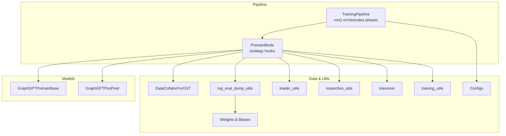
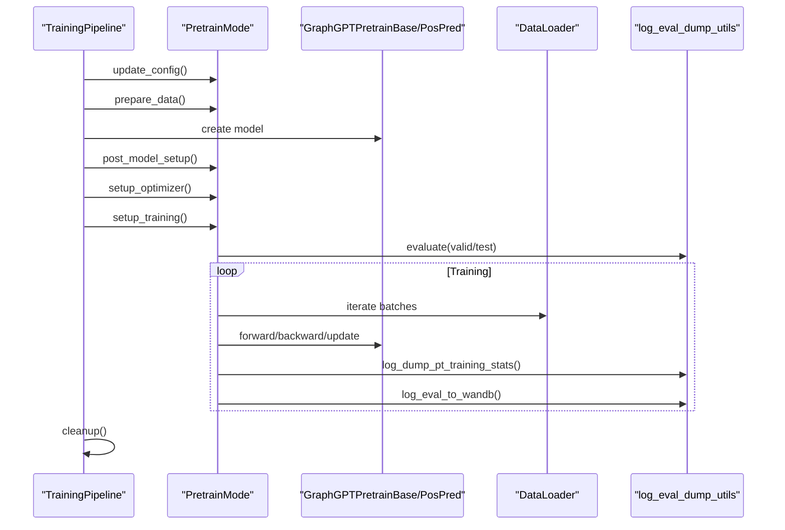
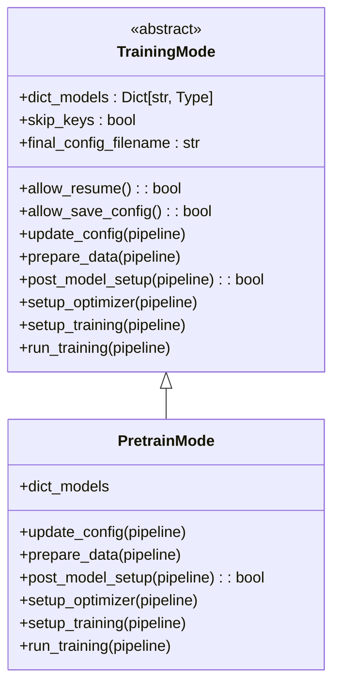
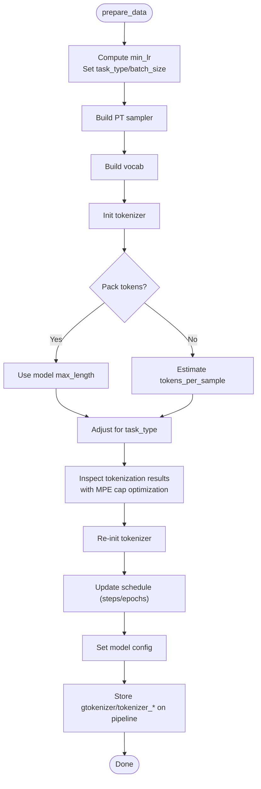
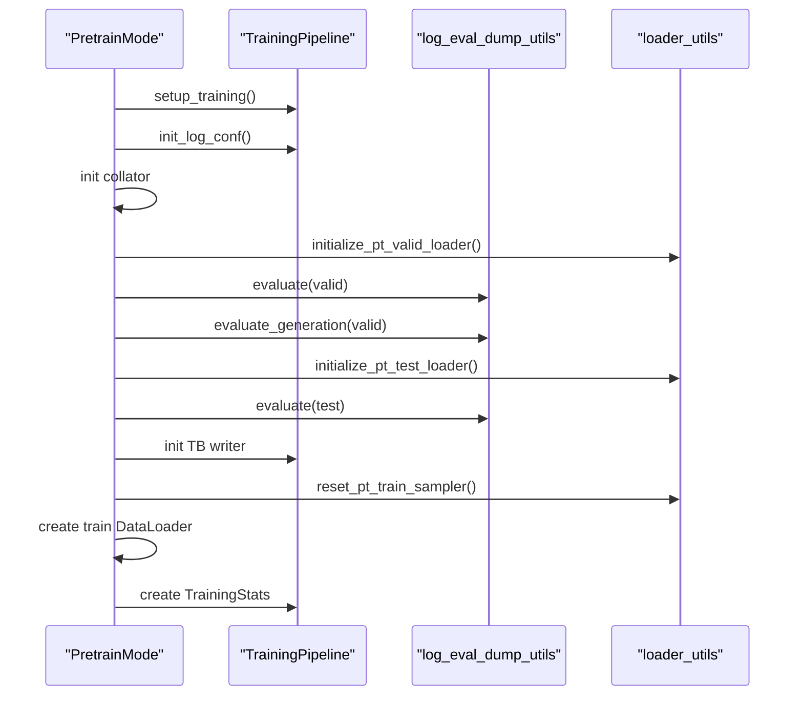
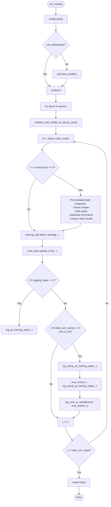
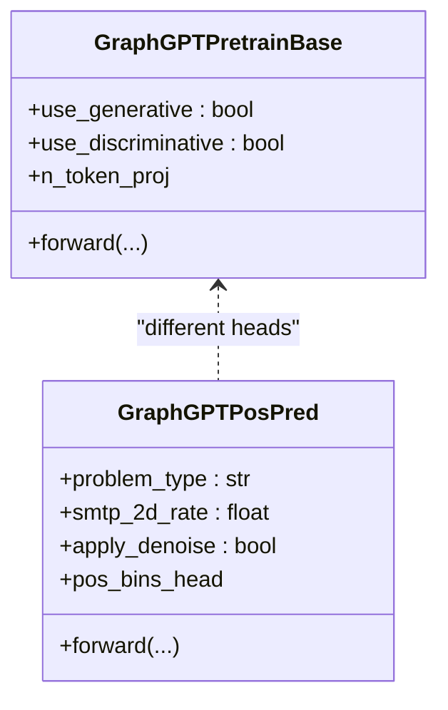
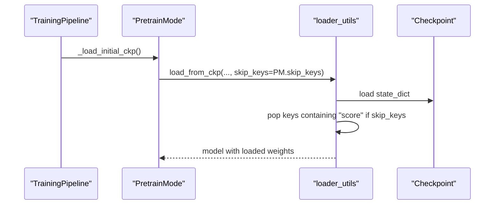
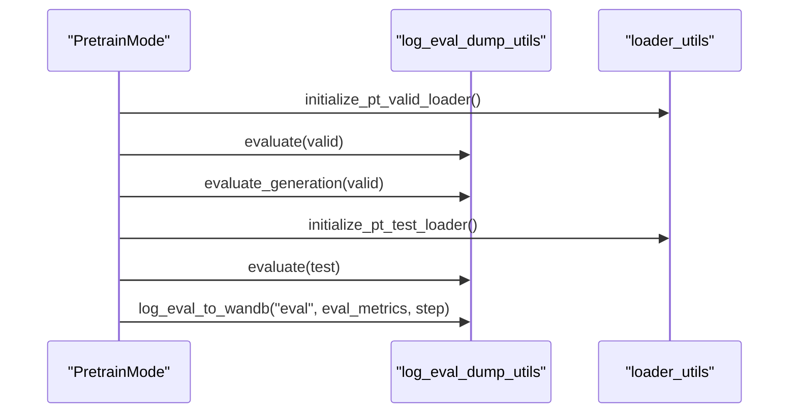
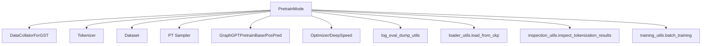

# Pre-training Mode

<cite>
**Referenced Files in This Document**
- [pretrain_mode.py](file://src/training/pretrain_mode.py)
- [mode.py](file://src/training/mode.py)
- [pipeline.py](file://src/training/pipeline.py)
- [modeling_pretrain.py](file://src/models/graphgpt/modeling_pretrain.py)
- [configuration_graphgpt.py](file://src/models/graphgpt/configuration_graphgpt.py)
- [modeling_helpers.py](file://src/models/graphgpt/modeling_helpers.py)
- [log_eval_dump_utils.py](file://src/utils/log_eval_dump_utils.py)
- [loader_utils.py](file://src/utils/loader_utils.py)
- [collator.py](file://src/data/collator.py)
- [inspection_utils.py](file://src/utils/inspection_utils.py)
- [tokenizer.py](file://src/data/tokenizer.py)
- [training_utils.py](file://src/utils/training_utils.py)
- [base.yaml](file://configs/training/base.yaml)
- [base.yaml](file://configs/tokenization/base.yaml)
- [train_pretrain.py](file://examples/train_pretrain.py)
- [ppa_pretrain.sh](file://examples/edge_lvl/ppa_pretrain.sh)
- [proteins_pretrain.sh](file://examples/node_lvl/proteins_pretrain.sh)
- [base_configs.py](file://src/conf/base_configs.py)
- [padding.py](file://src/data/tokenizer/padding.py)
- [model_configs.py](file://src/conf/model/model_configs.py)
</cite>

## Update Summary
**Changes Made**
- Enhanced evaluation logging system with improved metric reporting and Weights & Biases integration
- Updated log_dump_pt_training_stats function to return evaluation metrics for proper logging
- Added comprehensive Weights & Biases integration for pre-training metrics
- Enhanced training loop to automatically log evaluation metrics to Weights & Biases
- Updated configuration documentation to include Weights & Biases setup

## Table of Contents
1. [Introduction](#introduction)
2. [Project Structure](#project-structure)
3. [Core Components](#core-components)
4. [Architecture Overview](#architecture-overview)
5. [Detailed Component Analysis](#detailed-component-analysis)
6. [Dependency Analysis](#dependency-analysis)
7. [Performance Considerations](#performance-considerations)
8. [Sequence Length Parameter Naming](#sequence-length-parameter-naming)
9. [Automatic Data Inspection System](#automatic-data-inspection-system)
10. [Diagnostic Performance Optimization](#diagnostic-performance-optimization)
11. [Enhanced Evaluation Logging System](#enhanced-evaluation-logging-system)
12. [Weights & Biases Integration](#weights-biases-integration)
13. [Troubleshooting Guide](#troubleshooting-guide)
14. [Conclusion](#conclusion)
15. [Appendices](#appendices)

## Introduction
This document explains the PretrainingMode implementation within the training modes strategy. It details how pre-training mode differs from fine-tuning mode, including data preparation, optimizer setup, training objectives, and evaluation. It also documents pre-training-specific methods, configurations, checkpoint handling, and evaluation procedures. Practical workflows and common pre-training objectives (NTP, SMTP, Position Prediction) are included, along with how pre-training mode integrates with the broader training pipeline.

**Updated** Enhanced with performance optimizations for diagnostic workflows during tokenization inspection, featuring a temporary maximum position embeddings (MPE) cap mechanism to prevent slow diagnostic runs. Also includes a new automatic data inspection system that prints detailed information about the first batch of data during the initial epoch of training. The documentation now reflects the improved parameter naming convention where `max_length` is used instead of `max_position_embeddings` to better distinguish between positional embedding dimensions and sequence length constraints. Additionally, the evaluation logging system has been enhanced with improved metric reporting and comprehensive Weights & Biases integration for real-time experiment tracking.

## Project Structure
Pre-training mode is orchestrated by the unified TrainingPipeline and implemented via the PretrainMode strategy. The key components are:
- TrainingPipeline: shared orchestration (config extraction, distributed setup, model creation, checkpoint handling, cleanup)
- PretrainMode: pre-training strategy implementing mode-specific hooks
- Models: GraphGPTPretrainBase and GraphGPTPosPred supporting generative and discriminative objectives
- Utilities: collation, logging, evaluation, and checkpoint loading helpers
- Examples: shell scripts and training entry points for pre-training workflows



**Diagram sources**
- [pipeline.py:60-96](file://src/training/pipeline.py#L60-L96)
- [pretrain_mode.py:48-75](file://src/training/pretrain_mode.py#L48-L75)
- [modeling_pretrain.py:57-691](file://src/models/graphgpt/modeling_pretrain.py#L57-L691)
- [collator.py:22-133](file://src/data/collator.py#L22-L133)
- [log_eval_dump_utils.py:166-239](file://src/utils/log_eval_dump_utils.py#L166-L239)
- [loader_utils.py:663-751](file://src/utils/loader_utils.py#L663-L751)
- [inspection_utils.py:73-143](file://src/utils/inspection_utils.py#L73-143)
- [tokenizer.py:53](file://src/data/tokenizer.py#L53)
- [training_utils.py:7-106](file://src/utils/training_utils.py#L7-L106)

**Section sources**
- [pipeline.py:60-96](file://src/training/pipeline.py#L60-L96)
- [pretrain_mode.py:48-75](file://src/training/pretrain_mode.py#L48-L75)

## Core Components
- PretrainMode: Implements mode-specific logic for pre-training including data preparation, optimizer setup, training preparation, and the training loop. It registers two model classes: GraphGPTPretrainBase and GraphGPTPosPred.
- TrainingPipeline: Coordinates shared phases (distributed setup, model creation, checkpoint loading/resume, saving config, cleanup) and delegates mode-specific behavior to PretrainMode.
- Models:
  - GraphGPTPretrainBase: supports generative objectives (NTP/MTP/MLM) and optional discriminative contrastive loss.
  - GraphGPTPosPred: supports 3D position prediction and SMTP variants (line, cube, mix), with optional 2D SMTP and CL loss.
- Utilities:
  - DataCollatorForGST: tokenization and batching for pre-training using `max_length` parameter.
  - loader_utils: pre-training samplers and loader initialization.
  - log_eval_dump_utils: evaluation and inference utilities for pre-training with enhanced metric reporting and Weights & Biases integration.
  - inspection_utils: comprehensive tokenization inspection with performance optimizations.
  - training_utils: batch processing and training utilities.
  - loader_utils.load_from_ckp_with_try: loads checkpoints with skip_keys behavior.

**Section sources**
- [pretrain_mode.py:48-75](file://src/training/pretrain_mode.py#L48-L75)
- [pipeline.py:15-96](file://src/training/pipeline.py#L15-L96)
- [modeling_pretrain.py:57-691](file://src/models/graphgpt/modeling_pretrain.py#L57-L691)
- [collator.py:22-133](file://src/data/collator.py#L22-L133)
- [loader_utils.py:663-751](file://src/utils/loader_utils.py#L663-L751)
- [log_eval_dump_utils.py:166-239](file://src/utils/log_eval_dump_utils.py#L166-L239)
- [inspection_utils.py:73-143](file://src/utils/inspection_utils.py#L73-143)
- [training_utils.py:7-106](file://src/utils/training_utils.py#L7-L106)

## Architecture Overview
The pre-training pipeline follows a deterministic sequence:
1. Extract and update configs (including enabling pretrain_mode and schedule updates)
2. Prepare data: tokenizer config, dataset, vocabulary, tokenizer, sampler, schedule, model config
3. Create model and optionally evaluate/infer-only
4. Load initial checkpoint (skipping score-related keys by default)
5. Setup optimizer (DeepSpeed or native) and EMA
6. Initialize logging, collator, validation/test loaders, and pre-training evaluation
7. Run training loop with periodic logging and checkpointing
8. Cleanup and save final config



**Diagram sources**
- [pipeline.py:60-96](file://src/training/pipeline.py#L60-L96)
- [pretrain_mode.py:81-501](file://src/training/pretrain_mode.py#L81-L501)
- [log_eval_dump_utils.py:166-239](file://src/utils/log_eval_dump_utils.py#L166-L239)

## Detailed Component Analysis

### PretrainingMode Strategy
PretrainMode implements the strategy interface for pre-training. It defines:
- Model registry mapping model_type to GraphGPTPretrainBase and GraphGPTPosPred
- Default skip_keys behavior (True) for checkpoint loading
- Mode-specific hooks: update_config, prepare_data, post_model_setup, setup_optimizer, setup_training, run_training

Key behaviors:
- Sets training flags (pretrain_mode, do_valid, do_test) and schedules steps_per_saving based on world_size and batch_size
- Supports inside-model SMTP via tokenizer configuration
- Builds vocabulary, initializes tokenizer, computes tokens_per_sample, and updates schedule
- Initializes collator, validation/test loaders, and pre-training evaluation
- Runs training loop with periodic logging and checkpointing



**Diagram sources**
- [mode.py:5-90](file://src/training/mode.py#L5-L90)
- [pretrain_mode.py:48-75](file://src/training/pretrain_mode.py#L48-L75)

**Section sources**
- [mode.py:19-43](file://src/training/mode.py#L19-L43)
- [pretrain_mode.py:48-75](file://src/training/pretrain_mode.py#L48-L75)

### Data Preparation (prepare_data) with MPE Cap Optimization
The prepare_data phase performs:
- Compute min_lr based on use_deepspeed flag
- Determine task_type and batch_size
- Configure steps_per_saving from samples_per_saving
- Convert tokenization config and adjust task_type for inside-model SMTP
- Read dataset and raw dataset, inspect a sample
- Build pre-training sampler (train/valid/test)
- Build vocabulary and initialize tokenizer
- Token packing or estimate tokens_per_sample
- **Enhanced**: Inspect tokenization results with temporary MPE cap to prevent slow diagnostic runs
- Re-initialize tokenizer to avoid pickle errors
- Update schedule (num_steps, epochs) and set model config
- Store gtokenizer, tokenizer_cls, tokenizer_config, and legacy config on pipeline

**Updated** Added temporary maximum position embeddings (MPE) cap mechanism during tokenization inspection to optimize diagnostic performance.



**Diagram sources**
- [pretrain_mode.py:97-227](file://src/training/pretrain_mode.py#L97-L227)

**Section sources**
- [pretrain_mode.py:97-227](file://src/training/pretrain_mode.py#L97-L227)

### Optimizer Setup (setup_optimizer)
The setup_optimizer phase:
- Creates model_parameters and initializes DeepSpeed if enabled, otherwise initializes optimizer and profiler
- Prints finish message and initializes EMA

```mermaid
sequenceDiagram
participant PM as "PretrainMode"
participant TP as "TrainingPipeline"
participant DS as "DeepSpeed"
participant Opt as "Optimizer"
PM->>TP : setup_optimizer()
alt use_deepspeed
PM->>DS : initialize(model, model_parameters, config)
DS-->>PM : model, optimizer, scheduler
PM->>TP : set opt_stats and device
else native
PM->>Opt : initialize_optimizer(model, model_parameters, training, loss_utils)
Opt-->>PM : model, opt_stats
PM->>PM : profiler start
end
PM->>TP : init EMA
```

**Diagram sources**
- [pretrain_mode.py:271-303](file://src/training/pretrain_mode.py#L271-L303)

**Section sources**
- [pretrain_mode.py:271-303](file://src/training/pretrain_mode.py#L271-L303)

### Training Preparation (setup_training)
The setup_training phase:
- Initialize logging configuration and checkpoint state
- Initialize DataCollatorForGST with `max_length` parameter
- Initialize validation/test loaders and evaluate before training
- Dump config and initialize TensorBoard writer
- Reset train sampler
- Create train DataLoader
- Initialize TrainingStats and ODPS stats



**Diagram sources**
- [pretrain_mode.py:308-407](file://src/training/pretrain_mode.py#L308-L407)
- [loader_utils.py:663-751](file://src/utils/loader_utils.py#L663-L751)
- [log_eval_dump_utils.py:166-239](file://src/utils/log_eval_dump_utils.py#L166-L239)

**Section sources**
- [pretrain_mode.py:308-407](file://src/training/pretrain_mode.py#L308-L407)

### Training Loop (run_training) with Automatic Data Inspection
The run_training phase:
- Sets model.train() and starts profiler if not using DeepSpeed
- Iterates over epochs and loaders, executes batch_training, updates EMA, logs training stats, and periodically dumps stats and checkpoints
- **Enhanced**: Automatically inspects the first batch of data during the initial epoch (epoch 0, batch 0) to provide detailed information about tensor shapes, data types, statistical summaries, and unique value counts
- **Enhanced**: Logs training metrics to Weights & Biases during regular logging steps
- **Enhanced**: Returns evaluation metrics from log_dump_pt_training_stats and logs them to Weights & Biases during checkpoint saves
- Breaks on reaching total_num_steps

**Updated** Added automatic data inspection system that prints detailed information about the first batch of data during the initial epoch of training. Enhanced training loop to include Weights & Biases integration for real-time experiment tracking.



**Diagram sources**
- [pretrain_mode.py:412-499](file://src/training/pretrain_mode.py#L412-L499)

**Section sources**
- [pretrain_mode.py:412-499](file://src/training/pretrain_mode.py#L412-L499)

### Pre-training Objectives and Model Behavior
- Generative objectives supported by GraphGPTPretrainBase:
  - Next-token prediction (NTP) and multi-token prediction (MTP) with optional focal loss
  - Masked language modeling (MLM) via token masking
  - Discriminative objective (contrastive loss) with optional dual-head outputs
- Position prediction and SMTP objectives supported by GraphGPTPosPred:
  - 3D position prediction with line, cube, or mixed tokenization strategies
  - 2D SMTP with configurable rates and replacement noise
  - Optional discriminative loss and position input projections



**Diagram sources**
- [modeling_pretrain.py:57-691](file://src/models/graphgpt/modeling_pretrain.py#L57-L691)

**Section sources**
- [modeling_pretrain.py:57-691](file://src/models/graphgpt/modeling_pretrain.py#L57-L691)
- [modeling_helpers.py:639-768](file://src/models/graphgpt/modeling_helpers.py#L639-L768)
- [configuration_graphgpt.py:61-96](file://src/models/graphgpt/configuration_graphgpt.py#L61-L96)

### Checkpoint Handling and Skip Keys
- PretrainMode sets skip_keys=True by default, causing loader_utils.load_from_ckp_with_try to skip keys containing "score" when loading checkpoints.
- TrainingPipeline passes skip_keys to loader_utils.load_from_ckp, ensuring downstream task heads (e.g., scores) are not loaded when resuming pre-training.
- This behavior aligns with pre-training's focus on backbone and pre-training heads rather than task-specific outputs.



**Diagram sources**
- [pipeline.py:166-177](file://src/training/pipeline.py#L166-L177)
- [loader_utils.py:176-220](file://src/utils/loader_utils.py#L176-L220)
- [mode.py:19-24](file://src/training/mode.py#L19-L24)

**Section sources**
- [pipeline.py:166-177](file://src/training/pipeline.py#L166-L177)
- [loader_utils.py:176-220](file://src/utils/loader_utils.py#L176-L220)
- [mode.py:19-24](file://src/training/mode.py#L19-L24)

### Enhanced Evaluation Procedures
- Pre-training evaluation runs on validation and test sets before training and periodically during training.
- Generation evaluation can be enabled to assess generation quality.
- Inference-only mode is supported for pre-training models.
- **Enhanced**: Evaluation metrics are now returned by log_dump_pt_training_stats and logged to Weights & Biases for real-time monitoring.



**Diagram sources**
- [pretrain_mode.py:335-361](file://src/training/pretrain_mode.py#L335-L361)
- [loader_utils.py:663-751](file://src/utils/loader_utils.py#L663-L751)
- [log_eval_dump_utils.py:166-239](file://src/utils/log_eval_dump_utils.py#L166-L239)

**Section sources**
- [pretrain_mode.py:335-361](file://src/training/pretrain_mode.py#L335-L361)
- [loader_utils.py:663-751](file://src/utils/loader_utils.py#L663-L751)
- [log_eval_dump_utils.py:166-239](file://src/utils/log_eval_dump_utils.py#L166-L239)

### Practical Workflows and Examples
- Training entry point: examples/train_pretrain.py constructs a TrainingPipeline with PretrainMode and runs it.
- Example scripts:
  - Edge-level PPA pre-training: examples/edge_lvl/ppa_pretrain.sh
  - Node-level Proteins pre-training: examples/node_lvl/proteins_pretrain.sh
- These scripts demonstrate typical pre-training flags (task_type, batch_size, total_tokens, warmup_tokens, samples_per_saving, optimizer settings, and DeepSpeed configuration).

**Section sources**
- [train_pretrain.py:12-18](file://examples/train_pretrain.py#L12-L18)
- [ppa_pretrain.sh:283](file://examples/edge_lvl/ppa_pretrain.sh#L283)
- [proteins_pretrain.sh:194](file://examples/node_lvl/proteins_pretrain.sh#L194)

## Dependency Analysis
PretrainingMode depends on:
- Data pipeline: collator, tokenizer, dataset readers, samplers
- Model registry: GraphGPTPretrainBase and GraphGPTPosPred
- Utilities: optimizer initialization, logging, evaluation, checkpoint loading, tokenization inspection, training utilities
- Configuration: training, tokenization, schedule, optimizer, and generation settings



**Diagram sources**
- [pretrain_mode.py:48-75](file://src/training/pretrain_mode.py#L48-L75)
- [collator.py:22-133](file://src/data/collator.py#L22-L133)
- [loader_utils.py:663-751](file://src/utils/loader_utils.py#L663-L751)
- [log_eval_dump_utils.py:166-239](file://src/utils/log_eval_dump_utils.py#L166-L239)
- [inspection_utils.py:73-143](file://src/utils/inspection_utils.py#L73-143)
- [training_utils.py:7-106](file://src/utils/training_utils.py#L7-L106)

**Section sources**
- [pretrain_mode.py:48-75](file://src/training/pretrain_mode.py#L48-L75)
- [collator.py:22-133](file://src/data/collator.py#L22-L133)
- [loader_utils.py:663-751](file://src/utils/loader_utils.py#L663-L751)
- [log_eval_dump_utils.py:166-239](file://src/utils/log_eval_dump_utils.py#L166-L239)
- [inspection_utils.py:73-143](file://src/utils/inspection_utils.py#L73-143)
- [training_utils.py:7-106](file://src/utils/training_utils.py#L7-L106)

## Performance Considerations
- Token packing: When pack_tokens > 0, tokens_per_sample equals max_length, reducing overhead.
- Estimating tokens_per_sample: Uses a representative sample count to balance memory and throughput.
- Gradient checkpointing and cache disabling: Enabled in model creation to reduce memory usage.
- Profiling: Optional flops profiling when not using DeepSpeed.
- Distributed training: DeepSpeed or native DDP setup influences optimizer and checkpoint loading behavior.

## Sequence Length Parameter Naming

**New Section** The codebase has been updated to improve parameter naming clarity by changing from `max_position_embeddings` to `max_length`. This change distinguishes between positional embedding dimensions and sequence length constraints, providing better conceptual clarity in the pre-training pipeline.

### Parameter Naming Changes
The following key locations have been updated with the new parameter naming:

1. **Training Configuration**: `train_cfg.max_length` replaces `train_cfg.max_position_embeddings`
2. **Model Configuration**: `model_cfg.max_length` replaces `model_cfg.max_position_embeddings`
3. **Collator Interface**: `max_length` parameter in DataCollatorForGST
4. **Padding Functions**: `_get_batch_seq_len` now uses `max_length` instead of `max_position_embeddings`
5. **Configuration Synchronization**: `sync_config` function uses `max_length` for parameter propagation

### Impact on Token Packing and Estimation
The parameter naming change affects several critical processes:

- **Token Packing**: When `pack_tokens > 0`, `tokens_per_sample` equals `train_cfg.max_length`, ensuring consistent sequence length handling
- **Token Estimation**: The `estimate_tokens_per_sample` function now uses `train_cfg.max_length` for accurate token count estimation
- **Batch Processing**: Padding functions use `max_length` to determine optimal batch sequence lengths

### Configuration Propagation
The configuration synchronization maintains backward compatibility while using the new parameter naming:

```python
# Old approach
train_cfg.max_length = train_cfg.max_length or model_cfg.max_position_embeddings

# New approach
train_cfg.max_length = train_cfg.max_length or model_cfg.max_length
```

This change improves code readability and makes the distinction between positional embedding dimensions and sequence length constraints more explicit.

**Section sources**
- [pretrain_mode.py:170-190](file://src/training/pretrain_mode.py#L170-L190)
- [pretrain_mode.py:336-341](file://src/training/pretrain_mode.py#L336-L341)
- [base_configs.py:243-244](file://src/conf/base_configs.py#L243-L244)
- [padding.py:11](file://src/data/tokenizer/padding.py#L11)
- [model_configs.py:267-268](file://src/conf/model/model_configs.py#L267-L268)

## Automatic Data Inspection System
**New Section** PretrainingMode now includes an automatic data inspection system that provides detailed information about the first batch of data during the initial epoch of training.

### System Overview
The automatic data inspection system triggers only once during the first epoch (epoch 0) and first batch (batch 0) of training. It prints comprehensive information about the data structure, including tensor properties, statistical summaries, and unique value counts.

### Inspection Features
When the system activates, it prints a formatted report containing:

1. **Tensor Properties**: Shape, data type, minimum value, maximum value, mean, and standard deviation
2. **Value Information**: Complete tensor values for quick verification
3. **Unique Value Counts**: Number of unique values in input_ids (helpful for vocabulary analysis)
4. **Non-Tensor Data**: Lists, tuples, and other data types with their sizes and contents

### Implementation Details
The inspection occurs in the training loop with a conditional check:
```python
if i == 0 and epoch == 0:  # Only for first epoch, first batch
    # Print detailed inspection information
```

The system processes each key-value pair in the data dictionary, applying appropriate inspection methods based on data types:
- **Tensors**: Shape, dtype, min/max, mean/std, values, and unique counts for input_ids
- **Lists/Tuples**: Size information and content display
- **Other types**: Type identification and value display

### Output Format
The inspection output is formatted with clear headers and separators:
```
================================================================================
DATALOADER OUTPUT INSPECTION
================================================================================
key:
  shape: (batch_size, sequence_length)
  dtype: torch.int64
  min: -inf, max: inf
  mean: 0.0000, std: 0.0000
  value: tensor([[...]])
  unique values: 1234
================================================================================
```

### Performance Impact
- **Single Execution**: Runs only once per training session (first epoch, first batch)
- **Minimal Overhead**: Inspection occurs before the expensive forward/backward passes
- **Conditional Activation**: Only triggered when i == 0 and epoch == 0

**Section sources**
- [pretrain_mode.py:466-485](file://src/training/pretrain_mode.py#L466-L485)

## Diagnostic Performance Optimization
**New Section** Enhanced pretraining diagnostics now include a temporary maximum position embeddings (MPE) cap mechanism to prevent slow diagnostic runs during tokenization inspection.

### MPE Cap Mechanism
During tokenization inspection, the system temporarily reduces the maximum length to a manageable size (1024) to optimize diagnostic performance:

```python
# Temporarily cap mpe for inspection to avoid packing hundreds of
# thousands of graphs during a diagnostic call (O(n^2) slow).
_saved_mpe = gtokenizer.mpe
if gtokenizer.mpe is not None:
    # Use the *original* (un-packed) max_length so we
    # still see a small packing example in the log.
    gtokenizer.mpe = min(gtokenizer.mpe, 1024)
inspect_tokenization_results(dataset, gtokenizer)
gtokenizer.mpe = _saved_mpe
```

### Performance Benefits
- **Reduced computational overhead**: Limits tokenization inspection to manageable scales
- **Faster diagnostic runs**: Prevents O(n²) complexity during tokenization analysis
- **Maintained functionality**: Preserves original MPE for actual training while optimizing diagnostics
- **Memory efficiency**: Reduces memory consumption during inspection phases

### Implementation Details
- The cap uses `min(gtokenizer.mpe, 1024)` to ensure the original MPE is preserved when it's smaller than 1024
- Temporary state restoration ensures subsequent operations use the correct MPE
- Maintains diagnostic accuracy while significantly improving performance

**Section sources**
- [pretrain_mode.py:199-208](file://src/training/pretrain_mode.py#L199-L208)

## Enhanced Evaluation Logging System
**New Section** The evaluation logging system has been significantly enhanced with improved metric reporting and Weights & Biases integration. The log_dump_pt_training_stats function now returns evaluation metrics that are properly logged to Weights & Biases.

### Return Value Enhancement
The log_dump_pt_training_stats function now returns a dictionary containing evaluation metrics:

```python
return {"valid_loss": valid_acc, "test_loss": test_acc, "ema_loss": ema_acc}
```

This enhancement allows for:
- Real-time monitoring of validation, test, and EMA losses
- Automated logging to Weights & Biases during checkpoint saves
- Improved experiment tracking and comparison

### Integration with Training Loop
The enhanced system integrates seamlessly with the training loop:

```python
if (
    (train_stats.j % sched_cfg.steps_per_saving == 0)
    and (train_stats.j > j_init)
) or (train_stats.j == sched_cfg.total_num_steps):
    eval_metrics = log_eval_dump_utils.log_dump_pt_training_stats(
        model,
        cfg,
        train_stats,
        opt_stats,
        loader_stats,
        ema_stats,
        tb_writer,
    )
    log_eval_dump_utils.log_eval_to_wandb(
        "eval", eval_metrics, train_stats.j
    )
```

### Metric Categories
The returned evaluation metrics include:
- **Valid Loss**: Validation loss computed on the validation dataset
- **Test Loss**: Test loss computed on the test dataset
- **EMA Loss**: Exponential Moving Average loss (if EMA is enabled)

### Weights & Biases Logging
The log_eval_to_wandb function automatically logs these metrics with appropriate prefixes:
- `eval/valid_loss`: Validation loss
- `eval/test_loss`: Test loss
- `eval/ema_loss`: EMA loss (when applicable)

**Section sources**
- [log_eval_dump_utils.py:581-662](file://src/utils/log_eval_dump_utils.py#L581-L662)
- [pretrain_mode.py:544-555](file://src/training/pretrain_mode.py#L544-L555)

## Weights & Biases Integration
**New Section** Comprehensive Weights & Biases integration has been implemented for real-time experiment tracking and monitoring during pre-training.

### Initialization Process
The Weights & Biases integration is initialized during the setup_training phase:

```python
pipeline.wandb_run = log_eval_dump_utils.init_wandb(
    cfg, output_dir, model=model, job_type="pretrain"
)
```

### Configuration Options
The Weights & Biases configuration supports extensive customization:

- **enabled**: Enable/disable wandb logging
- **api_key**: API key for authentication (can also use WANDB_API_KEY environment variable)
- **project**: Name of the wandb project (required when enabled)
- **entity**: Wandb entity (team or username)
- **name**: Run name (auto-generated if null)
- **tags**: List of tags for categorizing runs
- **notes**: Descriptive notes for the run
- **group**: Group name for organizing related runs
- **job_type**: Job type ("pretrain" for this mode)
- **resume**: Resume mode for continuing interrupted runs
- **log_model**: Whether to log model checkpoints as artifacts
- **log_freq**: Log frequency in steps (defaults to logging_steps)

### Training Metrics Logging
During regular training steps, metrics are logged to Weights & Biases:

```python
def log_to_wandb_pt(
    train_stats: TrainingStats,
    opt_stats: OptimizingStats,
    training: TrainingConfig,
):
    metrics = {
        "train/loss": train_stats.loss.item(),
        "train/learning_rate": curr_lr[0],
        "train/epoch": train_stats.ckp,
        "train/samples_per_second": train_stats.samples_per_second,
        "train/tokens_per_second": train_stats.tokens_per_second,
    }

    if train_stats.main_loss is not None:
        metrics["train/main_loss"] = train_stats.main_loss.item()
    if train_stats.aux_loss is not None:
        metrics["train/aux_loss"] = train_stats.aux_loss.item()

    wandb_log(metrics, step=train_stats.j)
```

### Evaluation Metrics Logging
Enhanced evaluation metrics are logged during checkpoint saves:

```python
def log_eval_to_wandb(
    eval_name: str,
    metrics: dict,
    step: int = None,
):
    prefixed_metrics = {
        f"{eval_name}/{k}": v for k, v in metrics.items() if v is not None
    }
    wandb_log(prefixed_metrics, step=step)
```

### Model Artifact Logging
Optional model checkpoint logging as Weights & Biases artifacts:

```python
def wandb_log_model(model_path: str, name: str = None, aliases: list = None):
    artifact = wandb.Artifact(
        name=name or "model",
        type="model",
    )
    if os.path.isdir(model_path):
        artifact.add_dir(model_path)
    else:
        artifact.add_file(model_path)
    wandb.log_artifact(artifact, aliases=aliases)
```

### Error Handling and Graceful Degradation
The Weights & Biases integration includes robust error handling:
- Checks for wandb availability before initialization
- Graceful fallback when API keys are missing
- Safe logging with exception handling
- Rank-based initialization (only on rank 0)

**Section sources**
- [log_eval_dump_utils.py:891-1031](file://src/utils/log_eval_dump_utils.py#L891-L1031)
- [log_eval_dump_utils.py:1044-1127](file://src/utils/log_eval_dump_utils.py#L1044-L1127)
- [base.yaml:92-106](file://configs/training/base.yaml#L92-L106)
- [base_configs.py:164-194](file://src/conf/base_configs.py#L164-L194)

## Troubleshooting Guide
Common issues and remedies:
- Checkpoint loading fails due to mismatched shapes for score-related keys: ensure skip_keys=True (default for PretrainMode) so loader_utils skips keys containing "score".
- Resuming from pretrain checkpoint: TrainingPipeline detects existing log.csv and resumes from the current output_dir instead of loading external pretrain_cpt.
- DeepSpeed vs native: Differences in optimizer initialization and checkpoint loading APIs; confirm use_deepspeed flag and configuration.
- Evaluation/inference-only: Use pt_eval_only or do_infer flags to run evaluation or inference without training.
- **Diagnostic performance issues**: If tokenization inspection runs slowly, verify the MPE cap mechanism is active and functioning correctly.
- **Data inspection not appearing**: Ensure you're running the first epoch (epoch 0) and first batch (batch 0) of training, as the inspection only activates once per training session.
- **Parameter naming confusion**: If encountering issues with `max_position_embeddings`, update to use `max_length` instead, as the latter provides clearer conceptual distinction between positional embedding dimensions and sequence length constraints.
- **Weights & Biases not logging**: Verify that wandb is installed, API key is configured, and project name is set in the configuration.
- **Evaluation metrics missing**: Ensure log_dump_pt_training_stats is returning evaluation metrics and that log_eval_to_wandb is properly invoked during checkpoint saves.
- **Training metrics not appearing**: Check that log_to_wandb_pt is called during logging steps and that the wandb run is properly initialized.

**Section sources**
- [loader_utils.py:176-220](file://src/utils/loader_utils.py#L176-L220)
- [pipeline.py:129-136](file://src/training/pipeline.py#L129-L136)
- [pretrain_mode.py:271-303](file://src/training/pretrain_mode.py#L271-L303)
- [pretrain_mode.py:466-485](file://src/training/pretrain_mode.py#L466-L485)
- [log_eval_dump_utils.py:891-1031](file://src/utils/log_eval_dump_utils.py#L891-L1031)

## Conclusion
PretrainingMode encapsulates the pre-training strategy within the unified TrainingPipeline. It provides robust data preparation, flexible pre-training objectives (generative and discriminative), and efficient training loops with evaluation and checkpointing. The default skip_keys=True ensures that pre-training checkpoints can be safely resumed without loading task-specific score heads.

**Updated** Recent enhancements include a sophisticated MPE cap mechanism for diagnostic performance optimization, significantly improving debugging workflows while maintaining full functionality. Additionally, the new automatic data inspection system provides valuable insights into the first batch of training data during the initial epoch, helping developers quickly validate their data pipeline and model inputs. The improved parameter naming convention using `max_length` instead of `max_position_embeddings` enhances conceptual clarity and distinguishes between positional embedding dimensions and sequence length constraints.

The most significant enhancement is the comprehensive Weights & Biases integration, which provides real-time experiment tracking, automated metric logging, and seamless integration with modern ML experiment management workflows. The enhanced evaluation logging system now returns structured evaluation metrics that are automatically logged to Weights & Biases, enabling researchers to monitor training progress, compare experiments, and track performance improvements across different configurations.

Practical examples and scripts demonstrate how to configure and run pre-training across different graph learning tasks, with comprehensive diagnostic capabilities and modern experiment tracking to support development and debugging workflows.

## Appendices

### Pre-training Specific Configurations
- Training schedule and optimizer settings: total_tokens, warmup_tokens, logging_steps, samples_per_saving, steps_per_saving, lr, weight_decay, eps, max_grad_norm, use_ema
- Task type and pretrain objectives: task_type, pretrain_mlm (name, params, dlm_wgt), focal_gamma
- Token packing and collation: pack_tokens, pad_to_multiple_of, max_length
- Generation and evaluation: do_generation, do_infer, pt_eval_only, valid_percent, do_test
- **Enhanced**: Weights & Biases configuration: wandb.enabled, wandb.api_key, wandb.project, wandb.entity, wandb.name, wandb.tags, wandb.notes, wandb.group, wandb.job_type, wandb.resume, wandb.log_model, wandb.log_freq

**Updated** Configuration now uses `max_length` parameter consistently throughout the pre-training pipeline, providing clearer distinction between positional embedding dimensions and sequence length constraints. The Weights & Biases configuration enables comprehensive experiment tracking and monitoring.

**Section sources**
- [base.yaml:1-78](file://configs/training/base.yaml#L1-L78)
- [base.yaml:1-117](file://configs/tokenization/base.yaml#L1-L117)
- [base_configs.py:145-146](file://src/conf/base_configs.py#L145-L146)
- [base_configs.py:243-244](file://src/conf/base_configs.py#L243-L244)
- [base_configs.py:164-194](file://src/conf/base_configs.py#L164-L194)
