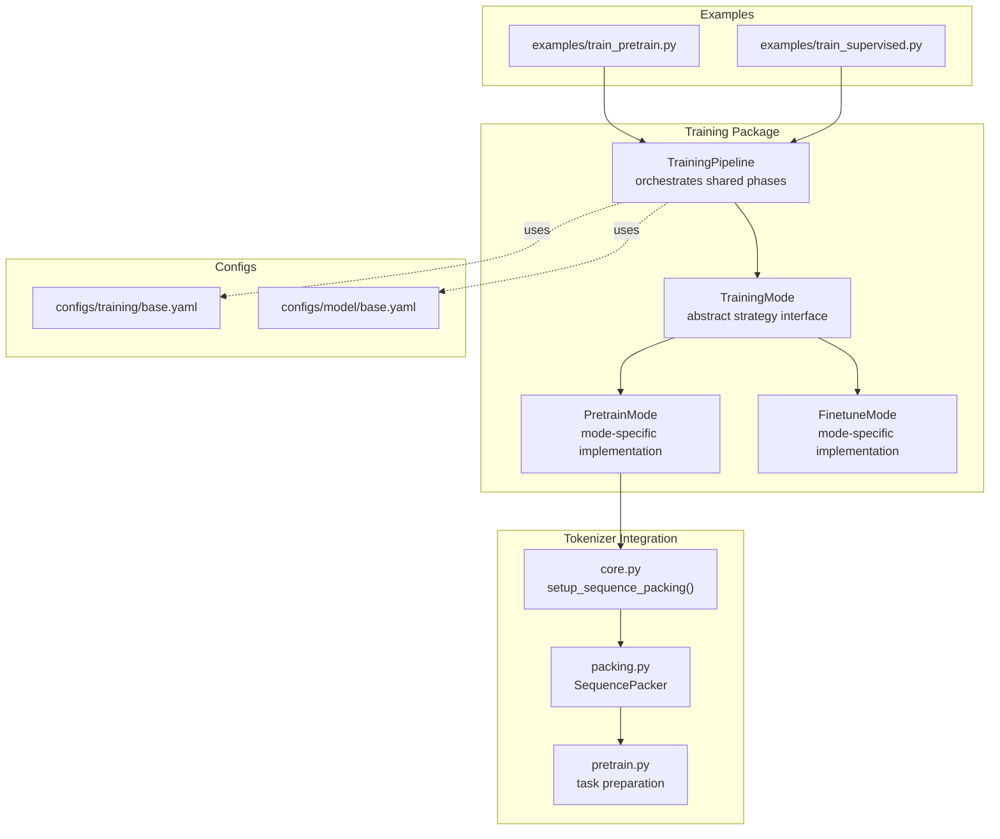
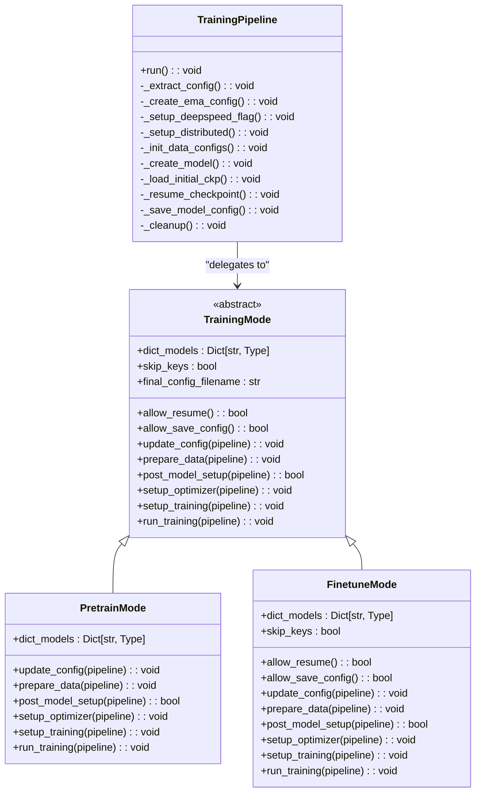
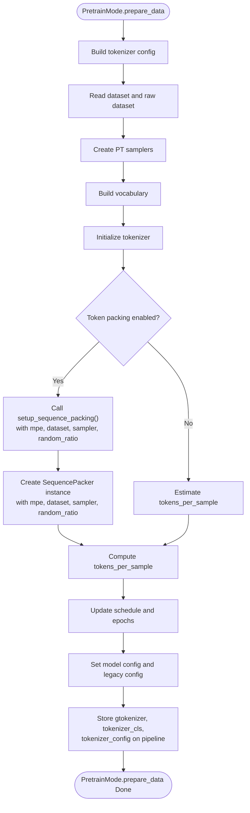
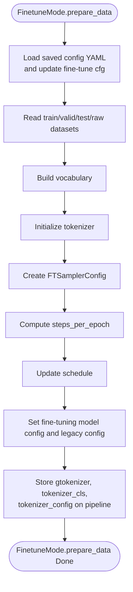
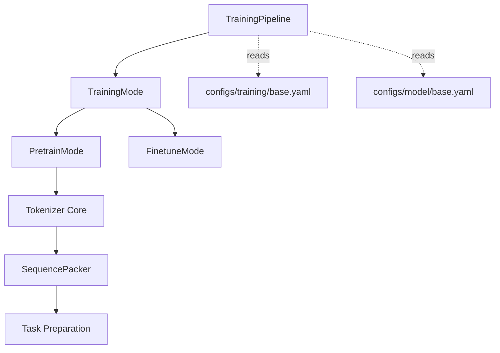

# Training Modes Strategy

<cite>
**Referenced Files in This Document**
- [mode.py](file://src/training/mode.py)
- [pretrain_mode.py](file://src/training/pretrain_mode.py)
- [finetune_mode.py](file://src/training/finetune_mode.py)
- [pipeline.py](file://src/training/pipeline.py)
- [train_pretrain.py](file://examples/train_pretrain.py)
- [train_supervised.py](file://examples/train_supervised.py)
- [base.yaml](file://configs/training/base.yaml)
- [model_base.yaml](file://configs/model/base.yaml)
- [modeling_pretrain.py](file://src/models/graphgpt/modeling_pretrain.py)
- [modeling_finetune.py](file://src/models/graphgpt/modeling_finetune.py)
- [core.py](file://src/data/tokenizer/core.py)
- [packing.py](file://src/data/tokenizer/strategies/packing.py)
- [pretrain.py](file://src/data/tokenizer/strategies/task_prep/pretrain.py)
</cite>

## Update Summary
**Changes Made**
- Updated Pre-training Workflow Details section to reflect the new `setup_sequence_packing()` method
- Added new section on Sequence Packing Strategy Integration
- Updated Data handling differences between pre-training and fine-tuning modes
- Enhanced explanation of token packing implementation and configuration
- Added details about the new SequencePacker class and its integration with the tokenizer

## Table of Contents
1. [Introduction](#introduction)
2. [Project Structure](#project-structure)
3. [Core Components](#core-components)
4. [Architecture Overview](#architecture-overview)
5. [Detailed Component Analysis](#detailed-component-analysis)
6. [Sequence Packing Strategy Integration](#sequence-packing-strategy-integration)
7. [Dependency Analysis](#dependency-analysis)
8. [Performance Considerations](#performance-considerations)
9. [Troubleshooting Guide](#troubleshooting-guide)
10. [Conclusion](#conclusion)
11. [Appendices](#appendices)

## Introduction
This document explains the training modes strategy pattern implementation used to support two distinct training workflows: pre-training and fine-tuning. The strategy pattern encapsulates mode-specific behavior behind a common interface, enabling a unified training pipeline that orchestrates shared setup phases while delegating data preparation, model creation, optimization, and training loops to mode-specific implementations. This separation allows flexible, extensible training workflows tailored to different objectives and datasets.

**Updated** The training configuration now uses a new `setup_sequence_packing()` method instead of direct mpe, dataset, and sampler attribute configuration, providing enhanced integration with the sequence packing strategy for improved training efficiency.

## Project Structure
The training modes are implemented under the training package, with a shared pipeline and mode-specific subclasses. Example entry points demonstrate how to select a mode at runtime.



**Diagram sources**
- [pipeline.py:15-96](file://src/training/pipeline.py#L15-L96)
- [mode.py:5-90](file://src/training/mode.py#L5-L90)
- [pretrain_mode.py:48-501](file://src/training/pretrain_mode.py#L48-L501)
- [finetune_mode.py:43-459](file://src/training/finetune_mode.py#L43-L459)
- [train_pretrain.py:12-18](file://examples/train_pretrain.py#L12-L18)
- [train_supervised.py:12-18](file://examples/train_supervised.py#L12-L18)
- [base.yaml:1-78](file://configs/training/base.yaml#L1-L78)
- [model_base.yaml:1-222](file://configs/model/base.yaml#L1-L222)
- [core.py:82-98](file://src/data/tokenizer/core.py#L82-L98)
- [packing.py:12-46](file://src/data/tokenizer/strategies/packing.py#L12-L46)
- [pretrain.py:115-143](file://src/data/tokenizer/strategies/task_prep/pretrain.py#L115-L143)

**Section sources**
- [pipeline.py:15-96](file://src/training/pipeline.py#L15-L96)
- [mode.py:5-90](file://src/training/mode.py#L5-L90)
- [pretrain_mode.py:48-501](file://src/training/pretrain_mode.py#L48-L501)
- [finetune_mode.py:43-459](file://src/training/finetune_mode.py#L43-L459)
- [train_pretrain.py:12-18](file://examples/train_pretrain.py#L12-L18)
- [train_supervised.py:12-18](file://examples/train_supervised.py#L12-L18)
- [base.yaml:1-78](file://configs/training/base.yaml#L1-L78)
- [model_base.yaml:1-222](file://configs/model/base.yaml#L1-L222)

## Core Components
- TrainingMode (abstract): Defines the strategy interface for training modes. It specifies shared properties and abstract methods that each mode must implement.
- PretrainMode: Implements pre-training behavior including token packing, step-level saving, pre-training evaluation, and specialized model heads.
- FinetuneMode: Implements supervised fine-tuning behavior including epoch-level evaluation, separate train/valid/test loaders, layer freezing, and evaluation-only/inference-only modes.
- TrainingPipeline: Orchestrates shared setup phases (config extraction, distributed setup, model creation, checkpoint handling, cleanup) and delegates mode-specific phases to the selected mode.

Key responsibilities:
- Shared orchestration: Distributed setup, model creation, checkpoint loading/resuming, saving model config, cleanup.
- Mode-specific phases: Data preparation, optimizer setup, training preparation, and the training loop.

**Section sources**
- [mode.py:5-90](file://src/training/mode.py#L5-L90)
- [pretrain_mode.py:48-501](file://src/training/pretrain_mode.py#L48-L501)
- [finetune_mode.py:43-459](file://src/training/finetune_mode.py#L43-L459)
- [pipeline.py:15-96](file://src/training/pipeline.py#L15-L96)

## Architecture Overview
The strategy pattern separates concerns between a shared pipeline and mode-specific implementations. The pipeline manages lifecycle and shared resources, while each mode controls data, model, and training specifics.



**Diagram sources**
- [mode.py:5-90](file://src/training/mode.py#L5-L90)
- [pretrain_mode.py:48-501](file://src/training/pretrain_mode.py#L48-L501)
- [finetune_mode.py:43-459](file://src/training/finetune_mode.py#L43-L459)
- [pipeline.py:15-227](file://src/training/pipeline.py#L15-L227)

## Detailed Component Analysis

### TrainingMode Abstract Base Class
Defines the contract for training modes:
- Properties:
  - dict_models: Maps model type identifiers to model classes.
  - skip_keys: Controls whether to skip score-related keys when loading pretrained checkpoints (defaults to True for pre-training).
  - allow_resume: Allows resuming from existing checkpoints (defaults to True; fine-tuning may override to disallow when eval_only).
  - allow_save_config: Controls saving model config to output_dir (defaults to True; fine-tuning may override to disallow when eval_only).
  - final_config_filename: Filename for the final config saved during cleanup (defaults to "config_final.yaml"; fine-tuning uses "config.yaml").
- Methods:
  - update_config(pipeline): Mode-specific config updates before setup.
  - prepare_data(pipeline): Full data pipeline including tokenizer config, dataset reading, vocabulary building, tokenizer initialization, sampler creation, schedule updates, and model config.
  - post_model_setup(pipeline): Post-model-creation setup (e.g., freezing layers, early exits for eval_only/infer_only).
  - setup_optimizer(pipeline): Creates optimizer (DeepSpeed or DDP), initializes EMA model.
  - setup_training(pipeline): Initializes logging, collator, evaluation loaders, tensorboard writer, pre-training evaluation, and training statistics.
  - run_training(pipeline): Executes the training loop.

Behavioral differences:
- PretrainMode sets skip_keys=True and final_config_filename="config_final.yaml".
- FinetuneMode overrides skip_keys=False, allow_resume(), allow_save_config(), and final_config_filename="config.yaml".

**Section sources**
- [mode.py:5-90](file://src/training/mode.py#L5-L90)

### PretrainMode Implementation
Responsibilities:
- Data preparation:
  - Determines task_type and batch_size.
  - Computes steps_per_saving and schedules.
  - Builds tokenizer configuration and reads datasets.
  - Constructs pre-training samplers and builds vocabulary.
  - Initializes tokenizer and token packing logic using the new `setup_sequence_packing()` method.
  - Updates training schedule and sets model configuration.
  - Stores tokenizer and model config on the pipeline for downstream phases.
- Post-model setup:
  - Supports eval_only and infer_only modes by performing pre-training evaluation and inference without training.
- Optimizer setup:
  - Initializes DeepSpeed or DDP optimizer and EMA.
- Training preparation:
  - Initializes logging, collator, validation/test loaders, and evaluates before training.
  - Resets train sampler and creates train DataLoader.
  - Sets up TrainingStats and ODPS statistics.
- Training loop:
  - Iterates epochs and steps, performs batch training, updates EMA, logs statistics, and periodically saves checkpoints.

Key differences from fine-tuning:
- Uses step-level saving and evaluation.
- Supports token packing and pre-training evaluation.
- Uses DataCollatorForGST with max_length from model config.
- Manages flops profiling (when not using DeepSpeed).

**Updated** The pre-training mode now uses the enhanced `setup_sequence_packing()` method which internally creates a `SequencePacker` instance with configurable parameters including max position embeddings (mpe), dataset reference, sampler, and random_ratio.

**Section sources**
- [pretrain_mode.py:48-501](file://src/training/pretrain_mode.py#L48-L501)

### FinetuneMode Implementation
Responsibilities:
- Data preparation:
  - Loads saved config YAML and updates fine-tuning configuration.
  - Reads separate train/valid/test datasets and builds vocabulary.
  - Initializes tokenizer and constructs FTSamplerConfig.
  - Computes steps_per_epoch and updates schedule.
  - Sets fine-tuning model configuration.
  - Stores tokenizer and model config on the pipeline.
- Post-model setup:
  - Optionally freezes layers based on configuration.
  - Prints trainable parameters and returns False to continue training.
- Optimizer setup:
  - Sets main task and auxiliary task ratios.
  - Creates optimizer (DeepSpeed or DDP) and initializes EMA with ModelEmaV3.
- Training preparation:
  - Initializes logging, collator, evaluation loaders, and tensorboard writer.
  - Performs pre-training evaluation if not in eval_only mode.
  - Sets up TrainingStats with epoch_start and j counters.
- Training loop:
  - Iterates epochs and steps, performs batch training, updates EMA, logs statistics, and periodically dumps training stats.
  - Supports eval_only and infer_only modes with epoch-level evaluation cadence.

Key differences from pre-training:
- Uses epoch-level evaluation and separate train/valid/test loaders.
- Supports layer freezing and EMA decay configuration.
- Uses DataCollatorForGST with is_training=False for evaluation loaders.
- Disallows resume and config saving when eval_only is enabled.

**Section sources**
- [finetune_mode.py:43-459](file://src/training/finetune_mode.py#L43-L459)

### TrainingPipeline Orchestration
The pipeline coordinates shared phases:
- Extracts configuration components (tokenization, model, training, data, schedule, optimizer).
- Creates EMA configuration and stats.
- Sets DeepSpeed flag and determines resume behavior.
- Initializes distributed environment.
- Initializes stacked features, embedding dimensions, and sync configurations.
- Creates model using mode.dict_models lookup and propagates dictionary bounds if available.
- Loads initial checkpoint from pretrained checkpoint if provided and skip_keys is respected.
- Resumes from current checkpoint if conditions are met.
- Saves model config on rank 0 if allowed by mode.
- Cleans up by closing tensorboard writer and saving final config.

Entry points:
- examples/train_pretrain.py selects PretrainMode.
- examples/train_supervised.py selects FinetuneMode.

**Section sources**
- [pipeline.py:15-227](file://src/training/pipeline.py#L15-L227)
- [train_pretrain.py:12-18](file://examples/train_pretrain.py#L12-L18)
- [train_supervised.py:12-18](file://examples/train_supervised.py#L12-L18)

### Model Classes and Their Roles
- Pre-training models:
  - GraphGPTPretrainBase and GraphGPTPosPred are registered in PretrainMode.dict_models and handle pre-training objectives such as masked language modeling and position prediction.
- Fine-tuning models:
  - GraphGPTTaskModel and GraphGPTDenoisingRegressionDoubleHeadsModel are registered in FinetuneMode.dict_models and handle supervised tasks with classification/regression heads and optional denoising components.

These model classes are created by the pipeline using mode.dict_models and are configured according to mode-specific settings.

**Section sources**
- [pretrain_mode.py:71-75](file://src/training/pretrain_mode.py#L71-L75)
- [finetune_mode.py:66-70](file://src/training/finetune_mode.py#L66-L70)
- [modeling_pretrain.py:57-118](file://src/models/graphgpt/modeling_pretrain.py#L57-L118)
- [modeling_finetune.py:64-105](file://src/models/graphgpt/modeling_finetune.py#L64-L105)

## Detailed Component Analysis

### Pre-training Workflow Details
- Data handling:
  - Reads dataset and constructs pre-training samplers.
  - Builds vocabulary and initializes tokenizer.
  - Supports token packing through the new `setup_sequence_packing()` method which creates a `SequencePacker` instance.
  - Updates schedule based on tokens_per_sample and batch_size.
- Model configuration:
  - Sets model config and legacy config for compatibility.
- Training loop:
  - Iterates epochs and steps, performs batch training, updates EMA, logs statistics, and saves checkpoints at configured intervals.



**Updated** The workflow now includes the new `setup_sequence_packing()` method which serves as a centralized interface for configuring sequence packing with enhanced integration capabilities.

**Diagram sources**
- [pretrain_mode.py:97-227](file://src/training/pretrain_mode.py#L97-L227)
- [core.py:82-98](file://src/data/tokenizer/core.py#L82-L98)
- [packing.py:12-46](file://src/data/tokenizer/strategies/packing.py#L12-L46)

**Section sources**
- [pretrain_mode.py:97-227](file://src/training/pretrain_mode.py#L97-L227)

### Fine-tuning Workflow Details
- Data handling:
  - Loads saved config YAML and updates fine-tuning configuration.
  - Reads separate train/valid/test datasets and builds vocabulary.
  - Initializes tokenizer and constructs FTSamplerConfig.
  - Computes steps_per_epoch and updates schedule.
- Model configuration:
  - Sets fine-tuning model configuration and legacy config.
- Training loop:
  - Iterates epochs and steps, performs batch training, updates EMA, logs statistics, and periodically dumps training stats.
  - Supports eval_only and infer_only modes with epoch-level cadence.



**Diagram sources**
- [finetune_mode.py:116-199](file://src/training/finetune_mode.py#L116-L199)

**Section sources**
- [finetune_mode.py:116-199](file://src/training/finetune_mode.py#L116-L199)

### Differences Between Pre-training and Fine-tuning Modes
- Data handling:
  - Pre-training: Single dataset, PT samplers, token packing via `setup_sequence_packing()`, and dynamic tokens-per-sample estimation.
  - Fine-tuning: Separate train/valid/test datasets, FTSamplerConfig, and fixed steps_per_epoch.
- Training objectives:
  - Pre-training: Step-level saving, pre-training evaluation, and generative/discriminative objectives.
  - Fine-tuning: Epoch-level evaluation, classification/regression objectives, and optional denoising.
- Configuration:
  - Pre-training: Uses "config_final.yaml" for final config filename and pack_tokens parameter for sequence packing.
  - Fine-tuning: Uses "config.yaml" and may disallow resume/save when eval_only is enabled.
- Model heads:
  - Pre-training: Generative and/or discriminative heads.
  - Fine-tuning: Task-specific heads (classification/regression) and optional double heads.

**Updated** Pre-training mode now utilizes the enhanced `setup_sequence_packing()` method which provides better integration with the tokenizer's sequence packing strategy, replacing the previous direct attribute configuration approach.

**Section sources**
- [mode.py:19-44](file://src/training/mode.py#L19-L44)
- [pretrain_mode.py:48-501](file://src/training/pretrain_mode.py#L48-L501)
- [finetune_mode.py:43-459](file://src/training/finetune_mode.py#L43-L459)

### Practical Examples of Implementing Custom Training Modes
To implement a new training mode:
1. Create a subclass of TrainingMode and implement all abstract methods:
   - update_config(pipeline)
   - prepare_data(pipeline)
   - post_model_setup(pipeline)
   - setup_optimizer(pipeline)
   - setup_training(pipeline)
   - run_training(pipeline)
2. Define dict_models mapping model type identifiers to model classes.
3. Override properties as needed:
   - skip_keys
   - allow_resume()
   - allow_save_config()
   - final_config_filename
4. Integrate with the pipeline by passing an instance of your mode to TrainingPipeline.
5. Add an entry script similar to examples/train_pretrain.py or examples/train_supervised.py to select your mode.

Mode selection criteria:
- Choose PretrainMode for self-supervised pre-training with step-level saving and evaluation.
- Choose FinetuneMode for supervised fine-tuning with epoch-level evaluation and task-specific heads.

Mode-specific configuration requirements:
- Pre-training: Configure task_type, pack_tokens, schedule (total_tokens, warmup_tokens), optimizer settings, and pretrain_mlm parameters.
- Fine-tuning: Configure ft_eval (eval_only, infer_only, epoch_per_eval), finetune (freeze), and task-specific ft_head settings.

**Section sources**
- [mode.py:5-90](file://src/training/mode.py#L5-L90)
- [train_pretrain.py:12-18](file://examples/train_pretrain.py#L12-L18)
- [train_supervised.py:12-18](file://examples/train_supervised.py#L12-L18)
- [base.yaml:1-78](file://configs/training/base.yaml#L1-L78)
- [model_base.yaml:1-222](file://configs/model/base.yaml#L1-L222)

## Sequence Packing Strategy Integration

The training modes now feature an enhanced sequence packing strategy that improves training efficiency by combining multiple short sequences into longer packed sequences.

### SequencePacker Class
The `SequencePacker` class provides the core functionality for packing multiple tokenized sequences:

- **Constructor Parameters**:
  - `mpe`: Maximum position embeddings (sequence length limit)
  - `dataset`: Reference to the underlying dataset
  - `sampler`: Optional sampler for controlled sampling
  - `random_ratio`: Ratio controlling random vs sequential sampling
  - `eos_token`: End-of-sequence token identifier
  - `label_pad_token`: Padding token for labels

- **Pack Method**: Combines multiple tokenized sequences into a single packed sequence while respecting the MPE constraint.

### Integration with Pre-training Mode
The `setup_sequence_packing()` method in the tokenizer core provides a centralized interface:

```python
def setup_sequence_packing(self, mpe, dataset, sampler=None, random_ratio=1.0):
    """Setup sequence packing for pre-training."""
    from .strategies.packing import SequencePacker

    self.mpe = mpe
    self.dataset = dataset
    self.sampler = sampler
    self.random_ratio = random_ratio

    self.sequence_packer = SequencePacker(
        mpe=mpe,
        dataset=dataset,
        sampler=sampler,
        random_ratio=random_ratio,
        eos_token=self.get_eos_token(),
        label_pad_token=self.get_label_pad_token(),
    )
```

### Configuration Parameters
The sequence packing functionality is controlled through the training configuration:

- `pack_tokens`: Controls whether sequence packing is enabled (0 = disabled, > 0 = enabled)
- `max_length`: Maximum sequence length for token packing
- `random_ratio`: Ratio controlling random sampling behavior

### Task Preparation Integration
The sequence packing strategy integrates with task preparation through the pretrain task strategy:

- Updates attention masks and split lengths for packed sequences
- Handles position IDs and attention modes for different sequence parts
- Manages padding and label handling for packed sequences

**Section sources**
- [core.py:82-98](file://src/data/tokenizer/core.py#L82-L98)
- [packing.py:12-46](file://src/data/tokenizer/strategies/packing.py#L12-L46)
- [pretrain.py:115-143](file://src/data/tokenizer/strategies/task_prep/pretrain.py#L115-L143)

## Dependency Analysis
The training modes depend on shared utilities and configuration, while maintaining low coupling to each other. The pipeline centralizes shared logic, reducing duplication across modes.



**Diagram sources**
- [pipeline.py:15-227](file://src/training/pipeline.py#L15-L227)
- [mode.py:5-90](file://src/training/mode.py#L5-L90)
- [pretrain_mode.py:48-501](file://src/training/pretrain_mode.py#L48-L501)
- [finetune_mode.py:43-459](file://src/training/finetune_mode.py#L43-L459)
- [base.yaml:1-78](file://configs/training/base.yaml#L1-L78)
- [model_base.yaml:1-222](file://configs/model/base.yaml#L1-L222)
- [core.py:82-98](file://src/data/tokenizer/core.py#L82-L98)
- [packing.py:12-46](file://src/data/tokenizer/strategies/packing.py#L12-L46)
- [pretrain.py:115-143](file://src/data/tokenizer/strategies/task_prep/pretrain.py#L115-L143)

**Section sources**
- [pipeline.py:15-227](file://src/training/pipeline.py#L15-L227)
- [mode.py:5-90](file://src/training/mode.py#L5-L90)
- [pretrain_mode.py:48-501](file://src/training/pretrain_mode.py#L48-L501)
- [finetune_mode.py:43-459](file://src/training/finetune_mode.py#L43-L459)
- [base.yaml:1-78](file://configs/training/base.yaml#L1-L78)
- [model_base.yaml:1-222](file://configs/model/base.yaml#L1-L222)

## Performance Considerations
- Pre-training:
  - Token packing reduces padding overhead and improves throughput.
  - Step-level saving balances checkpoint frequency with disk IO.
  - Flops profiler can be used for performance analysis when not using DeepSpeed.
  - **Updated** The new `setup_sequence_packing()` method provides better memory efficiency and reduced padding overhead through intelligent sequence combination.
- Fine-tuning:
  - Layer freezing reduces parameter count and accelerates training.
  - Epoch-level evaluation reduces overhead compared to step-level evaluations.
  - EMA with ModelEmaV3 can improve generalization and stability.

## Troubleshooting Guide
Common issues and resolutions:
- Resume conflicts:
  - Ensure allow_resume() returns True for the selected mode and that the output_dir contains a valid checkpoint.
- Config saving:
  - If allow_save_config() returns False (e.g., eval_only in fine-tuning), the model config will not be saved.
- Checkpoint loading:
  - When skip_keys is True (pre-training), score-related keys are skipped when loading pretrained checkpoints.
- Distributed training:
  - Verify DeepSpeed flag and distributed environment setup; ensure world_size and rank are correctly configured.
- Logging and tensorboard:
  - Confirm that the tensorboard writer is initialized and closed properly during cleanup.
- **Updated** Sequence packing issues:
  - Verify that `pack_tokens` is properly configured in training configuration.
  - Check that `setup_sequence_packing()` is called with correct parameters (mpe, dataset, sampler).
  - Ensure the SequencePacker is properly integrated with the tokenizer's task preparation strategy.

**Section sources**
- [pipeline.py:179-227](file://src/training/pipeline.py#L179-L227)
- [mode.py:19-44](file://src/training/mode.py#L19-L44)

## Conclusion
The training modes strategy pattern cleanly separates pre-training and fine-tuning workflows while sharing common orchestration logic. By implementing a new mode, developers can extend the system with minimal coupling to existing components. The provided examples and configuration files offer a practical foundation for adapting the strategy to new datasets and tasks.

**Updated** The introduction of the `setup_sequence_packing()` method and enhanced sequence packing strategy significantly improves training efficiency for pre-training scenarios by intelligently combining multiple short sequences into longer packed sequences, reducing padding overhead and improving computational throughput.

## Appendices

### Configuration Reference
- Training configuration (pre-training and fine-tuning):
  - Keys include deepspeed configuration, scheduling, optimizer settings, batch sizes, and evaluation flags.
  - **Updated** Includes pack_tokens parameter for sequence packing configuration.
- Model configuration:
  - Includes core architecture parameters, dropout settings, graph input stacking, pre-training and fine-tuning head settings, and tokenizer special tokens.

**Section sources**
- [base.yaml:1-78](file://configs/training/base.yaml#L1-L78)
- [model_base.yaml:1-222](file://configs/model/base.yaml#L1-L222)
