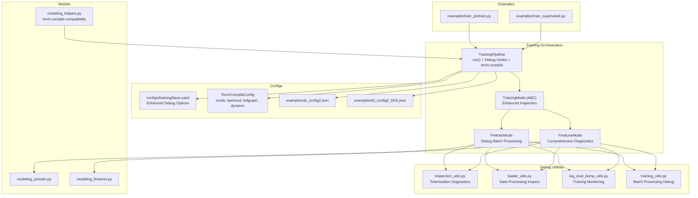
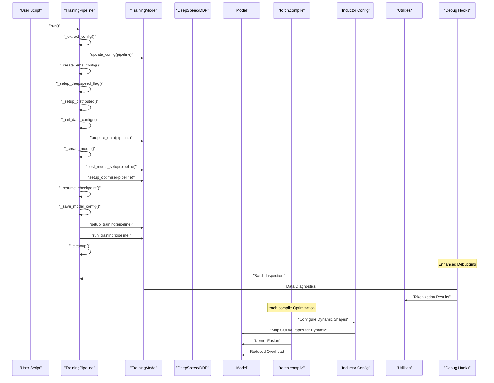
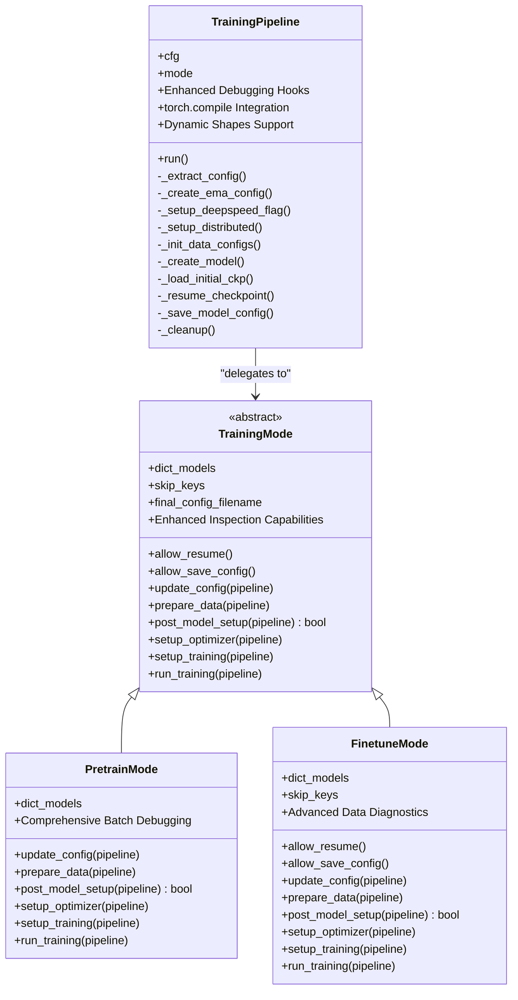
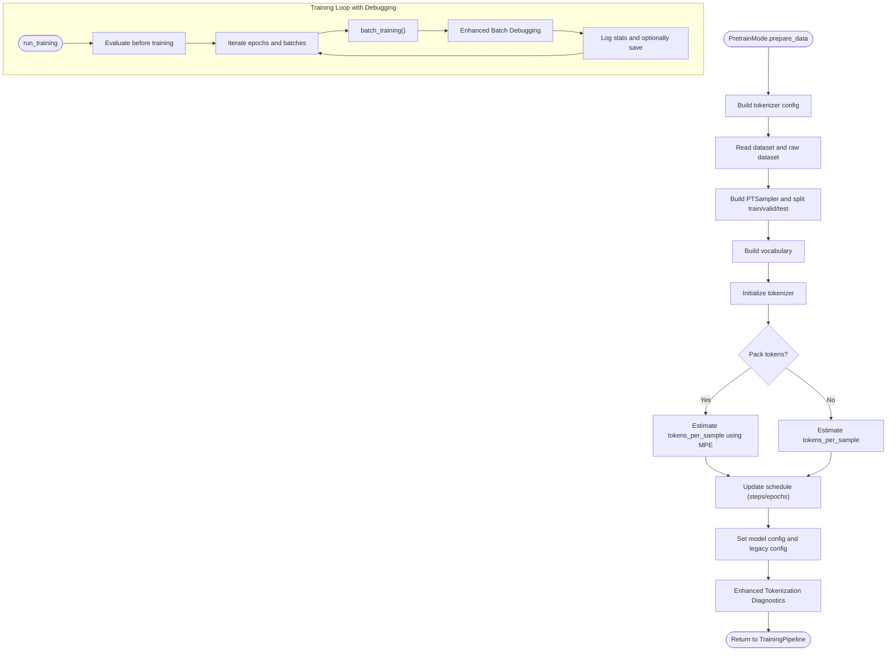
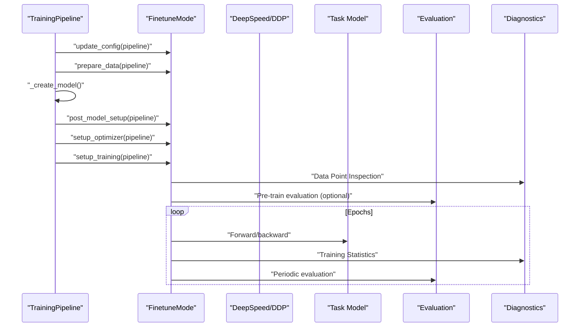
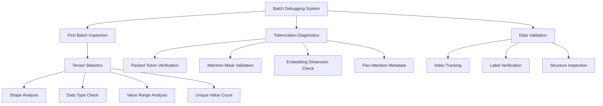
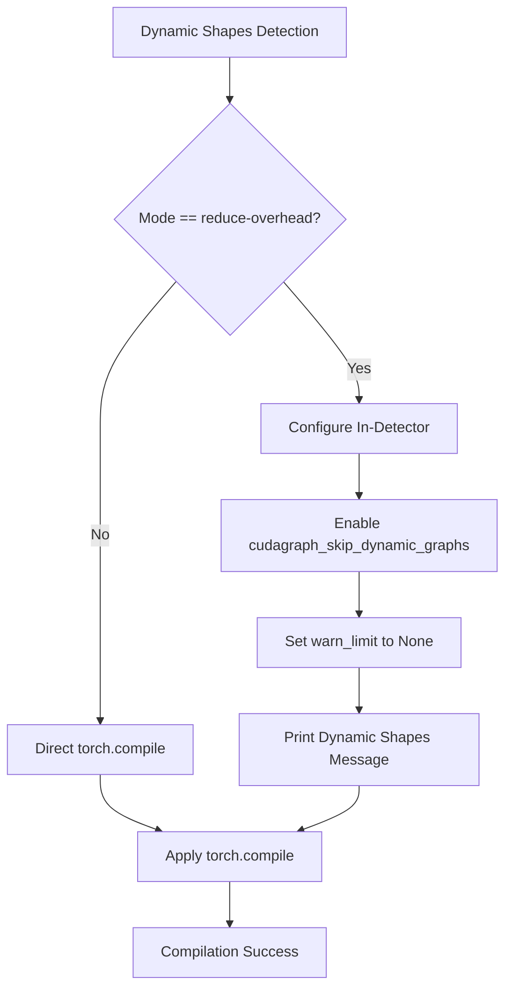
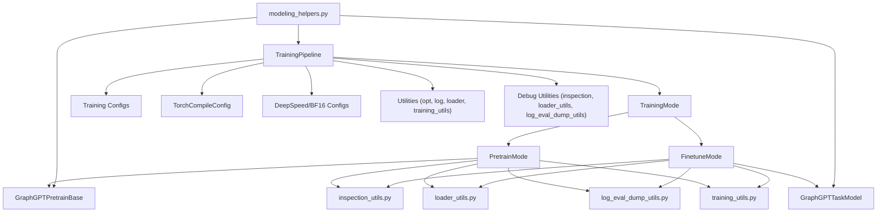

# Training Pipeline

<cite>
**Referenced Files in This Document**
- [pipeline.py](file://src/training/pipeline.py)
- [mode.py](file://src/training/mode.py)
- [pretrain_mode.py](file://src/training/pretrain_mode.py)
- [finetune_mode.py](file://src/training/finetune_mode.py)
- [base_configs.py](file://src/conf/base_configs.py)
- [train_pretrain.py](file://examples/train_pretrain.py)
- [train_supervised.py](file://examples/train_supervised.py)
- [base.yaml](file://configs/training/base.yaml)
- [ds_config2.json](file://examples/ds_config2.json)
- [ds_config2_bf16.json](file://examples/ds_config2_bf16.json)
- [training_utils.py](file://src/utils/training_utils.py)
- [opt_utils.py](file://src/utils/opt_utils.py)
- [modeling_pretrain.py](file://src/models/graphgpt/modeling_pretrain.py)
- [modeling_finetune.py](file://src/models/graphgpt/modeling_finetune.py)
- [modeling_helpers.py](file://src/models/graphgpt/modeling_helpers.py)
- [tokenizer_utils.py](file://src/utils/tokenizer_utils.py)
- [inspection_utils.py](file://src/utils/inspection_utils.py)
- [loader_utils.py](file://src/utils/loader_utils.py)
- [log_eval_dump_utils.py](file://src/utils/log_eval_dump_utils.py)
</cite>

## Update Summary
**Changes Made**
- Added comprehensive documentation for dynamic shapes configuration in torch.compile optimization
- Documented new inductor configuration logic to skip CUDAGraphs for dynamic shapes
- Updated torch.compile integration section with sequence packing compatibility
- Enhanced troubleshooting guide with dynamic shapes and CUDAGraphs considerations
- Added detailed explanation of torch.compile configuration parameters and their effects

## Table of Contents
1. [Introduction](#introduction)
2. [Project Structure](#project-structure)
3. [Core Components](#core-components)
4. [Architecture Overview](#architecture-overview)
5. [Detailed Component Analysis](#detailed-component-analysis)
6. [Enhanced Debugging and Configuration Management](#enhanced-debugging-and-configuration-management)
7. [Torch Compile Optimization Integration](#torch-compile-optimization-integration)
8. [Dynamic Shapes and Sequence Packing Compatibility](#dynamic-shapes-and-sequence-packing-compatibility)
9. [Dependency Analysis](#dependency-analysis)
10. [Performance Considerations](#performance-considerations)
11. [Troubleshooting Guide](#troubleshooting-guide)
12. [Conclusion](#conclusion)
13. [Appendices](#appendices)

## Introduction
This document explains the unified training orchestration system of Graph-GPT with a focus on the strategy pattern implementation. It covers how the TrainingPipeline coordinates shared setup phases and delegates mode-specific behavior to TrainingMode subclasses. It documents the pre-training pipeline with next-token prediction (NTP) and scheduled masked-token prediction (SMTP), and the fine-tuning pipeline for downstream tasks including graph-level, edge-level, and node-level predictions. The system now includes enhanced debugging capabilities, improved configuration management, advanced batch processing utilities, and comprehensive torch.compile optimization support for kernel fusion and reduced launch overhead, with special attention to dynamic shapes and sequence packing compatibility.

## Project Structure
The training system is organized around a strategy pattern with enhanced debugging, configuration management, and torch.compile optimization:
- A shared TrainingPipeline orchestrates common setup and lifecycle phases with comprehensive debugging hooks and torch.compile integration.
- Two TrainingMode subclasses implement pre-training and fine-tuning strategies with improved inspection capabilities.
- Example entry points demonstrate how to launch pre-training and fine-tuning jobs with enhanced diagnostics.
- Configuration files define training schedules, optimizer settings, distributed parameters, and torch.compile optimization options.
- Model implementations encapsulate the specific objectives and heads for pre-training and fine-tuning with enhanced monitoring.

**Diagram sources**
- [pipeline.py:15-96](file://src/training/pipeline.py#L15-L96)
- [mode.py:5-90](file://src/training/mode.py#L5-L90)
- [pretrain_mode.py:48-75](file://src/training/pretrain_mode.py#L48-L75)
- [finetune_mode.py:43-70](file://src/training/finetune_mode.py#L43-L70)
- [base_configs.py:164-184](file://src/conf/base_configs.py#L164-L184)
- [train_pretrain.py:12-14](file://examples/train_pretrain.py#L12-L14)
- [train_supervised.py:12-14](file://examples/train_supervised.py#L12-L14)
- [base.yaml:107-118](file://configs/training/base.yaml#L107-L118)
- [ds_config2.json:1-43](file://examples/ds_config2.json#L1-43)
- [ds_config2_bf16.json:1-38](file://examples/ds_config2_bf16.json#L1-L38)
- [modeling_pretrain.py:57-118](file://src/models/graphgpt/modeling_pretrain.py#L57-L118)
- [modeling_finetune.py:64-106](file://src/models/graphgpt/modeling_finetune.py#L64-L106)
- [modeling_helpers.py:120-125](file://src/models/graphgpt/modeling_helpers.py#L120-L125)
- [inspection_utils.py:73-169](file://src/utils/inspection_utils.py#L73-L169)
- [loader_utils.py:680-752](file://src/utils/loader_utils.py#L680-L752)
- [log_eval_dump_utils.py:1-200](file://src/utils/log_eval_dump_utils.py#L1-L200)
- [training_utils.py:1-200](file://src/utils/training_utils.py#L1-L200)

**Section sources**
- [pipeline.py:15-96](file://src/training/pipeline.py#L15-L96)
- [mode.py:5-90](file://src/training/mode.py#L5-L90)
- [pretrain_mode.py:48-75](file://src/training/pretrain_mode.py#L48-L75)
- [finetune_mode.py:43-70](file://src/training/finetune_mode.py#L43-L70)
- [base_configs.py:164-184](file://src/conf/base_configs.py#L164-L184)
- [train_pretrain.py:12-14](file://examples/train_pretrain.py#L12-L14)
- [train_supervised.py:12-14](file://examples/train_supervised.py#L12-L14)
- [base.yaml:107-118](file://configs/training/base.yaml#L107-L118)

## Core Components
- TrainingPipeline: Central orchestrator that extracts configs, sets up distributed environments, initializes tokenizers and models, manages checkpoints, and executes mode-specific phases. Now includes enhanced debugging hooks, comprehensive batch inspection capabilities, and torch.compile optimization integration with dynamic shapes support.
- TrainingMode (ABC): Defines the strategy interface with abstract methods for mode-specific behavior: update_config, prepare_data, post_model_setup, setup_optimizer, setup_training, and run_training. Enhanced with improved inspection and debugging support.
- PretrainMode: Implements pre-training specifics including dataset preparation, token packing, NTP/SMTP objectives, evaluation before training, and step-wise saving. Features comprehensive batch debugging and tokenization diagnostics with torch.compile optimization.
- FinetuneMode: Implements supervised fine-tuning specifics including separate train/valid/test loaders, optional layer freezing, epoch-level evaluation cadence, and optional inference dumping. Includes enhanced data processing inspection and training monitoring with torch.compile integration.

Key shared capabilities:
- Distributed training via environment setup and DeepSpeed initialization.
- Mixed precision training with automatic scaling for non-DeepSpeed runs.
- Gradient accumulation support (enforced to 1 outside DeepSpeed).
- EMA model support for pre-training and fine-tuning.
- Comprehensive logging and TensorBoard writer initialization.
- Advanced debugging utilities for batch inspection and data diagnostics.
- **New**: torch.compile optimization integration for kernel fusion and reduced launch overhead with dynamic shapes support for sequence packing.

**Section sources**
- [pipeline.py:15-96](file://src/training/pipeline.py#L15-L96)
- [mode.py:5-90](file://src/training/mode.py#L5-L90)
- [pretrain_mode.py:48-75](file://src/training/pretrain_mode.py#L48-L75)
- [finetune_mode.py:43-70](file://src/training/finetune_mode.py#L43-L70)

## Architecture Overview
The unified training pipeline follows a deterministic lifecycle with shared phases and mode-specific extensions, now enhanced with comprehensive debugging capabilities and torch.compile optimization with dynamic shapes support.

**Diagram sources**
- [pipeline.py:60-96](file://src/training/pipeline.py#L60-L96)
- [pretrain_mode.py:81-265](file://src/training/pretrain_mode.py#L81-L265)
- [finetune_mode.py:86-358](file://src/training/finetune_mode.py#L86-L358)
- [inspection_utils.py:73-169](file://src/utils/inspection_utils.py#L73-L169)
- [training_utils.py:470-500](file://src/utils/training_utils.py#L470-L500)
- [pipeline.py:170-202](file://src/training/pipeline.py#L170-L202)

## Detailed Component Analysis

### Strategy Pattern: TrainingPipeline and TrainingMode
- TrainingPipeline centralizes shared orchestration with enhanced debugging capabilities and torch.compile integration:
  - Configuration decomposition into tokenization, model, training, data, schedule, optimizer, and torch_compile configs.
  - EMA configuration and stats initialization.
  - Distributed environment setup and DeepSpeed flag resolution.
  - Data config initialization and model creation with gradient checkpointing and cache disabling.
  - Checkpoint loading/resuming and final config dumping.
  - Comprehensive batch inspection hooks for debugging training loops.
  - **New**: torch.compile optimization application with configurable modes, backends, and dynamic shapes support.
- TrainingMode defines the contract for mode-specific behavior with enhanced inspection support:
  - dict_models: mapping of model_type to model classes.
  - Properties: skip_keys, allow_resume, allow_save_config, final_config_filename.
  - Methods: update_config, prepare_data, post_model_setup, setup_optimizer, setup_training, run_training.
  - Enhanced debugging hooks for data processing and tokenization diagnostics.

**Diagram sources**
- [pipeline.py:15-96](file://src/training/pipeline.py#L15-L96)
- [mode.py:5-90](file://src/training/mode.py#L5-L90)
- [pretrain_mode.py:48-75](file://src/training/pretrain_mode.py#L48-L75)
- [finetune_mode.py:43-70](file://src/training/finetune_mode.py#L43-L70)

**Section sources**
- [pipeline.py:15-96](file://src/training/pipeline.py#L15-L96)
- [mode.py:5-90](file://src/training/mode.py#L5-L90)

### Pre-training Pipeline: NTP and SMTP Objectives with Enhanced Debugging
PretrainMode implements:
- Tokenizer configuration and dataset reading with comprehensive inspection.
- Vocab building and tokenizer initialization with semantics and stacking method.
- Token packing estimation and optional packing to maximize sequence utilization.
- Schedule updates based on tokens_per_sample, batch_size, and world_size.
- Model configuration and legacy conversion for compatibility.
- Post-model setup with optional evaluation/inference-only modes.
- Optimizer setup with DeepSpeed or DDP + OneCycleLR + GradScaler.
- Pre-training evaluation on validation and test sets.
- Step-wise training loop with logging, saving, EMA updates, and comprehensive batch debugging.

**Enhanced Debugging Features:**
- First batch inspection with detailed tensor statistics and shapes.
- Comprehensive tokenization result diagnostics.
- Batch processing validation and data pipeline monitoring.
- Enhanced logging for training progress and debugging information.

Objectives:
- Next-token prediction (NTP): Predicts the next token(s) given the context, configurable via model head settings.
- Scheduled masked-token prediction (SMTP): Applies a scheduled masking policy controlled by pretrain_mlm configuration, supporting inside-model scheduling and optional weighting.

**Diagram sources**
- [pretrain_mode.py:97-227](file://src/training/pretrain_mode.py#L97-L227)
- [pretrain_mode.py:428-544](file://src/training/pretrain_mode.py#L428-L544)
- [inspection_utils.py:73-169](file://src/utils/inspection_utils.py#L73-L169)
- [training_utils.py:7-103](file://src/utils/training_utils.py#L7-L103)
- [modeling_pretrain.py:57-118](file://src/models/graphgpt/modeling_pretrain.py#L57-L118)
- [tokenizer_utils.py:250-278](file://src/utils/tokenizer_utils.py#L250-L278)

**Section sources**
- [pretrain_mode.py:97-227](file://src/training/pretrain_mode.py#L97-L227)
- [pretrain_mode.py:428-544](file://src/training/pretrain_mode.py#L428-L544)
- [inspection_utils.py:73-169](file://src/utils/inspection_utils.py#L73-L169)
- [training_utils.py:7-103](file://src/utils/training_utils.py#L7-L103)
- [modeling_pretrain.py:57-118](file://src/models/graphgpt/modeling_pretrain.py#L57-L118)
- [tokenizer_utils.py:250-278](file://src/utils/tokenizer_utils.py#L250-L278)

### Fine-tuning Pipeline: Downstream Tasks with Advanced Diagnostics
FinetuneMode implements:
- Separate train/valid/test datasets and samplers with comprehensive inspection.
- Optional layer freezing for backbone adaptation.
- Collation and evaluation loaders with enhanced debugging support.
- Optimizer setup with DeepSpeed or DDP + scheduler and EMA.
- Pre-training evaluation in non-eval-only mode.
- Epoch-level training loop with periodic evaluation and optional inference dumping.
- Advanced data processing diagnostics and training monitoring.

**Enhanced Diagnostics Features:**
- Comprehensive data point inspection for train/validation/test sets.
- Detailed tokenization result analysis for fine-tuning tasks.
- Advanced training statistics monitoring and logging.
- Enhanced evaluation capabilities with comprehensive metrics reporting.

Downstream tasks supported:
- Graph-level classification/regression.
- Edge-level classification/regression.
- Node-level classification/regression.

**Diagram sources**
- [finetune_mode.py:86-358](file://src/training/finetune_mode.py#L86-L358)
- [modeling_finetune.py:64-106](file://src/models/graphgpt/modeling_finetune.py#L64-L106)
- [inspection_utils.py:73-169](file://src/utils/inspection_utils.py#L73-L169)
- [log_eval_dump_utils.py:83-175](file://src/utils/log_eval_dump_utils.py#L83-L175)

**Section sources**
- [finetune_mode.py:86-358](file://src/training/finetune_mode.py#L86-L358)
- [modeling_finetune.py:64-106](file://src/models/graphgpt/modeling_finetune.py#L64-L106)
- [inspection_utils.py:73-169](file://src/utils/inspection_utils.py#L73-L169)
- [log_eval_dump_utils.py:83-175](file://src/utils/log_eval_dump_utils.py#L83-L175)

### Practical Examples: Configuring Training Runs
- Launching pre-training:
  - Entry point: [train_pretrain.py:12-14](file://examples/train_pretrain.py#L12-L14)
  - Uses TrainingPipeline with PretrainMode and Hydra configuration.
- Launching fine-tuning:
  - Entry point: [train_supervised.py:12-14](file://examples/train_supervised.py#L12-L14)
  - Uses TrainingPipeline with FinetuneMode and Hydra configuration.
- Configuration:
  - Base training config: [base.yaml:1-118](file://configs/training/base.yaml#L1-L118)
  - DeepSpeed configurations: [ds_config2.json:1-43](file://examples/ds_config2.json#L1-L43), [ds_config2_bf16.json:1-38](file://examples/ds_config2_bf16.json#L1-L38)

Common configuration knobs:
- task_type: pretrain-mlm, pretrain-smtp, graph, edge, node.
- schedule: epochs, total_tokens, warmup_epochs/tokens, logging_steps, samples_per_saving.
- optimizer: lr, betas, weight_decay, eps, max_grad_norm, gradient_accumulation_steps, use_ema, ema_decay.
- distributed: world_size, rank.
- finetune: freeze, use_aux, aux_ratio, task_ratio.
- ft_eval: save_pred, save_hidden_states, infer_only, eval_only, epoch_per_eval.
- **New**: torch_compile: enabled, mode, backend, fullgraph, dynamic, disable_on_deepspeed for optimization.
- Enhanced debugging: pack_tokens, num_workers, num_workers_eval for better diagnostics.

**Section sources**
- [train_pretrain.py:12-14](file://examples/train_pretrain.py#L12-L14)
- [train_supervised.py:12-14](file://examples/train_supervised.py#L12-L14)
- [base.yaml:1-118](file://configs/training/base.yaml#L1-L118)
- [ds_config2.json:1-43](file://examples/ds_config2.json#L1-L43)
- [ds_config2_bf16.json:1-38](file://examples/ds_config2_bf16.json#L1-L38)

### Monitoring Training Progress and Evaluating Performance
- Logging:
  - Pre-training: periodic logs and step-wise saving; evaluation on validation and test sets before and during training.
  - Fine-tuning: epoch-level evaluation cadence; optional inference dumping to ODPS tables.
  - Enhanced debugging: comprehensive batch inspection with tensor statistics and shapes.
- TensorBoard:
  - Writers initialized in mode-specific setup routines.
  - Enhanced training statistics monitoring with debugging information.
- Metrics:
  - Validation/test losses and task-specific metrics (e.g., OGB evaluations) recorded and saved.
  - Comprehensive evaluation metrics with detailed breakdowns.

**Section sources**
- [pretrain_mode.py:428-544](file://src/training/pretrain_mode.py#L428-L544)
- [finetune_mode.py:372-468](file://src/training/finetune_mode.py#L372-L468)
- [log_eval_dump_utils.py:1-200](file://src/utils/log_eval_dump_utils.py#L1-L200)

### Relationship Between Training Modes and Specific Requirements
- PretrainMode:
  - Single dataset with train/valid/test splits.
  - Token packing and schedule updates based on tokens_per_sample.
  - Evaluation before training and EMA-based best checkpoint tracking.
  - Comprehensive batch debugging and tokenization diagnostics with torch.compile optimization.
- FinetuneMode:
  - Separate train/valid/test datasets.
  - Optional layer freezing and auxiliary pre-training loss integration.
  - Epoch-level evaluation cadence and optional inference dumping.
  - Advanced data processing inspection and training monitoring with torch.compile integration.

**Section sources**
- [pretrain_mode.py:148-227](file://src/training/pretrain_mode.py#L148-L227)
- [finetune_mode.py:134-198](file://src/training/finetune_mode.py#L134-L198)

### Distributed Training Integration with DeepSpeed, Mixed Precision, and Gradient Accumulation
- Distributed setup:
  - Environment variables configured and world_size/rank resolved.
  - DeepSpeed initialization with NCCL backend when enabled.
- Mixed precision:
  - Non-DeepSpeed path uses torch.cuda.amp.GradScaler with autocast for forward pass.
  - DeepSpeed path leverages its internal precision settings.
- Gradient accumulation:
  - Enforced to 1 outside DeepSpeed to align with AMP scaling behavior.
- Checkpointing:
  - DeepSpeed resume via model.load_checkpoint().
  - Non-DeepSpeed resume via DDP + optimizer/scheduler restoration.

**Section sources**
- [pipeline.py:137-202](file://src/training/pipeline.py#L137-L202)
- [opt_utils.py:7-38](file://src/utils/opt_utils.py#L7-L38)
- [training_utils.py:47-86](file://src/utils/training_utils.py#L47-L86)

## Enhanced Debugging and Configuration Management

### Comprehensive Batch Inspection System
The training system now includes sophisticated batch inspection capabilities that provide detailed debugging information:

**Pre-training Batch Debugging:**
- First batch inspection with comprehensive tensor statistics
- Shape analysis and data type verification
- Statistical summaries (min, max, mean, std) for all tensor inputs
- Unique value counting for input_ids
- Detailed data structure inspection for lists and tuples

**Fine-tuning Data Diagnostics:**
- Sample inspection with index tracking
- Input structure validation and key enumeration
- Task-specific label verification
- Embedding dimension analysis
- Noise data inspection for denoising tasks

**Enhanced Tokenization Diagnostics:**
- Comprehensive tokenization result analysis
- Packed token verification and sequence packing diagnostics
- Attention mask and position id validation
- Embedding dimension checking
- Flex attention metadata inspection

**Diagram sources**
- [pretrain_mode.py:473-499](file://src/training/pretrain_mode.py#L473-L499)
- [training_utils.py:124-127](file://src/utils/training_utils.py#L124-L127)
- [inspection_utils.py:73-169](file://src/utils/inspection_utils.py#L73-L169)

### Advanced Configuration Management
Enhanced configuration management provides better control over training processes:

**Improved Tokenization Configuration:**
- Dynamic task type detection and configuration updates
- Inside-model scheduling configuration for SMTP
- Flexible tokenizer class selection based on configuration
- Stack method configuration for graph input processing

**Enhanced Schedule Configuration:**
- Automatic tokens_per_sample estimation with packing support
- Dynamic schedule updates based on world size and batch size
- Reset samples per epoch configuration for iterable datasets
- Comprehensive schedule statistics printing

**Advanced Model Configuration:**
- Legacy configuration conversion for compatibility
- Model bounds propagation for specific datasets
- Gradient checkpointing and cache disabling automation
- Embedding dimension synchronization

**New**: Torch Compile Configuration:
- TorchCompileConfig with enabled, mode, backend, fullgraph, dynamic, and disable_on_deepspeed parameters
- Integration with TrainingConfig for seamless optimization
- Automatic torch.compile application during model creation
- Dynamic shapes support for sequence packing compatibility

**Section sources**
- [pretrain_mode.py:82-241](file://src/training/pretrain_mode.py#L82-L241)
- [finetune_mode.py:86-206](file://src/training/finetune_mode.py#L86-L206)
- [pipeline.py:149-165](file://src/training/pipeline.py#L149-L165)
- [base_configs.py:164-184](file://src/conf/base_configs.py#L164-L184)

### Batch Processing Capabilities
Enhanced batch processing utilities provide better data pipeline monitoring:

**Flexible Attention Processing:**
- Support for flex attention metadata (sample_lens, split_lens, attn_modes)
- Automatic attention mode detection and processing
- Sequence length and split length validation
- Attention mode configuration for different attention types

**Enhanced Data Collation:**
- Comprehensive data collation with flexible tensor handling
- Embedding input processing for raw embeddings
- Weighted sample processing for balanced training
- Position id support for positional encoding

**Advanced Training Utilities:**
- Enhanced batch training with debugging hooks
- Fine-tuning batch processing with task-specific labels
- Auxiliary loss integration for multi-task learning
- Gradient accumulation enforcement and validation

**Section sources**
- [training_utils.py:7-103](file://src/utils/training_utils.py#L7-L103)
- [training_utils.py:111-200](file://src/utils/training_utils.py#L111-L200)
- [pretrain_mode.py:473-499](file://src/training/pretrain_mode.py#L473-L499)

## Torch Compile Optimization Integration

### Configuration Structure and Parameters
The torch.compile optimization system introduces a comprehensive configuration framework:

**TorchCompileConfig Class:**
- enabled: Boolean flag to enable/disable torch.compile optimization
- mode: Compilation mode selection ('default', 'reduce-overhead', 'max-autotune')
- backend: Compilation backend ('inductor' recommended, 'cudagraphs', etc.)
- fullgraph: Full graph compilation requirement for complex models
- dynamic: Dynamic shapes support for variable sequence lengths
- disable_on_deepspeed: Compatibility toggle for DeepSpeed integration

**Integration Points:**
- Applied automatically during model creation in TrainingPipeline
- Configurable through training/base.yaml under torch_compile section
- Automatic fallback for unsupported PyTorch versions

### Performance Benefits and Optimization Strategies
**Kernel Fusion and Reduced Overhead:**
- Eliminates kernel launch overhead through graph fusion
- Reduces memory fragmentation and improves GPU utilization
- Optimizes computational graph for better memory access patterns

**Compilation Modes:**
- reduce-overhead: Optimal for reducing kernel launch overhead (recommended)
- max-autotune: Maximum performance with slower compilation time
- default: Balanced option for general use cases

**Backend Selection:**
- inductor: Default backend optimized for PyTorch models
- cudagraphs: CUDA graph backend for static computation graphs
- Custom backends: Support for specialized hardware optimizations

### Implementation Details and Error Handling
**Automatic Application:**
- Integrated into _create_model() method during training pipeline setup
- Automatic detection of PyTorch version compatibility
- Graceful fallback with informative warnings for unsupported versions

**Error Handling:**
- Try-catch block around torch.compile application
- Informative error messages for compilation failures
- Automatic fallback to unoptimized model execution

**Section sources**
- [pipeline.py:170-202](file://src/training/pipeline.py#L170-L202)
- [base_configs.py:164-184](file://src/conf/base_configs.py#L164-L184)
- [base.yaml:107-118](file://configs/training/base.yaml#L107-L118)

## Dynamic Shapes and Sequence Packing Compatibility

### In-Detector Configuration Logic
The torch.compile system includes sophisticated configuration logic to handle dynamic shapes, particularly important for sequence packing techniques:

**Dynamic Shapes Detection:**
- Automatic detection of dynamic shapes in sequence packing scenarios
- Conditional configuration of inductor settings based on compilation mode
- Special handling for reduce-overhead mode to avoid CUDAGraph limitations

**Inductor Configuration:**
- cudagraph_skip_dynamic_graphs: Enabled to skip CUDAGraphs for dynamic shapes
- cudagraph_dynamic_shape_warn_limit: Set to None for unlimited dynamic shape warnings
- Graceful fallback for older PyTorch versions without these configurations

**Sequence Packing Compatibility:**
- Dynamic shapes enabled by default for variable-length sequences
- Reduced-overhead mode automatically configured to skip CUDAGraphs
- TensorFloat32 optimization for Ampere+ GPUs

**Diagram sources**
- [pipeline.py:190-200](file://src/training/pipeline.py#L190-L200)

### Configuration Parameters and Their Effects
**torch_compile.dynamic Parameter:**
- Controls dynamic shapes support in torch.compile
- Recommended as True for sequence packing and variable-length sequences
- Enables flexibility for different batch sizes and sequence lengths

**torch_compile.mode Parameter:**
- default: Balanced option that works well with dynamic shapes
- reduce-overhead: Uses CUDAGraphs but requires careful dynamic shapes handling
- max-autotune: Best performance but slower compilation time

**torch_compile.disable_on_deepspeed Parameter:**
- Compatibility toggle for DeepSpeed integration
- Set to True by default for safety
- Can be overridden if DeepSpeed compatibility issues are resolved

**Section sources**
- [base.yaml:112-118](file://configs/training/base.yaml#L112-L118)
- [base_configs.py:180-185](file://src/conf/base_configs.py#L180-L185)
- [pipeline.py:190-200](file://src/training/pipeline.py#L190-L200)

## Dependency Analysis
The training system exhibits clear separation of concerns with enhanced debugging capabilities and torch.compile optimization:
- TrainingPipeline depends on TrainingMode implementations and utilities for data, models, logging, debugging, and torch.compile optimization.
- PretrainMode and FinetuneMode depend on model classes, dataset utilities, and comprehensive debugging tools with torch.compile integration.
- Example scripts depend on TrainingPipeline and the respective mode with enhanced diagnostic capabilities.
- Debug utilities provide comprehensive inspection capabilities across the entire training pipeline.
- **New**: TorchCompileConfig provides centralized configuration for optimization settings with dynamic shapes support.
- **New**: Model helpers include torch.compile compatibility measures for flex attention and loss functions.

**Diagram sources**
- [pipeline.py:15-96](file://src/training/pipeline.py#L15-L96)
- [mode.py:5-90](file://src/training/mode.py#L5-L90)
- [pretrain_mode.py:48-75](file://src/training/pretrain_mode.py#L48-L75)
- [finetune_mode.py:43-70](file://src/training/finetune_mode.py#L43-L70)
- [base_configs.py:164-184](file://src/conf/base_configs.py#L164-L184)
- [modeling_pretrain.py:57-118](file://src/models/graphgpt/modeling_pretrain.py#L57-L118)
- [modeling_finetune.py:64-106](file://src/models/graphgpt/modeling_finetune.py#L64-L106)
- [modeling_helpers.py:120-125](file://src/models/graphgpt/modeling_helpers.py#L120-L125)
- [base.yaml:107-118](file://configs/training/base.yaml#L107-L118)
- [ds_config2.json:1-43](file://examples/ds_config2.json#L1-L43)
- [ds_config2_bf16.json:1-38](file://examples/ds_config2_bf16.json#L1-L38)
- [inspection_utils.py:73-169](file://src/utils/inspection_utils.py#L73-L169)
- [loader_utils.py:680-752](file://src/utils/loader_utils.py#L680-L752)
- [log_eval_dump_utils.py:1-200](file://src/utils/log_eval_dump_utils.py#L1-L200)
- [training_utils.py:1-200](file://src/utils/training_utils.py#L1-L200)

**Section sources**
- [pipeline.py:15-96](file://src/training/pipeline.py#L15-L96)
- [mode.py:5-90](file://src/training/mode.py#L5-L90)
- [pretrain_mode.py:48-75](file://src/training/pretrain_mode.py#L48-L75)
- [finetune_mode.py:43-70](file://src/training/finetune_mode.py#L43-L70)
- [base_configs.py:164-184](file://src/conf/base_configs.py#L164-L184)

## Performance Considerations
- Mixed precision:
  - Use bf16/fp16 configurations for memory efficiency; verify stability with gradient clipping.
- Gradient accumulation:
  - Keep gradient_accumulation_steps at 1 outside DeepSpeed to prevent scaling inconsistencies.
- Token packing:
  - Increase tokens_per_sample via pack_tokens to improve sequence utilization; ensure MPE alignment.
- Distributed training:
  - Tune micro-batch sizes per GPU in DeepSpeed configs; enable overlap_comm for latency hiding.
- Activation checkpointing:
  - Enable partitioned activation checkpointing to reduce memory footprint during pre-training and fine-tuning.
- **New**: torch.compile optimization:
  - Enable torch_compile.enabled for kernel fusion and reduced launch overhead.
  - Use 'reduce-overhead' mode for optimal performance with variable sequence lengths.
  - Configure 'inductor' backend for PyTorch-optimized compilation.
  - Set dynamic=True for flexible handling of variable-length sequences.
  - Monitor compilation time vs. runtime performance trade-offs.
  - Configure cudagraph_skip_dynamic_graphs automatically for reduce-overhead mode.
- Enhanced debugging:
  - Use pack_tokens and num_workers configuration for better diagnostics without impacting performance.
  - Leverage first batch inspection for quick debugging without full training overhead.

## Troubleshooting Guide
Common issues and resolutions with enhanced debugging support:
- DeepSpeed resume mismatch:
  - Ensure pretrain_cpt equals output_dir and allow_resume is True for the mode; verify checkpoint existence.
- OOM during evaluation:
  - Reduce batch_size_eval and increase pad_to_multiple_of for alignment.
- Incorrect schedule steps:
  - Verify tokens_per_sample, batch_size, and world_size are consistent with schedule updates.
- Missing EMA best results:
  - Confirm do_test is enabled for pre-training and use_ema is set appropriately.
- Inference dumping failures:
  - Check ODPS writer configuration and table permissions for fine-tuning infer_only mode.
- Training stuck or slow:
  - Use first batch inspection to verify data pipeline correctness and tensor shapes.
  - Check tokenization results for packed sequences and attention mask validity.
  - Monitor training statistics for gradient norm and loss behavior.
- Data pipeline issues:
  - Utilize comprehensive data point inspection for train/validation/test sets.
  - Verify embedding dimensions and sequence lengths for graph inputs.
  - Check flex attention metadata for attention mode compatibility.
- **New**: torch.compile issues:
  - Verify PyTorch version >= 2.0 for torch.compile availability.
  - Check compilation errors in _apply_torch_compile() method.
  - Disable torch_compile.enabled if compilation fails or causes instability.
  - Adjust mode parameter based on performance requirements (reduce-overhead vs. max-autotune).
  - Ensure model compatibility with torch.compile (avoid complex control flow).
  - **New**: For sequence packing issues, verify dynamic shapes configuration is enabled.
  - **New**: If experiencing CUDAGraph problems with reduce-overhead mode, check inductor configuration.
  - **New**: Monitor cudagraph_skip_dynamic_graphs setting for dynamic shapes compatibility.

**Section sources**
- [pipeline.py:179-202](file://src/training/pipeline.py#L179-L202)
- [finetune_mode.py:433-444](file://src/training/finetune_mode.py#L433-L444)
- [pretrain_mode.py:473-499](file://src/training/pretrain_mode.py#L473-L499)
- [inspection_utils.py:73-169](file://src/utils/inspection_utils.py#L73-L169)
- [pipeline.py:170-202](file://src/training/pipeline.py#L170-L202)

## Conclusion
The Graph-GPT training system leverages a robust strategy pattern to unify orchestration across pre-training and fine-tuning with significantly enhanced debugging, configuration management, and torch.compile optimization capabilities. The shared phases handle distributed setup, model creation, checkpointing, and logging, while mode-specific implementations tailor data pipelines, objectives, and evaluation cadences. The enhanced debugging system provides comprehensive batch inspection, tokenization diagnostics, and data processing validation. With DeepSpeed integration, mixed precision, advanced batch processing utilities, comprehensive debugging support, and torch.compile optimization for kernel fusion and reduced launch overhead, the system enables efficient and scalable training for diverse graph-level, edge-level, and node-level tasks with superior monitoring, troubleshooting capabilities, and performance optimization. The new dynamic shapes configuration ensures compatibility with sequence packing techniques and variable-length sequences, making the system robust for modern graph neural network training scenarios.

## Appendices

### Appendix A: Pre-training Objectives Details
- Next-token prediction (NTP):
  - Predicts subsequent tokens conditioned on prior context; configurable projection head for multi-token prediction.
- Scheduled masked-token prediction (SMTP):
  - Applies a scheduled masking ratio governed by polynomial/cosine/fixed policies; supports inside-model scheduling and optional weighting.

**Section sources**
- [modeling_pretrain.py:57-118](file://src/models/graphgpt/modeling_pretrain.py#L57-L118)
- [tokenizer_utils.py:250-278](file://src/utils/tokenizer_utils.py#L250-L278)

### Appendix B: Example Entry Points
- Pre-training launcher: [train_pretrain.py:12-14](file://examples/train_pretrain.py#L12-L14)
- Fine-tuning launcher: [train_supervised.py:12-14](file://examples/train_supervised.py#L12-L14)

**Section sources**
- [train_pretrain.py:12-14](file://examples/train_pretrain.py#L12-L14)
- [train_supervised.py:12-14](file://examples/train_supervised.py#L12-L14)

### Appendix C: Enhanced Debugging Capabilities
- Comprehensive batch inspection with tensor statistics and shapes
- Advanced tokenization result diagnostics
- Data processing validation and structure analysis
- Training statistics monitoring and logging
- Flexible attention metadata processing
- Embedding dimension verification
- Gradient accumulation enforcement and validation

**Section sources**
- [inspection_utils.py:73-169](file://src/utils/inspection_utils.py#L73-L169)
- [training_utils.py:7-103](file://src/utils/training_utils.py#L7-L103)
- [pretrain_mode.py:473-499](file://src/training/pretrain_mode.py#L473-L499)

### Appendix D: Torch Compile Configuration Reference
- TorchCompileConfig parameters:
  - enabled: Enable/disable optimization
  - mode: 'default', 'reduce-overhead', 'max-autotune'
  - backend: 'inductor', 'cudagraphs', custom
  - fullgraph: Require full graph compilation
  - dynamic: Support dynamic shapes for sequence packing
  - disable_on_deepspeed: Compatibility toggle for DeepSpeed
- Integration location: TrainingPipeline._apply_torch_compile()
- Configuration file: configs/training/base.yaml under torch_compile section
- **New**: Dynamic shapes support for variable-length sequences and sequence packing
- **New**: Automatic inductor configuration for CUDAGraph compatibility

**Section sources**
- [base_configs.py:164-184](file://src/conf/base_configs.py#L164-L184)
- [pipeline.py:170-202](file://src/training/pipeline.py#L170-L202)
- [base.yaml:107-118](file://configs/training/base.yaml#L107-L118)

### Appendix E: Dynamic Shapes and Sequence Packing Compatibility
- **New**: cudagraph_skip_dynamic_graphs configuration for inductor
- **New**: cudagraph_dynamic_shape_warn_limit setting for dynamic shape warnings
- **New**: Automatic configuration for reduce-overhead mode with dynamic shapes
- **New**: Dynamic shapes enabled by default for sequence packing compatibility
- **New**: Graceful fallback for older PyTorch versions without advanced inductor configs

**Section sources**
- [pipeline.py:190-200](file://src/training/pipeline.py#L190-L200)
- [base.yaml:112-118](file://configs/training/base.yaml#L112-L118)
- [modeling_helpers.py:120-125](file://src/models/graphgpt/modeling_helpers.py#L120-L125)
