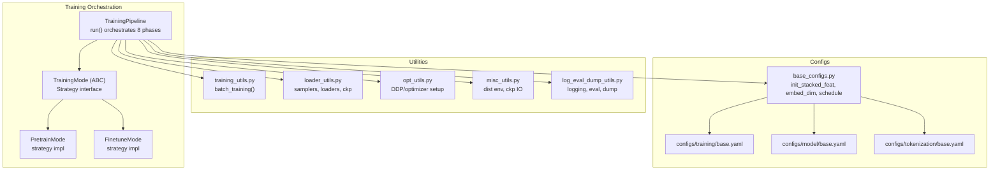
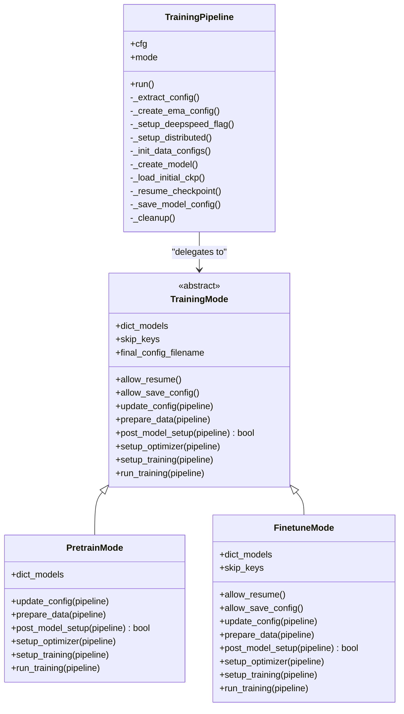
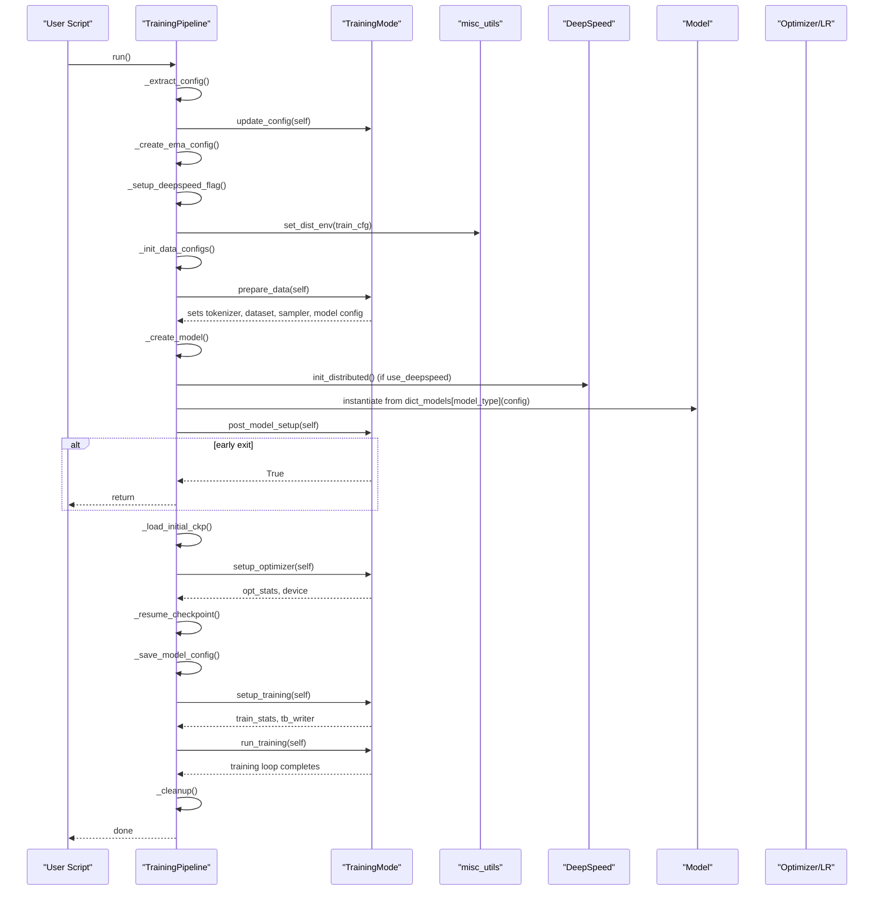
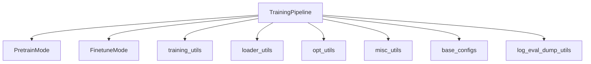

# Unified Pipeline Orchestration

<cite>
**Referenced Files in This Document**
- [pipeline.py](file://src/training/pipeline.py)
- [mode.py](file://src/training/mode.py)
- [pretrain_mode.py](file://src/training/pretrain_mode.py)
- [finetune_mode.py](file://src/training/finetune_mode.py)
- [training_utils.py](file://src/utils/training_utils.py)
- [loader_utils.py](file://src/utils/loader_utils.py)
- [opt_utils.py](file://src/utils/opt_utils.py)
- [misc_utils.py](file://src/utils/misc_utils.py)
- [base_configs.py](file://src/conf/base_configs.py)
- [modules_utils.py](file://src/utils/modules_utils.py)
- [log_eval_dump_utils.py](file://src/utils/log_eval_dump_utils.py)
- [train_pretrain.py](file://examples/train_pretrain.py)
- [train_supervised.py](file://examples/train_supervised.py)
- [base.yaml (training)](file://configs/training/base.yaml)
- [base.yaml (model)](file://configs/model/base.yaml)
- [base.yaml (tokenization)](file://configs/tokenization/base.yaml)
</cite>

## Table of Contents
1. [Introduction](#introduction)
2. [Project Structure](#project-structure)
3. [Core Components](#core-components)
4. [Architecture Overview](#architecture-overview)
5. [Detailed Component Analysis](#detailed-component-analysis)
6. [Dependency Analysis](#dependency-analysis)
7. [Performance Considerations](#performance-considerations)
8. [Troubleshooting Guide](#troubleshooting-guide)
9. [Conclusion](#conclusion)
10. [Appendices](#appendices)

## Introduction
This document describes the unified training pipeline orchestration system that coordinates a shared, robust execution framework for both pre-training and supervised fine-tuning. It explains the TrainingPipeline class architecture, the strategy pattern implementation via the TrainingMode ABC interface, and the eight-phase execution model. It also documents shared setup phases, mode-specific data preparation, model creation with DeepSpeed integration, optimizer setup, checkpoint loading/resume, and cleanup procedures. Practical examples show pipeline initialization, configuration decomposition, and distributed training setup. The document further clarifies the relationship between shared pipeline components and mode-specific implementations, and provides debugging strategies and performance optimization techniques.

## Project Structure
The training orchestration spans several modules:
- Training orchestration and strategy: src/training/pipeline.py, src/training/mode.py, src/training/pretrain_mode.py, src/training/finetune_mode.py
- Utilities: src/utils/training_utils.py, src/utils/loader_utils.py, src/utils/opt_utils.py, src/utils/misc_utils.py, src/utils/log_eval_dump_utils.py
- Configuration: src/conf/base_configs.py and config YAMLs under configs/
- Examples: examples/train_pretrain.py, examples/train_supervised.py

**Diagram sources**
- [pipeline.py:60-96](file://src/training/pipeline.py#L60-L96)
- [mode.py:5-90](file://src/training/mode.py#L5-L90)
- [pretrain_mode.py:48-501](file://src/training/pretrain_mode.py#L48-L501)
- [finetune_mode.py:43-459](file://src/training/finetune_mode.py#L43-L459)
- [training_utils.py:7-206](file://src/utils/training_utils.py#L7-L206)
- [loader_utils.py:17-752](file://src/utils/loader_utils.py#L17-L752)
- [opt_utils.py:7-38](file://src/utils/opt_utils.py#L7-L38)
- [misc_utils.py:507-540](file://src/utils/misc_utils.py#L507-L540)
- [log_eval_dump_utils.py:1-200](file://src/utils/log_eval_dump_utils.py#L1-L200)
- [base_configs.py:206-302](file://src/conf/base_configs.py#L206-L302)
- [base.yaml (training):1-78](file://configs/training/base.yaml#L1-L78)
- [base.yaml (model):1-222](file://configs/model/base.yaml#L1-L222)
- [base.yaml (tokenization):1-117](file://configs/tokenization/base.yaml#L1-L117)

**Section sources**
- [pipeline.py:60-96](file://src/training/pipeline.py#L60-L96)
- [mode.py:5-90](file://src/training/mode.py#L5-L90)
- [base_configs.py:206-302](file://src/conf/base_configs.py#L206-L302)

## Core Components
- TrainingPipeline: Central orchestrator that defines eight shared phases and delegates mode-specific behavior to a TrainingMode strategy. It manages configuration decomposition, EMA setup, distributed training, model creation, optimizer setup, checkpoint loading/resume, training preparation, training loop, and cleanup.
- TrainingMode (ABC): Defines the strategy interface with abstract methods for mode-specific behavior and properties for shared policy (e.g., skip_keys, allow_save_config).
- PretrainMode and FinetuneMode: Concrete strategies implementing pre-training and supervised fine-tuning respectively. They override data preparation, model setup hooks, optimizer creation, training preparation, and the training loop.

Key orchestration responsibilities:
- Shared phases: config extraction, EMA setup, distributed setup, data configs init, model creation, initial checkpoint load, resume, save config, training preparation, training loop, cleanup.
- Mode-specific phases: data preparation (tokenizer, dataset, sampler, schedule updates, model config), optimizer setup (DeepSpeed or DDP), training preparation (logging, collators, loaders, stats), and training loop (step/epoch logic, evaluation cadence).

**Section sources**
- [pipeline.py:15-96](file://src/training/pipeline.py#L15-L96)
- [mode.py:5-90](file://src/training/mode.py#L5-L90)
- [pretrain_mode.py:48-501](file://src/training/pretrain_mode.py#L48-L501)
- [finetune_mode.py:43-459](file://src/training/finetune_mode.py#L43-L459)

## Architecture Overview
The unified pipeline follows a strategy pattern: a single orchestrator (TrainingPipeline) coordinates shared setup and teardown, while two strategies (PretrainMode, FinetuneMode) encapsulate mode-specific behaviors. The pipeline integrates DeepSpeed for distributed training and gradient accumulation, and uses PyTorch’s AMP for mixed precision when not using DeepSpeed.

**Diagram sources**
- [pipeline.py:15-96](file://src/training/pipeline.py#L15-L96)
- [mode.py:5-90](file://src/training/mode.py#L5-L90)
- [pretrain_mode.py:48-501](file://src/training/pretrain_mode.py#L48-L501)
- [finetune_mode.py:43-459](file://src/training/finetune_mode.py#L43-L459)

## Detailed Component Analysis

### Eight-Phase Execution Model
The pipeline executes eight well-defined phases with explicit dependencies and state management:

1) Shared base setup
- Decompose Hydra config into tokenization, model, training, data, schedule, optimizer sub-configs.
- Create EMA configuration and stats.
- Determine DeepSpeed usage from training config and output directory.
- Initialize distributed environment (NCCL, world size, rank).

2) Data configs (shared)
- Initialize stacked feature count and embedding dimension.
- Sync configurations across tokenization, model, and training.

3) Data + tokenizer + sampler + model config (mode-specific)
- Mode-specific data preparation: build tokenizer config, read dataset, build vocabulary, initialize tokenizer, construct samplers, update schedule and model config.
- Store tokenizer artifacts and model config on the pipeline for downstream use.

4) Model creation (shared)
- Initialize DeepSpeed if enabled.
- Instantiate model from mode’s registry using pipeline.model_cfg.model_type and pipeline.config.
- Propagate dataset bounds if available.
- Enable gradient checkpointing and disable cache.

5) Post-model setup (mode-specific)
- Print trainable parameters.
- Early exit for eval-only or infer-only modes.

6) Optimizer (mode-specific)
- Create optimizer and LR scheduler (DeepSpeed engine or DDP + AMP).
- Initialize EMA statistics.

7) Resume + save config (shared with mode guards)
- Resume from latest checkpoint if allowed by mode and conditions.
- Save model config on rank 0 and finalize config filename.

8) Training preparation (mode-specific)
- Initialize logging, collator, evaluation loaders, TensorBoard writer.
- Optionally evaluate before training.
- Initialize training statistics and loader stats.

9) Training loop (mode-specific)
- Iterate epochs/batches, perform forward/backward/update.
- Update EMA, log metrics, periodically save checkpoints and evaluation results.

10) Cleanup (shared)
- Close TensorBoard writer and save final configuration.

**Diagram sources**
- [pipeline.py:60-96](file://src/training/pipeline.py#L60-L96)
- [pretrain_mode.py:97-266](file://src/training/pretrain_mode.py#L97-L266)
- [finetune_mode.py:116-359](file://src/training/finetune_mode.py#L116-L359)
- [misc_utils.py:507-540](file://src/utils/misc_utils.py#L507-L540)

**Section sources**
- [pipeline.py:60-96](file://src/training/pipeline.py#L60-L96)
- [pretrain_mode.py:97-266](file://src/training/pretrain_mode.py#L97-L266)
- [finetune_mode.py:116-359](file://src/training/finetune_mode.py#L116-L359)

### Shared Setup Phases
- Configuration decomposition: splits the top-level config into tokenization, model, training, data, schedule, and optimizer sub-configs for clarity and reuse.
- EMA setup: constructs EMA configuration and stats for exponential moving averages of model parameters.
- DeepSpeed flag: toggles DeepSpeed usage based on presence of a DeepSpeed config file and determines whether to resume from an existing log.
- Distributed setup: initializes NCCL process group, sets world size and rank, seeds randomness, and prepares environment for distributed runs.

**Section sources**
- [pipeline.py:101-142](file://src/training/pipeline.py#L101-L142)
- [misc_utils.py:507-540](file://src/utils/misc_utils.py#L507-L540)

### Mode-Specific Data Preparation
- PretrainMode:
  - Builds tokenizer configuration from the merged config, reads dataset, builds vocabulary, initializes tokenizer, constructs pre-training samplers, estimates tokens per sample, updates schedule and model config, and stores artifacts on the pipeline.
- FinetuneMode:
  - Builds tokenizer configuration with optional semantic embeddings, reads train/valid/test datasets, inspects data points, builds vocabulary, initializes tokenizer, constructs FTSamplerConfig, updates schedule, sets model config, and stores artifacts on the pipeline.

**Section sources**
- [pretrain_mode.py:97-227](file://src/training/pretrain_mode.py#L97-L227)
- [finetune_mode.py:116-199](file://src/training/finetune_mode.py#L116-L199)

### Model Creation with DeepSpeed Integration
- Initializes DeepSpeed distributed backend when enabled.
- Instantiates the model using the mode’s model registry keyed by model_type.
- Propagates dataset-specific bounds if present.
- Enables gradient checkpointing and disables cache to reduce memory footprint.

**Section sources**
- [pipeline.py:149-165](file://src/training/pipeline.py#L149-L165)
- [pretrain_mode.py:71-75](file://src/training/pretrain_mode.py#L71-L75)
- [finetune_mode.py:66-70](file://src/training/finetune_mode.py#L66-L70)

### Optimizer Setup and EMA
- PretrainMode:
  - Uses DeepSpeed initialize when enabled; otherwise sets up DDP wrapper and AdamW optimizer with OneCycleLR scheduler and GradScaler for AMP.
  - Initializes EMA statistics after optimizer creation.
- FinetuneMode:
  - Similar DeepSpeed or DDP setup with optional non-DeepSpeed scheduler configuration.
  - Initializes EMA with a dedicated EMA class and moves EMA state to device.

**Section sources**
- [pretrain_mode.py:271-303](file://src/training/pretrain_mode.py#L271-L303)
- [finetune_mode.py:218-258](file://src/training/finetune_mode.py#L218-L258)
- [opt_utils.py:7-38](file://src/utils/opt_utils.py#L7-L38)

### Checkpoint Loading and Resume
- Non-resume initialization loads pretrained checkpoint when provided and different from output directory, skipping score-related keys for pre-training.
- Resume logic checks for existing log in output directory and loads from checkpoint if allowed by mode; supports DeepSpeed and DDP resume paths and loads EMA checkpoint.

**Section sources**
- [pipeline.py:166-203](file://src/training/pipeline.py#L166-L203)
- [loader_utils.py:161-221](file://src/utils/loader_utils.py#L161-L221)
- [misc_utils.py:208-252](file://src/utils/misc_utils.py#L208-L252)

### Training Preparation and Loop
- PretrainMode:
  - Initializes logging, collator, validation/test loaders, evaluates before training, sets up TensorBoard, resets train sampler, creates train loader, and initializes training stats.
  - Training loop iterates epochs and batches, performs batch training, updates EMA, logs metrics, and periodically saves checkpoints and evaluation results.
- FinetuneMode:
  - Initializes logging, collator, evaluation loaders, sets up TensorBoard, optionally evaluates before training, and initializes training stats.
  - Training loop iterates epochs, optionally evaluates, and periodically logs and saves results; supports eval-only and infer-only modes.

**Section sources**
- [pretrain_mode.py:308-501](file://src/training/pretrain_mode.py#L308-L501)
- [finetune_mode.py:263-459](file://src/training/finetune_mode.py#L263-L459)
- [training_utils.py:7-206](file://src/utils/training_utils.py#L7-L206)

### Cleanup Procedures
- Closes TensorBoard writer and saves final configuration to output directory using mode-specific final config filename.

**Section sources**
- [pipeline.py:218-227](file://src/training/pipeline.py#L218-L227)

### Practical Examples
- Pipeline initialization:
  - Pre-training: instantiate TrainingPipeline with PretrainMode and call run().
  - Supervised fine-tuning: instantiate TrainingPipeline with FinetuneMode and call run().
- Configuration decomposition:
  - TrainingPipeline decomposes the top-level config into sub-configs for tokenization, model, training, data, schedule, and optimizer.
- Distributed training setup:
  - TrainingPipeline calls set_dist_env to initialize NCCL and set world size/rank, and optionally DeepSpeed distributed backend.

**Section sources**
- [train_pretrain.py:12-19](file://examples/train_pretrain.py#L12-L19)
- [train_supervised.py:12-19](file://examples/train_supervised.py#L12-L19)
- [pipeline.py:101-142](file://src/training/pipeline.py#L101-L142)
- [misc_utils.py:507-540](file://src/utils/misc_utils.py#L507-L540)

## Dependency Analysis
The pipeline orchestrates a tight coupling between shared utilities and mode-specific implementations:

**Diagram sources**
- [pipeline.py:60-96](file://src/training/pipeline.py#L60-L96)
- [pretrain_mode.py:48-501](file://src/training/pretrain_mode.py#L48-L501)
- [finetune_mode.py:43-459](file://src/training/finetune_mode.py#L43-L459)
- [training_utils.py:7-206](file://src/utils/training_utils.py#L7-L206)
- [loader_utils.py:17-752](file://src/utils/loader_utils.py#L17-L752)
- [opt_utils.py:7-38](file://src/utils/opt_utils.py#L7-L38)
- [misc_utils.py:507-540](file://src/utils/misc_utils.py#L507-L540)
- [base_configs.py:206-302](file://src/conf/base_configs.py#L206-L302)
- [log_eval_dump_utils.py:1-200](file://src/utils/log_eval_dump_utils.py#L1-L200)

**Section sources**
- [pipeline.py:60-96](file://src/training/pipeline.py#L60-L96)
- [loader_utils.py:17-752](file://src/utils/loader_utils.py#L17-L752)

## Performance Considerations
- Mixed precision and gradient accumulation:
  - AMP with GradScaler is used for non-DeepSpeed runs; gradient accumulation steps are validated to be 1 for AMP to avoid scaling inconsistencies.
- Gradient checkpointing and cache disabling:
  - Enabled during model creation to reduce memory usage.
- Token estimation and packing:
  - Estimation of tokens per sample and optional token packing reduces overhead and improves throughput.
- DataLoader tuning:
  - Worker initialization, pinning, prefetch factor, and drop-last settings are configured per mode to balance throughput and memory.
- Distributed training:
  - NCCL backend, world size/rank propagation, and deterministic shuffling with seeds improve reproducibility and performance.

[No sources needed since this section provides general guidance]

## Troubleshooting Guide
Common issues and strategies:
- Distributed initialization failures:
  - Verify NCCL backend availability and environment variables; fallback prints indicate local test mode.
- Checkpoint loading mismatches:
  - Use skip_keys to exclude score-related keys for pre-training checkpoints; DeepSpeed Zero stages require specialized APIs to reconstruct state dicts.
- Logging and saving:
  - Ensure rank 0 writes to output directory; verify final config filename matches mode-specific expectations.
- Training instability:
  - Validate gradient accumulation steps and max gradient norm clipping; adjust learning rate and scheduler settings.
- Evaluation and inference:
  - Confirm collator and tokenizer alignment; ensure sampler sizes and world size division are correct.

**Section sources**
- [misc_utils.py:507-540](file://src/utils/misc_utils.py#L507-L540)
- [loader_utils.py:161-221](file://src/utils/loader_utils.py#L161-L221)
- [training_utils.py:7-206](file://src/utils/training_utils.py#L7-L206)

## Conclusion
The unified training pipeline provides a robust, extensible orchestration layer that cleanly separates shared infrastructure from mode-specific logic. By leveraging the strategy pattern, it supports both pre-training and supervised fine-tuning with minimal duplication. The eight-phase execution model ensures predictable setup, data preparation, model creation, optimizer configuration, checkpoint handling, training preparation, training loop, and cleanup. With integrated DeepSpeed support, distributed training, and comprehensive utilities for data loading, optimization, and logging, the system offers a production-ready foundation for scalable graph model training.

[No sources needed since this section summarizes without analyzing specific files]

## Appendices

### Configuration Reference Highlights
- Training base configuration includes DeepSpeed flags, scheduling, optimizer settings, batching, distributed settings, and fine-tuning controls.
- Model base configuration defines architecture, graph input stacking, pre-training and fine-tuning heads, and tokenizer token IDs.
- Tokenization base configuration specifies dataset selection, semantics, structure tokens, and ODPS integration.

**Section sources**
- [base.yaml (training):1-78](file://configs/training/base.yaml#L1-L78)
- [base.yaml (model):1-222](file://configs/model/base.yaml#L1-L222)
- [base.yaml (tokenization):1-117](file://configs/tokenization/base.yaml#L1-L117)
