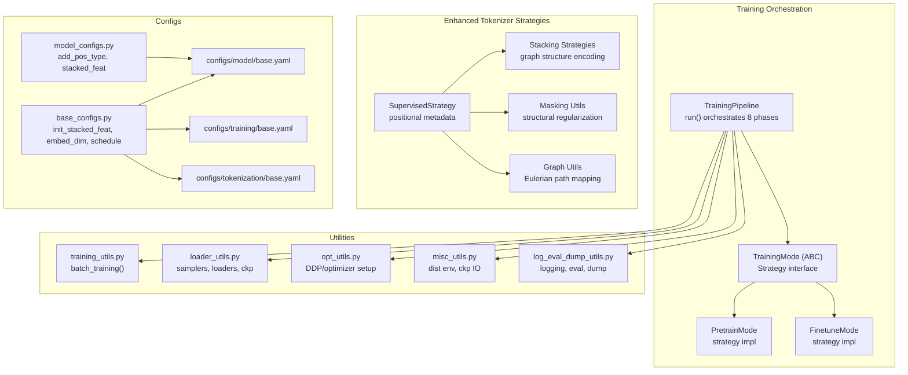
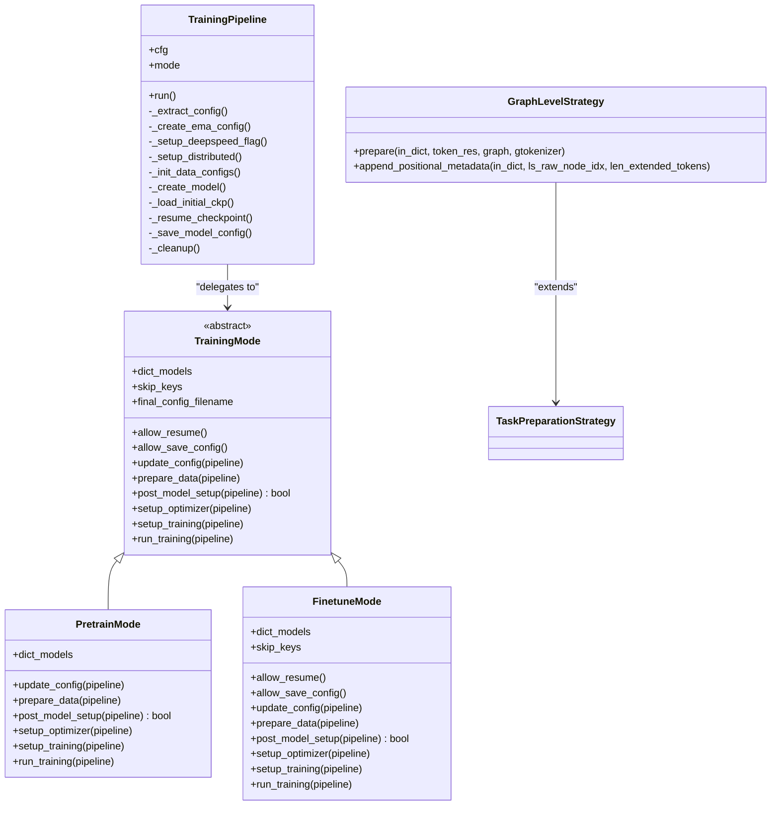
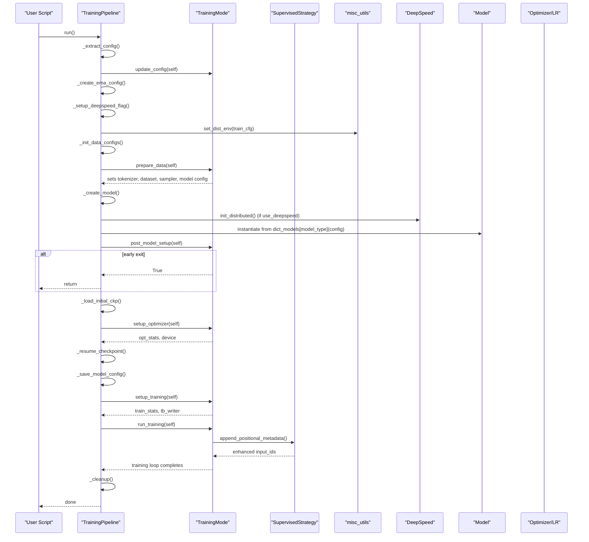
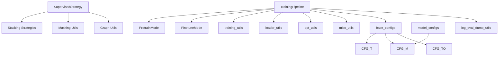

# Unified Pipeline Orchestration

<cite>
**Referenced Files in This Document**
- [pipeline.py](file://src/training/pipeline.py)
- [mode.py](file://src/training/mode.py)
- [pretrain_mode.py](file://src/training/pretrain_mode.py)
- [finetune_mode.py](file://src/training/finetune_mode.py)
- [supervised.py](file://src/data/tokenizer/strategies/task_prep/supervised.py)
- [stacking.py](file://src/data/tokenizer/stacking.py)
- [masking.py](file://src/data/tokenizer/masking.py)
- [nx_utils.py](file://src/utils/nx_utils.py)
- [training_utils.py](file://src/utils/training_utils.py)
- [loader_utils.py](file://src/utils/loader_utils.py)
- [opt_utils.py](file://src/utils/opt_utils.py)
- [misc_utils.py](file://src/utils/misc_utils.py)
- [base_configs.py](file://src/conf/base_configs.py)
- [modules_utils.py](file://src/utils/modules_utils.py)
- [log_eval_dump_utils.py](file://src/utils/log_eval_dump_utils.py)
- [model_configs.py](file://src/conf/model/model_configs.py)
- [train_pretrain.py](file://examples/train_pretrain.py)
- [train_supervised.py](file://examples/train_supervised.py)
- [base.yaml (training)](file://configs/training/base.yaml)
- [base.yaml (model)](file://configs/model/base.yaml)
- [base.yaml (tokenization)](file://configs/tokenization/base.yaml)
</cite>

## Update Summary
**Changes Made**
- Enhanced supervised training documentation with new positional metadata system
- Added detailed explanation of [pos_type, node_mask, node_idx, edge_mask] components
- Documented graph structure awareness improvements in tokenizer strategies
- Updated model configuration references for positional metadata handling
- Added practical examples of enhanced supervised training capabilities

## Table of Contents
1. [Introduction](#introduction)
2. [Project Structure](#project-structure)
3. [Core Components](#core-components)
4. [Architecture Overview](#architecture-overview)
5. [Detailed Component Analysis](#detailed-component-analysis)
6. [Enhanced Supervised Training Capabilities](#enhanced-supervised-training-capabilities)
7. [Dependency Analysis](#dependency-analysis)
8. [Performance Considerations](#performance-considerations)
9. [Troubleshooting Guide](#troubleshooting-guide)
10. [Conclusion](#conclusion)
11. [Appendices](#appendices)

## Introduction
This document describes the unified training pipeline orchestration system that coordinates a shared, robust execution framework for both pre-training and supervised fine-tuning. It explains the TrainingPipeline class architecture, the strategy pattern implementation via the TrainingMode ABC interface, and the eight-phase execution model. The system now includes enhanced supervised training capabilities with a sophisticated positional metadata system that provides explicit graph structure awareness through [pos_type, node_mask, node_idx, edge_mask] components, significantly improving the model's understanding of graph relationships during training.

## Project Structure
The training orchestration spans several modules with enhanced supervised training capabilities:
- Training orchestration and strategy: src/training/pipeline.py, src/training/mode.py, src/training/pretrain_mode.py, src/training/finetune_mode.py
- Enhanced tokenizer strategies: src/data/tokenizer/strategies/task_prep/supervised.py
- Tokenization utilities: src/data/tokenizer/stacking.py, src/data/tokenizer/masking.py, src/utils/nx_utils.py
- Utilities: src/utils/training_utils.py, src/utils/loader_utils.py, src/utils/opt_utils.py, src/utils/misc_utils.py, src/utils/log_eval_dump_utils.py
- Configuration: src/conf/base_configs.py, src/conf/model/model_configs.py and config YAMLs under configs/
- Examples: examples/train_pretrain.py, examples/train_supervised.py



**Diagram sources**
- [pipeline.py:60-96](file://src/training/pipeline.py#L60-L96)
- [mode.py:5-90](file://src/training/mode.py#L5-L90)
- [pretrain_mode.py:48-501](file://src/training/pretrain_mode.py#L48-L501)
- [finetune_mode.py:43-459](file://src/training/finetune_mode.py#L43-L459)
- [supervised.py:36-69](file://src/data/tokenizer/strategies/task_prep/supervised.py#L36-L69)
- [stacking.py:72-191](file://src/data/tokenizer/stacking.py#L72-L191)
- [masking.py:359-374](file://src/data/tokenizer/masking.py#L359-L374)
- [nx_utils.py:551-565](file://src/utils/nx_utils.py#L551-L565)
- [training_utils.py:7-206](file://src/utils/training_utils.py#L7-L206)
- [loader_utils.py:17-752](file://src/utils/loader_utils.py#L17-L752)
- [opt_utils.py:7-38](file://src/utils/opt_utils.py#L7-L38)
- [misc_utils.py:507-540](file://src/utils/misc_utils.py#L507-L540)
- [log_eval_dump_utils.py:1-200](file://src/utils/log_eval_dump_utils.py#L1-L200)
- [model_configs.py:198-199](file://src/conf/model/model_configs.py#L198-L199)
- [base_configs.py:206-302](file://src/conf/base_configs.py#L206-L302)
- [base.yaml (training):1-78](file://configs/training/base.yaml#L1-L78)
- [base.yaml (model):1-222](file://configs/model/base.yaml#L1-L222)
- [base.yaml (tokenization):1-117](file://configs/tokenization/base.yaml#L1-L117)

**Section sources**
- [pipeline.py:60-96](file://src/training/pipeline.py#L60-L96)
- [mode.py:5-90](file://src/training/mode.py#L5-L90)
- [base_configs.py:206-302](file://src/conf/base_configs.py#L206-L302)

## Core Components
- TrainingPipeline: Central orchestrator that defines eight shared phases and delegates mode-specific behavior to a TrainingMode strategy. It manages configuration decomposition, EMA setup, distributed training, model creation, optimizer setup, checkpoint loading/resume, training preparation, training loop, and cleanup.
- TrainingMode (ABC): Defines the strategy interface with abstract methods for mode-specific behavior and properties for shared policy (e.g., skip_keys, allow_save_config).
- PretrainMode and FinetuneMode: Concrete strategies implementing pre-training and supervised fine-tuning respectively. They override data preparation, model setup hooks, optimizer creation, training preparation, and the training loop.
- Enhanced Supervised Strategy: New tokenizer strategy that appends 4D positional metadata [pos_type, node_mask, node_idx, edge_mask] to input_ids for improved graph structure awareness.

Key orchestration responsibilities:
- Shared phases: config extraction, EMA setup, distributed setup, data configs init, model creation, initial checkpoint load, resume, save config, training preparation, training loop, cleanup.
- Mode-specific phases: data preparation (tokenizer, dataset, sampler, schedule updates, model config), optimizer setup (DeepSpeed or DDP), training preparation (logging, collators, loaders, stats), and training loop (step/epoch logic, evaluation cadence).
- Enhanced supervised training: automatic positional metadata injection for graph-level tasks with structural regularization masks.

**Section sources**
- [pipeline.py:15-96](file://src/training/pipeline.py#L15-L96)
- [mode.py:5-90](file://src/training/mode.py#L5-L90)
- [pretrain_mode.py:48-501](file://src/training/pretrain_mode.py#L48-L501)
- [finetune_mode.py:43-459](file://src/training/finetune_mode.py#L43-L459)
- [supervised.py:36-69](file://src/data/tokenizer/strategies/task_prep/supervised.py#L36-L69)

## Architecture Overview
The unified pipeline follows a strategy pattern: a single orchestrator (TrainingPipeline) coordinates shared setup and teardown, while two strategies (PretrainMode, FinetuneMode) encapsulate mode-specific behaviors. The pipeline integrates DeepSpeed for distributed training and gradient accumulation, and uses PyTorch's AMP for mixed precision when not using DeepSpeed. The enhanced supervised training capability introduces a new positional metadata system that provides explicit graph structure awareness.



**Diagram sources**
- [pipeline.py:15-96](file://src/training/pipeline.py#L15-L96)
- [mode.py:5-90](file://src/training/mode.py#L5-L90)
- [pretrain_mode.py:48-501](file://src/training/pretrain_mode.py#L48-L501)
- [finetune_mode.py:43-459](file://src/training/finetune_mode.py#L43-L459)
- [supervised.py:7-34](file://src/data/tokenizer/strategies/task_prep/supervised.py#L7-L34)

## Detailed Component Analysis

### Eight-Phase Execution Model
The pipeline executes eight well-defined phases with explicit dependencies and state management:

1) Shared base setup
- Decompose Hydra config into tokenization, model, training, data, schedule, optimizer sub-configs.
- Create EMA configuration and stats.
- Determine DeepSpeed usage from training config and output directory.
- Initialize distributed environment (NCCL, world size, rank).

2) Data configs (shared)
- Initialize stacked feature count and embedding dimension.
- Sync configurations across tokenization, model, and training.

3) Data + tokenizer + sampler + model config (mode-specific)
- Mode-specific data preparation: build tokenizer config, read dataset, build vocabulary, initialize tokenizer, construct samplers, update schedule and model config.
- Store tokenizer artifacts and model config on the pipeline for downstream use.

4) Model creation (shared)
- Initialize DeepSpeed if enabled.
- Instantiate model from mode's registry using pipeline.model_cfg.model_type and pipeline.config.
- Propagate dataset bounds if available.
- Enable gradient checkpointing and disable cache.

5) Post-model setup (mode-specific)
- Print trainable parameters.
- Early exit for eval-only or infer-only modes.

6) Optimizer (mode-specific)
- Create optimizer and LR scheduler (DeepSpeed engine or DDP + AMP).
- Initialize EMA statistics.

7) Resume + save config (shared with mode guards)
- Resume from latest checkpoint if allowed by mode and conditions.
- Save model config on rank 0 and finalize config filename.

8) Training preparation (mode-specific)
- Initialize logging, collator, evaluation loaders, TensorBoard writer.
- Optionally evaluate before training.
- Initialize training statistics and loader stats.

9) Training loop (mode-specific)
- Iterate epochs/batches, perform forward/backward/update.
- Update EMA, log metrics, periodically save checkpoints and evaluation results.

10) Cleanup (shared)
- Close TensorBoard writer and save final configuration.



**Diagram sources**
- [pipeline.py:60-96](file://src/training/pipeline.py#L60-L96)
- [pretrain_mode.py:97-266](file://src/training/pretrain_mode.py#L97-L266)
- [finetune_mode.py:116-359](file://src/training/finetune_mode.py#L116-L359)
- [supervised.py:36-69](file://src/data/tokenizer/strategies/task_prep/supervised.py#L36-L69)
- [misc_utils.py:507-540](file://src/utils/misc_utils.py#L507-L540)

**Section sources**
- [pipeline.py:60-96](file://src/training/pipeline.py#L60-L96)
- [pretrain_mode.py:97-266](file://src/training/pretrain_mode.py#L97-L266)
- [finetune_mode.py:116-359](file://src/training/finetune_mode.py#L116-L359)

### Shared Setup Phases
- Configuration decomposition: splits the top-level config into tokenization, model, training, data, schedule, and optimizer sub-configs for clarity and reuse.
- EMA setup: constructs EMA configuration and stats for exponential moving averages of model parameters.
- DeepSpeed flag: toggles DeepSpeed usage based on presence of a DeepSpeed config file and determines whether to resume from an existing log.
- Distributed setup: initializes NCCL process group, sets world size and rank, seeds randomness, and prepares environment for distributed runs.

**Section sources**
- [pipeline.py:101-142](file://src/training/pipeline.py#L101-L142)
- [misc_utils.py:507-540](file://src/utils/misc_utils.py#L507-L540)

### Mode-Specific Data Preparation
- PretrainMode:
  - Builds tokenizer configuration from the merged config, reads dataset, builds vocabulary, initializes tokenizer, constructs pre-training samplers, estimates tokens per sample, updates schedule and model config, and stores artifacts on the pipeline.
- FinetuneMode:
  - Builds tokenizer configuration with optional semantic embeddings, reads train/valid/test datasets, inspects data points, builds vocabulary, initializes tokenizer, constructs FTSamplerConfig, updates schedule, sets model config, and stores artifacts on the pipeline.
  - **Enhanced**: Automatically applies positional metadata to graph-level tasks for improved structural awareness.

**Section sources**
- [pretrain_mode.py:97-227](file://src/training/pretrain_mode.py#L97-L227)
- [finetune_mode.py:116-199](file://src/training/finetune_mode.py#L116-L199)

### Model Creation with DeepSpeed Integration
- Initializes DeepSpeed distributed backend when enabled.
- Instantiates the model using the mode's model registry keyed by model_type.
- Propagates dataset-specific bounds if present.
- Enables gradient checkpointing and disables cache to reduce memory footprint.

**Section sources**
- [pipeline.py:149-165](file://src/training/pipeline.py#L149-L165)
- [pretrain_mode.py:71-75](file://src/training/pretrain_mode.py#L71-L75)
- [finetune_mode.py:66-70](file://src/training/finetune_mode.py#L66-L70)

### Optimizer Setup and EMA
- PretrainMode:
  - Uses DeepSpeed initialize when enabled; otherwise sets up DDP wrapper and AdamW optimizer with OneCycleLR scheduler and GradScaler for AMP.
  - Initializes EMA statistics after optimizer creation.
- FinetuneMode:
  - Similar DeepSpeed or DDP setup with optional non-DeepSpeed scheduler configuration.
  - Initializes EMA with a dedicated EMA class and moves EMA state to device.

**Section sources**
- [pretrain_mode.py:271-303](file://src/training/pretrain_mode.py#L271-L303)
- [finetune_mode.py:218-258](file://src/training/finetune_mode.py#L218-L258)
- [opt_utils.py:7-38](file://src/utils/opt_utils.py#L7-L38)

### Checkpoint Loading and Resume
- Non-resume initialization loads pretrained checkpoint when provided and different from output directory, skipping score-related keys for pre-training.
- Resume logic checks for existing log in output directory and loads from checkpoint if allowed by mode; supports DeepSpeed and DDP resume paths and loads EMA checkpoint.

**Section sources**
- [pipeline.py:166-203](file://src/training/pipeline.py#L166-L203)
- [loader_utils.py:161-221](file://src/utils/loader_utils.py#L161-L221)
- [misc_utils.py:208-252](file://src/utils/misc_utils.py#L208-L252)

### Training Preparation and Loop
- PretrainMode:
  - Initializes logging, collator, validation/test loaders, evaluates before training, sets up TensorBoard, resets train sampler, creates train loader, and initializes training stats.
  - Training loop iterates epochs and batches, performs batch training, updates EMA, logs metrics, and periodically saves checkpoints and evaluation results.
- FinetuneMode:
  - Initializes logging, collator, evaluation loaders, sets up TensorBoard, optionally evaluates before training, and initializes training stats.
  - Training loop iterates epochs, optionally evaluates, and periodically logs and saves results; supports eval-only and infer-only modes.
  - **Enhanced**: Automatic positional metadata injection for graph-level supervised tasks.

**Section sources**
- [pretrain_mode.py:308-501](file://src/training/pretrain_mode.py#L308-L501)
- [finetune_mode.py:263-459](file://src/training/finetune_mode.py#L263-L459)
- [training_utils.py:7-206](file://src/utils/training_utils.py#L7-L206)

### Cleanup Procedures
- Closes TensorBoard writer and saves final configuration to output directory using mode-specific final config filename.

**Section sources**
- [pipeline.py:218-227](file://src/training/pipeline.py#L218-L227)

### Practical Examples
- Pipeline initialization:
  - Pre-training: instantiate TrainingPipeline with PretrainMode and call run().
  - Supervised fine-tuning: instantiate TrainingPipeline with FinetuneMode and call run().
- Configuration decomposition:
  - TrainingPipeline decomposes the top-level config into sub-configs for tokenization, model, training, data, schedule, and optimizer.
- Distributed training setup:
  - TrainingPipeline calls set_dist_env to initialize NCCL and set world size/rank, and optionally DeepSpeed distributed backend.

**Section sources**
- [train_pretrain.py:12-19](file://examples/train_pretrain.py#L12-L19)
- [train_supervised.py:12-19](file://examples/train_supervised.py#L12-L19)
- [pipeline.py:101-142](file://src/training/pipeline.py#L101-L142)
- [misc_utils.py:507-540](file://src/utils/misc_utils.py#L507-L540)

## Enhanced Supervised Training Capabilities

### Positional Metadata System
The enhanced supervised training introduces a sophisticated positional metadata system that provides explicit graph structure awareness through four key components appended to each token's feature vector:

#### Metadata Components
1. **pos_type**: Clipped node position type (0-4)
   - 0: Padding tokens
   - 1/2/3: First three nodes defining Cartesian coordinates
   - 4: Other nodes in the sequence

2. **node_mask**: Binary mask for node-level structural regularization
   - Applied using structural masking strategies to regularize node positions
   - Multiplied by boolean condition `(node_idx > 0)` to exclude padding positions

3. **node_idx**: Node index for node-level attention/masking (SMTP)
   - Raw node indices from tokenization (+1 offset for zero-padding)
   - Used for structural token matching and attention masking

4. **edge_mask**: Binary mask for edge-level structural regularization
   - Derived from edge sequences formed by consecutive node positions
   - Multiplied by boolean condition `(np.array(edge_seq) > 0).all(axis=-1)` to exclude invalid edges

#### Implementation Details
The positional metadata is automatically appended to input_ids in the GraphLevelStrategy.prepare() method:

```python
def append_positional_metadata(self, in_dict, ls_raw_node_idx, len_extended_tokens):
    """Append 4D positional metadata [pos_type, node_mask, node_idx, edge_mask] to input_ids.

    Extends each token's feature dimension by 4 columns for graph structure awareness:
    - pos_type: Clipped node position type (0-4): 0 for padding, 1/2/3 for 3 nodes defining the cartesian coordinates, 4 for other nodes
    - node_mask: Binary mask for node-level structural regularization
    - node_idx: Node index for node-level attention/masking (SMTP)
    - edge_mask: Binary mask for edge-level structural regularization

    Args:
        in_dict: Dictionary containing 'input_ids' [seq_len, stacked_feat]
        ls_raw_node_idx: Raw node indices from tokenization (-1 for non-node positions)
        len_extended_tokens: Number of extended tokens (usually 0 for graph tasks)

    Returns:
        Updated in_dict with 'input_ids' shape [seq_len, stacked_feat + 4]
    """
    # Implementation details...
```

#### Structural Regularization Mechanisms
The system employs advanced masking strategies for structural regularization:

1. **Node-level Masking**: Uses `get_mask_of_raw_seq(node_idx, mask_type="random")` to create binary masks for node positions
2. **Edge-level Masking**: Creates edge sequences from consecutive node positions and applies structural masking
3. **Eulerian Path Integration**: Leverages Eulerian path traversal to maintain graph topology awareness
4. **Bidirectional Edge Type Mapping**: Maps edges to directional types (<edge_in>, <edge_out>, <edge_bi>, <edge_jump>) for enhanced structural understanding

#### Graph Structure Awareness Features
- **Explicit Coordinate Definition**: Nodes 1, 2, and 3 in the sequence define Cartesian coordinates for downstream tasks
- **Topological Preservation**: Eulerian path ensures all graph edges are traversed systematically
- **Attention Guidance**: Positional metadata guides attention mechanisms to respect graph structure
- **Regularization Effects**: Structural masks prevent overfitting to spurious positional patterns

#### Configuration Integration
The positional metadata system integrates seamlessly with existing model configurations:

- **add_pos_type**: Boolean flag controlling whether positional metadata is appended
- **stacked_feat_agg_method**: Aggregation method for handling the extended feature dimensions
- **model.graph_input.stacked_feat**: Tracks the total feature dimension including positional metadata

**Section sources**
- [supervised.py:36-69](file://src/data/tokenizer/strategies/task_prep/supervised.py#L36-L69)
- [masking.py:359-374](file://src/data/tokenizer/masking.py#L359-L374)
- [nx_utils.py:551-565](file://src/utils/nx_utils.py#L551-L565)
- [model_configs.py:198-199](file://src/conf/model/model_configs.py#L198-L199)

## Dependency Analysis
The pipeline orchestrates a tight coupling between shared utilities and mode-specific implementations, with enhanced dependencies for the positional metadata system:



**Diagram sources**
- [pipeline.py:60-96](file://src/training/pipeline.py#L60-L96)
- [pretrain_mode.py:48-501](file://src/training/pretrain_mode.py#L48-L501)
- [finetune_mode.py:43-459](file://src/training/finetune_mode.py#L43-L459)
- [supervised.py:36-69](file://src/data/tokenizer/strategies/task_prep/supervised.py#L36-L69)
- [stacking.py:72-191](file://src/data/tokenizer/stacking.py#L72-L191)
- [masking.py:359-374](file://src/data/tokenizer/masking.py#L359-L374)
- [nx_utils.py:551-565](file://src/utils/nx_utils.py#L551-L565)
- [training_utils.py:7-206](file://src/utils/training_utils.py#L7-L206)
- [loader_utils.py:17-752](file://src/utils/loader_utils.py#L17-L752)
- [opt_utils.py:7-38](file://src/utils/opt_utils.py#L7-L38)
- [misc_utils.py:507-540](file://src/utils/misc_utils.py#L507-L540)
- [base_configs.py:206-302](file://src/conf/base_configs.py#L206-L302)
- [model_configs.py:198-199](file://src/conf/model/model_configs.py#L198-L199)
- [log_eval_dump_utils.py:1-200](file://src/utils/log_eval_dump_utils.py#L1-L200)

**Section sources**
- [pipeline.py:60-96](file://src/training/pipeline.py#L60-L96)
- [loader_utils.py:17-752](file://src/utils/loader_utils.py#L17-L752)

## Performance Considerations
- Mixed precision and gradient accumulation:
  - AMP with GradScaler is used for non-DeepSpeed runs; gradient accumulation steps are validated to be 1 for AMP to avoid scaling inconsistencies.
- Gradient checkpointing and cache disabling:
  - Enabled during model creation to reduce memory usage.
- Token estimation and packing:
  - Estimation of tokens per sample and optional token packing reduces overhead and improves throughput.
- DataLoader tuning:
  - Worker initialization, pinning, prefetch factor, and drop-last settings are configured per mode to balance throughput and memory.
- Distributed training:
  - NCCL backend, world size/rank propagation, and deterministic shuffling with seeds improve reproducibility and performance.
- **Enhanced supervised training**:
  - Positional metadata adds 4 additional feature dimensions per token but provides significant structural awareness benefits.
  - Memory overhead is minimal compared to the computational gains from improved graph understanding.
  - Masking operations are vectorized for efficient computation during training.

## Troubleshooting Guide
Common issues and strategies:
- Distributed initialization failures:
  - Verify NCCL backend availability and environment variables; fallback prints indicate local test mode.
- Checkpoint loading mismatches:
  - Use skip_keys to exclude score-related keys for pre-training checkpoints; DeepSpeed Zero stages require specialized APIs to reconstruct state dicts.
- Logging and saving:
  - Ensure rank 0 writes to output directory; verify final config filename matches mode-specific expectations.
- Training instability:
  - Validate gradient accumulation steps and max gradient norm clipping; adjust learning rate and scheduler settings.
- Evaluation and inference:
  - Confirm collator and tokenizer alignment; ensure sampler sizes and world size division are correct.
- **Enhanced supervised training issues**:
  - Verify `add_pos_type=True` in model configuration for positional metadata injection.
  - Check that `stacked_feat` dimension includes the 4 additional positional metadata columns.
  - Ensure Eulerian path generation is working correctly for graph structure preservation.
  - Monitor memory usage as positional metadata increases feature dimensions by 4x.

**Section sources**
- [misc_utils.py:507-540](file://src/utils/misc_utils.py#L507-L540)
- [loader_utils.py:161-221](file://src/utils/loader_utils.py#L161-L221)
- [training_utils.py:7-206](file://src/utils/training_utils.py#L7-L206)
- [supervised.py:36-69](file://src/data/tokenizer/strategies/task_prep/supervised.py#L36-L69)

## Conclusion
The unified training pipeline provides a robust, extensible orchestration layer that cleanly separates shared infrastructure from mode-specific logic. By leveraging the strategy pattern, it supports both pre-training and supervised fine-tuning with minimal duplication. The eight-phase execution model ensures predictable setup, data preparation, model creation, optimizer configuration, checkpoint handling, training preparation, training loop, and cleanup.

**Enhanced supervised training capabilities** represent a significant advancement, introducing a sophisticated positional metadata system that provides explicit graph structure awareness through [pos_type, node_mask, node_idx, edge_mask] components. This enhancement improves the model's understanding of graph relationships during training, enabling better performance on graph-level tasks while maintaining backward compatibility.

With integrated DeepSpeed support, distributed training, comprehensive utilities for data loading, optimization, and logging, and the new positional metadata system, the system offers a production-ready foundation for scalable graph model training with enhanced structural awareness.

## Appendices

### Configuration Reference Highlights
- Training base configuration includes DeepSpeed flags, scheduling, optimizer settings, batching, distributed settings, and fine-tuning controls.
- Model base configuration defines architecture, graph input stacking, pre-training and fine-tuning heads, tokenizer token IDs, and **positional metadata settings**.
- Tokenization base configuration specifies dataset selection, semantics, structure tokens, and ODPS integration.

### Enhanced Configuration Settings
- **add_pos_type**: Controls whether positional metadata is appended to input_ids (default: True)
- **stacked_feat_agg_method**: Aggregation method for handling extended feature dimensions
- **model.graph_input.stacked_feat**: Tracks total feature dimension including positional metadata (typically original_stacked_feat + 4)

**Section sources**
- [base.yaml (training):1-78](file://configs/training/base.yaml#L1-L78)
- [base.yaml (model):1-222](file://configs/model/base.yaml#L1-L222)
- [base.yaml (tokenization):1-117](file://configs/tokenization/base.yaml#L1-L117)
- [model_configs.py:198-199](file://src/conf/model/model_configs.py#L198-L199)
