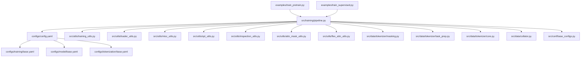
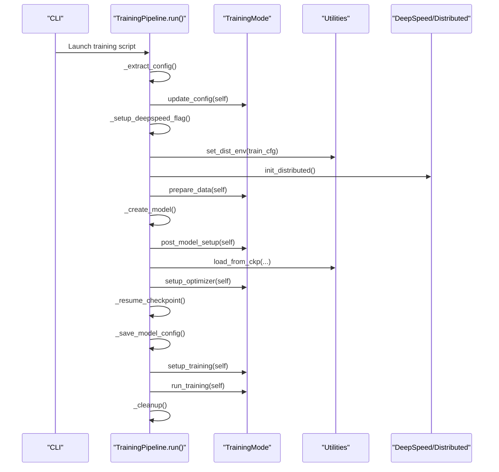
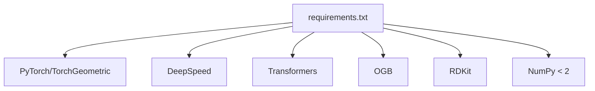

# Troubleshooting Guide

<cite>
**Referenced Files in This Document**
- [README.md](file://README.md)
- [requirements.txt](file://requirements.txt)
- [configs/config.yaml](file://configs/config.yaml)
- [configs/training/base.yaml](file://configs/training/base.yaml)
- [configs/model/base.yaml](file://configs/model/base.yaml)
- [configs/tokenization/base.yaml](file://configs/tokenization/base.yaml)
- [examples/train_pretrain.py](file://examples/train_pretrain.py)
- [examples/train_supervised.py](file://examples/train_supervised.py)
- [src/training/pipeline.py](file://src/training/pipeline.py)
- [src/utils/training_utils.py](file://src/utils/training_utils.py)
- [src/utils/loader_utils.py](file://src/utils/loader_utils.py)
- [src/utils/misc_utils.py](file://src/utils/misc_utils.py)
- [src/utils/opt_utils.py](file://src/utils/opt_utils.py)
- [src/utils/inspection_utils.py](file://src/utils/inspection_utils.py)
- [src/utils/attn_mask_utils.py](file://src/utils/attn_mask_utils.py)
- [src/utils/flex_attn_utils.py](file://src/utils/flex_attn_utils.py)
- [src/data/tokenizer/masking.py](file://src/data/tokenizer/masking.py)
- [src/data/tokenizer/task_prep.py](file://src/data/tokenizer/task_prep.py)
- [src/data/tokenizer/core.py](file://src/data/tokenizer/core.py)
- [src/data/collator.py](file://src/data/collator.py)
- [src/conf/base_configs.py](file://src/conf/base_configs.py)
</cite>

## Table of Contents
1. [Introduction](#introduction)
2. [Project Structure](#project-structure)
3. [Core Components](#core-components)
4. [Architecture Overview](#architecture-overview)
5. [Detailed Component Analysis](#detailed-component-analysis)
6. [Dependency Analysis](#dependency-analysis)
7. [Performance Considerations](#performance-considerations)
8. [Troubleshooting Guide](#troubleshooting-guide)
9. [Conclusion](#conclusion)
10. [Appendices](#appendices)

## Introduction
This troubleshooting guide focuses on diagnosing and resolving common issues encountered when installing, configuring, and training Graph-GPT models. It covers environment setup, dependency conflicts, CUDA compatibility, training stability (memory overflow, convergence, performance bottlenecks), and debugging strategies for data pipelines, model training, and configuration errors. Practical, step-by-step resolutions and preventive best practices are included to help users avoid frequent pitfalls.

**Updated** Enhanced coverage of packed sequence masking bug fixes and new masking strategies, including troubleshooting mask ratio inconsistencies and attention mode coordination in packed sequences.

## Project Structure
The repository is organized around a unified training pipeline, modular configuration via YAML and dataclasses, and a clear separation of concerns for data loading, model creation, and utilities. Understanding this layout helps isolate issues quickly.

**Diagram sources**
- [examples/train_pretrain.py:1-19](file://examples/train_pretrain.py#L1-L19)
- [examples/train_supervised.py:1-19](file://examples/train_supervised.py#L1-L19)
- [src/training/pipeline.py:1-258](file://src/training/pipeline.py#L1-L258)
- [configs/config.yaml:1-20](file://configs/config.yaml#L1-L20)
- [configs/training/base.yaml:1-78](file://configs/training/base.yaml#L1-L78)
- [configs/model/base.yaml:1-222](file://configs/model/base.yaml#L1-L222)
- [configs/tokenization/base.yaml:1-117](file://configs/tokenization/base.yaml#L1-L117)
- [src/utils/training_utils.py:1-206](file://src/utils/training_utils.py#L1-L206)
- [src/utils/loader_utils.py:1-752](file://src/utils/loader_utils.py#L1-L752)
- [src/utils/misc_utils.py:1-540](file://src/utils/misc_utils.py#L1-L540)
- [src/utils/opt_utils.py:1-38](file://src/utils/opt_utils.py#L1-L38)
- [src/utils/inspection_utils.py:1-167](file://src/utils/inspection_utils.py#L1-L167)
- [src/utils/attn_mask_utils.py:1-42](file://src/utils/attn_mask_utils.py#L1-L42)
- [src/utils/flex_attn_utils.py:1-110](file://src/utils/flex_attn_utils.py#L1-L110)
- [src/data/tokenizer/masking.py:1-277](file://src/data/tokenizer/masking.py#L1-L277)
- [src/data/tokenizer/task_prep.py:1-530](file://src/data/tokenizer/task_prep.py#L1-L530)
- [src/data/tokenizer/core.py:1-877](file://src/data/tokenizer/core.py#L1-L877)
- [src/data/collator.py:1-134](file://src/data/collator.py#L1-L134)
- [src/conf/base_configs.py:190-299](file://src/conf/base_configs.py#L190-L299)

**Section sources**
- [README.md:203-286](file://README.md#L203-L286)
- [examples/train_pretrain.py:1-19](file://examples/train_pretrain.py#L1-L19)
- [examples/train_supervised.py:1-19](file://examples/train_supervised.py#L1-L19)
- [src/training/pipeline.py:15-96](file://src/training/pipeline.py#L15-L96)

## Core Components
- Unified training pipeline orchestrating setup, data, model, optimizer, and training loop.
- Configuration system combining YAML-based defaults with dataclass-backed runtime configs.
- Utilities for distributed training, data loaders, checkpointing, and inspection.
- **Enhanced** packed sequence handling with attention mode coordination and masking bug fixes.

Key responsibilities:
- Pipeline: shared lifecycle, distributed setup, model creation, checkpointing/resuming, cleanup.
- Training utilities: single-step training with AMP and DeepSpeed integration.
- Loader utilities: deterministic samplers, worker initialization, ODPS table dataset support, loader initialization.
- Misc utilities: distributed environment setup, checkpoint save/load, inference dumping, token estimation.
- Optimization utilities: optimizer/scheduler/grad scaler setup.
- **New** Attention utilities: flexible attention mask creation for packed sequences with proper coordination.
- **Enhanced** Tokenization utilities: improved masking strategies with bug fixes for packed sequences.

**Section sources**
- [src/training/pipeline.py:15-96](file://src/training/pipeline.py#L15-L96)
- [src/utils/training_utils.py:7-206](file://src/utils/training_utils.py#L7-L206)
- [src/utils/loader_utils.py:55-752](file://src/utils/loader_utils.py#L55-L752)
- [src/utils/misc_utils.py:507-540](file://src/utils/misc_utils.py#L507-L540)
- [src/utils/opt_utils.py:7-38](file://src/utils/opt_utils.py#L7-L38)
- [src/utils/attn_mask_utils.py:1-42](file://src/utils/attn_mask_utils.py#L1-L42)
- [src/utils/flex_attn_utils.py:1-110](file://src/utils/flex_attn_utils.py#L1-L110)

## Architecture Overview
The training pipeline coordinates configuration extraction, distributed setup, data preparation, model creation, optimizer setup, checkpointing/resuming, and the training loop. Mode-specific logic is delegated to pretraining or fine-tuning strategies.

**Diagram sources**
- [src/training/pipeline.py:60-96](file://src/training/pipeline.py#L60-L96)
- [src/training/pipeline.py:119-142](file://src/training/pipeline.py#L119-L142)
- [src/training/pipeline.py:149-178](file://src/training/pipeline.py#L149-L178)
- [src/training/pipeline.py:179-203](file://src/training/pipeline.py#L179-L203)
- [src/training/pipeline.py:204-227](file://src/training/pipeline.py#L204-L227)
- [src/utils/misc_utils.py:507-540](file://src/utils/misc_utils.py#L507-L540)

## Detailed Component Analysis

### Training Pipeline
- Orchestrates shared phases and delegates mode-specific behavior.
- Distributed setup and environment variables are handled centrally.
- Checkpointing logic distinguishes resume vs. pretrained initialization.

Common issues:
- Distributed initialization failures (NCCL, environment variables).
- Resume vs. pretrained initialization confusion.
- DeepSpeed configuration mismatch.

Resolution tips:
- Verify NCCL backend and environment variables before launching.
- Ensure output_dir vs. pretrain_cpt semantics are understood when resuming.
- Confirm deepspeed config file path and presence.

**Section sources**
- [src/training/pipeline.py:15-96](file://src/training/pipeline.py#L15-L96)
- [src/training/pipeline.py:119-142](file://src/training/pipeline.py#L119-L142)
- [src/training/pipeline.py:179-203](file://src/training/pipeline.py#L179-L203)

### Training Utilities
- Single-step training supports both DeepSpeed and AMP modes.
- Gradient accumulation constraints and gradient clipping are enforced.
- Loss composition differs between pretrain and finetune modes.

Common issues:
- Gradient accumulation assertion failures.
- NaN/inf gradients leading to training stalls.
- Incorrect device dtype mixing.

Resolution tips:
- Keep gradient_accumulation_steps at 1 when not using DeepSpeed.
- Enable gradient clipping and monitor norms.
- Ensure autocast dtype matches expectations.

**Section sources**
- [src/utils/training_utils.py:7-206](file://src/utils/training_utils.py#L7-L206)

### Loader Utilities
- Deterministic samplers and worker initialization for reproducibility.
- ODPS table dataset support with epoch-aware resets.
- Loader initialization with prefetch and pin_memory toggles.

Common issues:
- Worker seeds not applied leading to non-reproducible runs.
- ODPS dataset skipping misalignment causing epoch drift.
- DataLoader pin_memory and drop_last mismatches.

Resolution tips:
- Use worker_init_fn_seed consistently.
- Align skipped samples with steps_per_epoch for ODPS.
- Tune prefetch_factor and drop_last according to dataset type.

**Section sources**
- [src/utils/loader_utils.py:134-159](file://src/utils/loader_utils.py#L134-L159)
- [src/utils/loader_utils.py:504-554](file://src/utils/loader_utils.py#L504-L554)
- [src/utils/loader_utils.py:556-607](file://src/utils/loader_utils.py#L556-L607)
- [src/utils/loader_utils.py:610-644](file://src/utils/loader_utils.py#L610-L644)

### Misc Utilities
- Distributed environment setup with NCCL and timeouts.
- Checkpoint save/load for DDP and DeepSpeed ZeRO stages.
- Inference dumping and token estimation helpers.

Common issues:
- NCCL init failures or timeouts.
- DeepSpeed checkpoint loading inconsistencies.
- Missing keys/unexpected keys after load.

Resolution tips:
- Increase init_process_group timeout if needed.
- Prefer DeepSpeed APIs for ZeRO checkpoints.
- Inspect missing/unexpected keys for compatibility.

**Section sources**
- [src/utils/misc_utils.py:507-540](file://src/utils/misc_utils.py#L507-L540)
- [src/utils/misc_utils.py:69-122](file://src/utils/misc_utils.py#L69-L122)
- [src/utils/misc_utils.py:231-252](file://src/utils/misc_utils.py#L231-L252)

### Optimization Utilities
- Optimizer creation, scheduler setup, and GradScaler initialization.
- DDP wrapping with graceful fallback for local runs.

Common issues:
- DDP wrapping exceptions in local environments.
- Scheduler total steps mismatch.

Resolution tips:
- Catch DDP wrapping exceptions for local testing.
- Ensure total_num_steps aligns with schedule updates.

**Section sources**
- [src/utils/opt_utils.py:7-38](file://src/utils/opt_utils.py#L7-L38)

### Inspection Utilities
- Trainable parameter reporting.
- Tokenization inspection for debugging inputs.
- Attribute distribution checks.

Common issues:
- Misaligned shapes between inputs and model expectations.
- Unexpected tokenization outputs.

Resolution tips:
- Use inspection utilities to print tokenization results and shapes.
- Verify attention_mask and position_ids shapes.

**Section sources**
- [src/utils/inspection_utils.py:13-33](file://src/utils/inspection_utils.py#L13-L33)
- [src/utils/inspection_utils.py:73-144](file://src/utils/inspection_utils.py#L73-L144)

### Attention Utilities
- Flexible attention mask creation for packed sequences.
- Coordination between different attention modes ('full', 'causal', 'noise').
- Bug fixes for mask ratio inconsistencies in packed sequences.

Common issues:
- Attention mode coordination failures in packed sequences.
- Mask ratio inconsistencies between packed and unpacked sequences.
- Flex attention mask creation errors.

Resolution tips:
- Ensure proper attention mode coordination in packed sequences.
- Verify mask ratio calculations account for packed sequence boundaries.
- Use flex attention utilities for complex packed sequence scenarios.

**Section sources**
- [src/utils/attn_mask_utils.py:1-42](file://src/utils/attn_mask_utils.py#L1-L42)
- [src/utils/flex_attn_utils.py:1-110](file://src/utils/flex_attn_utils.py#L1-L110)

### Tokenization Utilities
- Enhanced masking strategies with bug fixes for packed sequences.
- Improved mask ratio handling and attention mode coordination.
- Support for both stacked and non-stacked tokenization approaches.

Common issues:
- Mask ratio inconsistencies in packed sequences.
- Attention mode coordination failures.
- Tokenization shape mismatches.

Resolution tips:
- Verify mask ratio calculations in packed sequence contexts.
- Ensure attention modes are properly coordinated across sequence splits.
- Check tokenization output shapes before model processing.

**Section sources**
- [src/data/tokenizer/masking.py:1-277](file://src/data/tokenizer/masking.py#L1-L277)
- [src/data/tokenizer/task_prep.py:1-530](file://src/data/tokenizer/task_prep.py#L1-L530)
- [src/data/tokenizer/core.py:1-877](file://src/data/tokenizer/core.py#L1-L877)

## Dependency Analysis
External dependencies and compatibility constraints:
- PyTorch, CUDA, and DeepSpeed versions must match tested combinations.
- Transformers and related packages require pinned versions.
- RDKit and OGB are required for molecular datasets.

**Diagram sources**
- [requirements.txt:1-27](file://requirements.txt#L1-L27)

**Section sources**
- [requirements.txt:1-27](file://requirements.txt#L1-L27)
- [README.md:211-222](file://README.md#L211-L222)

## Performance Considerations
- Use gradient accumulation only when necessary; otherwise keep at 1.
- Enable gradient clipping to stabilize training.
- Tune DataLoader prefetch_factor, pin_memory, and drop_last for dataset type.
- Monitor tokens per sample to estimate steps and adjust schedule.
- Consider AMP with appropriate dtype for speed/memory trade-offs.
- **Enhanced** Optimize packed sequence processing with proper attention mode coordination.

[No sources needed since this section provides general guidance]

## Troubleshooting Guide

### Installation and Environment Setup
Symptoms:
- Import errors or module not found.
- CUDA version mismatch or driver issues.
- DeepSpeed version inconsistency across workers.
- OGB/RDKit download failures.

Root causes and fixes:
- Match tested versions: Python 3.10, PyTorch 2.5.1, CUDA 12.4, DeepSpeed 0.15.4.
- Use conda environment creation as documented; avoid mixing pip and conda versions.
- Pin transformers and accelerate to compatible versions.
- For OGB datasets, ensure network connectivity and permissions; consider preprocessing separately.

Preventive measures:
- Use the provided conda environment recipe.
- Freeze versions in virtual environments.
- Validate CUDA availability and device visibility before training.

**Section sources**
- [README.md:211-222](file://README.md#L211-L222)
- [requirements.txt:1-27](file://requirements.txt#L1-L27)

### Dependency Conflicts
Symptoms:
- Version conflicts between transformers, accelerate, and torch versions.
- Incompatibilities with torch-scatter/sparse installation.

Root causes and fixes:
- Align transformers and accelerate versions per requirements.
- Install torch-scatter and torch-sparse from the specified wheel index matching your PyTorch version.
- Avoid upgrading pinned packages independently.

Preventive measures:
- Keep requirements.txt intact.
- Reinstall dependencies in a fresh environment.

**Section sources**
- [requirements.txt:19-27](file://requirements.txt#L19-L27)

### CUDA Compatibility Issues
Symptoms:
- NCCL initialization failures.
- Device errors or CUDA out of memory warnings.
- Performance degradation or training stalls.

Root causes and fixes:
- Ensure NCCL backend and proper environment variables are set.
- Verify GPU visibility and CUDA driver compatibility.
- Reduce batch size or enable gradient accumulation.
- Use gradient clipping to prevent exploding gradients.

Preventive measures:
- Test with a smaller dataset first.
- Monitor GPU memory and adjust batch size accordingly.

**Section sources**
- [src/utils/misc_utils.py:507-540](file://src/utils/misc_utils.py#L507-L540)
- [src/utils/training_utils.py:72-78](file://src/utils/training_utils.py#L72-L78)

### DeepSpeed Configuration Problems
Symptoms:
- Workers stuck during initialization.
- Checkpoint loading fails or inconsistent states.
- Mixed precision or ZeRO stage mismatches.

Root causes and fixes:
- Ensure all workers use the same deepspeed config file path.
- Use DeepSpeed APIs for ZeRO checkpoints to avoid mismatches.
- Verify gradient accumulation and optimizer states when resuming.

Preventive measures:
- Keep deepspeed version consistent across nodes.
- Validate checkpoint structure before resuming.

**Section sources**
- [requirements.txt:7](file://requirements.txt#L7)
- [src/utils/misc_utils.py:231-252](file://src/utils/misc_utils.py#L231-L252)
- [src/training/pipeline.py:119-128](file://src/training/pipeline.py#L119-L128)

### Training Stability Issues
Symptoms:
- Loss NaN or inf.
- Convergence stalls or oscillation.
- Memory overflow (CUDA OOM).

Root causes and fixes:
- Enable gradient clipping and monitor norms.
- Reduce batch size or increase gradient accumulation.
- Use AMP with appropriate dtype and scaler updates.
- Inspect inputs for unexpected shapes or values.

Preventive measures:
- Inspect tokenization outputs and shapes before training.
- Start with smaller models and datasets.

**Section sources**
- [src/utils/training_utils.py:72-86](file://src/utils/training_utils.py#L72-L86)
- [src/utils/inspection_utils.py:73-144](file://src/utils/inspection_utils.py#L73-L144)

### Data Pipeline Problems
Symptoms:
- Non-reproducible runs due to worker randomness.
- ODPS dataset skipping misalignment.
- DataLoader performance bottlenecks.

Root causes and fixes:
- Initialize worker seeds using worker_init_fn_seed.
- Align skipped samples with steps_per_epoch for ODPS.
- Tune prefetch_factor and pin_memory; drop_last based on task.

Preventive measures:
- Use deterministic samplers for reproducibility.
- Profile DataLoader throughput.

**Section sources**
- [src/utils/loader_utils.py:150-159](file://src/utils/loader_utils.py#L150-L159)
- [src/utils/loader_utils.py:504-554](file://src/utils/loader_utils.py#L504-L554)
- [src/utils/loader_utils.py:556-607](file://src/utils/loader_utils.py#L556-L607)

### Model Training and Configuration Errors
Symptoms:
- Shape mismatches between inputs and model.
- Missing or unexpected keys after loading checkpoints.
- Scheduler steps mismatch.

Root causes and fixes:
- Inspect tokenization results and shapes using inspection utilities.
- Compare missing/unexpected keys to identify compatibility issues.
- Ensure schedule total_num_steps and warmup_num_steps are updated.

Preventive measures:
- Validate configuration merging and YAML loading.
- Save and reuse final config for eval-only runs.

**Section sources**
- [src/utils/inspection_utils.py:73-144](file://src/utils/inspection_utils.py#L73-L144)
- [src/utils/misc_utils.py:231-252](file://src/utils/misc_utils.py#L231-L252)
- [src/conf/base_configs.py:54-72](file://src/conf/base_configs.py#L54-L72)

### Packed Sequence Masking Issues
**Updated** New troubleshooting section for packed sequence masking problems.

Symptoms:
- Mask ratio inconsistencies between packed and unpacked sequences.
- Attention mode coordination failures in packed sequences.
- Flex attention mask creation errors.
- Position ID mismatches in packed sequences.

Root causes and fixes:
- Verify mask ratio calculations account for packed sequence boundaries and attention modes.
- Ensure proper coordination between 'full', 'causal', and 'noise' attention modes in packed sequences.
- Check that split_lens and attn_modes are properly aligned for flex attention.
- Validate position IDs are correctly generated for packed sequences.

Resolution tips:
- Use the flex attention utilities for complex packed sequence scenarios.
- Verify attention_mask and position_ids shapes match packed sequence lengths.
- Check that mask ratios are calculated per sequence split, not globally.
- Ensure packed sequence EOS tokens are properly handled in attention mode coordination.

Preventive measures:
- Test packed sequence tokenization with small batches first.
- Validate attention mode coordination before enabling complex masking strategies.
- Monitor mask ratio consistency across different sequence types.

**Section sources**
- [src/utils/flex_attn_utils.py:1-110](file://src/utils/flex_attn_utils.py#L1-L110)
- [src/data/tokenizer/task_prep.py:140-160](file://src/data/tokenizer/task_prep.py#L140-L160)
- [src/data/tokenizer/core.py:320-326](file://src/data/tokenizer/core.py#L320-L326)
- [src/data/collator.py:80-90](file://src/data/collator.py#L80-L90)

### Debugging Strategies
- Use inspection utilities to print tokenization results and shapes.
- Print trainable parameter counts to verify model setup.
- Dump inference results and hidden states for debugging downstream tasks.
- Monitor logs and CSV outputs for trends.

**Section sources**
- [src/utils/inspection_utils.py:13-33](file://src/utils/inspection_utils.py#L13-L33)
- [src/utils/inspection_utils.py:73-144](file://src/utils/inspection_utils.py#L73-L144)
- [src/utils/misc_utils.py:322-347](file://src/utils/misc_utils.py#L322-L347)

### Performance Optimization Techniques
- Adjust batch size and gradient accumulation.
- Enable AMP with appropriate dtype and scaler updates.
- Tune DataLoader parameters (prefetch_factor, pin_memory, drop_last).
- Estimate tokens per sample to calibrate schedules.
- **Enhanced** Optimize packed sequence processing with proper attention mode coordination.

**Section sources**
- [src/utils/training_utils.py:53-86](file://src/utils/training_utils.py#L53-L86)
- [src/utils/loader_utils.py:556-607](file://src/utils/loader_utils.py#L556-L607)
- [src/utils/misc_utils.py:349-378](file://src/utils/misc_utils.py#L349-L378)

### Resource Utilization Monitoring
- Monitor GPU memory usage and adjust batch size accordingly.
- Track training throughput and latency per epoch/batch.
- Use logs and CSV outputs to track metrics and losses.

[No sources needed since this section provides general guidance]

### Preventive Measures and Best Practices
- Use the provided conda environment and requirements.
- Keep versions pinned and avoid manual upgrades.
- Validate configurations and tokenization outputs before training.
- Start with toy examples and small datasets.
- Save and reuse final config for eval-only runs.

**Section sources**
- [README.md:203-246](file://README.md#L203-L246)
- [src/conf/base_configs.py:250-264](file://src/conf/base_configs.py#L250-L264)

## Conclusion
By following this guide, users can systematically diagnose and resolve installation, environment, training, and configuration issues in Graph-GPT. The unified pipeline, modular configuration, and rich utilities provide clear entry points for isolating problems. Adopting the recommended preventive measures and best practices will minimize downtime and improve reproducibility.

**Updated** Enhanced troubleshooting coverage for packed sequence masking issues with new bug fixes and attention mode coordination strategies.

## Appendices

### Quick Reference: Common Commands and Paths
- Environment setup and dependencies: [README.md:211-222](file://README.md#L211-L222)
- Training entry points: [examples/train_pretrain.py:12-14](file://examples/train_pretrain.py#L12-L14), [examples/train_supervised.py:12-14](file://examples/train_supervised.py#L12-L14)
- Configuration defaults: [configs/config.yaml:1-20](file://configs/config.yaml#L1-L20), [configs/training/base.yaml:1-78](file://configs/training/base.yaml#L1-L78), [configs/model/base.yaml:1-222](file://configs/model/base.yaml#L1-L222), [configs/tokenization/base.yaml:1-117](file://configs/tokenization/base.yaml#L1-L117)
- **New** Packed sequence utilities: [src/utils/flex_attn_utils.py:1-110](file://src/utils/flex_attn_utils.py#L1-L110), [src/data/tokenizer/task_prep.py:140-160](file://src/data/tokenizer/task_prep.py#L140-L160)
