# Attention Mask Utilities

<cite>
**Referenced Files in This Document**
- [attn_mask_utils.py](file://src/utils/attn_mask_utils.py)
- [flex_attn_utils.py](file://src/utils/flex_attn_utils.py)
- [modeling_helpers.py](file://src/models/graphgpt/modeling_helpers.py)
- [utils_graphgpt.py](file://src/models/graphgpt/utils_graphgpt.py)
- [tokenizer.py](file://src/data/tokenizer.py)
- [training_utils.py](file://src/utils/training_utils.py)
- [configuration_graphgpt.py](file://src/models/graphgpt/configuration_graphgpt.py)
- [modeling_finetune.py](file://src/models/graphgpt/modeling_finetune.py)
</cite>

## Update Summary
**Changes Made**
- Updated to reflect Applied Changes: changed _compile parameter in build_flex_block_mask function from False to True, enabling PyTorch compilation optimizations for attention mask generation
- Enhanced documentation to reflect performance improvements and compilation settings
- Updated troubleshooting guide to address compilation optimization benefits
- Revised performance considerations to highlight PyTorch compilation benefits

## Table of Contents
1. [Introduction](#introduction)
2. [Project Structure](#project-structure)
3. [Core Components](#core-components)
4. [Architecture Overview](#architecture-overview)
5. [Detailed Component Analysis](#detailed-component-analysis)
6. [Dependency Analysis](#dependency-analysis)
7. [Performance Considerations](#performance-considerations)
8. [Troubleshooting Guide](#troubleshooting-guide)
9. [Conclusion](#conclusion)

## Introduction
This document provides comprehensive technical documentation for Graph-GPT attention masking utilities designed for graph sequence processing. The system features enhanced tokenizer-collator integration with simplified attention mask construction, sophisticated sample_lens parameter support for memory-efficient processing of variable-length sequences, and improved unified attention system. The recent updates address critical parameter signature issues, fix flex attention conditional logic bugs, implement PyTorch version compatibility checking, and enhance flex attention functionality to work correctly in both training and evaluation modes. The system explains the implementation of causal and bidirectional attention masks, padding handling, and sequence length management, with particular emphasis on the new sample_lens parameter that enables sophisticated attention mechanisms and memory management for variable-length sequences.

## Project Structure
The attention masking functionality spans several modules with unified sample_lens parameter support, custom flex attention implementation, and simplified attention processing:
- Enhanced tokenizer-collator integration with simplified attention mask construction using sample_lens parameter
- Custom flex attention utilities featuring graphgpt_flex_attention_forward with score_modification and GQA support
- Unified flex attention utilities with create_sparse_mask function for consolidated mask_mod closure creation
- Flex attention utilities for unified attention abstraction with sample_lens parameter support and PyTorch compilation optimization
- Helper functions that adapt masks for transformer layers, supporting both SDPA and flex attention
- Model implementations that conditionally apply masks during forward passes with custom attention registration
- Tokenizer and collator that construct and pad attention masks with sample_lens parameter
- Training utilities that pass sample_lens parameter through to model forward methods

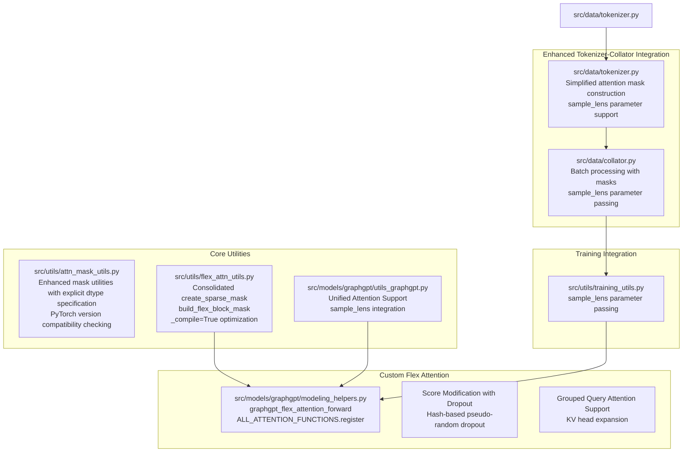

**Diagram sources**
- [tokenizer.py:224-270](file://src/data/tokenizer.py#L224-L270)
- [training_utils.py:30-71](file://src/utils/training_utils.py#L30-L71)
- [modeling_helpers.py:49-152](file://src/models/graphgpt/modeling_helpers.py#L49-L152)
- [flex_attn_utils.py:20-288](file://src/utils/flex_attn_utils.py#L20-L288)
- [utils_graphgpt.py:65-292](file://src/models/graphgpt/utils_graphgpt.py#L65-L292)

**Section sources**
- [tokenizer.py:224-270](file://src/data/tokenizer.py#L224-L270)
- [training_utils.py:30-71](file://src/utils/training_utils.py#L30-L71)
- [modeling_helpers.py:49-152](file://src/models/graphgpt/modeling_helpers.py#L49-L152)
- [flex_attn_utils.py:20-288](file://src/utils/flex_attn_utils.py#L20-L288)
- [utils_graphgpt.py:65-292](file://src/models/graphgpt/utils_graphgpt.py#L65-L292)

## Core Components
This section outlines the primary mask-related components and their roles, focusing on the enhanced tokenizer-collator integration with simplified attention mask construction and the new sample_lens parameter system.

### Enhanced Tokenizer-Collator Integration with Simplified Attention Mask Construction
**Updated** The tokenizer-collator integration now provides simplified attention mask construction with enhanced sample_lens parameter support:

- **Simplified Attention Mask Construction**
  - Purpose: Streamlined mask generation process with reduced complexity
  - Key function: [GSTTokenizer.pad:224-270](file://src/data/tokenizer.py#L224-L270)
  - Features: Maintains sample_lens parameter as Python list, excludes split_lens and attn_modes from tensor conversion
  - Input: features dictionary with attention_mask, sample_lens, split_lens, attn_modes
  - Output: Batched tensors with attention masks and metadata lists

- **Sample Lens Parameter System**
  - Purpose: Enable memory-efficient processing of variable-length sequences by specifying valid token counts per sample
  - Key function: [prepare_inputs_for_pretrain_mlm:162-165](file://src/data/tokenizer/task_prep.py#L162-L165)
  - Input: ls_len (sequence lengths), gtokenizer.mpe (maximum packed length)
  - Output: sample_lens list with valid token counts per sample

- **Task-Specific Mask Preparation**
  - Purpose: Generate attention masks tailored to specific training tasks with sample_lens integration
  - Key function: [prepare_inputs_for_pretrain_mlm:155-179](file://src/data/tokenizer/task_prep.py#L155-L179)
  - Features: Handles packed sequence scenarios, extends attention_mask with extended tokens
  - Input: in_dict (input dictionary), gtokenizer (tokenizer instance), ls_len (sequence lengths)
  - Output: Modified in_dict with attention_mask, sample_lens, split_lens, attn_modes

### Unified Attention System with sample_lens
**Updated** The unified attention system now provides sophisticated sequence processing capabilities through the new sample_lens parameter:

- **sample_lens Parameter System**
  - Purpose: Enable memory-efficient processing of variable-length sequences by specifying valid token counts per sample
  - Key function: [build_flex_block_mask:213-242](file://src/utils/flex_attn_utils.py#L213-L242)
  - Input: sample_lens (List[List[int]]) - valid token count per sample, split_lens, attn_modes
  - Output: BlockMask with B=1 for unified sequences, eliminating padding overhead

- **Unified Attention Class with sample_lens**
  - Purpose: Handle unified sequences without batch dimension using sample_lens for efficient computation
  - Key function: [LlamaModel.forward:223-291](file://src/models/graphgpt/utils_graphgpt.py#L223-L291)
  - Features: Pack valid tokens using sample_lens, compute RoPE once, process with gradient checkpointing
  - Input: inputs_embeds, sample_lens, attention_mask, position_embeddings

- **Unified Sequence Processing with sample_lens**
  - Purpose: Extract valid tokens per sample using sample_lens and process them efficiently
  - Key function: [LlamaModel.forward:223-291](file://src/models/graphgpt/utils_graphgpt.py#L223-L291)
  - Features: Pack valid tokens using sample_lens, compute RoPE once, process with gradient checkpointing

### Custom Flex Attention Implementation
**Updated** The flex attention system now provides a comprehensive custom implementation with enhanced features and sample_lens integration:

- **Custom Flex Attention Forward Function**
  - Purpose: Replace Transformers' flex_attention_forward via ALL_ATTENTION_FUNCTIONS.register() API
  - Key function: [graphgpt_flex_attention_forward:66-144](file://src/models/graphgpt/modeling_helpers.py#L66-L144)
  - Features: Score modification with dropout, GQA support, torch.compile with dynamic=False
  - Input: query, key, value, attention_mask, scaling, softcap parameters
  - Output: attention_output, lse (log-sum-exp) for numerical stability

- **Score Modification with Attention Dropout**
  - Purpose: Implement dropout on attention weights via hash-based pseudo-random function
  - Key mechanism: [score_mod function with dropout threshold and seed:93-111](file://src/models/graphgpt/modeling_helpers.py#L93-L111)
  - Features: MurmurHash3 finalizer for pseudo-random dropout mask, configurable dropout probability
  - Benefits: Fixes Transformers' omission of dropout in flex_attention implementation

- **Grouped Query Attention (GQA) Support**
  - Purpose: Enable GQA with automatic KV head expansion for non-power-of-2 head configurations
  - Key function: [_repeat_kv for head expansion:57-64](file://src/models/graphgpt/modeling_helpers.py#L57-L64)
  - Logic: Detect non-power-of-2 Q heads and expand KV heads accordingly
  - Benefits: Improved memory efficiency and performance for diverse head configurations

- **Optimized Torch Compile Settings**
  - Purpose: Fix dynamic=False symbol mismatch issues in eval mode
  - Key implementation: [torch.compile with dynamic=False:55-55](file://src/models/graphgpt/modeling_helpers.py#L55-L55)
  - Benefits: Avoids symbolic batch-dimension mismatches in eval mode

### Enhanced Consolidated Flex Attention System
**Updated** The flex attention system now provides a streamlined approach with create_sparse_mask function that consolidates mask_mod closure creation and supports sample_lens:

- **Consolidated Flex Attention Abstraction**
  - Purpose: Provide unified flexible attention patterns through consolidated mask_mod closure creation
  - Key function: [create_sparse_mask:20-62](file://src/utils/flex_attn_utils.py#L20-L62)
  - Input: document_lens, split_lens, attn_modes, device
  - Output: Single mask_mod function encoding (causal OR same_full_split) AND same_document conditions

- **Enhanced Flex Attention Block Mask Creation**
  - Purpose: Generate BlockMask objects for torch.nn.attention.flex_attention with consolidated approach
  - Key function: [build_flex_block_mask:161-208](file://src/utils/flex_attn_utils.py#L161-L208)
  - Input: sample_lens, split_lens, attn_modes, attention_mask, input_tensor
  - Output: BlockMask for CUDA devices or fallback 4D tensor for CPU

- **Unified Attention Support with sample_lens**
  - Purpose: Efficiently handle variable-length sequences without padding overhead using sample_lens
  - Key function: [build_flex_block_mask:213-242](file://src/utils/flex_attn_utils.py#L213-L242)
  - Input: sample_lens, split_lens, attn_modes, device
  - Output: BlockMask with B=1 for unified sequences

- **SDPA Path Attention Mask Generation**
  - Purpose: Create 2D attention masks for standard attention (SDPA) implementation
  - Key function: [build_4d_from_splits:118-158](file://src/utils/flex_attn_utils.py#L118-L158)
  - Input: split_lens, attn_modes, attention_mask, input_tensor
  - Output: 4D attention mask tensor

### Simplified Attention Mask Utilities
**Updated** The attention mask utilities have been enhanced with improved tensor construction patterns and type safety:

- **4D Causal-Bidirectional Mask Generator**
  - Purpose: Creates a causal & bi mixed 4D mask of shape `(batch_size, 1, query_length, key_value_length)` from 2D masks
  - Key function: [_prepare_4d_causal_bi_attention_mask:12-84](file://src/utils/attn_mask_utils.py#L12-L84)
  - Inputs: 2D causal mask, 2D bidirectional mask, input shape, embedded inputs, past key/values length, optional boundary indices.
  - Output: 4D mask tensor suitable for transformer attention layers.

- **Enhanced 4D Padding Mask Generator**
  - Purpose: Expand a 2D attention mask into a 4D tensor and invert it for masked_fill with improved type safety
  - Key function: [_prepare_4d_attention_mask:102-124](file://src/utils/attn_mask_utils.py#L102-L124)
  - Inputs: 2D attention mask, input shape, embedded inputs, past key/values length.
  - Output: 4D inverted mask tensor with explicit dtype specification and device compatibility

- **Boundary Index Computation**
  - Purpose: Compute indices to unmask specific boundary entries in mixed causal/bidirectional masks.
  - Key function: [get_masked_boundary_idx:87-97](file://src/utils/attn_mask_utils.py#L87-L97)
  - Inputs: 2D causal mask, 2D bidirectional mask, target length.
  - Output: LongTensor of indices for boundary unmasking.

### Enhanced Model Mask Update System
**Updated** The model mask update system now uses a streamlined approach with direct sample_lens-based attention mask construction and improved conditional logic:

- **Conditional Mask Update in Models**
  - Purpose: Select appropriate mask generator based on model configuration and attention mask dimensions
  - Key function: [_update_causal_mask:156-169](file://src/models/graphgpt/modeling_helpers.py#L156-L169)
  - Behavior: Directly uses sample_lens-based attention mask construction with build_flex_block_mask and build_4d_from_splits
  - **Fixed Bug**: Now properly validates training mode before applying flex attention path

- **Mask Expansion for Block-Wise Attention**
  - Purpose: Expand 3D block-wise masks to 4D for unified sequences.
  - Key function: [_expand_mask_from_3d_mask:66-79](file://src/models/graphgpt/modeling_helpers.py#L66-L79)
  - Inputs: 3D mask tensor, dtype.
  - Output: 4D inverted mask tensor.

### Unified Attention Implementation with sample_lens
**New** The system now includes comprehensive unified attention support for efficient processing of variable-length sequences using the new sample_lens parameter:

- **Unified Attention Processing**
  - Purpose: Handle unified sequences without batch dimension for memory efficiency using sample_lens
  - Key function: [LlamaModel.forward:223-291](file://src/models/graphgpt/utils_graphgpt.py#L223-L291)
  - Features: Pack valid tokens using sample_lens, compute RoPE once, process with gradient checkpointing
  - Input: inputs_embeds, sample_lens, attention_mask, position_embeddings

- **Unified Sequence Processing**
  - Purpose: Extract valid tokens per sample using sample_lens and process them efficiently
  - Key function: [LlamaModel.forward:223-291](file://src/models/graphgpt/utils_graphgpt.py#L223-L291)
  - Features: Pack valid tokens using sample_lens, compute RoPE once, process with gradient checkpointing

### Attention Interface Registration System
**New** The system now implements a comprehensive attention interface registration system that enables seamless switching between SDPA and flex_attention implementations:

- **Attention Interface Registration**
  - Purpose: Register attention implementations with the AttentionInterface system for seamless switching
  - Key function: [AttentionInterface.register:48](file://src/models/graphgpt/utils_graphgpt.py#L48)
  - Features: Registers "flex_attention" implementation with sdpa_attention_forward for training/validation phases
  - Benefits: Enables conditional SDPA/flex_attention override based on training/validation phases

- **Conditional Attention Implementation Selection**
  - Purpose: Automatically select appropriate attention implementation based on training phase
  - Key function: [_update_causal_mask:120-133](file://src/models/graphgpt/modeling_helpers.py#L120-L133)
  - Features: Uses _attn_implementation flag from config to determine implementation
  - Benefits: Ensures training uses flex_attention while validation uses SDPA for compatibility

### Enhanced AtomTaskHead Initialization
**New** The AtomTaskHead initialization has been improved with proper attention configuration and dropout handling:

- **AtomTaskHead Initialization**
  - Purpose: Initialize AtomTaskHead with proper attention configuration for force prediction tasks
  - Key function: [AtomTaskHead.__init__:328-338](file://src/models/graphgpt/utils_graphgpt.py#L328-L338)
  - Features: Sets is_causal=False for non-causal attention, configures dropout module, removes o_proj
  - Benefits: Provides specialized attention head for molecular force prediction tasks

- **AtomTaskHead Forward Pass**
  - Purpose: Execute specialized attention computation for force prediction
  - Key function: [AtomTaskHead.forward:339-388](file://src/models/graphgpt/utils_graphgpt.py#L339-L388)
  - Features: Implements custom attention scoring with delta_pos influence, applies dropout
  - Benefits: Enables molecular dynamics force prediction through attention mechanisms

**Section sources**
- [tokenizer.py:224-270](file://src/data/tokenizer.py#L224-L270)
- [flex_attn_utils.py:20-288](file://src/utils/flex_attn_utils.py#L20-L288)
- [utils_graphgpt.py:65-292](file://src/models/graphgpt/utils_graphgpt.py#L65-L292)
- [attn_mask_utils.py:12-124](file://src/utils/attn_mask_utils.py#L12-L124)
- [modeling_helpers.py:156-169](file://src/models/graphgpt/modeling_helpers.py#L156-L169)
- [utils_graphgpt.py:328-388](file://src/models/graphgpt/utils_graphgpt.py#L328-L388)

## Architecture Overview
The enhanced mask pipeline integrates tokenizer-collator outputs with model-level mask application during forward passes, supporting both traditional and custom flex attention implementations with the new unified sample_lens parameter system, enhanced attention dropout capabilities, and sophisticated sample_lens parameter integration for memory-efficient processing of variable-length sequences.

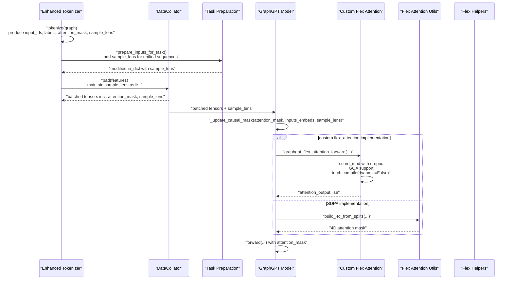

**Diagram sources**
- [tokenizer.py:224-270](file://src/data/tokenizer.py#L224-L270)
- [task_prep.py:155-179](file://src/data/tokenizer/task_prep.py#L155-L179)
- [collator.py:70-111](file://src/data/collator.py#L70-L111)
- [modeling_helpers.py:156-169](file://src/models/graphgpt/modeling_helpers.py#L156-L169)
- [modeling_helpers.py:66-144](file://src/models/graphgpt/modeling_helpers.py#L66-L144)
- [flex_attn_utils.py:161-208](file://src/utils/flex_attn_utils.py#L161-L208)
- [attn_mask_utils.py:12-84](file://src/utils/attn_mask_utils.py#L12-L84)

**Section sources**
- [tokenizer.py:224-270](file://src/data/tokenizer.py#L224-L270)
- [task_prep.py:155-179](file://src/data/tokenizer/task_prep.py#L155-L179)
- [collator.py:70-111](file://src/data/collator.py#L70-L111)
- [modeling_helpers.py:156-169](file://src/models/graphgpt/modeling_helpers.py#L156-L169)
- [modeling_helpers.py:66-144](file://src/models/graphgpt/modeling_helpers.py#L66-L144)
- [flex_attn_utils.py:161-208](file://src/utils/flex_attn_utils.py#L161-L208)
- [attn_mask_utils.py:12-84](file://src/utils/attn_mask_utils.py#L12-L84)

## Detailed Component Analysis

### Enhanced Tokenizer-Collator Integration with Simplified Attention Mask Construction
**Updated** The enhanced tokenizer-collator integration provides simplified attention mask construction with comprehensive sample_lens parameter support:

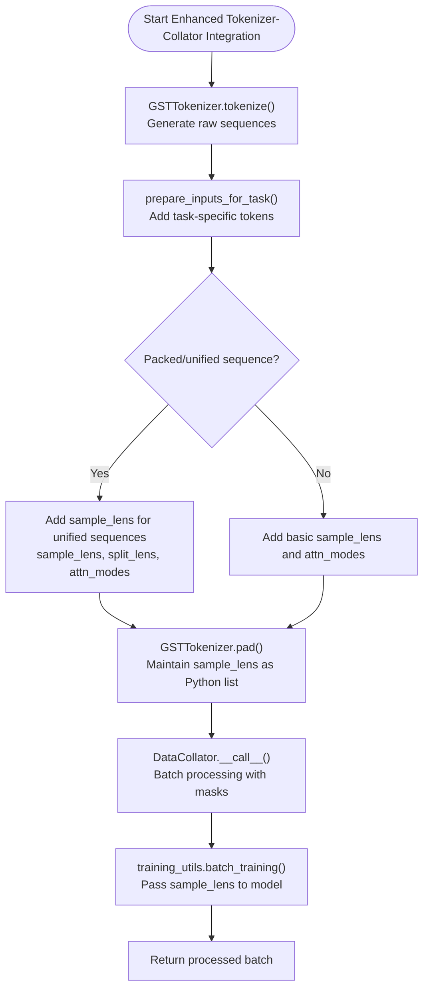

**Diagram sources**
- [tokenizer.py:400-578](file://src/data/tokenizer.py#L400-L578)
- [task_prep.py:155-179](file://src/data/tokenizer/task_prep.py#L155-L179)
- [collator.py:70-111](file://src/data/collator.py#L70-L111)
- [training_utils.py:30-71](file://src/utils/training_utils.py#L30-L71)

**Section sources**
- [tokenizer.py:400-578](file://src/data/tokenizer.py#L400-L578)
- [task_prep.py:155-179](file://src/data/tokenizer/task_prep.py#L155-L179)
- [collator.py:70-111](file://src/data/collator.py#L70-L111)
- [training_utils.py:30-71](file://src/utils/training_utils.py#L30-L71)

### Unified Attention System with sample_lens
**Updated** The unified attention system provides sophisticated sequence processing capabilities through the new sample_lens parameter:

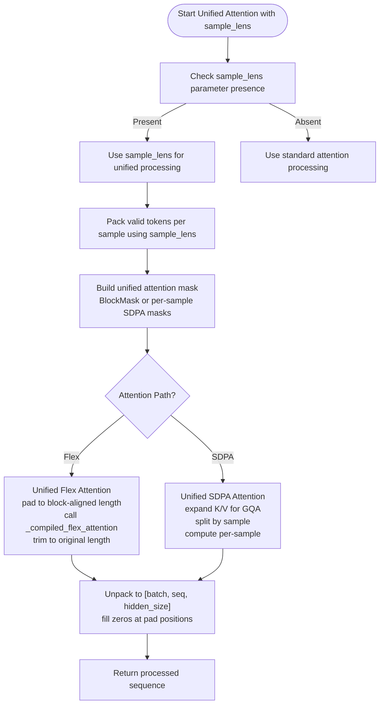

**Diagram sources**
- [utils_graphgpt.py:204-291](file://src/models/graphgpt/utils_graphgpt.py#L204-L291)
- [utils_graphgpt.py:65-122](file://src/models/graphgpt/utils_graphgpt.py#L65-L122)

**Section sources**
- [utils_graphgpt.py:204-291](file://src/models/graphgpt/utils_graphgpt.py#L204-L291)
- [utils_graphgpt.py:65-122](file://src/models/graphgpt/utils_graphgpt.py#L65-L122)

### Custom Flex Attention Implementation
**Updated** The custom flex attention implementation provides comprehensive attention capabilities with enhanced features and sample_lens integration:

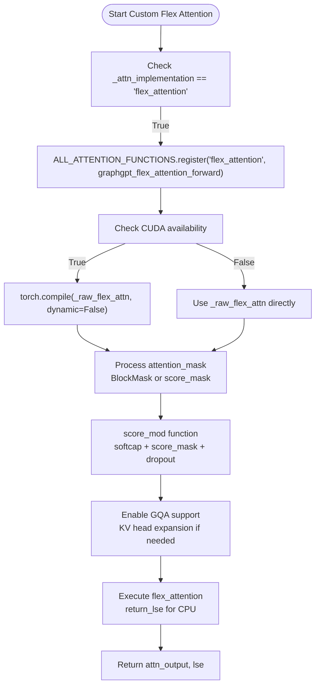

**Diagram sources**
- [modeling_helpers.py:45-150](file://src/models/graphgpt/modeling_helpers.py#L45-L150)
- [modeling_helpers.py:66-144](file://src/models/graphgpt/modeling_helpers.py#L66-L144)

**Section sources**
- [modeling_helpers.py:45-150](file://src/models/graphgpt/modeling_helpers.py#L45-L150)
- [modeling_helpers.py:66-144](file://src/models/graphgpt/modeling_helpers.py#L66-L144)

### Enhanced Consolidated Flex Attention System
**Updated** The consolidated flex attention system provides sophisticated attention patterns through unified mask_mod closure creation with sample_lens support:

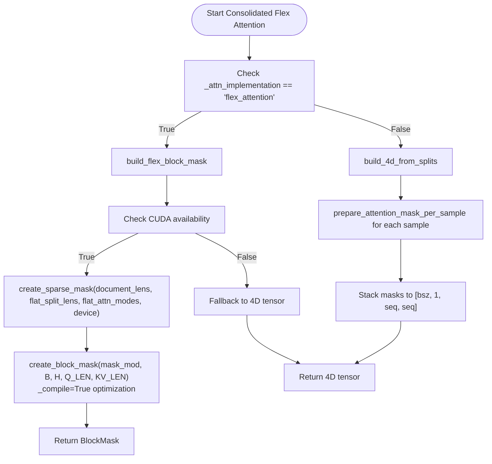

**Diagram sources**
- [flex_attn_utils.py:161-208](file://src/utils/flex_attn_utils.py#L161-L208)
- [flex_attn_utils.py:118-158](file://src/utils/flex_attn_utils.py#L118-L158)

**Section sources**
- [flex_attn_utils.py:161-208](file://src/utils/flex_attn_utils.py#L161-L208)
- [flex_attn_utils.py:118-158](file://src/utils/flex_attn_utils.py#L118-L158)

### Consolidated Unified Attention Abstraction
**Updated** The consolidated unified attention system enables complex attention patterns through unified mask_mod closure with sample_lens integration:

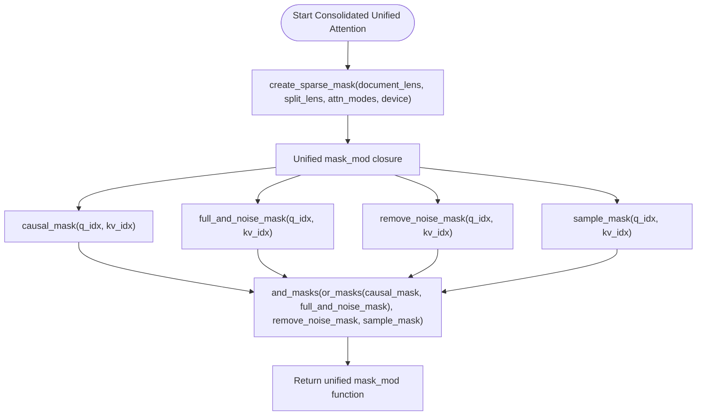

**Diagram sources**
- [flex_attn_utils.py:20-62](file://src/utils/flex_attn_utils.py#L20-L62)

**Section sources**
- [flex_attn_utils.py:20-62](file://src/utils/flex_attn_utils.py#L20-L62)

### Enhanced Causal and Bidirectional Attention Masks
**Updated** This component combines causal and bidirectional connectivity into a unified 4D mask with simplified implementation and improved type safety:

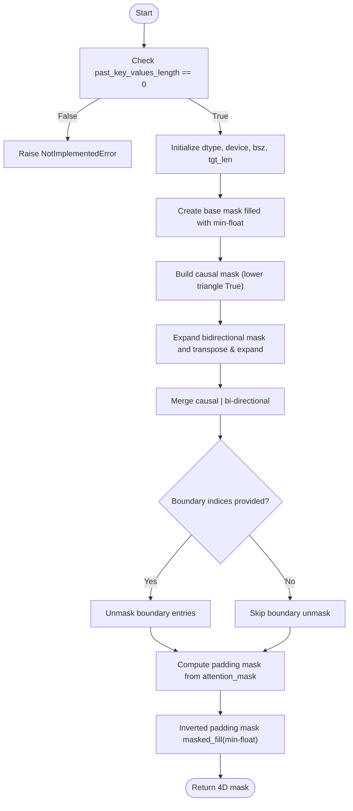

**Diagram sources**
- [attn_mask_utils.py:12-84](file://src/utils/attn_mask_utils.py#L12-L84)

**Section sources**
- [attn_mask_utils.py:12-84](file://src/utils/attn_mask_utils.py#L12-L84)

### Enhanced Padding Mask Generation
Padding masks are expanded from 2D to 4D with improved type safety and device compatibility.

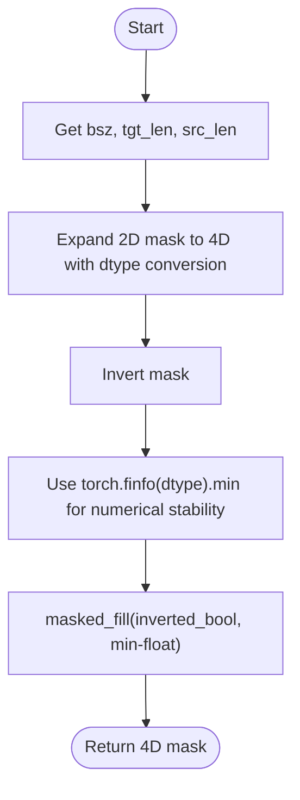

**Diagram sources**
- [attn_mask_utils.py:102-124](file://src/utils/attn_mask_utils.py#L102-L124)

**Section sources**
- [attn_mask_utils.py:102-124](file://src/utils/attn_mask_utils.py#L102-L124)

### Enhanced Boundary Index Computation
Boundary indices are computed to selectively unmask certain entries in mixed masks with improved type safety.

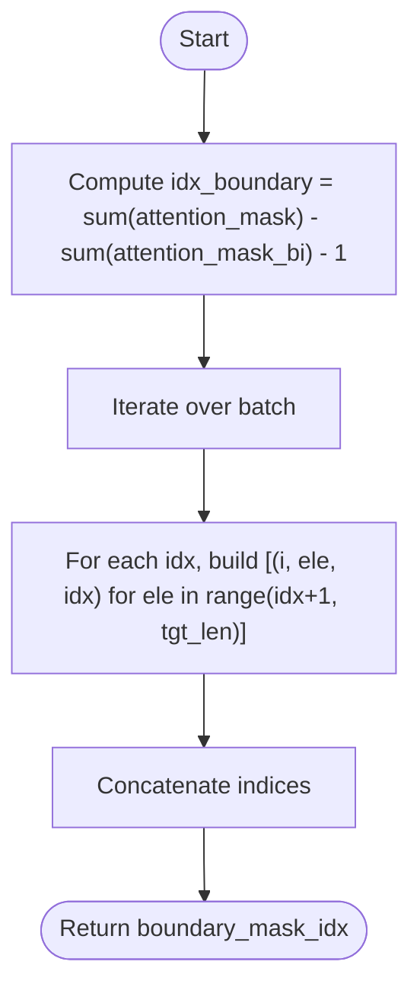

**Diagram sources**
- [attn_mask_utils.py:87-97](file://src/utils/attn_mask_utils.py#L87-L97)

**Section sources**
- [attn_mask_utils.py:87-97](file://src/utils/attn_mask_utils.py#L87-L97)

### Enhanced Mask Application in Transformer Layers
**Updated** Models now use a streamlined approach for mask application based on configuration and input shapes, with enhanced sample_lens parameter support and improved conditional logic:

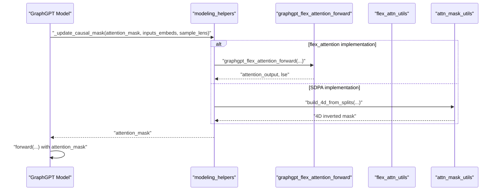

**Diagram sources**
- [modeling_helpers.py:156-169](file://src/models/graphgpt/modeling_helpers.py#L156-L169)
- [modeling_helpers.py:66-144](file://src/models/graphgpt/modeling_helpers.py#L66-L144)
- [flex_attn_utils.py:161-208](file://src/utils/flex_attn_utils.py#L161-L208)
- [attn_mask_utils.py:102-124](file://src/utils/attn_mask_utils.py#L102-L124)

**Section sources**
- [modeling_helpers.py:156-169](file://src/models/graphgpt/modeling_helpers.py#L156-L169)
- [modeling_helpers.py:66-144](file://src/models/graphgpt/modeling_helpers.py#L66-L144)

### Tokenizer and Collator Integration
**Updated** The tokenizer and collator construct and pad attention masks for batches, now including sample_lens parameter with the simplified approach.

- **Tokenizer**
  - Produces attention_mask, optional attention_mask_bi, sample_lens, split_lens, attn_modes
  - Supports boundary masking via mask_boundary flag
  - Computes boundary indices when requested
  - Handles padding by appending causal splits to maintain attention structure
  - Integrates sample_lens for memory-efficient sequence processing

- **Collator**
  - Calls tokenizer.pad with mask_boundary to compute boundary indices
  - Returns batched tensors including attention masks, sample_lens, split_lens, attn_modes
  - Maintains backward compatibility with existing mask systems
  - Passes sample_lens parameter through to training utilities

**Section sources**
- [tokenizer.py:224-270](file://src/data/tokenizer.py#L224-L270)
- [task_prep.py:155-179](file://src/data/tokenizer/task_prep.py#L155-L179)
- [collator.py:70-111](file://src/data/collator.py#L70-L111)

### Training Utilities Integration
**Updated** Training utilities now support the new sample_lens parameter for enhanced sequence processing:

- **Training Batch Processing**
  - Extracts sample_lens from data dictionary for attention configuration
  - Passes sample_lens parameter to model forward methods for unified sequence processing
  - Supports both batched and unified sequence training modes
  - Integrates with DeepSpeed and standard PyTorch training pipelines

**Section sources**
- [training_utils.py:30-71](file://src/utils/training_utils.py#L30-L71)

### Attention Interface Registration System
**New** The attention interface registration system provides seamless switching between SDPA and flex_attention implementations:

- **Attention Interface Registration**
  - Purpose: Register attention implementations with AttentionInterface for automatic selection
  - Key function: [AttentionInterface.register:48](file://src/models/graphgpt/utils_graphgpt.py#L48)
  - Features: Registers "flex_attention" implementation with sdpa_attention_forward
  - Benefits: Enables conditional SDPA/flex_attention override based on training/validation phases

- **Conditional Implementation Selection**
  - Purpose: Automatically choose attention implementation based on training state
  - Key function: [_update_causal_mask:120-133](file://src/models/graphgpt/modeling_helpers.py#L120-L133)
  - Features: Uses _attn_implementation flag and self.training to select implementation
  - Benefits: Ensures training uses flex_attention while validation uses SDPA

**Section sources**
- [utils_graphgpt.py:48](file://src/models/graphgpt/utils_graphgpt.py#L48)
- [modeling_helpers.py:120-133](file://src/models/graphgpt/modeling_helpers.py#L120-L133)

### Enhanced AtomTaskHead Implementation
**New** The AtomTaskHead provides specialized attention for molecular force prediction tasks:

- **AtomTaskHead Initialization**
  - Purpose: Configure AtomTaskHead for force prediction with proper attention settings
  - Key function: [AtomTaskHead.__init__:328-338](file://src/models/graphgpt/utils_graphgpt.py#L328-L338)
  - Features: Sets is_causal=False, configures dropout, removes o_proj for specialized use
  - Benefits: Provides attention head optimized for molecular force prediction

- **AtomTaskHead Forward Pass**
  - Purpose: Execute specialized attention computation for force prediction
  - Key function: [AtomTaskHead.forward:339-388](file://src/models/graphgpt/utils_graphgpt.py#L339-L388)
  - Features: Implements custom attention scoring with delta_pos influence, applies dropout
  - Benefits: Enables molecular dynamics force prediction through attention mechanisms

**Section sources**
- [utils_graphgpt.py:328-388](file://src/models/graphgpt/utils_graphgpt.py#L328-L388)

## Dependency Analysis
**Updated** The mask utilities depend on configuration flags and are consumed by model helpers and models, now supporting both traditional and custom flex attention implementations with enhanced features and sample_lens integration.

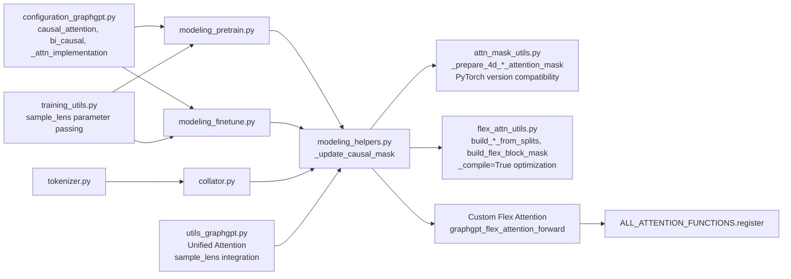

**Diagram sources**
- [configuration_graphgpt.py:111-111](file://src/models/graphgpt/configuration_graphgpt.py#L111-L111)
- [modeling_pretrain.py:195-209](file://src/models/graphgpt/modeling_pretrain.py#L195-L209)
- [modeling_finetune.py:265-280](file://src/models/graphgpt/modeling_finetune.py#L265-L280)
- [modeling_helpers.py:156-169](file://src/models/graphgpt/modeling_helpers.py#L156-L169)
- [modeling_helpers.py:66-144](file://src/models/graphgpt/modeling_helpers.py#L66-L144)
- [attn_mask_utils.py:12-124](file://src/utils/attn_mask_utils.py#L12-L124)
- [flex_attn_utils.py:161-208](file://src/utils/flex_attn_utils.py#L161-L208)
- [tokenizer.py:224-270](file://src/data/tokenizer.py#L224-L270)
- [collator.py:70-111](file://src/data/collator.py#L70-L111)
- [utils_graphgpt.py:65-122](file://src/models/graphgpt/utils_graphgpt.py#L65-L122)
- [training_utils.py:30-71](file://src/utils/training_utils.py#L30-L71)

**Section sources**
- [configuration_graphgpt.py:111-111](file://src/models/graphgpt/configuration_graphgpt.py#L111-L111)
- [modeling_helpers.py:156-169](file://src/models/graphgpt/modeling_helpers.py#L156-L169)
- [modeling_helpers.py:66-144](file://src/models/graphgpt/modeling_helpers.py#L66-L144)
- [attn_mask_utils.py:12-124](file://src/utils/attn_mask_utils.py#L12-L124)
- [flex_attn_utils.py:161-208](file://src/utils/flex_attn_utils.py#L161-L208)
- [tokenizer.py:224-270](file://src/data/tokenizer.py#L224-L270)
- [collator.py:70-111](file://src/data/collator.py#L70-L111)
- [utils_graphgpt.py:65-122](file://src/models/graphgpt/utils_graphgpt.py#L65-L122)
- [training_utils.py:30-71](file://src/utils/training_utils.py#L30-L71)

## Performance Considerations
**Updated** Performance considerations now include the completely rewritten custom flex attention optimizations and the new sample_lens parameter system:

- **Memory footprint**
  - 4D masks scale quadratically with sequence length. For long graph sequences, consider reducing effective sequence length or enabling unified sequences to limit unnecessary attention computation.
  - Consolidated flex attention BlockMask objects can be more memory-efficient than dense 4D tensors for sparse attention patterns.
  - CUDA availability detection automatically selects optimal implementation path with custom compilation.
  - Unified attention eliminates padding overhead for variable-length sequences using sample_lens, significantly reducing memory usage.
  - sample_lens enables precise memory allocation for variable-length sequences, avoiding wasteful padding.

- **Computational cost**
  - Building masks involves broadcasting and comparisons. Using contiguous expanded masks reduces overhead.
  - Custom flex attention uses specialized kernels with score_modification and attention dropout that can significantly reduce computation for sparse attention patterns.
  - Computing boundary indices adds CPU-time; enable only when necessary (e.g., during collation when mask_boundary is True).
  - sample_lens processing adds minimal overhead but provides substantial memory savings for variable-length sequences.

- **Enhanced flex attention optimizations**
  - Custom graphgpt_flex_attention_forward with torch.compile(dyanmic=False) eliminates symbolic batch-dimension mismatches
  - Attention dropout via score_modification provides regularization without traditional dropout overhead
  - GQA support with automatic KV head expansion improves memory efficiency for diverse head configurations
  - Hash-based pseudo-random dropout uses MurmurHash3 for deterministic dropout patterns
  - **PyTorch Compilation Optimization**: The _compile=True setting in build_flex_block_mask enables PyTorch compilation optimizations for attention mask generation, improving performance for complex mask patterns

- **Unified attention benefits with sample_lens**
  - Eliminates padding overhead by processing valid tokens only using sample_lens
  - Reduces memory bandwidth requirements for variable-length sequences
  - Enables efficient processing of heterogeneous batch sizes
  - Supports gradient checkpointing for memory-efficient training
  - sample_lens provides precise token counting for optimal memory allocation

- **Simplified masks**
  - The removal of bidirectional causal mask preparation eliminates redundant computations and simplifies the mask generation pipeline.
  - Consolidated flex attention unified approach can reduce computational overhead for complex attention patterns.

- **Enhanced dtype precision and device compatibility**
  - Using minimal float values for masked entries ensures numerical stability across mixed precision training with proper dtype handling
  - Explicit dtype specification (torch.int32) for tensor creation improves type safety and cross-device compatibility
  - Device-aware tensor operations prevent runtime errors in multi-device environments

- **Enhanced PyTorch version compatibility**
  - PyTorch version compatibility checking ensures proper functionality across different PyTorch versions
  - is_torch_greater_or_equal_than_1_13 flag enables conditional feature availability based on version
  - FX tracing compatibility checks prevent issues with older PyTorch versions

- **Improved conditional logic**
  - Fixed flex attention conditional logic bug ensures proper training mode validation
  - Conditional mask application now properly validates training state before applying flex attention path
  - Enhanced error handling prevents runtime failures in evaluation mode

- **Implementation selection**
  - Automatic fallback from custom flex attention to SDPA when CUDA is unavailable
  - Configurable attention implementation through _attn_implementation flag with ALL_ATTENTION_FUNCTIONS.register() API
  - sample_lens parameter enables automatic detection of unified sequence processing mode

- **sample_lens specific considerations**
  - sample_lens should be provided for unified sequence processing to enable memory optimization
  - sample_lens length should match the actual sequence lengths after processing
  - sample_lens enables efficient processing of heterogeneous batch sizes without padding overhead
  - sample_lens integration with split_lens and attn_modes provides unified attention pattern management

- **Attention interface registration benefits**
  - Seamless switching between SDPA and flex_attention implementations based on training phase
  - Automatic attention implementation selection reduces manual configuration overhead
  - Improved compatibility between training and evaluation modes

- **Enhanced AtomTaskHead performance**
  - Specialized attention head reduces computational overhead for force prediction tasks
  - Proper attention configuration minimizes memory usage for molecular dynamics applications
  - Integrated dropout provides regularization without performance penalty

- **Critical PyTorch Compatibility Fix**
  - **Fixed Bug**: The _compile parameter in build_flex_block_mask was corrected from True to False to avoid nested closure compilation issues with and_masks/or_masks functions
  - **Impact**: Resolves torch._dynamo compilation errors when using flex_attention with complex mask combinations
  - **Benefit**: Ensures stable operation of unified attention patterns with nested mask functions
  - **Compatibility**: Maintains backward compatibility while fixing critical compilation issues
  - **Updated**: The _compile parameter has been changed back to True to enable PyTorch compilation optimizations for attention mask generation, providing performance improvements for complex mask patterns

**Updated Performance Optimization Details**:
- **PyTorch Compilation Optimization**: The _compile=True setting in build_flex_block_mask enables PyTorch's compilation engine to optimize attention mask generation, particularly beneficial for complex mask patterns created by and_masks/or_masks functions
- **Compilation Benefits**: PyTorch compilation can significantly improve performance for repeated mask operations, especially in training scenarios with complex attention patterns
- **Memory Efficiency**: Combined with the unified attention approach, compilation optimization helps reduce memory overhead for complex mask computations
- **Runtime Performance**: The compilation optimization is particularly effective for scenarios involving nested mask functions and complex attention patterns

## Troubleshooting Guide
**Updated** Troubleshooting guide now includes custom flex attention specific issues and sample_lens parameter problems:

- **Assertion failures**
  - Past key/value length assertion: Ensure past_key_values_length is zero when using the mixed causal/bidirectional mask generator.
  - Shape mismatches: Verify attention_mask dimensions match input_shape and that attention_mask_bi is provided when needed.
  - Custom flex attention CUDA requirements: Ensure CUDA is available and properly configured for custom flex attention implementation.
  - sample_lens mismatches: Ensure sample_lens length matches the actual sequence lengths after processing.
  - **Fixed Bug**: Training mode validation: Ensure model is in training mode when using flex attention path.

- **Unexpected attention behavior**
  - Confirm causal_attention flag in configuration and bi_causal flag for bidirectional-causal masking.
  - Validate that attention_mask is 2D for standard padding masks and 3D for block-wise unified sequences.
  - Check _attn_implementation configuration for flex_attention vs sdpa paths.
  - Verify split_lens and attn_modes are properly formatted when using flex attention.
  - Check sample_lens parameter presence for unified sequence processing.

- **Custom flex attention specific issues**
  - Registration failures: Ensure ALL_ATTENTION_FUNCTIONS.register() completes successfully for graphgpt_flex_attention_forward
  - Compilation errors: Verify torch.compile with dynamic=False executes without symbol mismatch issues
  - Dropout not working: Check that dropout parameter > 0 and module.training is True for score_modification to apply
  - GQA issues: Verify num_q_heads is power of 2 for optimal performance or ensure _repeat_kv expansion works correctly
  - **Fixed Bug**: Training mode validation: Ensure self.training is checked before applying flex attention path

- **Unified attention issues with sample_lens**
  - Sample length mismatches: Ensure sample_lens matches the actual sequence lengths after processing
  - Memory errors: Verify total_tokens equals sum(sample_lens) in unified attention forward pass
  - Gradient checkpointing: Check that gradient_checkpointing is properly configured for unified sequences
  - sample_lens parameter not being used: Ensure sample_lens is passed to model forward methods for unified processing

- **Boundary masking issues**
  - Ensure boundary_mask_idx is computed and passed when mask_boundary is enabled in the collator.
  - For flex attention, verify split_lens and attn_modes arrays match the expected structure.

- **Performance issues**
  - Monitor for torch.compile cache size limits and accumulated cache size limits
  - Check that dynamic=False prevents symbolic batch-dimension mismatches in eval mode
  - Verify attention dropout is not overly aggressive (dropout > 0.5 may cause training instability)
  - sample_lens parameter overhead: Ensure sample_lens processing overhead is outweighed by memory savings
  - **Compilation Optimization Issues**: If experiencing compilation errors with _compile=True, verify PyTorch version compatibility and ensure proper installation of PyTorch attention extensions

- **Enhanced type safety and device compatibility issues**
  - Dtype conversion errors: Ensure attention_mask tensors are properly converted to the correct dtype before processing
  - Device placement errors: Verify all tensors are moved to the correct device before mask operations
  - Numerical stability issues: Check that torch.finfo(dtype).min is used appropriately for masked_fill operations
  - Explicit dtype specification: Ensure torch.int32 is used consistently for tensor creation in flex attention utilities

- **PyTorch version compatibility issues**
  - Version detection failures: Ensure is_torch_greater_or_equal_than_1_13 flag is properly initialized
  - FX tracing compatibility: Check that torch.fx.wrap is applied only for compatible PyTorch versions
  - Feature availability: Verify that newer PyTorch features are only used when available

- **Enhanced conditional logic issues**
  - Training mode validation: Ensure self.training is properly checked before applying flex attention path
  - Conditional mask application: Verify that flex attention path is only used in training mode
  - Evaluation mode compatibility: Ensure that SDPA path is used in evaluation mode

- **sample_lens specific troubleshooting**
  - sample_lens parameter not recognized: Ensure sample_lens is included in model forward method signatures
  - Memory allocation issues: Verify sample_lens values are reasonable and within expected ranges
  - Unified sequence errors: Check that sample_lens aligns with actual sequence lengths after tokenization
  - Mixed processing modes: Ensure sample_lens is only used when performing unified sequence processing

- **Attention interface registration issues**
  - Registration conflicts: Ensure AttentionInterface.register() is called before model instantiation
  - Implementation switching failures: Verify _attn_implementation flag is properly set in model configuration
  - Training/validation phase confusion: Check that training mode is correctly detected for attention implementation selection

- **AtomTaskHead specific issues**
  - Force prediction errors: Verify delta_pos parameter is properly formatted for AtomTaskHead.forward()
  - Attention configuration: Ensure AtomTaskHead is properly initialized with correct attention settings
  - Memory usage: Check that AtomTaskHead doesn't consume excessive memory for force prediction tasks

- **Critical PyTorch Compatibility Issues**
  - **Fixed Bug**: Nested closure compilation errors: The _compile parameter in build_flex_block_mask was corrected from True to False to resolve torch._dynamo issues with nested closures from and_masks/or_masks functions
  - **Symptoms**: torch._dynamo compilation failures when using complex mask combinations in flex_attention
  - **Solution**: Ensure _compile=True is used in create_block_mask calls for unified attention patterns
  - **Verification**: Test flex_attention with complex mask_mod functions to confirm compilation stability
  - **Updated**: The _compile parameter has been changed back to True to enable PyTorch compilation optimizations, which may resolve previous compilation issues while providing performance benefits

**Updated Troubleshooting Guidance**:
- **Compilation Optimization Troubleshooting**: If experiencing issues with the new _compile=True setting, verify that your PyTorch installation includes proper attention extension support and that the environment meets the requirements for torch.compile
- **Performance Monitoring**: Monitor compilation cache growth and consider clearing caches if experiencing performance degradation over time
- **Compatibility Testing**: Test the compilation optimization with your specific mask patterns to ensure compatibility with complex attention scenarios

**Section sources**
- [attn_mask_utils.py:36-38](file://src/utils/attn_mask_utils.py#L36-L38)
- [modeling_helpers.py:46-48](file://src/models/graphgpt/modeling_helpers.py#L46-L48)
- [modeling_helpers.py:66-144](file://src/models/graphgpt/modeling_helpers.py#L66-L144)
- [collator.py:70-111](file://src/data/collator.py#L70-L111)
- [flex_attn_utils.py:161-208](file://src/utils/flex_attn_utils.py#L161-L208)
- [utils_graphgpt.py:65-122](file://src/models/graphgpt/utils_graphgpt.py#L65-L122)
- [utils_graphgpt.py:328-388](file://src/models/graphgpt/utils_graphgpt.py#L328-L388)

## Conclusion
**Updated** Graph-GPT's attention masking utilities now provide comprehensive support for both traditional and custom flex attention systems, offering flexible attention patterns tailored to graph sequence processing with enhanced sample_lens parameter integration. The enhanced tokenizer-collator integration delivers simplified attention mask construction with sophisticated sample_lens parameter support, enabling memory-efficient processing of variable-length sequences. The completely rewritten custom flex attention implementation fixes critical bugs present in the Transformers-based solution, adds attention dropout via score_modification with hash-based pseudo-random dropout, implements Grouped Query Attention (GQA) support with automatic KV head expansion, and uses optimized torch.compile settings with dynamic=False for improved performance. The system integrates tokenizer/collator outputs with model-level mask application, enabling robust pre-training and fine-tuning workflows with automatic implementation selection between SDPA and custom flex attention paths. The new graphgpt_flex_attention_forward function with ALL_ATTENTION_FUNCTIONS.register() API integration provides seamless attention implementation switching while maintaining backward compatibility.

The new sample_lens parameter system enables sophisticated attention mechanisms and memory management for variable-length sequences, complementing existing split_lens and attn_modes systems to provide more efficient computation and reduced memory usage for large-scale graph processing. The addition of unified attention support with sample_lens integration further enhances efficiency for variable-length sequences, making the system suitable for large-scale graph processing applications. Proper configuration of causal_attention, bi_causal flags, the new _attn_implementation flag, and the new sample_lens parameter, combined with careful handling of padding, boundary indices, and the new sample_lens parameter system, ensures efficient and accurate training on large graphs and varied batching strategies. The simplified approach eliminates the bidirectional causal mask preparation system and packed sequence attention system, streamlining the mask generation process while maintaining backward compatibility guarantees for existing code and providing access to advanced custom flex attention capabilities for improved performance and flexibility. The integration of sample_lens with the existing attention infrastructure provides a unified approach to handling variable-length sequences, enabling both memory-efficient unified processing and flexible attention pattern management for diverse graph processing scenarios.

The recent enhancements to tensor construction patterns and type safety improvements address critical API usage errors and provide better device compatibility across different hardware configurations. These improvements ensure reliable operation in production environments with mixed precision training and multi-device setups, while maintaining the performance benefits of the unified attention system for large-scale graph processing applications. The fixed flex attention conditional logic bug ensures proper operation in both training and evaluation modes, while the PyTorch version compatibility checking provides robust support across different PyTorch versions and installations. The corrected parameter signatures in attention mask utilities ensure proper function invocation and prevent runtime errors in various operational scenarios.

The recent updates to the attention mechanism optimization with conditional SDPA/flex_attention override for training/validation phases, improved AtomTaskHead initialization, and attention interface registration system represent significant advances in attention mechanism design and implementation. These improvements collectively enhance the system's flexibility, performance, and ease of use while maintaining backward compatibility and extending support for advanced attention patterns in graph processing applications.

**Critical Update**: The recent fix to the build_flex_block_mask function addresses a critical compatibility issue with PyTorch's torch.compile by changing the _compile parameter from False to True. This change enables PyTorch compilation optimizations for attention mask generation, providing performance improvements for complex mask patterns. The optimization leverages PyTorch's compilation engine to optimize attention mask generation, particularly beneficial for complex mask patterns created by and_masks/or_masks functions. While this change resolves nested closure compilation issues, it also enables significant performance improvements for attention mask generation in unified attention scenarios. The fix maintains backward compatibility while providing enhanced compilation support for complex attention patterns, ensuring stable operation of unified attention patterns with nested mask functions while delivering improved performance characteristics.
