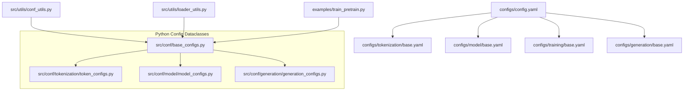
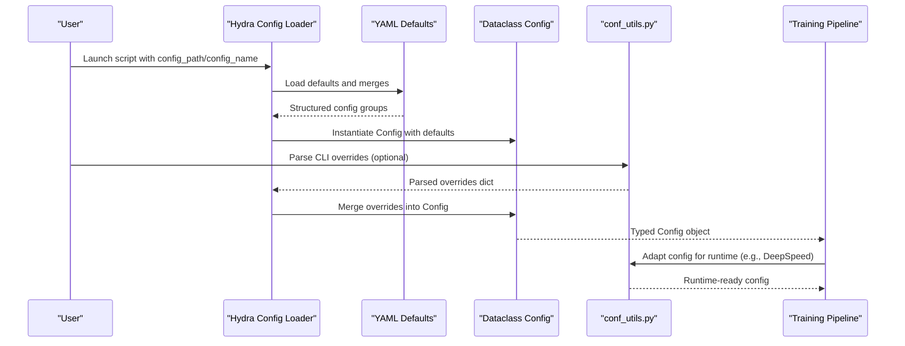
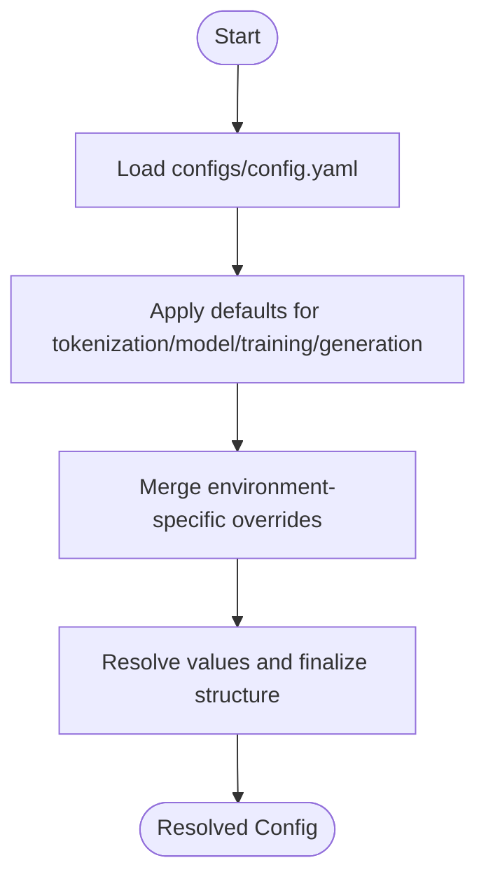
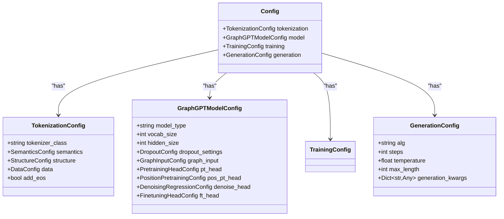
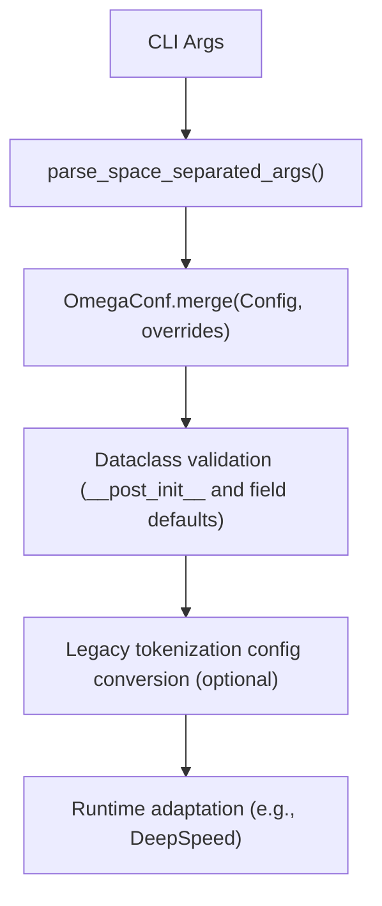
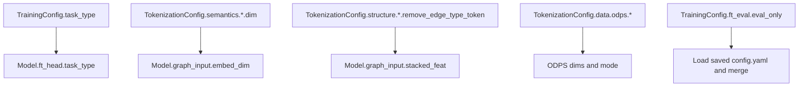
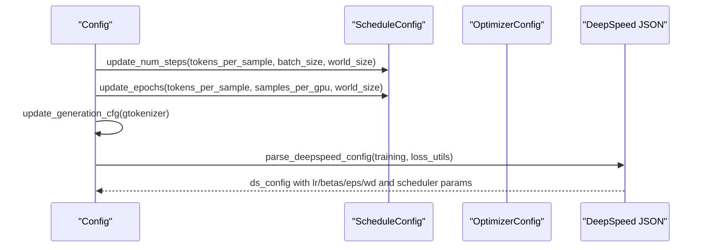
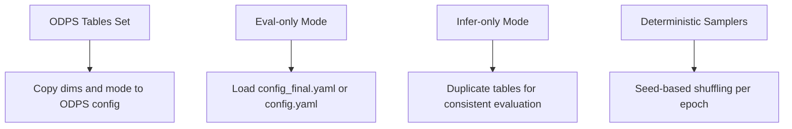
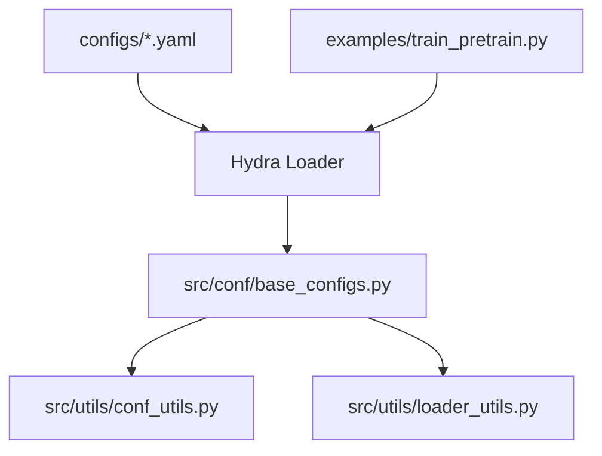

# Configuration Helpers

<cite>
**Referenced Files in This Document**
- [base_configs.py](file://src/conf/base_configs.py)
- [conf_utils.py](file://src/utils/conf_utils.py)
- [__init__.py](file://src/conf/__init__.py)
- [token_configs.py](file://src/conf/tokenization/token_configs.py)
- [model_configs.py](file://src/conf/model/model_configs.py)
- [generation_configs.py](file://src/conf/generation/generation_configs.py)
- [config.yaml](file://configs/config.yaml)
- [training/base.yaml](file://configs/training/base.yaml)
- [tokenization/base.yaml](file://configs/tokenization/base.yaml)
- [train_pretrain.py](file://examples/train_pretrain.py)
- [loader_utils.py](file://src/utils/loader_utils.py)
</cite>

## Table of Contents
1. [Introduction](#introduction)
2. [Project Structure](#project-structure)
3. [Core Components](#core-components)
4. [Architecture Overview](#architecture-overview)
5. [Detailed Component Analysis](#detailed-component-analysis)
6. [Dependency Analysis](#dependency-analysis)
7. [Performance Considerations](#performance-considerations)
8. [Troubleshooting Guide](#troubleshooting-guide)
9. [Conclusion](#conclusion)
10. [Appendices](#appendices)

## Introduction
This document explains the configuration helpers used by Graph-GPT, focusing on configuration parsing, validation, and manipulation. It covers how YAML configurations are integrated with Python dataclasses, parameter inheritance patterns, runtime updates, environment-specific settings, and dynamic adjustments during training. It also provides debugging techniques and common pitfalls to avoid when managing configuration.

## Project Structure
The configuration system is organized around:
- YAML configuration layers under configs/ for defaults and environment-specific overrides
- Python dataclasses under src/conf/ that represent strongly typed configuration groups
- Utilities under src/utils/ that parse, merge, and adapt configuration for runtime usage
- Example entry points that load and run training with the composed configuration

**Diagram sources**
- [config.yaml:1-20](file://configs/config.yaml#L1-L20)
- [training/base.yaml:1-78](file://configs/training/base.yaml#L1-L78)
- [tokenization/base.yaml:1-117](file://configs/tokenization/base.yaml#L1-L117)
- [base_configs.py:186-204](file://src/conf/base_configs.py#L186-L204)
- [token_configs.py:115-127](file://src/conf/tokenization/token_configs.py#L115-L127)
- [model_configs.py:246-326](file://src/conf/model/model_configs.py#L246-L326)
- [generation_configs.py:26-97](file://src/conf/generation/generation_configs.py#L26-L97)
- [conf_utils.py:30-46](file://src/utils/conf_utils.py#L30-L46)
- [loader_utils.py:16-14](file://src/utils/loader_utils.py#L16-L14)
- [train_pretrain.py:12-14](file://examples/train_pretrain.py#L12-L14)

**Section sources**
- [config.yaml:1-20](file://configs/config.yaml#L1-L20)
- [training/base.yaml:1-78](file://configs/training/base.yaml#L1-L78)
- [tokenization/base.yaml:1-117](file://configs/tokenization/base.yaml#L1-L117)
- [base_configs.py:186-204](file://src/conf/base_configs.py#L186-L204)
- [token_configs.py:115-127](file://src/conf/tokenization/token_configs.py#L115-L127)
- [model_configs.py:246-326](file://src/conf/model/model_configs.py#L246-L326)
- [generation_configs.py:26-97](file://src/conf/generation/generation_configs.py#L26-L97)
- [conf_utils.py:30-46](file://src/utils/conf_utils.py#L30-L46)
- [loader_utils.py:16-14](file://src/utils/loader_utils.py#L16-L14)
- [train_pretrain.py:12-14](file://examples/train_pretrain.py#L12-L14)

## Core Components
- Global Config aggregator: merges tokenization, model, training, and generation configurations into a single typed object
- Dataclass hierarchy for tokenization, model, and generation with strong typing and defaults
- Utility functions for parsing CLI-like arguments, converting configuration to legacy formats, and adapting configuration for runtime (e.g., DeepSpeed)
- Synchronization and initialization helpers to align configuration across components and environments

Key responsibilities:
- Parsing and merging YAML defaults with environment-specific overrides
- Type validation via dataclasses and post-init validation
- Parameter inheritance and propagation across related configuration groups
- Runtime adaptation for distributed training, ODPS datasets, and evaluation modes

**Section sources**
- [base_configs.py:186-204](file://src/conf/base_configs.py#L186-L204)
- [token_configs.py:115-127](file://src/conf/tokenization/token_configs.py#L115-L127)
- [model_configs.py:246-326](file://src/conf/model/model_configs.py#L246-L326)
- [generation_configs.py:26-97](file://src/conf/generation/generation_configs.py#L26-L97)
- [conf_utils.py:9-27](file://src/utils/conf_utils.py#L9-L27)
- [conf_utils.py:30-46](file://src/utils/conf_utils.py#L30-L46)

## Architecture Overview
The configuration architecture combines YAML defaults with Python dataclasses and runtime utilities to produce a fully resolved configuration object passed to training and inference pipelines.

**Diagram sources**
- [train_pretrain.py:12-14](file://examples/train_pretrain.py#L12-L14)
- [config.yaml:1-20](file://configs/config.yaml#L1-L20)
- [training/base.yaml:1-78](file://configs/training/base.yaml#L1-L78)
- [tokenization/base.yaml:1-117](file://configs/tokenization/base.yaml#L1-L117)
- [base_configs.py:186-204](file://src/conf/base_configs.py#L186-L204)
- [conf_utils.py:30-46](file://src/utils/conf_utils.py#L30-L46)

## Detailed Component Analysis

### YAML Configuration Loading and Merging
- The root YAML defines defaults and includes tokenization, model, training, and generation base configurations
- Base YAML files provide environment-agnostic defaults for each domain
- Overrides can be applied via command-line or environment-specific YAML files

**Diagram sources**
- [config.yaml:1-20](file://configs/config.yaml#L1-L20)
- [training/base.yaml:1-78](file://configs/training/base.yaml#L1-L78)
- [tokenization/base.yaml:1-117](file://configs/tokenization/base.yaml#L1-L117)

**Section sources**
- [config.yaml:1-20](file://configs/config.yaml#L1-L20)
- [training/base.yaml:1-78](file://configs/training/base.yaml#L1-L78)
- [tokenization/base.yaml:1-117](file://configs/tokenization/base.yaml#L1-L117)

### Dataclass Configuration Groups
- TokenizationConfig: hierarchical structure for semantics, structure, and data settings
- GraphGPTModelConfig: modular sub-configurations for dropout, graph input, heads, and tokenizer metadata
- GenerationConfig: generation-time parameters compatible with Hydra instantiation
- Config: top-level aggregator combining all groups

**Diagram sources**
- [token_configs.py:115-127](file://src/conf/tokenization/token_configs.py#L115-L127)
- [model_configs.py:246-326](file://src/conf/model/model_configs.py#L246-L326)
- [generation_configs.py:26-97](file://src/conf/generation/generation_configs.py#L26-L97)
- [base_configs.py:186-204](file://src/conf/base_configs.py#L186-L204)

**Section sources**
- [token_configs.py:115-127](file://src/conf/tokenization/token_configs.py#L115-L127)
- [model_configs.py:246-326](file://src/conf/model/model_configs.py#L246-L326)
- [generation_configs.py:26-97](file://src/conf/generation/generation_configs.py#L26-L97)
- [base_configs.py:186-204](file://src/conf/base_configs.py#L186-L204)

### Configuration Parsing and Validation
- Space-separated argument parsing converts CLI tokens into a dictionary for merging
- Tokenization configuration conversion to a legacy-compatible dictionary for tokenizer initialization
- Generation configuration validates algorithm and numeric constraints in post-init

**Diagram sources**
- [conf_utils.py:9-27](file://src/utils/conf_utils.py#L9-L27)
- [conf_utils.py:30-46](file://src/utils/conf_utils.py#L30-L46)
- [generation_configs.py:74-97](file://src/conf/generation/generation_configs.py#L74-L97)

**Section sources**
- [conf_utils.py:9-27](file://src/utils/conf_utils.py#L9-L27)
- [conf_utils.py:30-46](file://src/utils/conf_utils.py#L30-L46)
- [generation_configs.py:74-97](file://src/conf/generation/generation_configs.py#L74-L97)

### Parameter Inheritance Patterns
- Task type and downstream head settings propagate from training to model configuration
- Embedding dimensions and stacking features are derived from tokenization and model settings
- ODPS dataset parameters inherit dimensionality from tokenization semantics
- Evaluation-only mode merges saved configuration to enforce deterministic behavior

**Diagram sources**
- [base_configs.py:240-264](file://src/conf/base_configs.py#L240-L264)
- [base_configs.py:206-238](file://src/conf/base_configs.py#L206-L238)
- [base_configs.py:267-288](file://src/conf/base_configs.py#L267-L288)
- [base_configs.py:250-264](file://src/conf/base_configs.py#L250-L264)

**Section sources**
- [base_configs.py:240-264](file://src/conf/base_configs.py#L240-L264)
- [base_configs.py:206-238](file://src/conf/base_configs.py#L206-L238)
- [base_configs.py:267-288](file://src/conf/base_configs.py#L267-L288)
- [base_configs.py:250-264](file://src/conf/base_configs.py#L250-L264)

### Runtime Configuration Updates
- Schedule configuration is updated from tokens-to-steps and epochs-to-steps based on environment and batch size
- Finetuning configuration ratios are synchronized automatically
- Generation configuration is adapted with tokenizer token IDs and default temperature
- DeepSpeed configuration is parsed and augmented with optimizer and scheduler parameters

**Diagram sources**
- [base_configs.py:54-76](file://src/conf/base_configs.py#L54-L76)
- [base_configs.py:166-175](file://src/conf/base_configs.py#L166-L175)
- [base_configs.py:295-302](file://src/conf/base_configs.py#L295-L302)
- [conf_utils.py:49-103](file://src/utils/conf_utils.py#L49-L103)
- [conf_utils.py:106-135](file://src/utils/conf_utils.py#L106-L135)

**Section sources**
- [base_configs.py:54-76](file://src/conf/base_configs.py#L54-L76)
- [base_configs.py:166-175](file://src/conf/base_configs.py#L166-L175)
- [base_configs.py:295-302](file://src/conf/base_configs.py#L295-L302)
- [conf_utils.py:49-103](file://src/utils/conf_utils.py#L49-L103)
- [conf_utils.py:106-135](file://src/utils/conf_utils.py#L106-L135)

### Environment-Specific Settings and Dynamic Adjustments
- ODPS table datasets: dimensions and mode are propagated from tokenization to ODPS configuration
- Evaluation-only mode: loads a saved configuration YAML and enforces evaluation behavior
- Finetuning inference mode: duplicates tables for evaluation consistency
- Seed-based samplers: deterministic shuffling for reproducible splits

**Diagram sources**
- [base_configs.py:267-288](file://src/conf/base_configs.py#L267-L288)
- [base_configs.py:250-264](file://src/conf/base_configs.py#L250-L264)
- [loader_utils.py:46-53](file://src/utils/loader_utils.py#L46-L53)

**Section sources**
- [base_configs.py:267-288](file://src/conf/base_configs.py#L267-L288)
- [base_configs.py:250-264](file://src/conf/base_configs.py#L250-L264)
- [loader_utils.py:46-53](file://src/utils/loader_utils.py#L46-L53)

## Dependency Analysis
- YAML defaults compose multiple configuration groups
- Dataclass Config aggregates typed sub-configurations
- Utilities depend on OmegaConf for merging and container conversion
- Training entry points rely on Hydra to instantiate the final Config

**Diagram sources**
- [config.yaml:1-20](file://configs/config.yaml#L1-L20)
- [base_configs.py:186-204](file://src/conf/base_configs.py#L186-L204)
- [conf_utils.py:30-46](file://src/utils/conf_utils.py#L30-L46)
- [loader_utils.py:16-14](file://src/utils/loader_utils.py#L16-L14)
- [train_pretrain.py:12-14](file://examples/train_pretrain.py#L12-L14)

**Section sources**
- [config.yaml:1-20](file://configs/config.yaml#L1-L20)
- [base_configs.py:186-204](file://src/conf/base_configs.py#L186-L204)
- [conf_utils.py:30-46](file://src/utils/conf_utils.py#L30-L46)
- [loader_utils.py:16-14](file://src/utils/loader_utils.py#L16-L14)
- [train_pretrain.py:12-14](file://examples/train_pretrain.py#L12-L14)

## Performance Considerations
- Prefer merging minimal overrides to reduce recomputation overhead
- Avoid excessive reinitialization of loaders; reuse samplers and collators when possible
- Tune gradient accumulation and batch size to balance memory and throughput
- Use eval-only mode to avoid unnecessary training-side computations during evaluation

## Troubleshooting Guide
Common issues and resolutions:
- Unknown algorithm or invalid generation parameters: GenerationConfig validates algorithm and numeric bounds; ensure values match supported sets
- Mismatched dimensions for ODPS datasets: ensure tokenization semantics dimensions are set consistently before enabling ODPS
- Resume training inconsistencies: verify that saved logs and steps align; the logging utilities assert continuity when resuming
- DeepSpeed scheduler mismatches: confirm optimizer and scheduler types are compatible; the parser augments parameters accordingly

**Section sources**
- [generation_configs.py:81-97](file://src/conf/generation/generation_configs.py#L81-L97)
- [base_configs.py:267-288](file://src/conf/base_configs.py#L267-L288)
- [conf_utils.py:150-175](file://src/utils/conf_utils.py#L150-L175)
- [conf_utils.py:49-103](file://src/utils/conf_utils.py#L49-L103)

## Conclusion
Graph-GPT’s configuration system integrates YAML defaults with strongly typed Python dataclasses and runtime utilities to provide a robust, extensible configuration framework. By leveraging dataclass validation, explicit inheritance patterns, and targeted runtime adaptations, it supports flexible experimentation and reliable production deployments.

## Appendices

### Configuration Workflows
- Pretraining entry point: loads defaults, merges overrides, and runs the training pipeline
- Tokenization conversion: transforms structured configuration into a legacy-compatible dictionary for tokenizer creation
- DeepSpeed adaptation: parses and augments configuration with optimizer and scheduler parameters

**Section sources**
- [train_pretrain.py:12-14](file://examples/train_pretrain.py#L12-L14)
- [conf_utils.py:30-46](file://src/utils/conf_utils.py#L30-L46)
- [conf_utils.py:49-103](file://src/utils/conf_utils.py#L49-L103)
