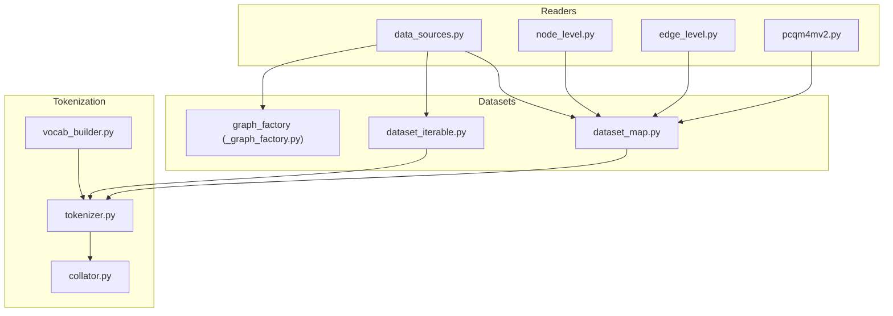
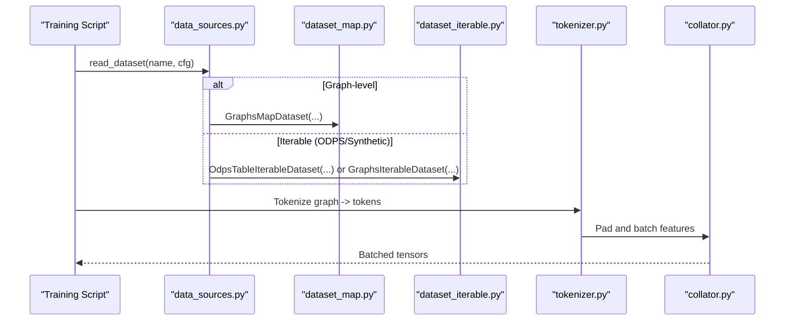
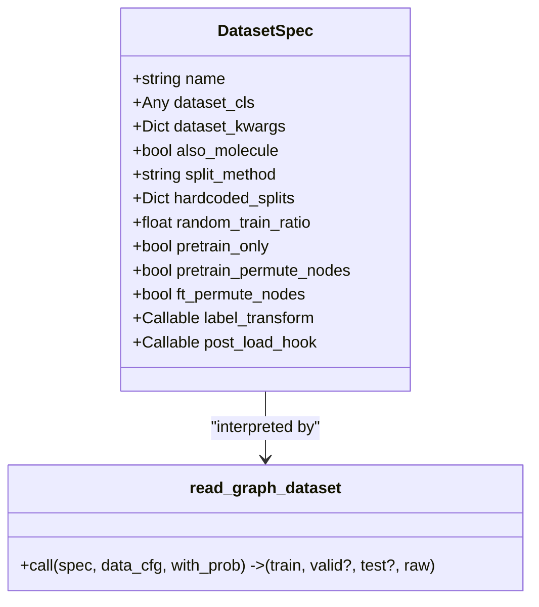
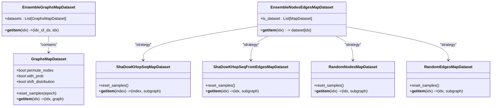
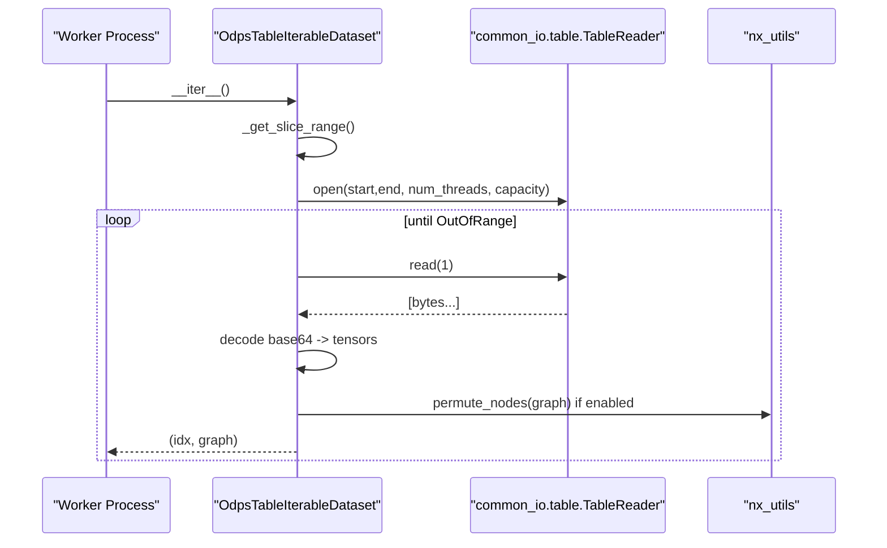
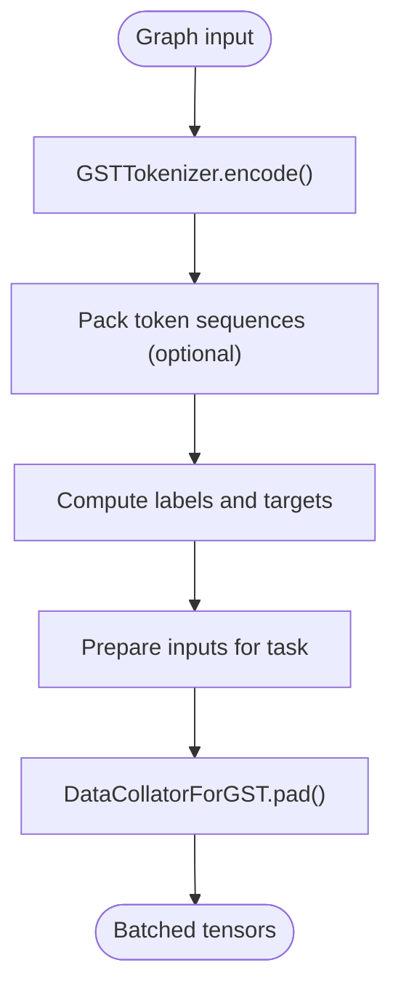
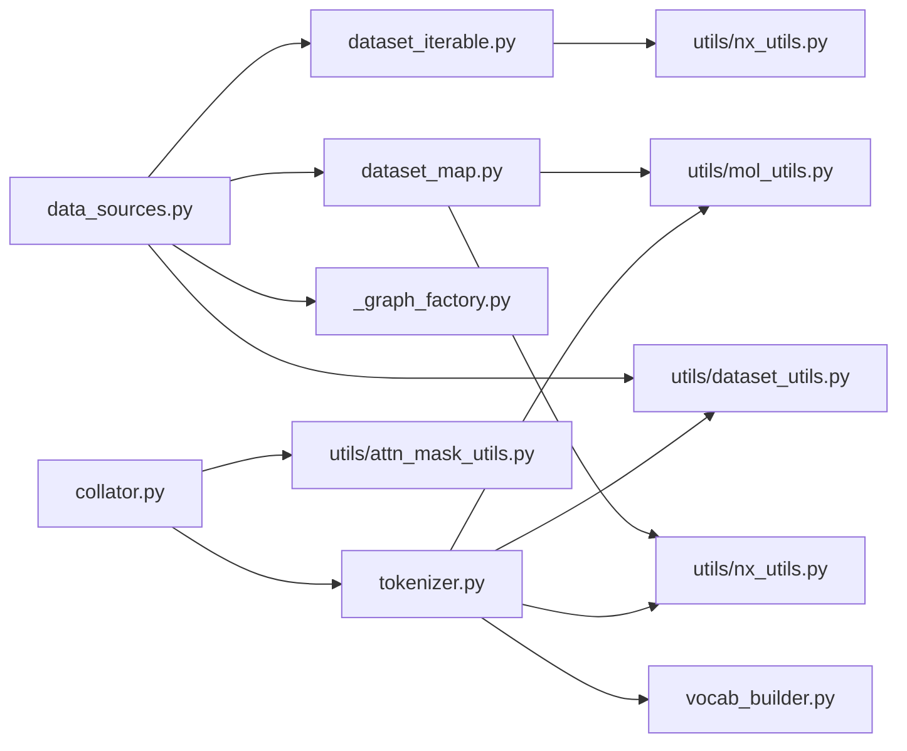

# Data Loading

<cite>
**Referenced Files in This Document**
- [data_sources.py](file://src/data/data_sources.py)
- [dataset_iterable.py](file://src/data/dataset_iterable.py)
- [collator.py](file://src/data/collator.py)
- [dataset_map.py](file://src/data/dataset_map.py)
- [_graph_factory.py](file://src/data/_graph_factory.py)
- [tokenizer.py](file://src/data/tokenizer.py)
- [vocab_builder.py](file://src/data/vocab_builder.py)
- [node_level.py](file://src/data/_readers/node_level.py)
- [edge_level.py](file://src/data/_readers/edge_level.py)
- [pcqm4mv2.py](file://src/data/_readers/pcqm4mv2.py)
- [dataset_utils.py](file://src/utils/dataset_utils.py)
</cite>

## Table of Contents
1. [Introduction](#introduction)
2. [Project Structure](#project-structure)
3. [Core Components](#core-components)
4. [Architecture Overview](#architecture-overview)
5. [Detailed Component Analysis](#detailed-component-analysis)
6. [Dependency Analysis](#dependency-analysis)
7. [Performance Considerations](#performance-considerations)
8. [Troubleshooting Guide](#troubleshooting-guide)
9. [Conclusion](#conclusion)

## Introduction
This document explains the Graph-GPT data loading utilities with a focus on efficient pipeline construction, prefetching, batching, and memory management. It covers:
- Data source integration (local OGB datasets, synthetic graphs, Alibaba ODPS tables)
- Sampling strategies for nodes, edges, and whole graphs
- Tokenization and batching via a dedicated collator
- Prefetching and parallelism via PyTorch DataLoader
- Memory-efficient processing and distribution-aware slicing
- Practical optimization tips and troubleshooting

## Project Structure
The data-loading stack is organized around:
- Registry-driven dataset readers for graph/node/link tasks
- Map-style and iterable datasets for sampling and streaming
- Tokenizer and collator for transforming graphs to token sequences and batching
- Helpers for vocabulary building and dataset utilities

**Diagram sources**
- [data_sources.py:1-413](file://src/data/data_sources.py#L1-L413)
- [dataset_map.py:1-1480](file://src/data/dataset_map.py#L1-L1480)
- [dataset_iterable.py:1-449](file://src/data/dataset_iterable.py#L1-L449)
- [_graph_factory.py:1-160](file://src/data/_graph_factory.py#L1-L160)
- [tokenizer.py:1-800](file://src/data/tokenizer.py#L1-L800)
- [collator.py:1-134](file://src/data/collator.py#L1-L134)
- [vocab_builder.py:1-219](file://src/data/vocab_builder.py#L1-L219)
- [node_level.py:1-369](file://src/data/_readers/node_level.py#L1-L369)
- [edge_level.py:1-381](file://src/data/_readers/edge_level.py#L1-L381)
- [pcqm4mv2.py:1-488](file://src/data/_readers/pcqm4mv2.py#L1-L488)

**Section sources**
- [data_sources.py:1-413](file://src/data/data_sources.py#L1-L413)
- [dataset_map.py:1-1480](file://src/data/dataset_map.py#L1-L1480)
- [dataset_iterable.py:1-449](file://src/data/dataset_iterable.py#L1-L449)
- [_graph_factory.py:1-160](file://src/data/_graph_factory.py#L1-L160)
- [tokenizer.py:1-800](file://src/data/tokenizer.py#L1-L800)
- [collator.py:1-134](file://src/data/collator.py#L1-L134)
- [vocab_builder.py:1-219](file://src/data/vocab_builder.py#L1-L219)
- [node_level.py:1-369](file://src/data/_readers/node_level.py#L1-L369)
- [edge_level.py:1-381](file://src/data/_readers/edge_level.py#L1-L381)
- [pcqm4mv2.py:1-488](file://src/data/_readers/pcqm4mv2.py#L1-L488)

## Core Components
- Registry-driven readers: Centralized registration of dataset readers for graph/node/link tasks and ODPS tables.
- Map-style datasets: Local datasets transformed into subgraphs or random samples with configurable sampling strategies.
- Iterable datasets: Streaming sources for synthetic graphs and ODPS tables with worker-aware slicing and prefetching.
- Tokenizer and collator: Convert graphs to token sequences and batch them with dynamic padding and attention masks.
- Vocabulary builder: Construct token vocabularies from dataset features and structure templates.

Key responsibilities:
- data_sources.py: Registers readers and orchestrates dataset splits and permutations.
- dataset_map.py: Implements sampling strategies (node/edge ego-k-hop, random, METIS partitioning) and ensembles.
- dataset_iterable.py: Provides iterable datasets for streaming and ODPS table access.
- tokenizer.py: Encodes graphs into token sequences with structure and semantics.
- collator.py: Pads and batches tokenized features with attention masks and boundary masking support.
- vocab_builder.py: Builds and caches vocabularies for structure and semantics.
- _readers/*: Task-specific readers for node/link/graph-level datasets.

**Section sources**
- [data_sources.py:1-413](file://src/data/data_sources.py#L1-L413)
- [dataset_map.py:1-1480](file://src/data/dataset_map.py#L1-L1480)
- [dataset_iterable.py:1-449](file://src/data/dataset_iterable.py#L1-L449)
- [tokenizer.py:1-800](file://src/data/tokenizer.py#L1-L800)
- [collator.py:1-134](file://src/data/collator.py#L1-L134)
- [vocab_builder.py:1-219](file://src/data/vocab_builder.py#L1-L219)
- [node_level.py:1-369](file://src/data/_readers/node_level.py#L1-L369)
- [edge_level.py:1-381](file://src/data/_readers/edge_level.py#L1-L381)
- [pcqm4mv2.py:1-488](file://src/data/_readers/pcqm4mv2.py#L1-L488)

## Architecture Overview
The data pipeline integrates readers, samplers, tokenization, and batching:

**Diagram sources**
- [data_sources.py:1-413](file://src/data/data_sources.py#L1-L413)
- [dataset_map.py:1172-1480](file://src/data/dataset_map.py#L1172-L1480)
- [dataset_iterable.py:134-449](file://src/data/dataset_iterable.py#L134-L449)
- [tokenizer.py:585-612](file://src/data/tokenizer.py#L585-L612)
- [collator.py:70-111](file://src/data/collator.py#L70-L111)

## Detailed Component Analysis

### Registry and Readers
- Central registry in data_sources.py registers readers for:
  - Graph-level datasets (e.g., OGB, PCQM4Mv2, structure)
  - Node/link-level datasets (e.g., OGBN, OGBL)
  - ODPS tables (streaming)
- _graph_factory.py defines DatasetSpec records and a generic reader that applies splits, transforms, and permutation flags consistently.

**Diagram sources**
- [_graph_factory.py:19-160](file://src/data/_graph_factory.py#L19-L160)

**Section sources**
- [data_sources.py:193-290](file://src/data/data_sources.py#L193-L290)
- [_graph_factory.py:50-160](file://src/data/_graph_factory.py#L50-L160)

### Map-Style Datasets and Sampling Strategies
- GraphsMapDataset: Loads subgraphs from InMemoryDataset with optional node permutation, probabilistic sampling, and distribution shifting.
- EnsembleGraphsMapDataset: Merges multiple GraphsMapDataset instances.
- ShaDowKHopSeqMapDataset: Ego-k-hop sampling around a node with configurable depth and neighbors.
- ShaDowKHopSeqFromEdgesMapDataset: Link prediction sampling around a node pair with negative sampling strategies.
- RandomNodesMapDataset and RandomEdgesMapDataset: Random sampling strategies for nodes/edges.
- EnsembleNodesEdgesMapDataset: Randomly selects among configured strategies.

**Diagram sources**
- [dataset_map.py:1172-1480](file://src/data/dataset_map.py#L1172-L1480)

**Section sources**
- [dataset_map.py:1172-1480](file://src/data/dataset_map.py#L1172-L1480)

### Iterable Datasets and ODPS Integration
- GraphsIterableDataset: Infinite generator of random graphs with configurable node/edge distributions.
- OdpsTableIterableDataset: Reads ODPS table rows, decodes base64-encoded tensors, supports worker-aware slicing and per-worker shuffling across epochs.
- OdpsTableIterableDatasetOneID: Similar to above with a simplified schema.

**Diagram sources**
- [dataset_iterable.py:295-449](file://src/data/dataset_iterable.py#L295-L449)

**Section sources**
- [dataset_iterable.py:134-449](file://src/data/dataset_iterable.py#L134-L449)

### Tokenization and Batching
- GSTTokenizer: Converts graphs to token sequences, decorates nodes/edges with structure and semantics, and prepares inputs for tasks.
- DataCollatorForGST: Dynamically pads token sequences, computes attention masks, and supports boundary masking and variable-length sequences.

**Diagram sources**
- [tokenizer.py:425-612](file://src/data/tokenizer.py#L425-L612)
- [collator.py:70-111](file://src/data/collator.py#L70-L111)

**Section sources**
- [tokenizer.py:1-800](file://src/data/tokenizer.py#L1-L800)
- [collator.py:1-134](file://src/data/collator.py#L1-L134)

### Vocabulary Building
- vocab_builder.py constructs structure and semantics vocabularies, supports caching, and handles special tokens and reserved identifiers.

**Section sources**
- [vocab_builder.py:1-219](file://src/data/vocab_builder.py#L1-L219)

### Task-Specific Readers
- Node-level readers (OGBN Products, ArXiv, Papers100M, Proteins) apply preprocessing and split handling.
- Edge-level readers (OGBL PPA, Citation2, WikiKG2, DDI) handle link prediction with negative sampling and reformatted edges.
- PCQM4Mv2 reader integrates molecular datasets with optional 3D positions and special handling for large molecules.

**Section sources**
- [node_level.py:1-369](file://src/data/_readers/node_level.py#L1-L369)
- [edge_level.py:1-381](file://src/data/_readers/edge_level.py#L1-L381)
- [pcqm4mv2.py:1-488](file://src/data/_readers/pcqm4mv2.py#L1-L488)

## Dependency Analysis
- data_sources.py depends on:
  - dataset_map.py for map-style datasets
  - dataset_iterable.py for iterable datasets
  - _graph_factory.py for graph-level spec-driven readers
  - utils.dataset_utils for dataset utilities
- dataset_map.py depends on:
  - torch_geometric for Data and sparse ops
  - utils.nx_utils for node permutation and graph utilities
  - utils.mol_utils for molecular utilities
- dataset_iterable.py depends on:
  - common_io for ODPS table access
  - utils.nx_utils for node permutation
- tokenizer.py depends on:
  - vocab_builder for vocabulary
  - utils for graph2path, tokenization helpers, and task preparation
- collator.py depends on:
  - tokenizer for tokenization and padding
  - utils.attn_mask_utils for boundary masking

**Diagram sources**
- [data_sources.py:1-413](file://src/data/data_sources.py#L1-L413)
- [dataset_map.py:1-1480](file://src/data/dataset_map.py#L1-L1480)
- [dataset_iterable.py:1-449](file://src/data/dataset_iterable.py#L1-L449)
- [_graph_factory.py:1-160](file://src/data/_graph_factory.py#L1-L160)
- [tokenizer.py:1-800](file://src/data/tokenizer.py#L1-L800)
- [collator.py:1-134](file://src/data/collator.py#L1-L134)
- [vocab_builder.py:1-219](file://src/data/vocab_builder.py#L1-L219)
- [dataset_utils.py:1-800](file://src/utils/dataset_utils.py#L1-L800)

**Section sources**
- [data_sources.py:1-413](file://src/data/data_sources.py#L1-L413)
- [dataset_map.py:1-1480](file://src/data/dataset_map.py#L1-L1480)
- [dataset_iterable.py:1-449](file://src/data/dataset_iterable.py#L1-L449)
- [_graph_factory.py:1-160](file://src/data/_graph_factory.py#L1-L160)
- [tokenizer.py:1-800](file://src/data/tokenizer.py#L1-L800)
- [collator.py:1-134](file://src/data/collator.py#L1-L134)
- [vocab_builder.py:1-219](file://src/data/vocab_builder.py#L1-L219)
- [dataset_utils.py:1-800](file://src/utils/dataset_utils.py#L1-L800)

## Performance Considerations
- Prefetching and parallelism
  - Iterable datasets use worker-aware slicing and per-worker shuffling to avoid duplicates across workers.
  - ODPS readers configure thread counts and buffer capacities to balance throughput and memory.
  - Map-style datasets support probabilistic sampling and distribution shifting to improve training stability.
- Memory management
  - GraphsMapDataset separates graphs efficiently using slice indices and supports optional node permutation.
  - Iterable datasets stream data to avoid loading entire datasets into memory.
  - Tokenization pads sequences to multiples of a configurable value to improve GPU utilization.
- Batching strategies
  - Dynamic padding with attention masks ensures minimal wasted computation.
  - Boundary masking reduces overhead for long sequences.
- Parallel processing
  - Multiple workers in DataLoader can increase throughput; ensure unique seeds per epoch for reproducibility.
  - For ODPS, per-worker mapping randomizes read order across epochs.

[No sources needed since this section provides general guidance]

## Troubleshooting Guide
Common issues and resolutions:
- ODPS OutOfRange exceptions
  - Ensure correct slice ranges and worker assignments; verify table metadata and row counts.
  - Check skipped samples per worker and adjust accordingly.
- Zero-edge subgraphs in link prediction
  - Enable allow_zero_edges to handle isolated nodes; inspect edge masks and target removal logic.
- Inconsistent node counts between SMILES and SDF
  - Align coordinate files with processed graphs; fill missing positions with zeros for test sets.
- Large vocab or slow vocabulary building
  - Use cached vocab files; restrict world identifiers for molecule datasets.
- Memory spikes during tokenization
  - Reduce max_length or pad_to_multiple_of; disable packed sequences if needed.

**Section sources**
- [dataset_iterable.py:333-383](file://src/data/dataset_iterable.py#L333-L383)
- [dataset_map.py:474-553](file://src/data/dataset_map.py#L474-L553)
- [dataset_utils.py:667-710](file://src/utils/dataset_utils.py#L667-L710)
- [vocab_builder.py:188-219](file://src/data/vocab_builder.py#L188-L219)

## Conclusion
Graph-GPT’s data loading stack combines registry-driven readers, flexible sampling strategies, robust tokenization, and efficient batching to support large-scale graph pretraining and fine-tuning. By leveraging iterable datasets for streaming, map-style datasets for controlled sampling, and a configurable collator for batching, the system achieves high throughput and memory efficiency. Proper configuration of prefetching, parallelism, and vocabulary caching further optimizes performance, while built-in safeguards address common pitfalls in distributed and large-scale training.
