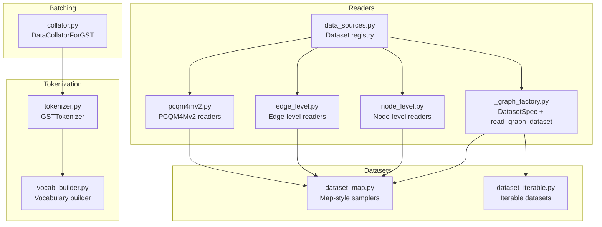
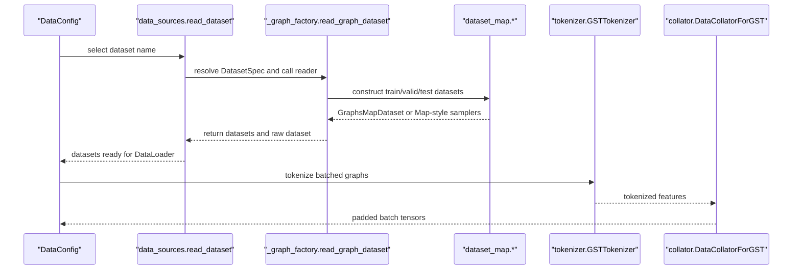
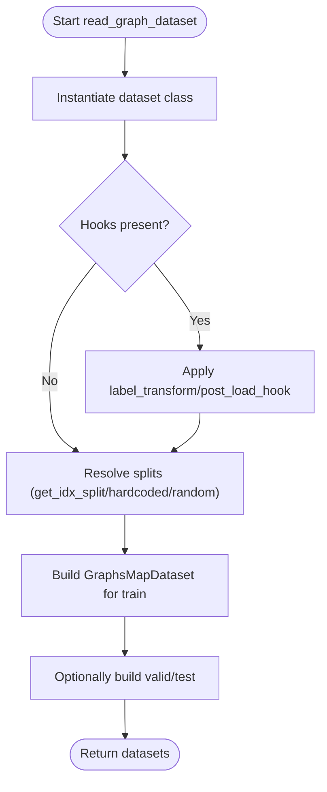
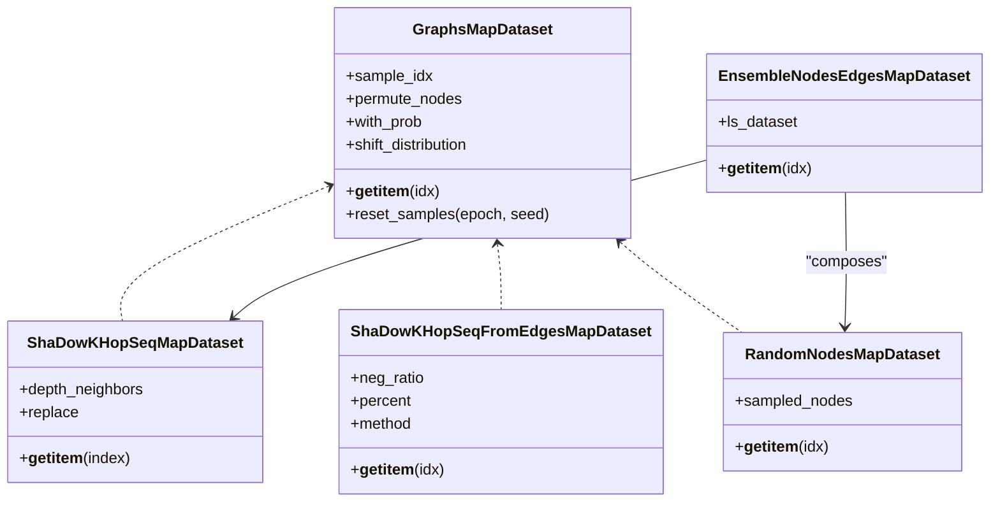
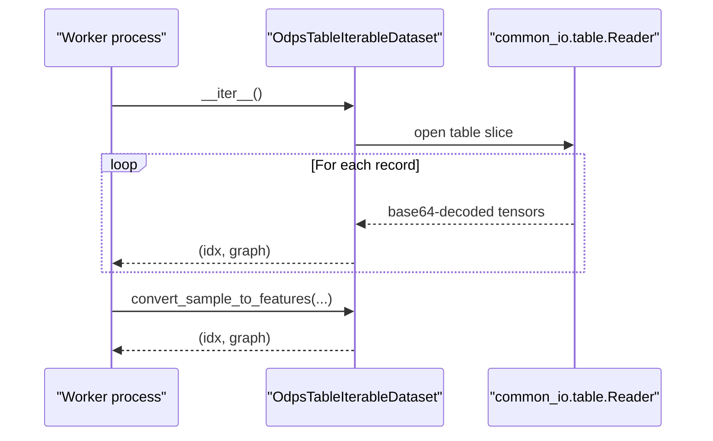
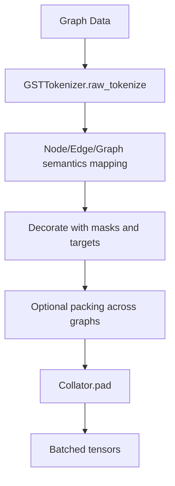
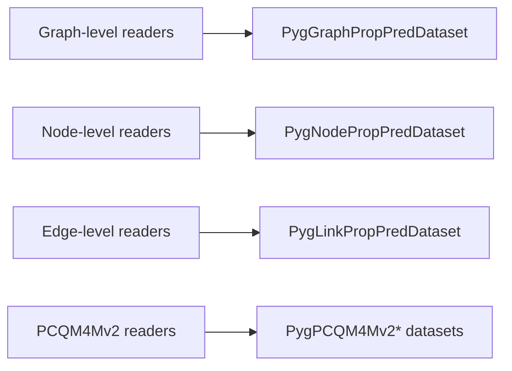
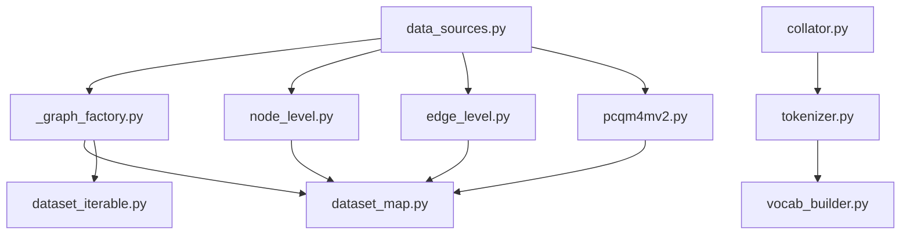

# Dataset Processing

<cite>
**Referenced Files in This Document**
- [src/data/__init__.py](file://src/data/__init__.py)
- [_graph_factory.py](file://src/data/_graph_factory.py)
- [collator.py](file://src/data/collator.py)
- [dataset_iterable.py](file://src/data/dataset_iterable.py)
- [dataset_map.py](file://src/data/dataset_map.py)
- [data_sources.py](file://src/data/data_sources.py)
- [tokenizer.py](file://src/data/tokenizer.py)
- [vocab_builder.py](file://src/data/vocab_builder.py)
- [dataset_utils.py](file://src/utils/dataset_utils.py)
- [pcqm4mv2.py](file://src/data/_readers/pcqm4mv2.py)
- [node_level.py](file://src/data/_readers/node_level.py)
- [edge_level.py](file://src/data/_readers/edge_level.py)
</cite>

## Table of Contents
1. [Introduction](#introduction)
2. [Project Structure](#project-structure)
3. [Core Components](#core-components)
4. [Architecture Overview](#architecture-overview)
5. [Detailed Component Analysis](#detailed-component-analysis)
6. [Dependency Analysis](#dependency-analysis)
7. [Performance Considerations](#performance-considerations)
8. [Troubleshooting Guide](#troubleshooting-guide)
9. [Conclusion](#conclusion)
10. [Appendices](#appendices)

## Introduction
This document explains the Graph-GPT dataset processing subsystem with a focus on data preprocessing, validation, and transformation operations. It covers dataset loading strategies across graph, node, and edge levels; data augmentation techniques; quality assurance checks; integration with diverse graph formats; batch processing utilities; and memory optimization techniques. Practical workflows, validation pipelines, and error handling strategies are included, along with guidance for optimizing performance on large-scale graph datasets and integrating with the main training pipeline.

## Project Structure
The dataset processing stack is organized around modular readers, dataset abstractions, tokenization, and batching utilities:
- Readers: graph-, node-, and edge-level readers encapsulate dataset-specific logic and transformations.
- Datasets: Map-style and iterable datasets support efficient sampling and streaming.
- Tokenization: Converts graphs into token sequences suitable for pretraining and finetuning.
- Collation: Pads and batches tokenized sequences for training.
- Utilities: Vocabulary building, molecular preprocessing, and graph manipulation helpers.

**Diagram sources**
- [data_sources.py:26-289](file://src/data/data_sources.py#L26-L289)
- [_graph_factory.py:50-101](file://src/data/_graph_factory.py#L50-L101)
- [node_level.py:27-369](file://src/data/_readers/node_level.py#L27-L369)
- [edge_level.py:27-381](file://src/data/_readers/edge_level.py#L27-L381)
- [pcqm4mv2.py:18-234](file://src/data/_readers/pcqm4mv2.py#L18-L234)
- [dataset_map.py:1172-1480](file://src/data/dataset_map.py#L1172-L1480)
- [dataset_iterable.py:18-449](file://src/data/dataset_iterable.py#L18-L449)
- [tokenizer.py:30-622](file://src/data/tokenizer.py#L30-L622)
- [vocab_builder.py:85-219](file://src/data/vocab_builder.py#L85-L219)
- [collator.py:22-134](file://src/data/collator.py#L22-L134)

**Section sources**
- [src/data/__init__.py:1-21](file://src/data/__init__.py#L1-L21)
- [data_sources.py:26-289](file://src/data/data_sources.py#L26-L289)

## Core Components
- DatasetSpec and generic reader: Declarative dataset descriptors and a unified reader that constructs train/validation/test splits and applies hooks.
- Map-style samplers: Localized subgraph sampling (node/edge ego, random node/edge, METIS partitioning) and graph-level shuffling with optional permutation and distribution shifting.
- Iterable datasets: Streaming from large tables and synthetic graphs for infinite training loops.
- Tokenizer and collator: Convert graphs to token sequences, apply masking and padding, and assemble batches.
- Readers: Graph-level (e.g., OGB datasets), node-level (e.g., ogbn-*), edge-level (e.g., ogbl-*), and specialized datasets (e.g., PCQM4Mv2).

Key responsibilities:
- Data loading and split management
- Augmentation via node permutation and subgraph sampling
- Quality checks (e.g., connectedness, self-loops, directedness)
- Vocabulary construction and tokenization
- Batch padding and attention masking

**Section sources**
- [_graph_factory.py:19-160](file://src/data/_graph_factory.py#L19-L160)
- [dataset_map.py:1172-1480](file://src/data/dataset_map.py#L1172-L1480)
- [dataset_iterable.py:18-449](file://src/data/dataset_iterable.py#L18-L449)
- [tokenizer.py:30-622](file://src/data/tokenizer.py#L30-L622)
- [collator.py:22-134](file://src/data/collator.py#L22-L134)
- [data_sources.py:46-289](file://src/data/data_sources.py#L46-L289)

## Architecture Overview
The dataset pipeline integrates readers, samplers, tokenization, and batching to feed the model efficiently.

**Diagram sources**
- [data_sources.py:26-289](file://src/data/data_sources.py#L26-L289)
- [_graph_factory.py:50-101](file://src/data/_graph_factory.py#L50-L101)
- [dataset_map.py:1172-1480](file://src/data/dataset_map.py#L1172-L1480)
- [tokenizer.py:585-612](file://src/data/tokenizer.py#L585-L612)
- [collator.py:70-111](file://src/data/collator.py#L70-L111)

## Detailed Component Analysis

### Graph-Level Reader and Split Management
- DatasetSpec defines dataset class, constructor arguments, split strategy, pretraining/finetuning flags, and hooks.
- Generic reader loads the dataset, applies label transforms and post-load hooks, and builds train/valid/test splits or pretraining-only sets.
- Split strategies include OGB-provided indices, hardcoded slices, and random splits with seeds.

**Diagram sources**
- [_graph_factory.py:50-137](file://src/data/_graph_factory.py#L50-L137)

**Section sources**
- [_graph_factory.py:19-160](file://src/data/_graph_factory.py#L19-L160)
- [data_sources.py:193-267](file://src/data/data_sources.py#L193-L267)

### Map-Style Samplers and Data Augmentation
- Node/edge ego sampling: Localized subgraphs around seed nodes/edges with configurable depth and neighbor counts; supports negative sampling for link prediction.
- Random node/edge sampling: Uniform random selection of nodes or edges to form subgraphs.
- METIS partitioning: Clusters large graphs into subgraphs with balanced node counts.
- GraphsMapDataset: Shuffles and samples graphs; supports node permutation, weighted sampling by Eulerian path counts, and distribution shifting toward target node-size distributions.

**Diagram sources**
- [dataset_map.py:1172-1480](file://src/data/dataset_map.py#L1172-L1480)

**Section sources**
- [dataset_map.py:33-130](file://src/data/dataset_map.py#L33-L130)
- [dataset_map.py:132-268](file://src/data/dataset_map.py#L132-L268)
- [dataset_map.py:271-553](file://src/data/dataset_map.py#L271-L553)
- [dataset_map.py:803-987](file://src/data/dataset_map.py#L803-L987)
- [dataset_map.py:990-1089](file://src/data/dataset_map.py#L990-L1089)
- [dataset_map.py:1092-1170](file://src/data/dataset_map.py#L1092-L1170)
- [dataset_map.py:1172-1480](file://src/data/dataset_map.py#L1172-L1480)

### Iterable Datasets and Large-Scale Streaming
- Iterable datasets support streaming from large tables and synthetic graphs, enabling infinite training loops and worker-aware slicing.
- ODPS table readers decode binary-encoded features and optionally permute node IDs.

**Diagram sources**
- [dataset_iterable.py:295-383](file://src/data/dataset_iterable.py#L295-L383)
- [dataset_iterable.py:390-430](file://src/data/dataset_iterable.py#L390-L430)

**Section sources**
- [dataset_iterable.py:18-132](file://src/data/dataset_iterable.py#L18-L132)
- [dataset_iterable.py:295-383](file://src/data/dataset_iterable.py#L295-L383)
- [dataset_iterable.py:390-430](file://src/data/dataset_iterable.py#L390-L430)

### Tokenization and Vocabulary
- GSTTokenizer converts graphs to token sequences, decorates nodes/edges/graphs with structure and semantics, and prepares inputs for tasks.
- Collator pads sequences, builds attention masks, and supports dynamic masking ratios during training.
- Vocabulary builder constructs structure and semantics vocabularies, with caching and merging strategies for molecule datasets.

**Diagram sources**
- [tokenizer.py:425-535](file://src/data/tokenizer.py#L425-L535)
- [tokenizer.py:585-612](file://src/data/tokenizer.py#L585-L612)
- [collator.py:70-111](file://src/data/collator.py#L70-L111)
- [vocab_builder.py:85-110](file://src/data/vocab_builder.py#L85-L110)

**Section sources**
- [tokenizer.py:30-622](file://src/data/tokenizer.py#L30-L622)
- [collator.py:22-134](file://src/data/collator.py#L22-L134)
- [vocab_builder.py:188-219](file://src/data/vocab_builder.py#L188-L219)

### Readers for Different Graph Formats
- Graph-level readers: OGB graph property prediction datasets, with optional label transforms and post-load hooks.
- Node-level readers: OGB node property prediction datasets (products, arxiv, papers100M, proteins), with preprocessing steps (e.g., undirected edges, global/local node ID encoding).
- Edge-level readers: OGB link property prediction datasets (ppa, citation2, wikikg2, ddi), with edge reformatting and negative sampling strategies.
- PCQM4Mv2 readers: Specialized handling for molecular datasets, including deduplication, large-molecule test selection, and optional addition of auxiliary datasets.

**Diagram sources**
- [data_sources.py:193-267](file://src/data/data_sources.py#L193-L267)
- [node_level.py:27-369](file://src/data/_readers/node_level.py#L27-L369)
- [edge_level.py:27-381](file://src/data/_readers/edge_level.py#L27-L381)
- [pcqm4mv2.py:18-234](file://src/data/_readers/pcqm4mv2.py#L18-L234)

**Section sources**
- [data_sources.py:46-289](file://src/data/data_sources.py#L46-L289)
- [node_level.py:27-369](file://src/data/_readers/node_level.py#L27-L369)
- [edge_level.py:27-381](file://src/data/_readers/edge_level.py#L27-L381)
- [pcqm4mv2.py:18-234](file://src/data/_readers/pcqm4mv2.py#L18-L234)

## Dependency Analysis
- Coupling: Readers depend on dataset classes and samplers; samplers depend on PyG sparse ops and graph utilities; tokenization depends on vocabulary and graph2path utilities.
- Cohesion: Each reader module encapsulates dataset-specific logic (e.g., edge reformatting, negative sampling).
- External dependencies: OGB, PyG, NetworkX, RDKit, common_io for ODPS.

**Diagram sources**
- [data_sources.py:26-289](file://src/data/data_sources.py#L26-L289)
- [_graph_factory.py:50-101](file://src/data/_graph_factory.py#L50-L101)
- [dataset_map.py:1172-1480](file://src/data/dataset_map.py#L1172-L1480)
- [dataset_iterable.py:18-449](file://src/data/dataset_iterable.py#L18-L449)
- [tokenizer.py:30-622](file://src/data/tokenizer.py#L30-L622)
- [vocab_builder.py:85-110](file://src/data/vocab_builder.py#L85-L110)
- [collator.py:22-134](file://src/data/collator.py#L22-L134)

**Section sources**
- [data_sources.py:26-289](file://src/data/data_sources.py#L26-L289)
- [dataset_map.py:1172-1480](file://src/data/dataset_map.py#L1172-L1480)
- [tokenizer.py:30-622](file://src/data/tokenizer.py#L30-L622)

## Performance Considerations
- Memory optimization:
  - Use GraphsMapDataset with provide_sampler and with_prob to sample proportionally to graph sizes (Eulerian path counts).
  - Use shift_distribution to align training graph sizes with a target distribution, reducing tail effects.
  - Prefer Iterable datasets for large tables to avoid loading entire datasets into memory.
- Speed optimization:
  - Use torch-sparse ops for localized subgraph extraction (e.g., ego-k-hop sampling).
  - Use ClusterData/METIS partitioning for large graphs to reduce memory footprint.
  - Parallel preprocessing with multiprocessing pools for molecular datasets.
- Batch processing:
  - Dynamic padding with pad_to_multiple_of and max_length to improve throughput.
  - Attention mask boundary masking computed only when requested to reduce overhead.

[No sources needed since this section provides general guidance]

## Troubleshooting Guide
Common issues and strategies:
- Incompatible graph formats:
  - Ensure edges are undirected when required (e.g., node-level datasets).
  - Remove self-loops and handle duplicates appropriately.
- Zero-edge subgraphs:
  - Edge-level samplers support allow_zero_edges to handle isolated nodes gracefully.
- Vocabulary mismatches:
  - Build vocab with merged molecule features when needed; cache vocab for reproducibility.
- Large-molecule bias:
  - Use distribution shifting or large-molecule test selection to mitigate bias in PCQM4Mv2.
- ODPS table decoding:
  - Verify base64 decoding and tensor shapes; ensure edge/node dimensions match configuration.

**Section sources**
- [node_level.py:38-54](file://src/data/_readers/node_level.py#L38-L54)
- [edge_level.py:124-132](file://src/data/_readers/edge_level.py#L124-L132)
- [pcqm4mv2.py:371-379](file://src/data/_readers/pcqm4mv2.py#L371-L379)
- [vocab_builder.py:188-219](file://src/data/vocab_builder.py#L188-L219)
- [dataset_iterable.py:390-430](file://src/data/dataset_iterable.py#L390-L430)

## Conclusion
The Graph-GPT dataset processing subsystem provides a robust, modular framework for loading, transforming, and batching heterogeneous graph data. It supports diverse graph formats, sophisticated sampling strategies, and efficient tokenization pipelines. With built-in quality checks, memory optimization, and performance-conscious design, it scales to large datasets while maintaining flexibility for research and production workloads.

[No sources needed since this section summarizes without analyzing specific files]

## Appendices

### Example Workflows

- Graph-level pretraining:
  - Register a DatasetSpec and use the generic reader to load train/valid/test splits.
  - Wrap datasets with GraphsMapDataset for shuffled sampling and optional node permutation.
  - Tokenize with GSTTokenizer and collate with DataCollatorForGST.

- Node-level finetuning:
  - Use node-level readers to preprocess graphs (e.g., undirected edges, global-local node IDs).
  - Sample subgraphs via ShaDowKHopSeqMapDataset and EnsembleNodesEdgesMapDataset.
  - Tokenize and batch as above.

- Edge-level link prediction:
  - Use edge-level readers to reformat edges and generate negative samples.
  - Employ ShaDowKHopSeqFromEdgesMapDataset with configurable negative ratio and sampling method.

- Large-scale streaming:
  - Use ODPS iterable datasets to stream from tables with worker-aware slicing and base64 decoding.

[No sources needed since this section provides general guidance]
