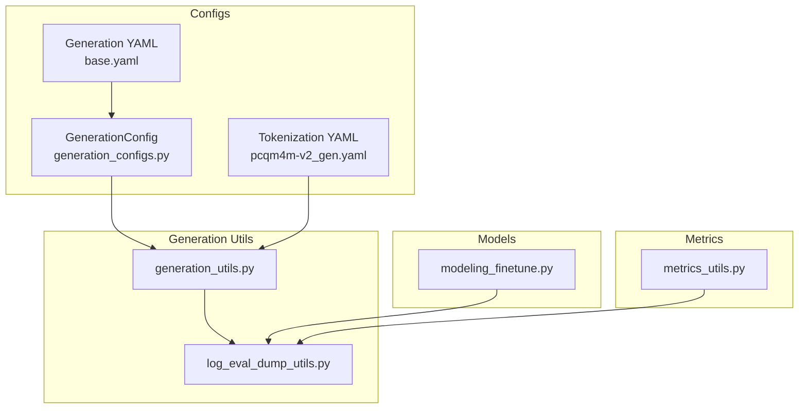
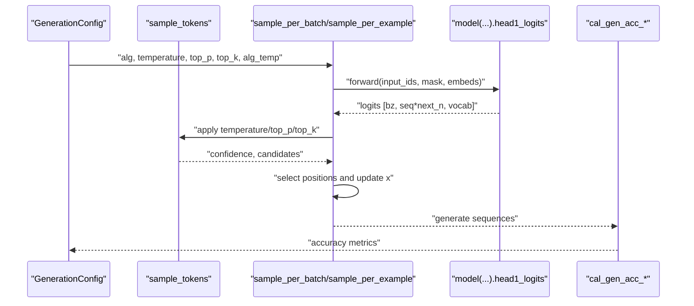
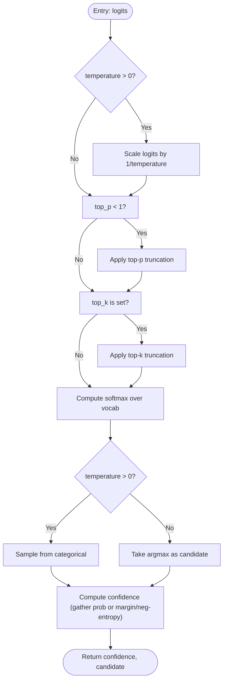
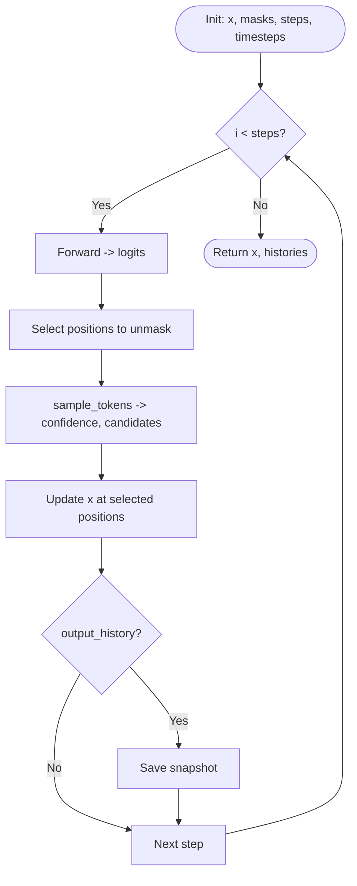
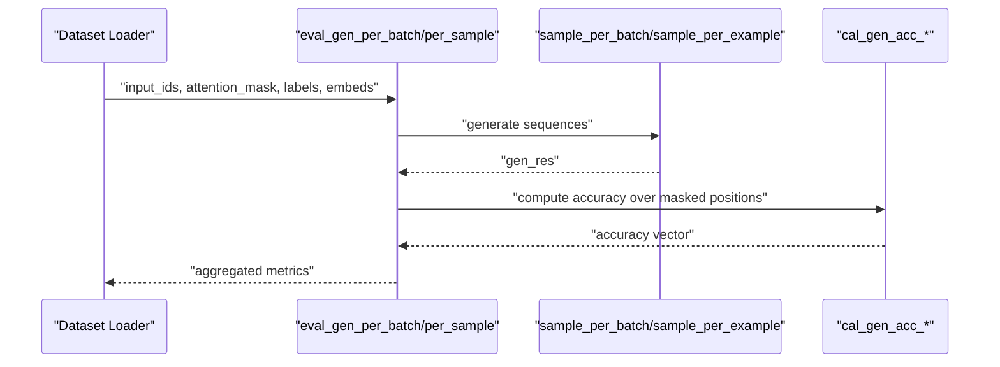
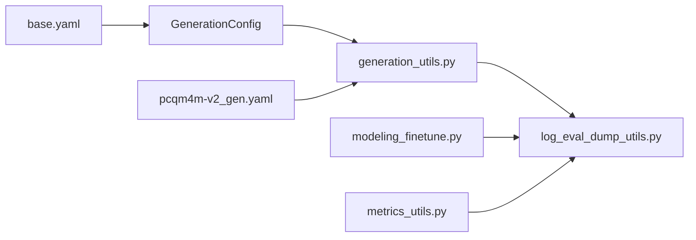

# Generation Tools

<cite>
**Referenced Files in This Document**
- [generation_utils.py](file://src/utils/generation_utils.py)
- [generation_configs.py](file://src/conf/generation/generation_configs.py)
- [base.yaml](file://configs/generation/base.yaml)
- [log_eval_dump_utils.py](file://src/utils/log_eval_dump_utils.py)
- [pcqm4m-v2_gen.yaml](file://configs/tokenization/graph_lvl/pcqm4m-v2_gen.yaml)
- [modeling_finetune.py](file://src/models/graphgpt/modeling_finetune.py)
- [metrics_utils.py](file://src/utils/metrics_utils.py)
- [base_configs.py](file://src/conf/base_configs.py)
</cite>

## Table of Contents
1. [Introduction](#introduction)
2. [Project Structure](#project-structure)
3. [Core Components](#core-components)
4. [Architecture Overview](#architecture-overview)
5. [Detailed Component Analysis](#detailed-component-analysis)
6. [Dependency Analysis](#dependency-analysis)
7. [Performance Considerations](#performance-considerations)
8. [Troubleshooting Guide](#troubleshooting-guide)
9. [Conclusion](#conclusion)
10. [Appendices](#appendices)

## Introduction
This document explains the Graph-GPT generation utilities that implement text generation strategies and sampling techniques for masked diffusion decoding. It covers generation algorithms, temperature scheduling, nucleus (top-p) and top-k sampling, confidence-based selection variants, and evaluation metrics. It also documents integration with model outputs, sequence decoding, and generation quality assessment, along with practical guidance for parameter tuning, performance optimization, debugging, and integration with evaluation pipelines.

## Project Structure
The generation system centers around:
- Generation configuration and runtime parameters
- Sampling and iterative decoding utilities
- Evaluation harnesses that integrate generation with accuracy metrics
- Tokenization configuration that defines special tokens used during generation

**Diagram sources**
- [generation_configs.py:26-97](file://src/conf/generation/generation_configs.py#L26-L97)
- [base.yaml:1-40](file://configs/generation/base.yaml#L1-L40)
- [pcqm4m-v2_gen.yaml:100-114](file://configs/tokenization/graph_lvl/pcqm4m-v2_gen.yaml#L100-L114)
- [generation_utils.py:44-463](file://src/utils/generation_utils.py#L44-L463)
- [log_eval_dump_utils.py:348-447](file://src/utils/log_eval_dump_utils.py#L348-L447)
- [modeling_finetune.py:714-756](file://src/models/graphgpt/modeling_finetune.py#L714-L756)
- [metrics_utils.py:16-90](file://src/utils/metrics_utils.py#L16-L90)

**Section sources**
- [generation_configs.py:26-97](file://src/conf/generation/generation_configs.py#L26-L97)
- [base.yaml:1-40](file://configs/generation/base.yaml#L1-L40)
- [pcqm4m-v2_gen.yaml:100-114](file://configs/tokenization/graph_lvl/pcqm4m-v2_gen.yaml#L100-L114)
- [generation_utils.py:44-463](file://src/utils/generation_utils.py#L44-L463)
- [log_eval_dump_utils.py:348-447](file://src/utils/log_eval_dump_utils.py#L348-L447)
- [modeling_finetune.py:714-756](file://src/models/graphgpt/modeling_finetune.py#L714-L756)
- [metrics_utils.py:16-90](file://src/utils/metrics_utils.py#L16-L90)

## Core Components
- GenerationConfig: Defines algorithm selection, temperature scheduling, nucleus/top-k sampling, step scheduling, and special token IDs.
- Sampling utilities: Implements top-p (nucleus) and top-k filtering, temperature scaling, and confidence-based selection variants (margin confidence and negative entropy).
- Iterative decoding: Performs masked diffusion decoding with configurable algorithms and stochastic/deterministic selection.
- Evaluation harness: Integrates generation with accuracy computation and optional history capture.

Key responsibilities:
- Parameter-driven decoding control via GenerationConfig
- Flexible sampling strategies via sample_tokens
- Batch-wise and example-wise decoding loops
- Accuracy metrics computed over masked positions

**Section sources**
- [generation_configs.py:26-97](file://src/conf/generation/generation_configs.py#L26-L97)
- [generation_utils.py:22-81](file://src/utils/generation_utils.py#L22-L81)
- [generation_utils.py:84-436](file://src/utils/generation_utils.py#L84-L436)
- [log_eval_dump_utils.py:348-447](file://src/utils/log_eval_dump_utils.py#L348-L447)

## Architecture Overview
The generation pipeline integrates configuration, sampling, iterative decoding, and evaluation.

**Diagram sources**
- [generation_utils.py:44-81](file://src/utils/generation_utils.py#L44-L81)
- [generation_utils.py:84-436](file://src/utils/generation_utils.py#L84-L436)
- [log_eval_dump_utils.py:387-447](file://src/utils/log_eval_dump_utils.py#L387-L447)

## Detailed Component Analysis

### GenerationConfig
Defines the decoding configuration:
- Algorithm selection: origin, maskgit_plus, topk_margin, entropy
- Temperature scheduling: temperature for token-level softmax, alg_temp for confidence-level Gumbel-max sampling
- Nucleus/top-k sampling: top_p and top_k
- Step scheduling: steps and eps for diffusion timesteps
- Output controls: output_history, num_return_sequences
- Special token IDs: mask_token_id, pad_token_id, bos_token_id, eos_token_id

Validation ensures supported algorithm values and non-negative temperature and positive steps.

**Section sources**
- [generation_configs.py:26-97](file://src/conf/generation/generation_configs.py#L26-L97)
- [base.yaml:6-40](file://configs/generation/base.yaml#L6-L40)

### Sampling Utilities
Implements:
- top_p_logits: cumulative probability truncation for nucleus sampling
- top_k_logits: hard cutoff at k-th largest probability
- sample_tokens: applies temperature scaling, top-p/top-k filtering, computes confidence (argmax by default; optionally margin confidence or negative entropy)

**Diagram sources**
- [generation_utils.py:22-81](file://src/utils/generation_utils.py#L22-L81)

**Section sources**
- [generation_utils.py:22-81](file://src/utils/generation_utils.py#L22-L81)

### Iterative Decoding Loops
Two decoding modes:
- sample_per_batch: vectorized decoding over batches with dynamic step counts and optional history capture
- sample_per_example: per-example decoding with explicit loop over steps

Both:
- Compute timesteps from 1 down to eps
- Select fraction of masked positions to unmask per step based on (1 - s/t)
- Apply selected algorithm and sampling strategy
- Update sequences in-place

Advanced algorithms:
- origin: uniform random masking with transfer probability
- maskgit_plus: confidence-based selection with optional Gumbel-max stochasticity via alg_temp
- topk_margin: margin confidence (top1 - top2)
- entropy: negative entropy confidence

**Diagram sources**
- [generation_utils.py:84-135](file://src/utils/generation_utils.py#L84-L135)
- [generation_utils.py:138-237](file://src/utils/generation_utils.py#L138-L237)
- [generation_utils.py:316-436](file://src/utils/generation_utils.py#L316-L436)

**Section sources**
- [generation_utils.py:84-135](file://src/utils/generation_utils.py#L84-L135)
- [generation_utils.py:138-237](file://src/utils/generation_utils.py#L138-L237)
- [generation_utils.py:316-436](file://src/utils/generation_utils.py#L316-L436)

### Confidence-Based Selection Variants
- Margin confidence: difference between top-1 and top-2 class probabilities
- Negative entropy: sum of p*log(p) across classes

These variants alter the confidence score used to rank masked positions for unmasking in advanced algorithms.

**Section sources**
- [generation_utils.py:70-81](file://src/utils/generation_utils.py#L70-L81)

### Generation Quality Metrics
- cal_gen_acc_per_sample: per-sample masked token accuracy
- cal_gen_acc_batch: per-batch masked token accuracy

Evaluation harness:
- eval_gen_per_batch: batch-wise generation and accuracy aggregation
- eval_gen_per_sample: per-sample generation and accuracy accumulation

**Diagram sources**
- [log_eval_dump_utils.py:387-447](file://src/utils/log_eval_dump_utils.py#L387-L447)
- [generation_utils.py:439-463](file://src/utils/generation_utils.py#L439-L463)

**Section sources**
- [log_eval_dump_utils.py:387-447](file://src/utils/log_eval_dump_utils.py#L387-L447)
- [generation_utils.py:439-463](file://src/utils/generation_utils.py#L439-L463)

### Integration with Model Outputs and Tokenization
- Model outputs: decoding consumes head1_logits for token predictions
- Tokenization: mask_token_id and other special tokens are configured via tokenization YAML and used to identify masked positions during decoding
- SMTP masking: during fine-tuning, additional masking schedules influence the initial masked distribution

**Section sources**
- [generation_utils.py:120-126](file://src/utils/generation_utils.py#L120-L126)
- [pcqm4m-v2_gen.yaml:100-114](file://configs/tokenization/graph_lvl/pcqm4m-v2_gen.yaml#L100-L114)
- [modeling_finetune.py:714-756](file://src/models/graphgpt/modeling_finetune.py#L714-L756)

## Dependency Analysis
- GenerationConfig drives behavior across generation_utils and evaluation utilities
- generation_utils depends on torch distributions and functional modules for sampling and masking
- log_eval_dump_utils orchestrates generation and accuracy computation
- Tokenization YAML supplies mask_token_id and other special tokens
- Metrics utilities support broader evaluation contexts

**Diagram sources**
- [generation_configs.py:26-97](file://src/conf/generation/generation_configs.py#L26-L97)
- [base.yaml:1-40](file://configs/generation/base.yaml#L1-L40)
- [pcqm4m-v2_gen.yaml:100-114](file://configs/tokenization/graph_lvl/pcqm4m-v2_gen.yaml#L100-L114)
- [generation_utils.py:84-436](file://src/utils/generation_utils.py#L84-L436)
- [log_eval_dump_utils.py:348-447](file://src/utils/log_eval_dump_utils.py#L348-L447)
- [modeling_finetune.py:714-756](file://src/models/graphgpt/modeling_finetune.py#L714-L756)
- [metrics_utils.py:16-90](file://src/utils/metrics_utils.py#L16-L90)

**Section sources**
- [generation_configs.py:26-97](file://src/conf/generation/generation_configs.py#L26-L97)
- [base.yaml:1-40](file://configs/generation/base.yaml#L1-L40)
- [pcqm4m-v2_gen.yaml:100-114](file://configs/tokenization/graph_lvl/pcqm4m-v2_gen.yaml#L100-L114)
- [generation_utils.py:84-436](file://src/utils/generation_utils.py#L84-L436)
- [log_eval_dump_utils.py:348-447](file://src/utils/log_eval_dump_utils.py#L348-L447)
- [modeling_finetune.py:714-756](file://src/models/graphgpt/modeling_finetune.py#L714-L756)
- [metrics_utils.py:16-90](file://src/utils/metrics_utils.py#L16-L90)

## Performance Considerations
- Prefer sample_per_batch for throughput when appropriate; it leverages vectorized operations and skips unnecessary inference when no tokens remain masked.
- Use alg_temp > 0 with maskgit_plus/topk_margin/entropy to enable stochastic selection; tune alg_temp to balance exploration and stability.
- Limit steps and eps to reduce computational cost; adjust based on dataset characteristics and desired completion rate.
- Enable output_history only when diagnosing generation dynamics; it increases memory usage.
- Ensure top_k and top_p are set appropriately to avoid overly uniform or greedy sampling that can degrade quality or increase variance.

[No sources needed since this section provides general guidance]

## Troubleshooting Guide
Common issues and remedies:
- Invalid algorithm: Ensure alg is one of origin, maskgit_plus, topk_margin, entropy.
- Negative temperature: temperature must be non-negative; alg_temp must be non-negative for Gumbel-based stochasticity.
- Zero steps: steps must be positive; otherwise, no decoding occurs.
- Incorrect input shapes: sample_per_batch expects 3D input_ids [bz, seq, next_n]; sample_per_example expects 2D [seq, next_n].
- Poor accuracy on masked positions: verify mask_token_id alignment with tokenizer configuration; confirm that labels reflect the masked positions.

Debugging tips:
- Inspect masked positions via mask_token_id and attention_mask to ensure proper identification of targets.
- Compare per-step accuracy vectors when output_history is enabled to detect early convergence or instability.
- Validate logits shape and vocabulary size match model outputs.

**Section sources**
- [generation_configs.py:81-97](file://src/conf/generation/generation_configs.py#L81-L97)
- [generation_utils.py:94-96](file://src/utils/generation_utils.py#L94-L96)
- [generation_utils.py:334](file://src/utils/generation_utils.py#L334)

## Conclusion
The Graph-GPT generation toolkit provides flexible, configurable masked diffusion decoding with robust sampling strategies. By combining temperature scaling, nucleus/top-k filtering, and confidence-based selection, it supports both deterministic and stochastic generation modes. Integrated evaluation utilities enable accurate quality assessment over masked positions, while configuration files offer straightforward parameter tuning across tasks.

[No sources needed since this section summarizes without analyzing specific files]

## Appendices

### Example Workflows
- Supervised fine-tuning evaluation with generation accuracy:
  - Use eval_gen_per_batch or eval_gen_per_sample to generate sequences and compute masked token accuracy.
  - Adjust alg, temperature, top_p, top_k, and alg_temp according to task needs.
- Tokenization alignment:
  - Ensure mask_token_id matches the tokenizer’s mask token to correctly identify masked positions.

**Section sources**
- [log_eval_dump_utils.py:348-447](file://src/utils/log_eval_dump_utils.py#L348-L447)
- [pcqm4m-v2_gen.yaml:100-114](file://configs/tokenization/graph_lvl/pcqm4m-v2_gen.yaml#L100-L114)

### Parameter Tuning Guidelines
- Origin algorithm: set temperature > 0 for stochasticity; top_p/top_k for controlled diversity.
- Advanced algorithms:
  - maskgit_plus: tune alg_temp for stochastic selection; top_p/top_k for filtering.
  - topk_margin: margin confidence improves discrimination between top choices.
  - entropy: negative entropy encourages low-uncertainty selections.
- Steps and eps: larger steps improve completion; smaller eps reduces noise at later stages.

**Section sources**
- [generation_configs.py:38-63](file://src/conf/generation/generation_configs.py#L38-L63)
- [base.yaml:6-40](file://configs/generation/base.yaml#L6-L40)
- [generation_utils.py:156-212](file://src/utils/generation_utils.py#L156-L212)
