# Inspection & Debugging

<cite>
**Referenced Files in This Document**
- [inspection_utils.py](file://src/utils/inspection_utils.py)
- [log_eval_dump_utils.py](file://src/utils/log_eval_dump_utils.py)
- [misc_utils.py](file://src/utils/misc_utils.py)
- [loader_utils.py](file://src/utils/loader_utils.py)
- [training_utils.py](file://src/utils/training_utils.py)
- [generation_utils.py](file://src/utils/generation_utils.py)
- [metrics_utils.py](file://src/utils/metrics_utils.py)
- [stats_configs.py](file://src/conf/stats_configs.py)
- [base_configs.py](file://src/conf/base_configs.py)
- [vis_utils.py](file://src/utils/vis_utils.py)
- [visualize.py](file://src/utils/visualize.py)
- [tokenizer.py](file://src/data/tokenizer.py)
- [pipeline.py](file://src/training/pipeline.py)
</cite>

## Table of Contents
1. [Introduction](#introduction)
2. [Project Structure](#project-structure)
3. [Core Components](#core-components)
4. [Architecture Overview](#architecture-overview)
5. [Detailed Component Analysis](#detailed-component-analysis)
6. [Dependency Analysis](#dependency-analysis)
7. [Performance Considerations](#performance-considerations)
8. [Troubleshooting Guide](#troubleshooting-guide)
9. [Conclusion](#conclusion)
10. [Appendices](#appendices)

## Introduction
This document focuses on inspection and debugging utilities for Graph-GPT, covering model analysis, performance monitoring, and troubleshooting workflows. It explains how to inspect tensors and model states, validate configurations, profile training, track memory and throughput, and integrate with logging systems. Practical debugging scenarios and best practices are included to help diagnose errors and optimize performance.

## Project Structure
The inspection and debugging ecosystem spans several modules:
- Utilities for inspection, logging, evaluation, and data loaders
- Configuration classes for training stats and runtime parameters
- Visualization helpers for graph structures
- Pipeline integration points for checkpoint loading and training loops

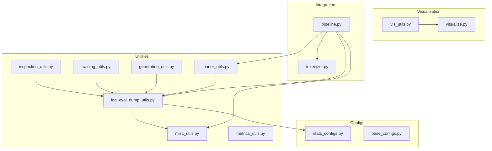

**Diagram sources**
- [inspection_utils.py:1-167](file://src/utils/inspection_utils.py#L1-L167)
- [log_eval_dump_utils.py:1-929](file://src/utils/log_eval_dump_utils.py#L1-L929)
- [misc_utils.py:1-540](file://src/utils/misc_utils.py#L1-L540)
- [loader_utils.py:1-752](file://src/utils/loader_utils.py#L1-L752)
- [training_utils.py:1-206](file://src/utils/training_utils.py#L1-L206)
- [generation_utils.py:1-464](file://src/utils/generation_utils.py#L1-L464)
- [metrics_utils.py:1-349](file://src/utils/metrics_utils.py#L1-L349)
- [stats_configs.py:1-158](file://src/conf/stats_configs.py#L1-L158)
- [base_configs.py:1-302](file://src/conf/base_configs.py#L1-L302)
- [vis_utils.py:1-31](file://src/utils/vis_utils.py#L1-L31)
- [visualize.py:1-233](file://src/utils/visualize.py#L1-L233)
- [tokenizer.py:116-156](file://src/data/tokenizer.py#L116-L156)
- [pipeline.py:149-177](file://src/training/pipeline.py#L149-L177)

**Section sources**
- [inspection_utils.py:1-167](file://src/utils/inspection_utils.py#L1-L167)
- [log_eval_dump_utils.py:1-929](file://src/utils/log_eval_dump_utils.py#L1-L929)
- [misc_utils.py:1-540](file://src/utils/misc_utils.py#L1-L540)
- [loader_utils.py:1-752](file://src/utils/loader_utils.py#L1-L752)
- [training_utils.py:1-206](file://src/utils/training_utils.py#L1-L206)
- [generation_utils.py:1-464](file://src/utils/generation_utils.py#L1-L464)
- [metrics_utils.py:1-349](file://src/utils/metrics_utils.py#L1-L349)
- [stats_configs.py:1-158](file://src/conf/stats_configs.py#L1-L158)
- [base_configs.py:1-302](file://src/conf/base_configs.py#L1-L302)
- [vis_utils.py:1-31](file://src/utils/vis_utils.py#L1-L31)
- [visualize.py:1-233](file://src/utils/visualize.py#L1-L233)
- [tokenizer.py:116-156](file://src/data/tokenizer.py#L116-L156)
- [pipeline.py:149-177](file://src/training/pipeline.py#L149-L177)

## Core Components
- Inspection utilities: trainable parameter counting, dataset sequence/node inspection, tokenization result inspection, and attribute value analysis.
- Logging and evaluation: training stats logging, evaluation routines, generation evaluation, and TensorBoard integration.
- Data loaders and samplers: deterministic and distributed sampling, loader initialization, and checkpoint loading helpers.
- Training utilities: batch training with AMP and gradient clipping, and debug prints for tensor shapes and slices.
- Metrics and comparisons: classification/regression metrics and best-result comparison logic.
- Visualization: NetworkX-based graph rendering and Plotly visualization.
- Configuration and stats: training stats, optimizer stats, EMA stats, and loader stats.

**Section sources**
- [inspection_utils.py:13-167](file://src/utils/inspection_utils.py#L13-L167)
- [log_eval_dump_utils.py:40-929](file://src/utils/log_eval_dump_utils.py#L40-L929)
- [misc_utils.py:69-540](file://src/utils/misc_utils.py#L69-L540)
- [loader_utils.py:17-752](file://src/utils/loader_utils.py#L17-L752)
- [training_utils.py:7-206](file://src/utils/training_utils.py#L7-L206)
- [metrics_utils.py:16-349](file://src/utils/metrics_utils.py#L16-L349)
- [vis_utils.py:9-31](file://src/utils/vis_utils.py#L9-L31)
- [visualize.py:13-233](file://src/utils/visualize.py#L13-L233)
- [stats_configs.py:15-158](file://src/conf/stats_configs.py#L15-L158)
- [base_configs.py:132-302](file://src/conf/base_configs.py#L132-L302)

## Architecture Overview
The inspection and debugging pipeline integrates training, evaluation, and logging with visualization and configuration management.

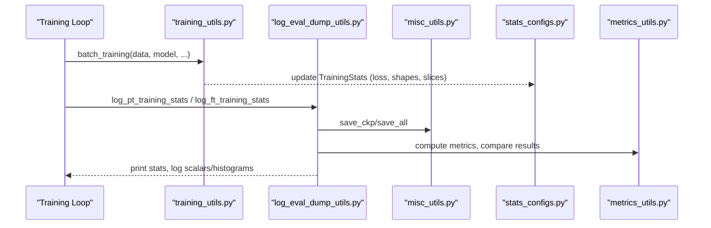

**Diagram sources**
- [training_utils.py:7-206](file://src/utils/training_utils.py#L7-L206)
- [log_eval_dump_utils.py:504-866](file://src/utils/log_eval_dump_utils.py#L504-L866)
- [misc_utils.py:69-205](file://src/utils/misc_utils.py#L69-L205)
- [stats_configs.py:29-92](file://src/conf/stats_configs.py#L29-L92)
- [metrics_utils.py:192-209](file://src/utils/metrics_utils.py#L192-L209)

## Detailed Component Analysis

### Inspection Utilities
Key capabilities:
- Trainable parameter reporting for model analysis and pruning checks.
- Dataset-level inspection for node counts and sequence lengths to tune batching and memory.
- Tokenization result inspection for debugging token packing, labels, and model inputs.
- Attribute value analysis for graph node/edge features.

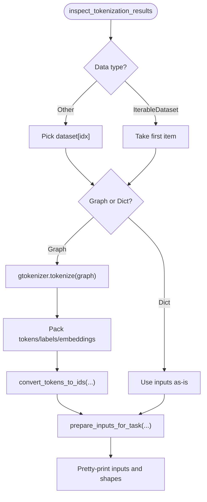

**Diagram sources**
- [inspection_utils.py:73-143](file://src/utils/inspection_utils.py#L73-L143)

**Section sources**
- [inspection_utils.py:13-167](file://src/utils/inspection_utils.py#L13-L167)

### Logging, Evaluation, and TensorBoard Integration
- Training stats logging: speed calculation, loss aggregation across GPUs, optional FLOPs/MACs recording via profiler.
- Evaluation routines: supervised fine-tuning and pre-training evaluation, generation evaluation with configurable algorithms.
- TensorBoard integration: scalar and histogram logging for parameters and losses.

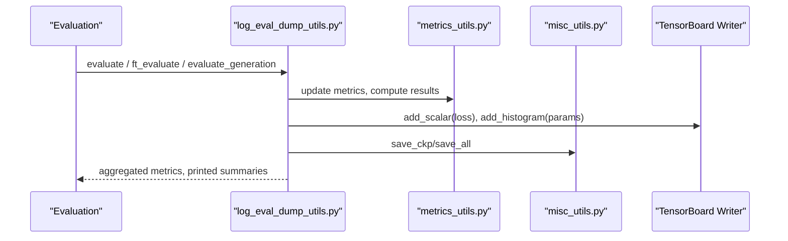

**Diagram sources**
- [log_eval_dump_utils.py:77-163](file://src/utils/log_eval_dump_utils.py#L77-L163)
- [log_eval_dump_utils.py:307-384](file://src/utils/log_eval_dump_utils.py#L307-L384)
- [log_eval_dump_utils.py:504-562](file://src/utils/log_eval_dump_utils.py#L504-L562)
- [metrics_utils.py:16-349](file://src/utils/metrics_utils.py#L16-L349)
- [misc_utils.py:124-176](file://src/utils/misc_utils.py#L124-L176)

**Section sources**
- [log_eval_dump_utils.py:40-929](file://src/utils/log_eval_dump_utils.py#L40-L929)
- [metrics_utils.py:16-349](file://src/utils/metrics_utils.py#L16-L349)
- [misc_utils.py:124-176](file://src/utils/misc_utils.py#L124-L176)

### Data Loaders and Samplers
- Deterministic and randomized sampling for reproducibility and distribution across ranks.
- Loader initialization for training/validation/test/inference with collation and worker seeding.
- Checkpoint loading helpers supporting PyTorch DDP and DeepSpeed ZeRO checkpoints.

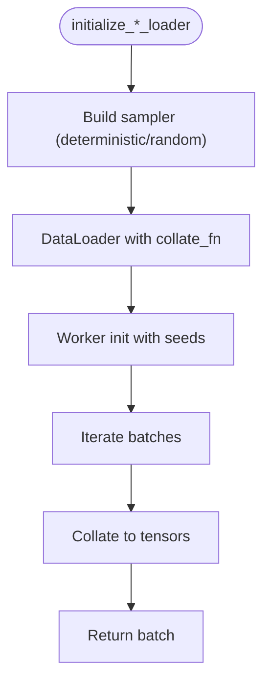

**Diagram sources**
- [loader_utils.py:445-480](file://src/utils/loader_utils.py#L445-L480)
- [loader_utils.py:610-644](file://src/utils/loader_utils.py#L610-L644)
- [loader_utils.py:176-220](file://src/utils/loader_utils.py#L176-L220)

**Section sources**
- [loader_utils.py:17-752](file://src/utils/loader_utils.py#L17-L752)
- [misc_utils.py:231-251](file://src/utils/misc_utils.py#L231-L251)

### Training Utilities and Debug Printing
- Batch training with AMP, gradient clipping, and optimizer steps.
- Debug prints for input shapes and a small slice of raw embeddings to detect anomalies early.

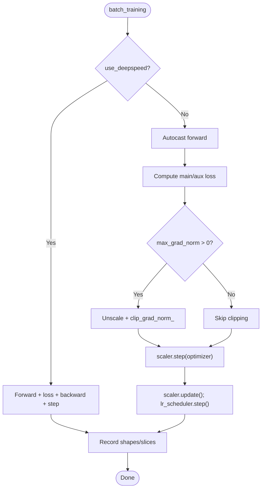

**Diagram sources**
- [training_utils.py:7-206](file://src/utils/training_utils.py#L7-L206)

**Section sources**
- [training_utils.py:7-206](file://src/utils/training_utils.py#L7-L206)

### Generation and Evaluation Utilities
- Sampling algorithms for generation: top-p, top-k, margin confidence, and entropy-based selection.
- Per-batch and per-sample generation evaluation with accuracy computation.

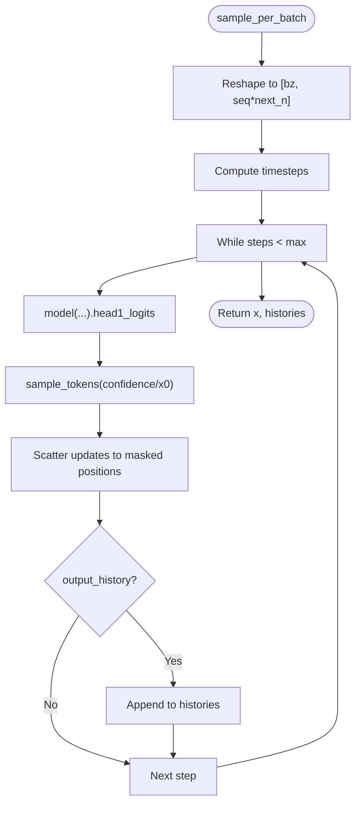

**Diagram sources**
- [generation_utils.py:84-136](file://src/utils/generation_utils.py#L84-L136)
- [generation_utils.py:439-464](file://src/utils/generation_utils.py#L439-L464)

**Section sources**
- [generation_utils.py:1-464](file://src/utils/generation_utils.py#L1-L464)

### Metrics and Best-Result Comparison
- Metrics registry supports single/multi-label classification, regression, and graph clustering.
- Comparison logic determines whether a new result is better than the previous best.

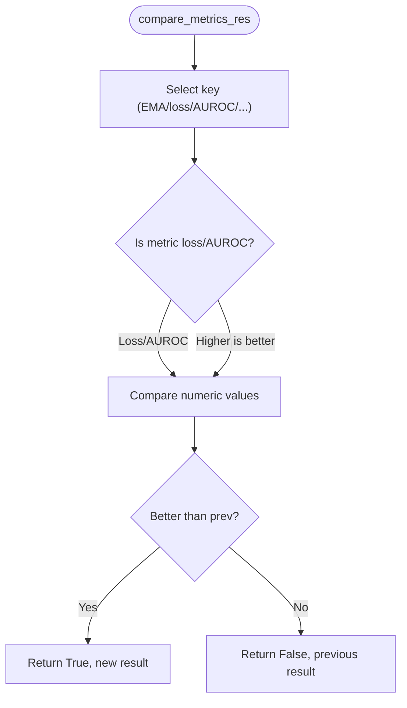

**Diagram sources**
- [metrics_utils.py:192-209](file://src/utils/metrics_utils.py#L192-L209)

**Section sources**
- [metrics_utils.py:16-349](file://src/utils/metrics_utils.py#L16-L349)

### Visualization Utilities
- Convert PyG graphs to NetworkX and render with Plotly for quick inspection of graph structures.

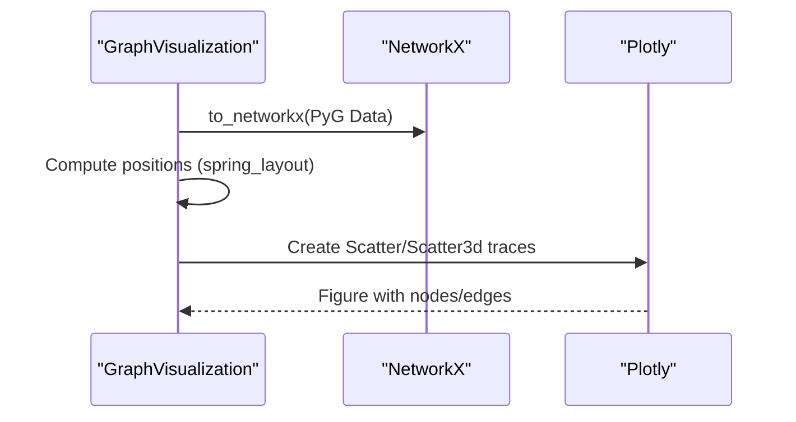

**Diagram sources**
- [vis_utils.py:19-31](file://src/utils/vis_utils.py#L19-L31)
- [visualize.py:181-233](file://src/utils/visualize.py#L181-L233)

**Section sources**
- [vis_utils.py:1-31](file://src/utils/vis_utils.py#L1-L31)
- [visualize.py:1-233](file://src/utils/visualize.py#L1-L233)

### Configuration and Stats
- TrainingStats tracks tokens/sec, samples/sec, and loss components; provides printing and saving hooks.
- OptimizingStats holds optimizer, LR scheduler, and GradScaler.
- EMAStats manages Exponential Moving Average models and best checkpoints.

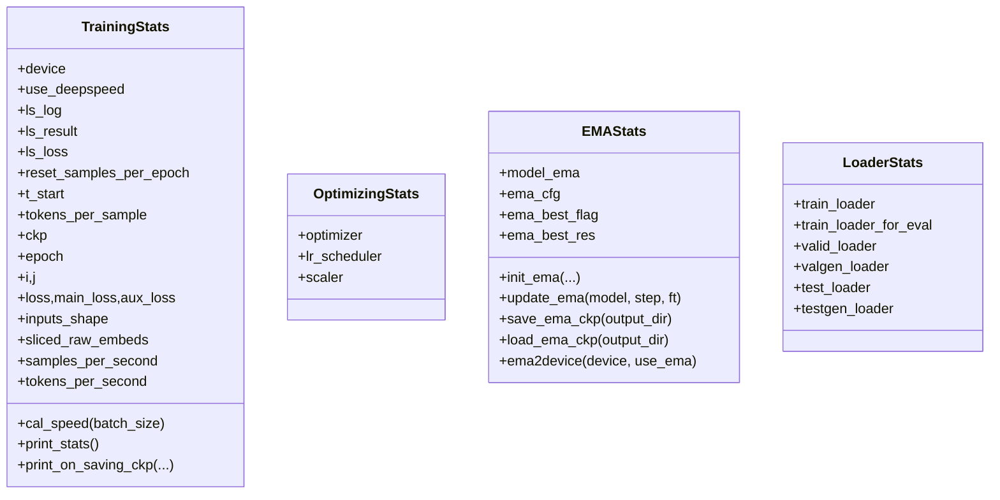

**Diagram sources**
- [stats_configs.py:29-158](file://src/conf/stats_configs.py#L29-L158)

**Section sources**
- [stats_configs.py:1-158](file://src/conf/stats_configs.py#L1-L158)
- [base_configs.py:132-302](file://src/conf/base_configs.py#L132-L302)

## Dependency Analysis
The following diagram highlights key dependencies among inspection, logging, and training components.

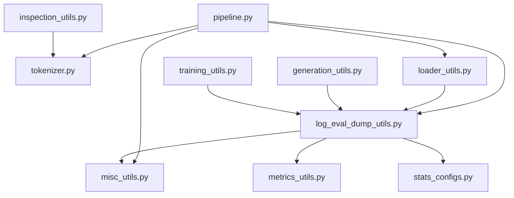

**Diagram sources**
- [inspection_utils.py:1-167](file://src/utils/inspection_utils.py#L1-L167)
- [log_eval_dump_utils.py:1-929](file://src/utils/log_eval_dump_utils.py#L1-L929)
- [misc_utils.py:1-540](file://src/utils/misc_utils.py#L1-L540)
- [loader_utils.py:1-752](file://src/utils/loader_utils.py#L1-L752)
- [training_utils.py:1-206](file://src/utils/training_utils.py#L1-L206)
- [generation_utils.py:1-464](file://src/utils/generation_utils.py#L1-L464)
- [metrics_utils.py:1-349](file://src/utils/metrics_utils.py#L1-L349)
- [stats_configs.py:1-158](file://src/conf/stats_configs.py#L1-L158)
- [tokenizer.py:116-156](file://src/data/tokenizer.py#L116-L156)
- [pipeline.py:149-177](file://src/training/pipeline.py#L149-L177)

**Section sources**
- [inspection_utils.py:1-167](file://src/utils/inspection_utils.py#L1-L167)
- [log_eval_dump_utils.py:1-929](file://src/utils/log_eval_dump_utils.py#L1-L929)
- [misc_utils.py:1-540](file://src/utils/misc_utils.py#L1-L540)
- [loader_utils.py:1-752](file://src/utils/loader_utils.py#L1-L752)
- [training_utils.py:1-206](file://src/utils/training_utils.py#L1-L206)
- [generation_utils.py:1-464](file://src/utils/generation_utils.py#L1-L464)
- [metrics_utils.py:1-349](file://src/utils/metrics_utils.py#L1-L349)
- [stats_configs.py:1-158](file://src/conf/stats_configs.py#L1-L158)
- [tokenizer.py:116-156](file://src/data/tokenizer.py#L116-L156)
- [pipeline.py:149-177](file://src/training/pipeline.py#L149-L177)

## Performance Considerations
- Throughput measurement: TrainingStats computes samples/sec and tokens/sec to monitor training efficiency.
- Gradient scaling and clipping: AMP scaler and optional gradient norm clipping improve stability and speed.
- Distributed reductions: Loss reduction across GPUs ensures consistent logging and evaluation.
- Profiling: Optional FLOPs/MACs recording during logging can help identify compute hotspots.
- Memory footprint: Inspect packed token shapes and raw embedding slices to prevent OOM; adjust batch size and max length accordingly.

[No sources needed since this section provides general guidance]

## Troubleshooting Guide
Common debugging scenarios and resolutions:
- Missing or unexpected keys after loading checkpoints: Use checkpoint loading helpers to handle both PyTorch and DeepSpeed formats; review missing/unexpected keys logs.
- OOM during evaluation: Reduce batch size for evaluation or disable auxiliary outputs; leverage smaller slices of raw embeddings for inspection.
- Incorrect tokenization: Use tokenization inspection to verify tokens, labels, and packed sequences; confirm EOS indexing.
- Slow training: Monitor samples/sec and tokens/sec; reduce max length or batch size; enable gradient clipping; verify profiler recording.
- Generation quality issues: Adjust generation algorithms and sampling parameters; evaluate per-batch vs per-sample accuracy; inspect histories if enabled.

**Section sources**
- [misc_utils.py:231-251](file://src/utils/misc_utils.py#L231-L251)
- [loader_utils.py:647-660](file://src/utils/loader_utils.py#L647-L660)
- [inspection_utils.py:73-143](file://src/utils/inspection_utils.py#L73-L143)
- [log_eval_dump_utils.py:504-562](file://src/utils/log_eval_dump_utils.py#L504-L562)
- [generation_utils.py:316-436](file://src/utils/generation_utils.py#L316-L436)

## Conclusion
The Graph-GPT inspection and debugging toolkit combines practical utilities for model state analysis, performance monitoring, and troubleshooting. By leveraging inspection routines, logging and evaluation helpers, generation utilities, and visualization tools, developers can quickly diagnose issues, validate configurations, and optimize training performance.

[No sources needed since this section summarizes without analyzing specific files]

## Appendices

### Best Practices for Model Debugging and Optimization
- Validate tokenization end-to-end before training; confirm packed shapes and attention masks.
- Track throughput and loss across GPUs; use distributed reductions for accurate metrics.
- Employ AMP with gradient clipping; monitor gradients and learning rate schedules.
- Use EMA for improved generalization and best-EMA selection.
- Visualize graphs and metrics to catch structural and performance anomalies early.

[No sources needed since this section provides general guidance]
