# Logging & Evaluation

<cite>
**Referenced Files in This Document**
- [log_eval_dump_utils.py](file://src/utils/log_eval_dump_utils.py)
- [metrics_utils.py](file://src/utils/metrics_utils.py)
- [ogb_utils.py](file://src/utils/ogb_utils.py)
- [loader_utils.py](file://src/utils/loader_utils.py)
- [misc_utils.py](file://src/utils/misc_utils.py)
- [generation_utils.py](file://src/utils/generation_utils.py)
- [training_utils.py](file://src/utils/training_utils.py)
- [base_configs.py](file://src/conf/base_configs.py)
- [pipeline.py](file://src/training/pipeline.py)
- [control_flow.py](file://src/utils/control_flow.py)
- [attn_mask_utils.py](file://src/utils/attn_mask_utils.py)
- [flex_attn_utils.py](file://src/utils/flex_attn_utils.py)
- [tokenizer.py](file://src/data/tokenizer.py)
- [tokenizer_utils.py](file://src/utils/tokenizer_utils.py)
- [pretrain_mode.py](file://src/training/pretrain_mode.py)
- [README.md](file://README.md)
</cite>

## Update Summary
**Changes Made**
- Updated evaluation function signatures to remove unused parameters (split_lens, attn_modes) from evaluation functions
- Enhanced log_dump_pt_training_stats to return structured evaluation metrics dictionary
- Updated attention mask system documentation to reflect parameter naming changes from split_lens/attn_modes to sample_lens
- Revised function signatures and parameter passing documentation to use sample_lens instead of split_lens
- Updated tokenizer utilities documentation to reflect the new parameter naming scheme

## Table of Contents
1. [Introduction](#introduction)
2. [Project Structure](#project-structure)
3. [Core Components](#core-components)
4. [Architecture Overview](#architecture-overview)
5. [Detailed Component Analysis](#detailed-component-analysis)
6. [Attention Mask System](#attention-mask-system)
7. [Dependency Analysis](#dependency-analysis)
8. [Performance Considerations](#performance-considerations)
9. [Troubleshooting Guide](#troubleshooting-guide)
10. [Conclusion](#conclusion)
11. [Appendices](#appendices)

## Introduction
This document explains the logging and evaluation utilities in Graph-GPT with a focus on experiment tracking, metric computation, and result analysis. It covers:
- Logging strategies for training and evaluation
- Evaluation metrics for classification, regression, and graph clustering tasks
- Integration with external monitoring systems via TensorBoard
- Experiment comparison workflows and result dumping
- Evaluation pipelines for supervised fine-tuning and pre-training
- Attention mask system with sample-based construction for flexible attention patterns
- Metric interpretation and result visualization
- Best practices for logging, performance monitoring, and CI/CD integration

## Project Structure
The logging and evaluation ecosystem centers around several key modules with enhanced attention mask support:
- Training orchestration and lifecycle management
- Metrics computation and evaluation adapters
- Data loaders and samplers for evaluation with attention mask integration
- Utilities for saving checkpoints, predictions, and summaries
- Generation utilities for evaluation of generative tasks with attention masks
- Configuration and scheduling for experiments
- Attention mask utilities for flexible attention pattern construction

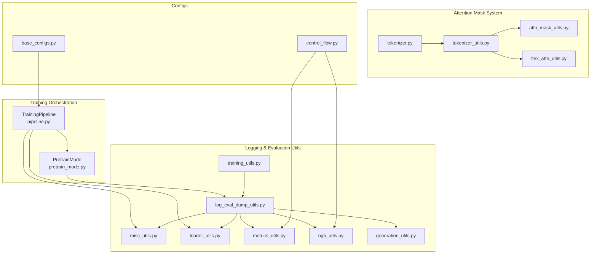

**Diagram sources**
- [pipeline.py:15-96](file://src/training/pipeline.py#L15-L96)
- [pretrain_mode.py:540-579](file://src/training/pretrain_mode.py#L540-L579)
- [log_eval_dump_utils.py:41-80](file://src/utils/log_eval_dump_utils.py#L41-L80)
- [log_eval_dump_utils.py:84-175](file://src/utils/log_eval_dump_utils.py#L84-L175)
- [log_eval_dump_utils.py:179-212](file://src/utils/log_eval_dump_utils.py#L179-L212)
- [log_eval_dump_utils.py:261-329](file://src/utils/log_eval_dump_utils.py#L261-L329)
- [log_eval_dump_utils.py:581-662](file://src/utils/log_eval_dump_utils.py#L581-L662)
- [attn_mask_utils.py:12-84](file://src/utils/attn_mask_utils.py#L12-L84)
- [flex_attn_utils.py:20-206](file://src/utils/flex_attn_utils.py#L20-L206)
- [tokenizer_utils.py:21-881](file://src/utils/tokenizer_utils.py#L21-L881)
- [tokenizer.py:224-270](file://src/data/tokenizer.py#L224-L270)

**Section sources**
- [pipeline.py:15-96](file://src/training/pipeline.py#L15-L96)
- [pretrain_mode.py:540-579](file://src/training/pretrain_mode.py#L540-L579)
- [log_eval_dump_utils.py:41-662](file://src/utils/log_eval_dump_utils.py#L41-L662)
- [attn_mask_utils.py:12-84](file://src/utils/attn_mask_utils.py#L12-L84)
- [flex_attn_utils.py:20-206](file://src/utils/flex_attn_utils.py#L20-L206)
- [tokenizer_utils.py:21-881](file://src/utils/tokenizer_utils.py#L21-L881)
- [tokenizer.py:224-270](file://src/data/tokenizer.py#L224-L270)

## Core Components
- Training and evaluation logging:
  - Pre-training and fine-tuning logging functions write CSV logs and optionally TensorBoard summaries.
  - Functions compute throughput, reduce losses across ranks, and log histograms of parameters.
  - Enhanced to support attention mask parameters (sample_lens, attn_modes) in model forward passes.
- Metrics computation:
  - Pluggable metric classes for single/multi-label classification, regression, and graph clustering.
  - Comparison logic to track best results (EMA) and update best checkpoints.
- Evaluation pipelines:
  - Fine-tuning evaluation on train/valid/test splits with optional EMA model evaluation.
  - Pre-training evaluation including masked language modeling accuracy computed over a grid of masking thresholds.
  - Enhanced attention mask support for flexible attention pattern construction.
- Result dumping:
  - Save model checkpoints, optimizer states, and prediction results.
  - Dump inference logits and hidden states for downstream analysis.
- Data loaders and samplers:
  - Deterministic and distributed sampling for evaluation with configurable subsets.
  - Enhanced attention mask integration for evaluation datasets.
- Generation utilities:
  - Batch and per-example generation with configurable decoding strategies and accuracy computation.
  - Attention mask support for generation evaluation.
- Attention mask system:
  - Flexible attention pattern construction with sample-based mask building.
  - Support for causal, full, and noise attention modes per sample.
  - Integration with both SDPA and flex attention backends.

**Section sources**
- [log_eval_dump_utils.py:41-662](file://src/utils/log_eval_dump_utils.py#L41-L662)
- [metrics_utils.py:16-348](file://src/utils/metrics_utils.py#L16-L348)
- [ogb_utils.py:13-214](file://src/utils/ogb_utils.py#L13-L214)
- [loader_utils.py:445-479](file://src/utils/loader_utils.py#L445-L479)
- [misc_utils.py:124-176](file://src/utils/misc_utils.py#L124-L176)
- [generation_utils.py:84-464](file://src/utils/generation_utils.py#L84-L464)
- [training_utils.py:7-206](file://src/utils/training_utils.py#L7-L206)
- [attn_mask_utils.py:12-84](file://src/utils/attn_mask_utils.py#L12-L84)
- [flex_attn_utils.py:20-206](file://src/utils/flex_attn_utils.py#L20-L206)

## Architecture Overview
The logging and evaluation architecture integrates training orchestration with modular utilities for metrics, data, and generation, now enhanced with attention mask support. It supports distributed training, optional DeepSpeed integration, and TensorBoard logging with flexible attention patterns.

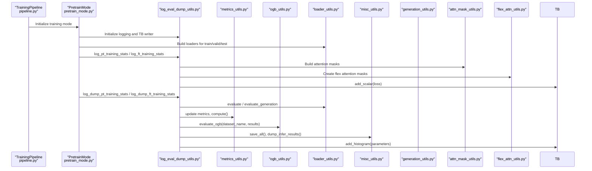

**Diagram sources**
- [pipeline.py:60-96](file://src/training/pipeline.py#L60-L96)
- [pretrain_mode.py:540-579](file://src/training/pretrain_mode.py#L540-L579)
- [log_eval_dump_utils.py:41-662](file://src/utils/log_eval_dump_utils.py#L41-L662)
- [metrics_utils.py:38-137](file://src/utils/metrics_utils.py#L38-L137)
- [ogb_utils.py:13-214](file://src/utils/ogb_utils.py#L13-L214)
- [loader_utils.py:445-479](file://src/utils/loader_utils.py#L445-L479)
- [misc_utils.py:124-176](file://src/utils/misc_utils.py#L124-L176)
- [generation_utils.py:84-136](file://src/utils/generation_utils.py#L84-L136)
- [attn_mask_utils.py:12-84](file://src/utils/attn_mask_utils.py#L12-L84)
- [flex_attn_utils.py:20-206](file://src/utils/flex_attn_utils.py#L20-L206)

## Detailed Component Analysis

### Logging and Training Stats
- Pre-training logging:
  - Computes speed, reduces loss across GPUs, and logs scalars and histograms to TensorBoard.
  - Enhanced to handle attention mask parameters in model forward passes.
- Fine-tuning logging:
  - Saves per-epoch training logs and evaluation results to CSV.
  - Supports attention mask parameters for evaluation datasets.
- Checkpointing and result dumping:
  - Saves model checkpoints, optimizer states, and prediction CSVs per epoch.
  - Supports DeepSpeed and DDP modes with attention mask integration.

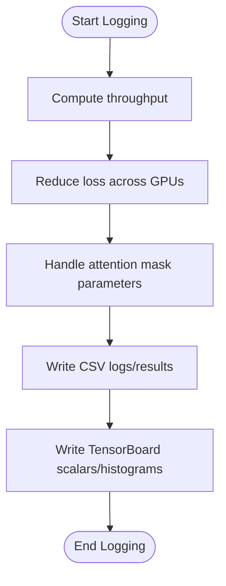

**Diagram sources**
- [log_eval_dump_utils.py:520-578](file://src/utils/log_eval_dump_utils.py#L520-L578)
- [log_eval_dump_utils.py:581-662](file://src/utils/log_eval_dump_utils.py#L581-L662)
- [log_eval_dump_utils.py:665-823](file://src/utils/log_eval_dump_utils.py#L665-L823)
- [misc_utils.py:124-176](file://src/utils/misc_utils.py#L124-L176)

**Section sources**
- [log_eval_dump_utils.py:520-823](file://src/utils/log_eval_dump_utils.py#L520-L823)
- [misc_utils.py:124-176](file://src/utils/misc_utils.py#L124-L176)

### Evaluation Pipelines
- Supervised fine-tuning evaluation:
  - Evaluates on partial train set, full valid set, and full test set.
  - Optionally evaluates with EMA model and compares metrics to track best results.
  - Dumps logits and hidden states for test set when configured.
  - Enhanced to support attention mask parameters (sample_lens, attn_modes) in model forward passes.
- Pre-training evaluation:
  - Evaluates masked language modeling accuracy across a grid of masking thresholds.
  - Supports batch-wise and per-sample generation evaluation.
  - Handles attention mask parameters for flexible attention pattern evaluation.

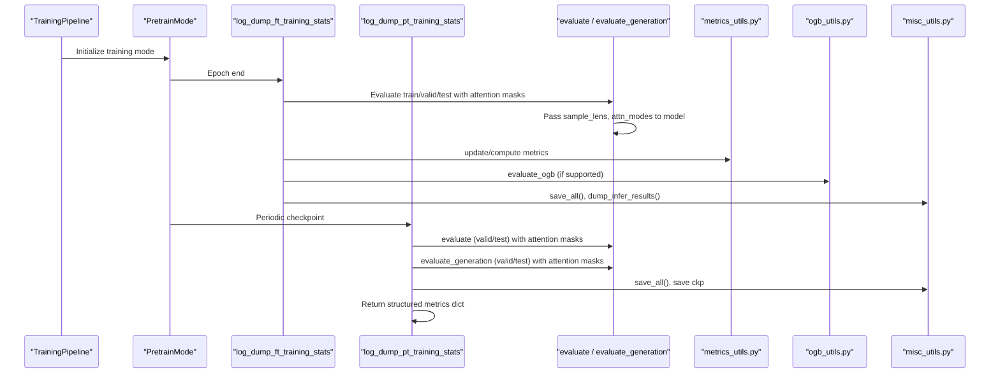

**Diagram sources**
- [pretrain_mode.py:540-579](file://src/training/pretrain_mode.py#L540-L579)
- [log_eval_dump_utils.py:581-662](file://src/utils/log_eval_dump_utils.py#L581-L662)
- [log_eval_dump_utils.py:261-329](file://src/utils/log_eval_dump_utils.py#L261-L329)
- [metrics_utils.py:38-137](file://src/utils/metrics_utils.py#L38-L137)
- [ogb_utils.py:13-214](file://src/utils/ogb_utils.py#L13-L214)
- [misc_utils.py:124-176](file://src/utils/misc_utils.py#L124-L176)

**Section sources**
- [pretrain_mode.py:540-579](file://src/training/pretrain_mode.py#L540-L579)
- [log_eval_dump_utils.py:581-662](file://src/utils/log_eval_dump_utils.py#L581-L662)
- [log_eval_dump_utils.py:261-329](file://src/utils/log_eval_dump_utils.py#L261-L329)
- [metrics_utils.py:38-137](file://src/utils/metrics_utils.py#L38-L137)
- [ogb_utils.py:13-214](file://src/utils/ogb_utils.py#L13-L214)
- [misc_utils.py:124-176](file://src/utils/misc_utils.py#L124-L176)

### Metrics Computation and Comparison
- Supported tasks:
  - Single/multi-label classification with AUROC and accuracy
  - Multi-label classification with per-task AUROC and mean AUROC
  - Regression with MSE and MAE
  - Graph clustering with accuracy, recall, precision, and F1
- Comparison logic:
  - Compares current metrics against best results and updates best checkpoint accordingly.
  - Enhanced to handle attention mask evaluation results.

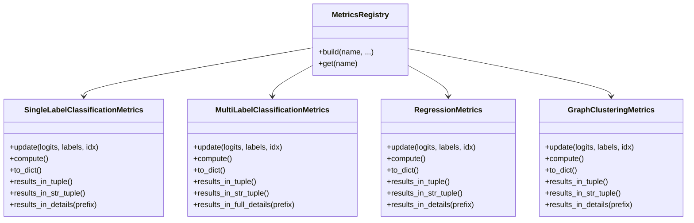

**Diagram sources**
- [metrics_utils.py:16-348](file://src/utils/metrics_utils.py#L16-L348)
- [control_flow.py:9-33](file://src/utils/control_flow.py#L9-L33)

**Section sources**
- [metrics_utils.py:16-348](file://src/utils/metrics_utils.py#L16-L348)
- [control_flow.py:9-33](file://src/utils/control_flow.py#L9-L33)

### OGB Integration and Evaluation Adapters
- Dataset-specific evaluators for node/link/graph tasks
- Reformatting utilities for HR/MRR evaluations
- CSV formatting helpers for result export

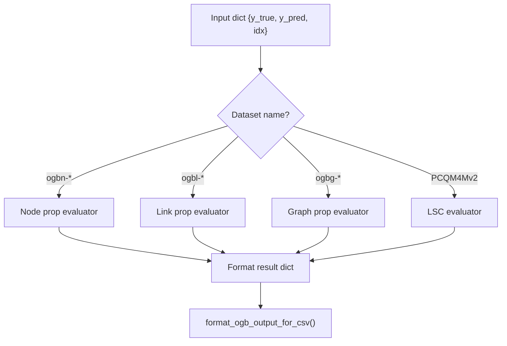

**Diagram sources**
- [ogb_utils.py:13-214](file://src/utils/ogb_utils.py#L13-L214)

**Section sources**
- [ogb_utils.py:13-214](file://src/utils/ogb_utils.py#L13-L214)

### Data Loaders and Samplers for Evaluation
- Deterministic and randomized samplers for train/validation/test splits
- Distributed sampling across ranks
- Evaluation loaders for fine-tuning and pre-training with attention mask support
- Enhanced to handle sample_lens and attn_modes parameters in evaluation datasets.

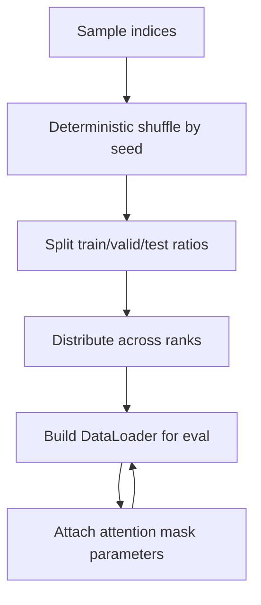

**Diagram sources**
- [loader_utils.py:223-305](file://src/utils/loader_utils.py#L223-L305)
- [loader_utils.py:445-479](file://src/utils/loader_utils.py#L445-L479)

**Section sources**
- [loader_utils.py:223-305](file://src/utils/loader_utils.py#L223-L305)
- [loader_utils.py:445-479](file://src/utils/loader_utils.py#L445-L479)

### Generation Evaluation
- Batch and per-example generation with configurable decoding strategies
- Accuracy computation for masked token prediction
- Support for multiple generation algorithms (origin, maskgit_plus, topk_margin, entropy)
- Enhanced attention mask support for generation evaluation.

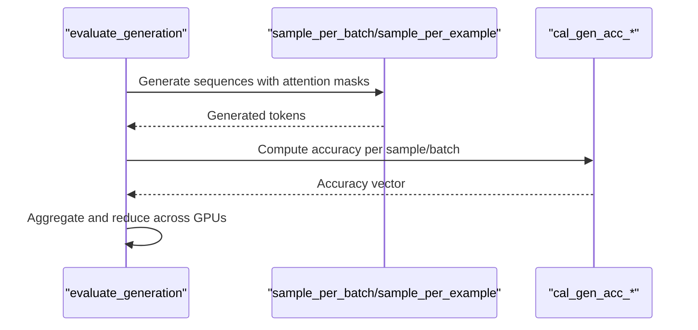

**Diagram sources**
- [log_eval_dump_utils.py:323-400](file://src/utils/log_eval_dump_utils.py#L323-L400)
- [generation_utils.py:84-464](file://src/utils/generation_utils.py#L84-L464)

**Section sources**
- [log_eval_dump_utils.py:323-400](file://src/utils/log_eval_dump_utils.py#L323-L400)
- [generation_utils.py:84-464](file://src/utils/generation_utils.py#L84-L464)

### Training Step Utilities
- Standard training step with AMP and gradient clipping
- Fine-tuning training step with auxiliary and task losses
- Enhanced to handle attention mask parameters in model forward passes.

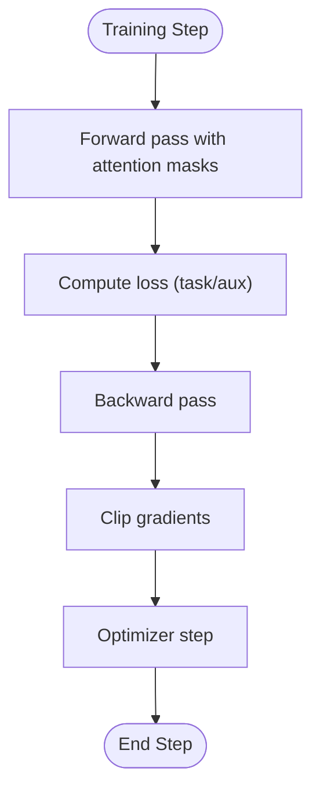

**Diagram sources**
- [training_utils.py:7-96](file://src/utils/training_utils.py#L7-L96)
- [training_utils.py:98-206](file://src/utils/training_utils.py#L98-L206)

**Section sources**
- [training_utils.py:7-206](file://src/utils/training_utils.py#L7-L206)

### Enhanced Evaluation Function Signatures
**Updated** The evaluation functions have been cleaned up to remove unused parameters and improve return value handling:

- `evaluate()` function signature simplified to remove unused attention mask parameters
- `evaluate_generation()` function signature simplified to remove unused attention mask parameters
- `log_dump_pt_training_stats()` now returns structured evaluation metrics dictionary
- `log_dump_ft_training_stats()` maintains existing interface for fine-tuning evaluation

**Section sources**
- [log_eval_dump_utils.py:256-320](file://src/utils/log_eval_dump_utils.py#L256-L320)
- [log_eval_dump_utils.py:323-400](file://src/utils/log_eval_dump_utils.py#L323-L400)
- [log_eval_dump_utils.py:581-662](file://src/utils/log_eval_dump_utils.py#L581-L662)
- [log_eval_dump_utils.py:665-823](file://src/utils/log_eval_dump_utils.py#L665-L823)

## Attention Mask System

### Sample-Based Attention Mask Construction
The attention mask system in Graph-GPT now supports flexible attention patterns through sample-based construction. This enables different attention modes (causal, full, noise) for different segments of the input sequence, with parameters named sample_lens for sequence length specification.

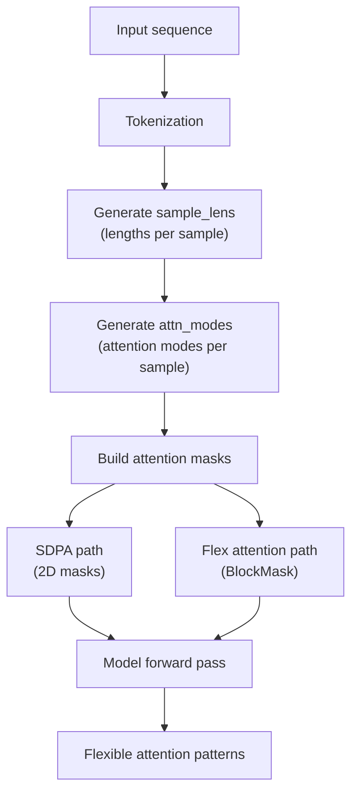

**Diagram sources**
- [flex_attn_utils.py:21-127](file://src/utils/flex_attn_utils.py#L21-L127)
- [flex_attn_utils.py:83-127](file://src/utils/flex_attn_utils.py#L83-L127)
- [attn_mask_utils.py:12-84](file://src/utils/attn_mask_utils.py#L12-L84)

### Attention Mask Utilities
The system provides utilities for both SDPA and flex attention backends:

- **SDPA Path**: Creates 2D attention masks per sample for traditional attention
- **Flex Attention Path**: Creates BlockMask objects for efficient sparse attention
- **Mixed Attention**: Supports causal, full, and noise attention modes per sample

**Section sources**
- [flex_attn_utils.py:21-127](file://src/utils/flex_attn_utils.py#L21-L127)
- [flex_attn_utils.py:83-127](file://src/utils/flex_attn_utils.py#L83-L127)
- [attn_mask_utils.py:12-84](file://src/utils/attn_mask_utils.py#L12-L84)

### Attention Mode Types
- **Causal**: Allows attention only to previous positions (standard autoregressive)
- **Full**: Allows attention to all positions within the same sample
- **Noise**: Masks certain positions for noise injection during training

**Section sources**
- [flex_attn_utils.py:21-77](file://src/utils/flex_attn_utils.py#L21-L77)
- [flex_attn_utils.py:83-127](file://src/utils/flex_attn_utils.py#L83-L127)

## Dependency Analysis
- Control-flow registry enables dynamic dispatch for metrics and OGB evaluators.
- Logging utilities depend on metrics and OGB modules for evaluation results.
- Evaluation functions depend on data loaders and generation utilities.
- Pipeline coordinates initialization, logging, evaluation, and cleanup.
- Attention mask utilities integrate with tokenizer utilities and model forward passes.
- Enhanced logging functions now pass attention mask parameters to model forward passes.

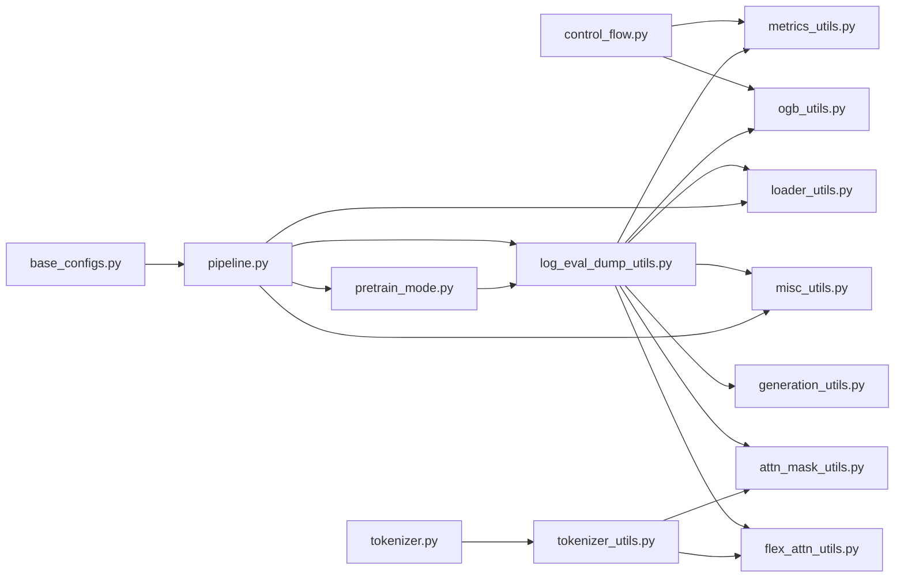

**Diagram sources**
- [control_flow.py:9-33](file://src/utils/control_flow.py#L9-L33)
- [metrics_utils.py:11-13](file://src/utils/metrics_utils.py#L11-L13)
- [ogb_utils.py:8-11](file://src/utils/ogb_utils.py#L8-L11)
- [log_eval_dump_utils.py:41-662](file://src/utils/log_eval_dump_utils.py#L41-L662)
- [loader_utils.py:445-479](file://src/utils/loader_utils.py#L445-L479)
- [misc_utils.py:124-176](file://src/utils/misc_utils.py#L124-L176)
- [generation_utils.py:84-136](file://src/utils/generation_utils.py#L84-L136)
- [attn_mask_utils.py:12-84](file://src/utils/attn_mask_utils.py#L12-L84)
- [flex_attn_utils.py:20-206](file://src/utils/flex_attn_utils.py#L20-L206)
- [tokenizer_utils.py:226-368](file://src/utils/tokenizer_utils.py#L226-L368)
- [pipeline.py:60-96](file://src/training/pipeline.py#L60-L96)
- [pretrain_mode.py:540-579](file://src/training/pretrain_mode.py#L540-L579)
- [base_configs.py:132-164](file://src/conf/base_configs.py#L132-L164)

**Section sources**
- [control_flow.py:9-33](file://src/utils/control_flow.py#L9-L33)
- [metrics_utils.py:11-13](file://src/utils/metrics_utils.py#L11-L13)
- [ogb_utils.py:8-11](file://src/utils/ogb_utils.py#L8-L11)
- [log_eval_dump_utils.py:41-662](file://src/utils/log_eval_dump_utils.py#L41-L662)
- [loader_utils.py:445-479](file://src/utils/loader_utils.py#L445-L479)
- [misc_utils.py:124-176](file://src/utils/misc_utils.py#L124-L176)
- [generation_utils.py:84-136](file://src/utils/generation_utils.py#L84-L136)
- [attn_mask_utils.py:12-84](file://src/utils/attn_mask_utils.py#L12-L84)
- [flex_attn_utils.py:20-206](file://src/utils/flex_attn_utils.py#L20-L206)
- [tokenizer_utils.py:226-368](file://src/utils/tokenizer_utils.py#L226-L368)
- [pipeline.py:60-96](file://src/training/pipeline.py#L60-L96)
- [pretrain_mode.py:540-579](file://src/training/pretrain_mode.py#L540-L579)
- [base_configs.py:132-164](file://src/conf/base_configs.py#L132-L164)

## Performance Considerations
- Throughput estimation:
  - Logging utilities compute effective samples per second and print per-rank statistics.
- Distributed reductions:
  - Loss and accuracy aggregations across GPUs ensure consistent metrics for multi-GPU runs.
- Gradient scaling and clipping:
  - Automatic mixed precision and gradient norm clipping improve training stability and speed.
- Efficient evaluation:
  - Sampling subsets for quick train-set evaluation and full evaluation on valid/test sets balances speed and accuracy.
- TensorBoard overhead:
  - Histogram logging and frequent flush intervals should be tuned for large-scale runs.
- Attention mask efficiency:
  - Flex attention backend provides memory-efficient sparse attention patterns.
  - SDPA path offers compatibility with traditional attention implementations.
- Parameter passing:
  - Attention mask parameters (sample_lens, attn_modes) are efficiently passed through model forward passes without additional overhead.
- Structured metrics return:
  - Enhanced evaluation functions now return structured dictionaries for easier metric consumption and comparison.

## Troubleshooting Guide
- Missing TensorBoard:
  - Falls back to tensorboardX if torch.utils.tensorboard is unavailable.
- Distributed environment:
  - If process group initialization fails, the code switches to a local test mode with adjusted logging steps.
- Checkpoint loading:
  - Supports both PyTorch and DeepSpeed checkpoint formats; missing/unexpected keys are reported.
- NaNs in metrics:
  - Logging functions detect NaNs during tensor gathering and print counts for diagnostics.
- OGB evaluator errors:
  - Some datasets require labeled data for certain metrics; errors are raised when evaluation is not applicable.
- Attention mask issues:
  - Ensure sample_lens and attn_modes are properly aligned with input sequence lengths.
  - Verify attention mask dimensions match model expectations.
  - Check for proper device placement of attention mask parameters.
- Evaluation function signature changes:
  - Updated evaluation functions no longer accept split_lens and attn_modes parameters.
  - Use simplified function signatures for cleaner code integration.

**Section sources**
- [log_eval_dump_utils.py:34-38](file://src/utils/log_eval_dump_utils.py#L34-L38)
- [misc_utils.py:507-540](file://src/utils/misc_utils.py#L507-L540)
- [misc_utils.py:231-252](file://src/utils/misc_utils.py#L231-L252)
- [log_eval_dump_utils.py:146-151](file://src/utils/log_eval_dump_utils.py#L146-L151)
- [ogb_utils.py:24-28](file://src/utils/ogb_utils.py#L24-L28)

## Conclusion
The logging and evaluation subsystem in Graph-GPT provides a robust framework for experiment tracking, metrics computation, and result analysis with enhanced attention mask support. It integrates seamlessly with distributed training, optional DeepSpeed, and TensorBoard, while supporting diverse evaluation scenarios across classification, regression, and graph tasks. The new attention mask system enables flexible attention patterns through sample-based construction, supporting different attention modes for various parts of the input sequence. The modular design enables straightforward extension and customization for new datasets, metrics, and attention patterns.

**Updated** Recent enhancements include improved parameter cleanup by removing unused split_lens and attn_modes parameters from evaluation functions, and enhanced log_dump_pt_training_stats to return structured evaluation metrics for better integration with monitoring systems.

## Appendices

### Example Workflows
- Supervised fine-tuning evaluation:
  - Run epoch-end evaluation on train/valid/test with optional EMA model.
  - Save CSV logs, evaluation results, and prediction CSVs.
  - Handle attention mask parameters (sample_lens, attn_modes) in model forward passes.
- Pre-training evaluation:
  - Evaluate masked language modeling accuracy across a grid of masking thresholds.
  - Save generation accuracy CSVs and checkpoints.
  - Utilize attention mask parameters for flexible attention pattern evaluation.
- Attention mask evaluation:
  - Test different attention modes (causal, full, noise) for various sequence segments.
  - Compare performance across different attention configurations.
- Structured metrics consumption:
  - Use returned evaluation metrics dictionary for wandb logging and experiment comparison.

**Section sources**
- [log_eval_dump_utils.py:581-662](file://src/utils/log_eval_dump_utils.py#L581-L662)
- [log_eval_dump_utils.py:665-823](file://src/utils/log_eval_dump_utils.py#L665-L823)
- [pretrain_mode.py:540-579](file://src/training/pretrain_mode.py#L540-L579)
- [flex_attn_utils.py:21-127](file://src/utils/flex_attn_utils.py#L21-L127)

### Metric Interpretation
- AUROC:
  - Area under the ROC curve; higher is better for binary and multi-class tasks.
- Accuracy:
  - Proportion of correct predictions; higher is better.
- MSE/MAE:
  - Mean Squared/Error; lower is better.
- Recall/Precision/F1:
  - Recall and precision trade-offs; F1 balances both.

**Section sources**
- [metrics_utils.py:38-137](file://src/utils/metrics_utils.py#L38-L137)
- [metrics_utils.py:211-348](file://src/utils/metrics_utils.py#L211-L348)

### Result Visualization
- Graph visualization utilities support NetworkX graphs and Plotly figures for exploratory analysis.

**Section sources**
- [vis_utils.py:1-31](file://src/utils/vis_utils.py#L1-L31)
- [visualize.py:1-232](file://src/utils/visualize.py#L1-L232)

### CI/CD Integration
- Logging to CSV and TensorBoard summaries enables automated experiment tracking.
- Checkpoint and result dumping facilitate reproducibility and artifact retention.
- Environment variables for summary directory and distributed ranks should be configured in CI runners.
- Attention mask parameters can be included in experiment configurations for reproducible attention pattern testing.
- Structured metrics return enables seamless integration with monitoring and alerting systems.

**Section sources**
- [log_eval_dump_utils.py:817-866](file://src/utils/log_eval_dump_utils.py#L817-L866)
- [misc_utils.py:124-176](file://src/utils/misc_utils.py#L124-L176)
- [pipeline.py:137-142](file://src/training/pipeline.py#L137-L142)

### Attention Mask Configuration
- **sample_lens**: List of integers specifying the length of each attention sample within a sequence.
- **attn_modes**: List of strings specifying attention mode for each sample ('causal', 'full', 'noise').
- **Integration**: Parameters are automatically generated during tokenization and passed through evaluation functions to model forward passes.
- **Cleanup**: Unused split_lens and attn_modes parameters have been removed from evaluation function signatures for cleaner interfaces.

**Section sources**
- [flex_attn_utils.py:21-127](file://src/utils/flex_attn_utils.py#L21-L127)
- [flex_attn_utils.py:83-127](file://src/utils/flex_attn_utils.py#L83-L127)
- [log_eval_dump_utils.py:41-662](file://src/utils/log_eval_dump_utils.py#L41-L662)

### Structured Metrics Return Format
**New** The enhanced evaluation system now returns structured metrics dictionaries:

- **log_dump_pt_training_stats()**: Returns `{"valid_loss": float, "test_loss": float, "ema_loss": float}`
- Enables direct integration with wandb logging and experiment comparison workflows
- Simplifies metric consumption in training pipelines and monitoring systems

**Section sources**
- [log_eval_dump_utils.py:665-662](file://src/utils/log_eval_dump_utils.py#L665-L662)
- [pretrain_mode.py:540-555](file://src/training/pretrain_mode.py#L540-L555)
