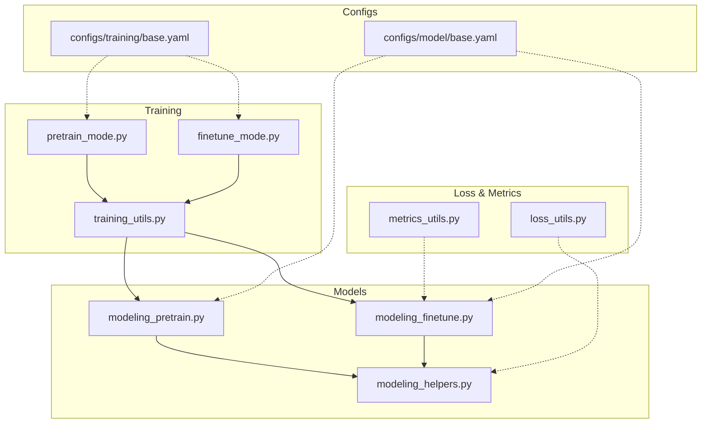
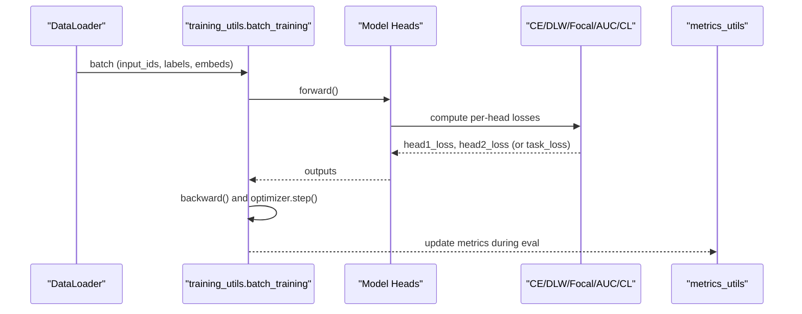
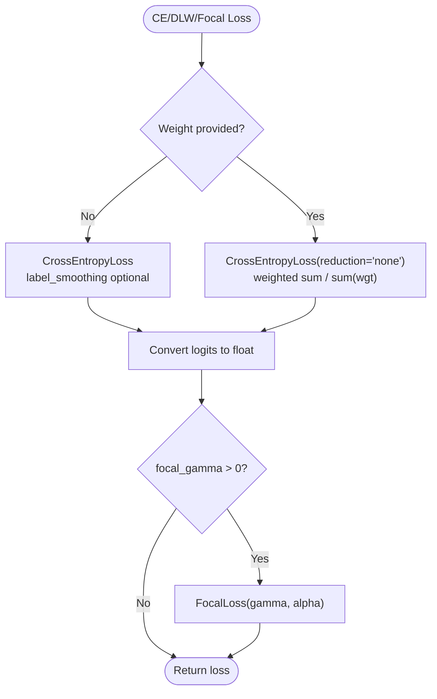
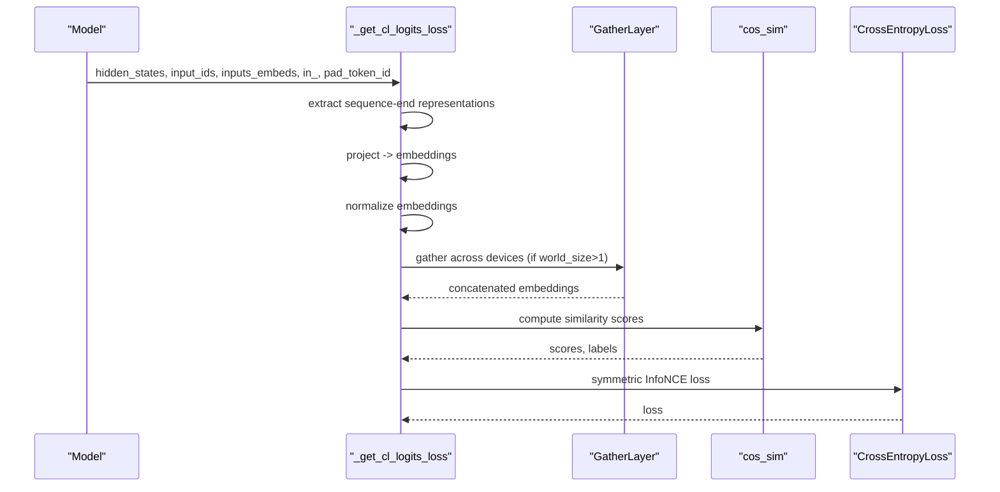
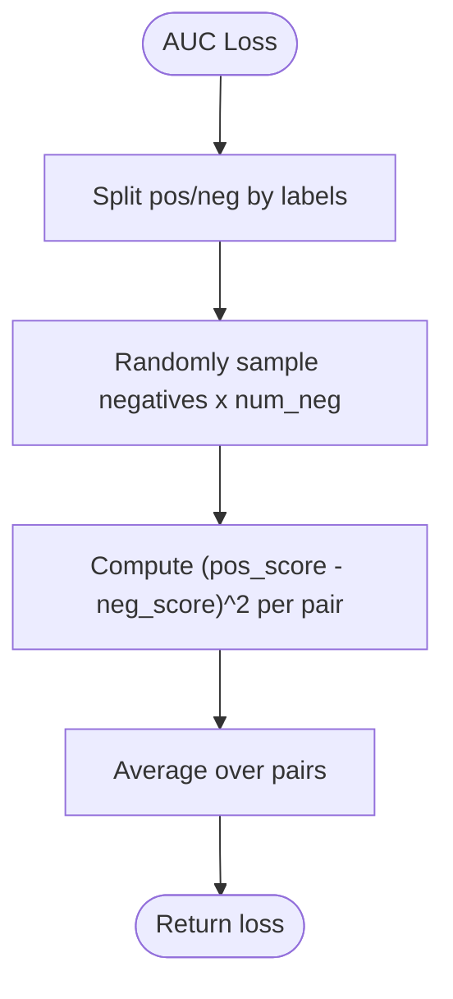
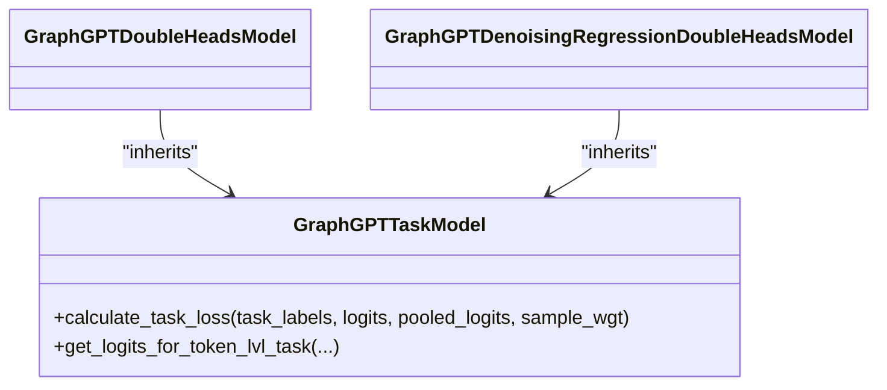
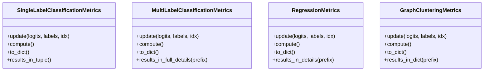
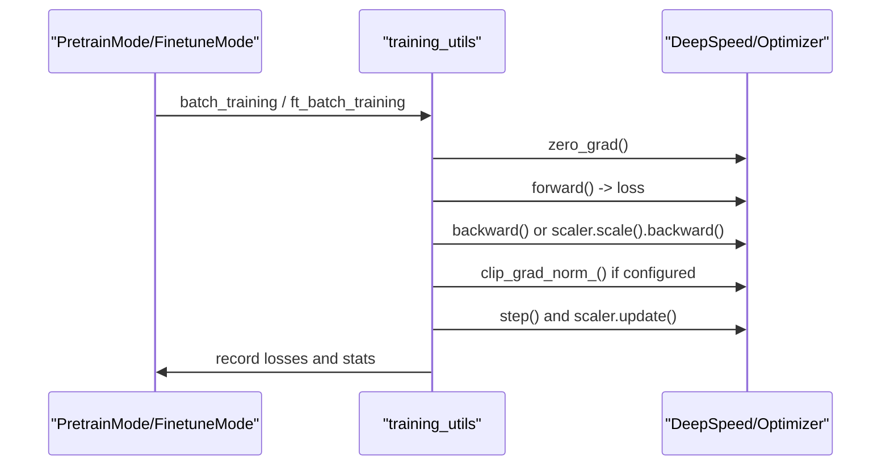
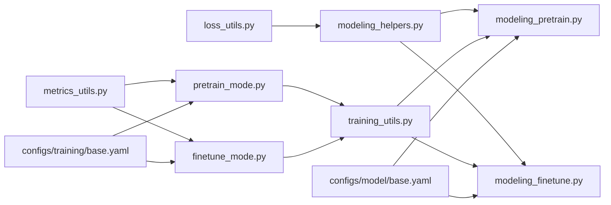

# Loss & Metrics

<cite>
**Referenced Files in This Document**
- [loss_utils.py](file://src/utils/loss_utils.py)
- [metrics_utils.py](file://src/utils/metrics_utils.py)
- [modeling_helpers.py](file://src/models/graphgpt/modeling_helpers.py)
- [modeling_pretrain.py](file://src/models/graphgpt/modeling_pretrain.py)
- [modeling_finetune.py](file://src/models/graphgpt/modeling_finetune.py)
- [training_utils.py](file://src/utils/training_utils.py)
- [pretrain_mode.py](file://src/training/pretrain_mode.py)
- [finetune_mode.py](file://src/training/finetune_mode.py)
- [base.yaml](file://configs/model/base.yaml)
- [base.yaml](file://configs/training/base.yaml)
</cite>

## Table of Contents
1. [Introduction](#introduction)
2. [Project Structure](#project-structure)
3. [Core Components](#core-components)
4. [Architecture Overview](#architecture-overview)
5. [Detailed Component Analysis](#detailed-component-analysis)
6. [Dependency Analysis](#dependency-analysis)
7. [Performance Considerations](#performance-considerations)
8. [Troubleshooting Guide](#troubleshooting-guide)
9. [Conclusion](#conclusion)
10. [Appendices](#appendices)

## Introduction
This document explains the loss computation and metrics utilities used by Graph-GPT for training objectives and evaluation. It focuses on:
- Loss function implementations for pre-training and fine-tuning
- Gradient computation and numerical stability
- Specialized metrics for graph tasks
- Regularization and optimization strategies
- Practical guidance for selecting losses, interpreting metrics, and monitoring training dynamics

## Project Structure
The loss and metrics ecosystem spans several modules:
- Loss utilities: cross-entropy variants, contrastive loss, focal loss, schedulers, and layer-wise parameter grouping
- Metrics utilities: classification, regression, and clustering metrics with distributed-aware aggregation
- Model helpers: core loss computation functions used by pre-training and fine-tuning heads
- Model heads: pre-training (generative/discriminative), position prediction, and fine-tuning task heads
- Training utilities: batch-level training loops integrating loss and metrics
- Training modes: pre-training and fine-tuning orchestration
- Configuration: model and training parameters controlling loss behavior and metrics

**Diagram sources**
- [loss_utils.py:1-413](file://src/utils/loss_utils.py#L1-L413)
- [metrics_utils.py:1-349](file://src/utils/metrics_utils.py#L1-L349)
- [modeling_helpers.py:145-228](file://src/models/graphgpt/modeling_helpers.py#L145-L228)
- [modeling_pretrain.py:57-266](file://src/models/graphgpt/modeling_pretrain.py#L57-L266)
- [modeling_finetune.py:64-326](file://src/models/graphgpt/modeling_finetune.py#L64-L326)
- [training_utils.py:7-90](file://src/utils/training_utils.py#L7-L90)
- [pretrain_mode.py:412-498](file://src/training/pretrain_mode.py#L412-L498)
- [finetune_mode.py:363-458](file://src/training/finetune_mode.py#L363-L458)
- [base.yaml:74-192](file://configs/model/base.yaml#L74-L192)
- [base.yaml:24-78](file://configs/training/base.yaml#L24-L78)

**Section sources**
- [loss_utils.py:1-413](file://src/utils/loss_utils.py#L1-L413)
- [metrics_utils.py:1-349](file://src/utils/metrics_utils.py#L1-L349)
- [modeling_helpers.py:145-228](file://src/models/graphgpt/modeling_helpers.py#L145-L228)
- [modeling_pretrain.py:57-266](file://src/models/graphgpt/modeling_pretrain.py#L57-L266)
- [modeling_finetune.py:64-326](file://src/models/graphgpt/modeling_finetune.py#L64-L326)
- [training_utils.py:7-90](file://src/utils/training_utils.py#L7-L90)
- [pretrain_mode.py:412-498](file://src/training/pretrain_mode.py#L412-L498)
- [finetune_mode.py:363-458](file://src/training/finetune_mode.py#L363-L458)
- [base.yaml:74-192](file://configs/model/base.yaml#L74-L192)
- [base.yaml:24-78](file://configs/training/base.yaml#L24-L78)

## Core Components
- Cross-entropy loss variants:
  - Standard and label-smoothed CE
  - Discrete diffusion weighted CE (DLW)
  - Focal loss with configurable alpha and gamma
- Contrastive loss for discriminative pre-training
- AUC-based loss for binary classification
- Layer-wise learning-rate grouping
- Metrics:
  - AUROC/Accuracy for binary and multiclass
  - Mean Squared Error and Mean Absolute Error for regression
  - Clustering accuracy, precision, recall for graph clustering

Key implementation anchors:
- CE/DLW/Focal loss: [modeling_helpers.py:145-198](file://src/models/graphgpt/modeling_helpers.py#L145-L198)
- Contrastive loss: [modeling_helpers.py:201-227](file://src/models/graphgpt/modeling_helpers.py#L201-L227), [loss_utils.py:107-137](file://src/utils/loss_utils.py#L107-L137)
- AUC loss: [loss_utils.py:25-53](file://src/utils/loss_utils.py#L25-L53)
- Layer-wise LR groups: [loss_utils.py:370-412](file://src/utils/loss_utils.py#L370-L412)
- Metrics: [metrics_utils.py:16-348](file://src/utils/metrics_utils.py#L16-L348)

**Section sources**
- [modeling_helpers.py:145-198](file://src/models/graphgpt/modeling_helpers.py#L145-L198)
- [modeling_helpers.py:201-227](file://src/models/graphgpt/modeling_helpers.py#L201-L227)
- [loss_utils.py:25-53](file://src/utils/loss_utils.py#L25-L53)
- [loss_utils.py:107-137](file://src/utils/loss_utils.py#L107-L137)
- [loss_utils.py:370-412](file://src/utils/loss_utils.py#L370-L412)
- [metrics_utils.py:16-348](file://src/utils/metrics_utils.py#L16-L348)

## Architecture Overview
The training pipeline integrates loss computation and metrics across pre-training and fine-tuning modes. The flow is:
- Data batches are forwarded through the model heads
- Heads compute per-head losses (e.g., generative CE, discriminative contrastive, task-specific losses)
- Training utilities aggregate and backpropagate losses
- Metrics utilities track and aggregate evaluation metrics across devices

**Diagram sources**
- [training_utils.py:7-90](file://src/utils/training_utils.py#L7-L90)
- [modeling_helpers.py:145-198](file://src/models/graphgpt/modeling_helpers.py#L145-L198)
- [modeling_helpers.py:201-227](file://src/models/graphgpt/modeling_helpers.py#L201-L227)
- [metrics_utils.py:16-348](file://src/utils/metrics_utils.py#L16-L348)

**Section sources**
- [training_utils.py:7-90](file://src/utils/training_utils.py#L7-L90)
- [modeling_helpers.py:145-198](file://src/models/graphgpt/modeling_helpers.py#L145-L198)
- [modeling_helpers.py:201-227](file://src/models/graphgpt/modeling_helpers.py#L201-L227)
- [metrics_utils.py:16-348](file://src/utils/metrics_utils.py#L16-L348)

## Detailed Component Analysis

### Cross-Entropy and Regularization Losses
- Standard and label-smoothed CE:
  - Flattens logits and labels, applies CrossEntropyLoss with optional label smoothing
  - Converts logits to float for stability in large-batch molecular datasets
- Discrete diffusion weighted CE (DLW-CE):
  - Uses per-token weights to re-weight masked positions
  - Sums weighted losses and normalizes by sum of weights
- Focal loss:
  - Supports alpha balancing and gamma focusing
  - Used in pre-training and fine-tuning for robustness to class imbalance

**Diagram sources**
- [modeling_helpers.py:145-198](file://src/models/graphgpt/modeling_helpers.py#L145-L198)
- [utils_graphgpt.py:340-377](file://src/models/graphgpt/utils_graphgpt.py#L340-L377)

**Section sources**
- [modeling_helpers.py:145-198](file://src/models/graphgpt/modeling_helpers.py#L145-L198)
- [utils_graphgpt.py:340-377](file://src/models/graphgpt/utils_graphgpt.py#L340-L377)

### Contrastive (CL) Loss for Discriminative Pre-Training
- Computes normalized embeddings from sequence representations
- Pairs left/right embeddings across batch indices
- Applies InfoNCE loss with symmetric averaging and temperature scaling
- Supports distributed gathering via a custom autograd function

**Diagram sources**
- [modeling_helpers.py:201-227](file://src/models/graphgpt/modeling_helpers.py#L201-L227)
- [loss_utils.py:89-104](file://src/utils/loss_utils.py#L89-L104)
- [loss_utils.py:107-167](file://src/utils/loss_utils.py#L107-L167)

**Section sources**
- [modeling_helpers.py:201-227](file://src/models/graphgpt/modeling_helpers.py#L201-L227)
- [loss_utils.py:89-104](file://src/utils/loss_utils.py#L89-L104)
- [loss_utils.py:107-167](file://src/utils/loss_utils.py#L107-L167)

### AUC-Based Loss for Binary Classification
- Samples negative pairs proportional to num_neg
- Computes pairwise squared error between positive and negative scores
- Suitable for imbalanced binary tasks

**Diagram sources**
- [loss_utils.py:25-53](file://src/utils/loss_utils.py#L25-L53)

**Section sources**
- [loss_utils.py:25-53](file://src/utils/loss_utils.py#L25-L53)

### Fine-Tuning Task Losses
- Regression: L1 or MSELoss on pooled representations
- Single-label classification: CE or weighted CE; optionally AUC loss
- Multi-label classification: BCEWithLogitsLoss with optional positive weights
- Token-level tasks: intra-instance contrastive logits with temperature scaling

**Diagram sources**
- [modeling_finetune.py:64-326](file://src/models/graphgpt/modeling_finetune.py#L64-L326)
- [modeling_finetune.py:329-423](file://src/models/graphgpt/modeling_finetune.py#L329-L423)
- [modeling_finetune.py:426-904](file://src/models/graphgpt/modeling_finetune.py#L426-L904)

**Section sources**
- [modeling_finetune.py:64-326](file://src/models/graphgpt/modeling_finetune.py#L64-L326)
- [modeling_finetune.py:329-423](file://src/models/graphgpt/modeling_finetune.py#L329-L423)
- [modeling_finetune.py:426-904](file://src/models/graphgpt/modeling_finetune.py#L426-L904)

### Metrics Utilities
- Single-label classification: AUROC and Accuracy (binary or multiclass)
- Multi-label classification: per-task AUROC vector and mean AUROC
- Regression: MSE and MAE
- Graph clustering: Accuracy, per-graph precision/recall, and derived F1-like EMA F1

**Diagram sources**
- [metrics_utils.py:16-89](file://src/utils/metrics_utils.py#L16-L89)
- [metrics_utils.py:91-141](file://src/utils/metrics_utils.py#L91-L141)
- [metrics_utils.py:143-191](file://src/utils/metrics_utils.py#L143-L191)
- [metrics_utils.py:211-337](file://src/utils/metrics_utils.py#L211-L337)

**Section sources**
- [metrics_utils.py:16-89](file://src/utils/metrics_utils.py#L16-L89)
- [metrics_utils.py:91-141](file://src/utils/metrics_utils.py#L91-L141)
- [metrics_utils.py:143-191](file://src/utils/metrics_utils.py#L143-L191)
- [metrics_utils.py:211-337](file://src/utils/metrics_utils.py#L211-L337)

### Training Loops and Gradient Computation
- Pre-training: computes head1_loss ± head2_loss, backward and optimizer step
- Fine-tuning: supports auxiliary pre-training loss and task loss combination
- Automatic mixed precision with gradient scaling and clipping
- Distributed training via DeepSpeed or native AMP

**Diagram sources**
- [pretrain_mode.py:412-498](file://src/training/pretrain_mode.py#L412-L498)
- [finetune_mode.py:363-458](file://src/training/finetune_mode.py#L363-L458)
- [training_utils.py:7-90](file://src/utils/training_utils.py#L7-L90)
- [training_utils.py:98-206](file://src/utils/training_utils.py#L98-L206)

**Section sources**
- [pretrain_mode.py:412-498](file://src/training/pretrain_mode.py#L412-L498)
- [finetune_mode.py:363-458](file://src/training/finetune_mode.py#L363-L458)
- [training_utils.py:7-90](file://src/utils/training_utils.py#L7-L90)
- [training_utils.py:98-206](file://src/utils/training_utils.py#L98-L206)

## Dependency Analysis
- Model heads depend on modeling_helpers for CE/DLW/Focal and CL loss computation
- Training utilities depend on model outputs and optimizer stats
- Metrics utilities are used in evaluation routines within training modes
- Configuration files define model and training parameters affecting loss behavior

**Diagram sources**
- [modeling_helpers.py:145-227](file://src/models/graphgpt/modeling_helpers.py#L145-L227)
- [modeling_pretrain.py:57-266](file://src/models/graphgpt/modeling_pretrain.py#L57-L266)
- [modeling_finetune.py:64-326](file://src/models/graphgpt/modeling_finetune.py#L64-L326)
- [training_utils.py:7-90](file://src/utils/training_utils.py#L7-L90)
- [pretrain_mode.py:412-498](file://src/training/pretrain_mode.py#L412-L498)
- [finetune_mode.py:363-458](file://src/training/finetune_mode.py#L363-L458)
- [metrics_utils.py:16-348](file://src/utils/metrics_utils.py#L16-L348)
- [loss_utils.py:1-413](file://src/utils/loss_utils.py#L1-L413)
- [base.yaml:74-192](file://configs/model/base.yaml#L74-L192)
- [base.yaml:24-78](file://configs/training/base.yaml#L24-L78)

**Section sources**
- [modeling_helpers.py:145-227](file://src/models/graphgpt/modeling_helpers.py#L145-L227)
- [modeling_pretrain.py:57-266](file://src/models/graphgpt/modeling_pretrain.py#L57-L266)
- [modeling_finetune.py:64-326](file://src/models/graphgpt/modeling_finetune.py#L64-L326)
- [training_utils.py:7-90](file://src/utils/training_utils.py#L7-L90)
- [pretrain_mode.py:412-498](file://src/training/pretrain_mode.py#L412-L498)
- [finetune_mode.py:363-458](file://src/training/finetune_mode.py#L363-L458)
- [metrics_utils.py:16-348](file://src/utils/metrics_utils.py#L16-L348)
- [loss_utils.py:1-413](file://src/utils/loss_utils.py#L1-L413)
- [base.yaml:74-192](file://configs/model/base.yaml#L74-L192)
- [base.yaml:24-78](file://configs/training/base.yaml#L24-L78)

## Performance Considerations
- Numerical stability:
  - Convert logits to float before CE to prevent loss stagnation in large batches
  - Use label smoothing to reduce overconfidence
  - Clip gradients when using AMP to maintain stable updates
- Mixed precision:
  - Automatic scaling reduces memory and accelerates training
  - Ensure proper unscale before clipping gradients
- Contrastive loss:
  - Temperature scaling and symmetric averaging improve alignment
  - Distributed gathering aggregates embeddings across devices
- Focal loss:
  - Adjust gamma and alpha to handle class imbalance effectively
- Learning-rate scheduling:
  - Layer-wise LR groups reduce overfitting and stabilize training
  - Scheduler registration enables flexible LR schedules

[No sources needed since this section provides general guidance]

## Troubleshooting Guide
Common issues and remedies:
- Loss not decreasing in FP16:
  - Ensure logits are cast to float before CE in large-batch scenarios
- NaNs or infs during training:
  - Verify gradient clipping and scaler usage
  - Check for exploding gradients and adjust max_grad_norm
- Imbalanced classes:
  - Use focal loss with appropriate gamma and alpha
  - Consider AUC loss for binary tasks
- Evaluation metrics mismatch:
  - Confirm metric aggregation aligns with distributed settings
  - For multi-label, ensure per-task AUROC and mean AUROC are interpreted correctly
- Contrastive loss saturation:
  - Adjust temperature and ensure proper normalization
  - Verify distributed gathering is enabled when world_size > 1

**Section sources**
- [modeling_helpers.py:164-177](file://src/models/graphgpt/modeling_helpers.py#L164-L177)
- [training_utils.py:71-86](file://src/utils/training_utils.py#L71-L86)
- [loss_utils.py:370-412](file://src/utils/loss_utils.py#L370-L412)
- [metrics_utils.py:91-141](file://src/utils/metrics_utils.py#L91-L141)
- [loss_utils.py:107-167](file://src/utils/loss_utils.py#L107-L167)

## Conclusion
Graph-GPT’s loss and metrics toolkit combines robust CE variants, focal loss, contrastive learning, and AUC-based objectives with comprehensive evaluation metrics. Proper configuration of numerical stability, mixed precision, and scheduling yields reliable training dynamics across pre-training and fine-tuning scenarios.

[No sources needed since this section summarizes without analyzing specific files]

## Appendices

### Practical Guidance: Loss Selection and Interpretation
- Pre-training (generative):
  - Use CE with label smoothing or DLW-CE for masked token prediction
  - Consider focal loss for long-tail token distributions
- Pre-training (discriminative):
  - Use contrastive loss to learn invariant representations
- Fine-tuning:
  - Regression: L1 or MSE depending on outlier sensitivity
  - Single-label classification: CE or AUC loss for imbalanced data
  - Multi-label classification: BCEWithLogitsLoss with positive weights
- Metrics interpretation:
  - AUROC and Accuracy for binary/multiclass classification
  - MSE/MAE for regression
  - Precision/Recall and EMA F1 for clustering tasks

**Section sources**
- [modeling_helpers.py:145-198](file://src/models/graphgpt/modeling_helpers.py#L145-L198)
- [modeling_helpers.py:201-227](file://src/models/graphgpt/modeling_helpers.py#L201-L227)
- [modeling_finetune.py:167-234](file://src/models/graphgpt/modeling_finetune.py#L167-L234)
- [metrics_utils.py:16-348](file://src/utils/metrics_utils.py#L16-L348)
- [base.yaml:74-192](file://configs/model/base.yaml#L74-L192)
- [base.yaml:24-78](file://configs/training/base.yaml#L24-L78)
