# Model Modules

<cite>
**Referenced Files in This Document**
- [modules_utils.py](file://src/utils/modules_utils.py)
- [utils_graphgpt.py](file://src/models/graphgpt/utils_graphgpt.py)
- [modeling_helpers.py](file://src/models/graphgpt/modeling_helpers.py)
- [flex_attn_utils.py](file://src/utils/flex_attn_utils.py)
- [model_configs.py](file://src/conf/model/model_configs.py)
- [base_configs.py](file://src/conf/base_configs.py)
- [training_utils.py](file://src/utils/training_utils.py)
- [pipeline.py](file://src/training/pipeline.py)
</cite>

## Update Summary
**Changes Made**
- Enhanced error handling and debugging capabilities with improved parameter validation
- Added comprehensive debugging print statements for layer freezing operations
- Implemented robust batch size validation in packed sequence processing
- Enhanced attention mechanism selection with reliable configuration detection
- Improved position embedding handling with better edge case management
- Strengthened parameter validation in configuration system with post-init validation

## Table of Contents
1. [Introduction](#introduction)
2. [Project Structure](#project-structure)
3. [Core Components](#core-components)
4. [Architecture Overview](#architecture-overview)
5. [Detailed Component Analysis](#detailed-component-analysis)
6. [Enhanced Error Handling and Debugging](#enhanced-error-handling-and-debugging)
7. [Flexible Attention Infrastructure](#flexible-attention-infrastructure)
8. [Enhanced Training Pipeline Support](#enhanced-training-pipeline-support)
9. [Dependency Analysis](#dependency-analysis)
10. [Performance Considerations](#performance-considerations)
11. [Troubleshooting Guide](#troubleshooting-guide)
12. [Conclusion](#conclusion)
13. [Appendices](#appendices)

## Introduction
This document explains the model utility modules and configuration helpers that power the Graph-GPT neural network building blocks and dynamic model construction. It focuses on:
- The MLP class with customizable layer dimensions, activation functions, and dropout
- Model architecture setup helpers for hidden size, attention heads, and dimension validation
- Layer freezing utilities for adapting and fine-tuning LLaMA-based backbones
- Enhanced error handling and debugging capabilities with improved parameter validation
- Flexible attention with dropout functionality for improved regularization and performance
- Refactored attention infrastructure supporting both SDPA and flex attention paths
- Enhanced training pipeline support with flexible attention metadata handling
- Improved attention mechanism selection logic in LlamaDecoderLayer initialization
- Fixed packed sequence processing bug: corrected conditional logic for batched vs packed sequence handling and improved hidden state shape handling
- Enhanced position embedding handling with improved edge case management for rotary embedding computation when position_ids are not explicitly provided
- Integration with the configuration system and training pipeline to support runtime parameter-driven model construction

## Project Structure
The model utilities and configuration system are organized across several modules:
- Configuration: modular dataclasses define model, dropout, graph input, geometric input, pretraining/denoising heads, and fine-tuning head parameters with enhanced validation
- Utilities: MLP builder, architecture setup, layer freezing helpers, and flexible attention utilities with dropout
- Model internals: shared components, helper functions, LLaMA extensions with dropout, and flexible attention implementations
- Training pipeline: orchestration that applies configuration and integrates model creation with enhanced attention support

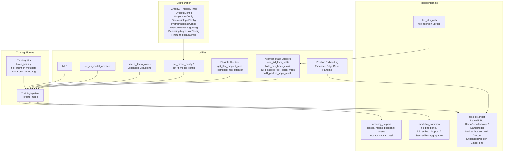

**Diagram sources**
- [model_configs.py:246-326](file://src/conf/model/model_configs.py#L246-L326)
- [modules_utils.py:8-93](file://src/utils/modules_utils.py#L8-L93)
- [utils_graphgpt.py:69-194](file://src/models/graphgpt/utils_graphgpt.py#L69-L194)
- [modeling_helpers.py:38-48](file://src/models/graphgpt/modeling_helpers.py#L38-L48)
- [flex_attn_utils.py:213-289](file://src/utils/flex_attn_utils.py#L213-L289)
- [pipeline.py:149-165](file://src/training/pipeline.py#L149-L165)
- [training_utils.py:7-110](file://src/utils/training_utils.py#L7-L110)

**Section sources**
- [model_configs.py:246-326](file://src/conf/model/model_configs.py#L246-L326)
- [modules_utils.py:8-93](file://src/utils/modules_utils.py#L8-L93)
- [utils_graphgpt.py:69-194](file://src/models/graphgpt/utils_graphgpt.py#L69-L194)
- [modeling_helpers.py:38-48](file://src/models/graphgpt/modeling_helpers.py#L38-L48)
- [flex_attn_utils.py:213-289](file://src/utils/flex_attn_utils.py#L213-L289)
- [pipeline.py:149-165](file://src/training/pipeline.py#L149-L165)
- [training_utils.py:7-110](file://src/utils/training_utils.py#L7-L110)

## Core Components
- MLP class: A flexible feed-forward stack with configurable widths, activation, and dropout
- Architecture setup: Computes intermediate size, number of attention heads, and head dimension from hidden size
- Layer freezing: Utility to freeze embedding and selected transformer layers for LLaMA adaptation with enhanced debugging
- Configuration conversion: Bridges modular configuration to legacy GraphGPTConfig for compatibility
- Backbones and helpers: Shared initialization, dropout, stacked feature aggregation, and loss/logit preparation
- Enhanced error handling: Comprehensive debugging capabilities with print statements for layer freezing operations
- Enhanced parameter validation: Robust validation in configuration system with post-init validation methods
- Flexible attention with dropout: Advanced attention mechanisms with dropout regularization for improved training stability
- Refactored attention infrastructure: Unified mask building utilities supporting both SDPA and flex attention paths
- Enhanced training pipeline: Comprehensive support for flexible attention metadata including sample_lens, split_lens, and attn_modes
- Improved attention mechanism selection: Fixed logic in LlamaDecoderLayer initialization for reliable attention type detection
- Fixed packed sequence processing: Corrected conditional logic for batched vs packed sequence handling and improved hidden state shape management
- Enhanced position embedding handling: Improved edge case management for rotary embedding computation when position_ids are not explicitly provided

**Section sources**
- [modules_utils.py:8-35](file://src/utils/modules_utils.py#L8-L35)
- [modules_utils.py:37-42](file://src/utils/modules_utils.py#L37-L42)
- [modules_utils.py:45-55](file://src/utils/modules_utils.py#L45-L55)
- [configuration_graphgpt.py:212-345](file://src/models/graphgpt/configuration_graphgpt.py#L212-L345)
- [modeling_common.py:160-185](file://src/models/graphgpt/modeling_common.py#L160-L185)
- [utils_graphgpt.py:65-121](file://src/models/graphgpt/utils_graphgpt.py#L65-L121)
- [modeling_helpers.py:43-84](file://src/models/graphgpt/modeling_helpers.py#L43-L84)
- [modeling_helpers.py:110-124](file://src/models/graphgpt/modeling_helpers.py#L110-L124)

## Architecture Overview
The model construction pipeline dynamically builds the GraphGPT model from configuration with enhanced attention infrastructure and robust error handling:
- The configuration system defines modular sub-configurations for dropout, graph input, geometric input, pretraining/denoising heads, and fine-tuning head with enhanced validation
- Utilities compute architecture parameters and construct MLP heads with dropout support
- The training pipeline creates the model, initializes dropout-enabled backbones, and prepares inputs and labels via helpers
- Enhanced error handling provides comprehensive debugging capabilities throughout the pipeline
- Flexible attention infrastructure provides unified mask building for both SDPA and flex attention paths with dropout regularization
- Training pipeline supports flexible attention metadata including sample_lens, split_lens, and attn_modes for advanced attention patterns
- Improved attention mechanism selection ensures reliable detection of attention implementation type in LlamaDecoderLayer
- Fixed packed sequence processing ensures proper handling of batched vs packed sequences with correct hidden state shape management
- Enhanced position embedding handling ensures robust rotary embedding computation across different sequence processing modes

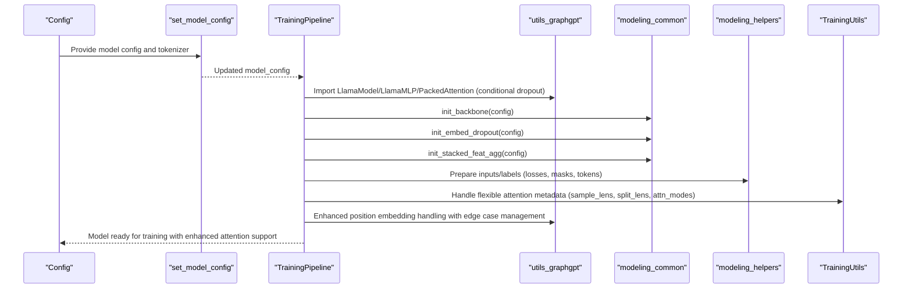

**Diagram sources**
- [base_configs.py:57-81](file://src/conf/base_configs.py#L57-L81)
- [modules_utils.py:57-81](file://src/utils/modules_utils.py#L57-L81)
- [pipeline.py:149-165](file://src/training/pipeline.py#L149-L165)
- [utils_graphgpt.py:176-194](file://src/models/graphgpt/utils_graphgpt.py#L176-L194)
- [modeling_common.py:160-185](file://src/models/graphgpt/modeling_common.py#L160-L185)
- [modeling_helpers.py:38-48](file://src/models/graphgpt/modeling_helpers.py#L38-L48)
- [training_utils.py:30-33](file://src/utils/training_utils.py#L30-L33)

## Detailed Component Analysis

### MLP Class
The MLP class composes a variable-depth feed-forward network:
- Inputs: in_dim, out_dim, mlp (list of hidden widths), hidden_act (activation name), dropout, bias
- Construction: Creates a ModuleList of Linear layers with widths derived from the concatenation of in_dim, mlp, out_dim
- Forward: Applies activation, dropout, and linear projection for each layer in sequence

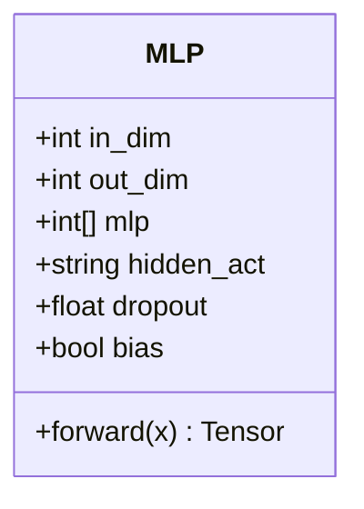

**Diagram sources**
- [modules_utils.py:8-35](file://src/utils/modules_utils.py#L8-L35)

**Section sources**
- [modules_utils.py:8-35](file://src/utils/modules_utils.py#L8-L35)

### Model Architecture Setup
Utility to compute architecture parameters from hidden_size:
- intermediate_size = hidden_size * 4
- head_dim = 64
- num_attention_heads = hidden_size // head_dim
- Asserts hidden_size is divisible by head_dim

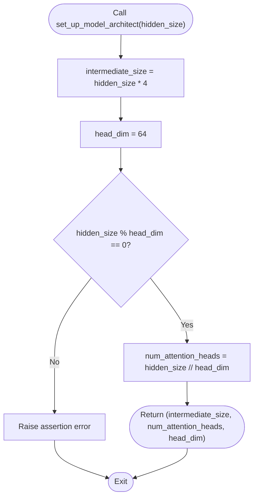

**Diagram sources**
- [modules_utils.py:37-42](file://src/utils/modules_utils.py#L37-L42)

**Section sources**
- [modules_utils.py:37-42](file://src/utils/modules_utils.py#L37-L42)

### Enhanced Layer Freezing Utilities (LLaMA Adaptation)
Freezes embedding and optionally a subset of transformer layers with enhanced debugging capabilities:
- Freeze embedding parameters of model.model.embed_tokens
- Freeze parameters of model.model.layers up to freeze_layer_count
- Enhanced debugging: Print statements for each frozen parameter showing parameter name and layer information

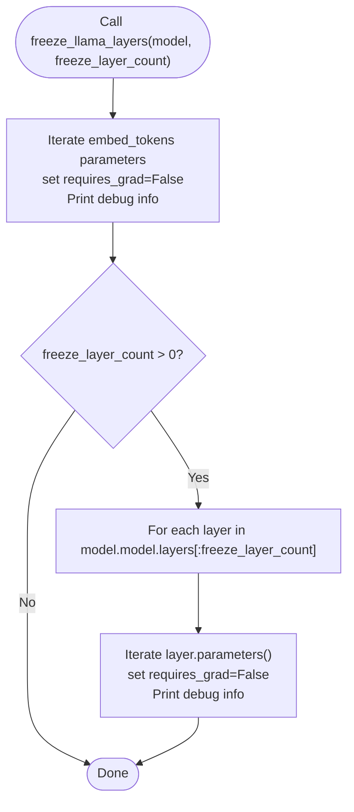

**Diagram sources**
- [modules_utils.py:45-55](file://src/utils/modules_utils.py#L45-L55)

**Section sources**
- [modules_utils.py:45-55](file://src/utils/modules_utils.py#L45-L55)

### Enhanced Configuration System and Legacy Conversion
The modular configuration system supports dynamic model construction with enhanced validation:
- GraphGPTModelConfig aggregates sub-configurations for dropout, graph input, geometric input, pretraining/denoising heads, and fine-tuning head
- convert_to_legacy_config maps structured configuration to legacy GraphGPTConfig for compatibility
- Enhanced validation: Post-initialization validation methods in configuration classes
- Generation configuration includes validation for algorithm types and parameter bounds

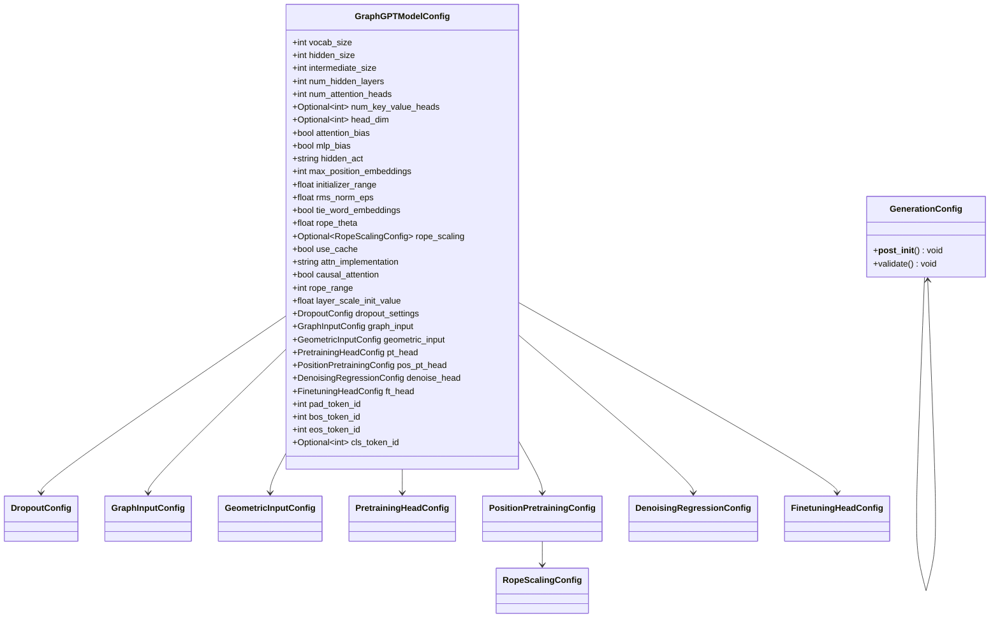

**Diagram sources**
- [model_configs.py:246-326](file://src/conf/model/model_configs.py#L246-L326)
- [model_configs.py:10-24](file://src/conf/model/model_configs.py#L10-L24)
- [generation_configs.py:74-97](file://src/conf/generation/generation_configs.py#L74-L97)

**Section sources**
- [model_configs.py:246-326](file://src/conf/model/model_configs.py#L246-L326)
- [generation_configs.py:74-97](file://src/conf/generation/generation_configs.py#L74-L97)

### Dropout-Enabled LLaMA Extensions
GraphGPT extends LLaMA components to support dropout:
- LlamaMLP adds activation and residual dropout around the MLP pathway
- LlamaDecoderLayer replaces MLP with dropout-enabled variant and adds DropPath and layer-scale lambdas
- LlamaModel constructs a ModuleList of dropout-aware decoder layers with stochastic depth

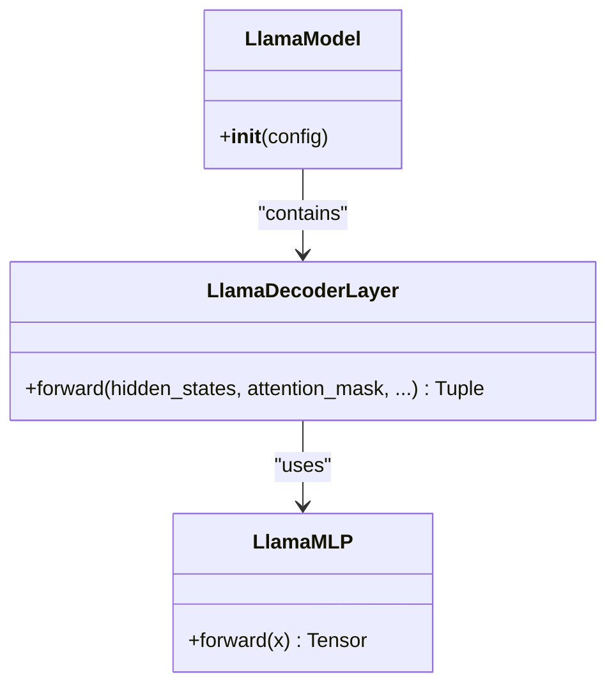

**Diagram sources**
- [utils_graphgpt.py:69-106](file://src/models/graphgpt/utils_graphgpt.py#L69-L106)
- [utils_graphgpt.py:83-174](file://src/models/graphgpt/utils_graphgpt.py#L83-L174)
- [utils_graphgpt.py:176-194](file://src/models/graphgpt/utils_graphgpt.py#L176-L194)

**Section sources**
- [utils_graphgpt.py:69-106](file://src/models/graphgpt/utils_graphgpt.py#L69-L106)
- [utils_graphgpt.py:83-174](file://src/models/graphgpt/utils_graphgpt.py#L83-L174)
- [utils_graphgpt.py:176-194](file://src/models/graphgpt/utils_graphgpt.py#L176-L194)

### Enhanced Attention Mechanism Selection Logic
Improved attention mechanism selection logic in LlamaDecoderLayer initialization:
- Fixed Configuration Detection: Uses `getattr(config, '_attn_implementation', 'sdpa')` for reliable attention type detection
- Conditional Attention Layer Selection: Automatically selects PackedAttention for flex_attention or LlamaAttention for SDPA
- Consistent Configuration Handling: Ensures attention implementation type is consistently detected across all model components
- Robust Default Fallback: Defaults to 'sdpa' when _attn_implementation is not set

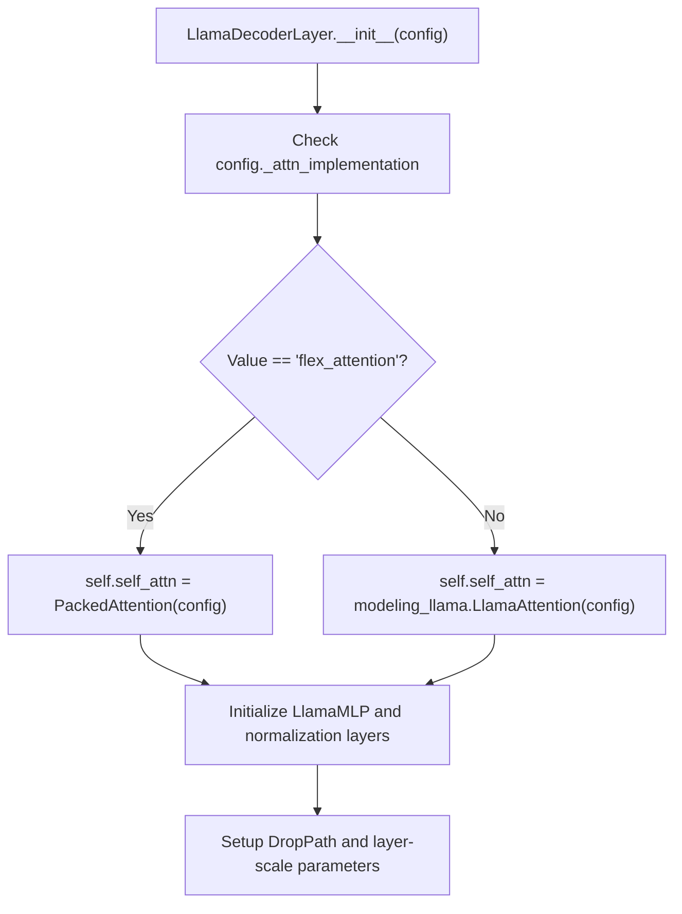

**Diagram sources**
- [utils_graphgpt.py:123-132](file://src/models/graphgpt/utils_graphgpt.py#L123-L132)

**Section sources**
- [utils_graphgpt.py:123-132](file://src/models/graphgpt/utils_graphgpt.py#L123-L132)

### Fixed Packed Sequence Processing
Corrected packed sequence processing with improved conditional logic and hidden state shape handling:

#### Fixed Batched vs Packed Sequence Handling:
- Corrected Conditional Logic: The `PackedAttention.forward()` method now properly distinguishes between batched and packed sequences using `sample_lens is None` check
- Proper Shape Management: Hidden states are correctly shaped for both SDPA (batched) and flex attention (packed) paths
- Hidden State Reshape: Proper handling of hidden state dimensions for different attention implementations

#### Enhanced Hidden State Shape Management:
- SDPA Path: Maintains [batch, seq, hidden_size] shape for standard attention
- Flex Attention Path: Converts to [total_tokens, hidden_size] for packed sequences
- Consistent Output: Both paths return compatible hidden state shapes for subsequent layers

#### Enhanced Batch Size Validation:
- Robust Assertion: `assert batch_size == 1` ensures proper packed sequence processing
- Error Prevention: Prevents runtime errors in batched vs packed sequence handling

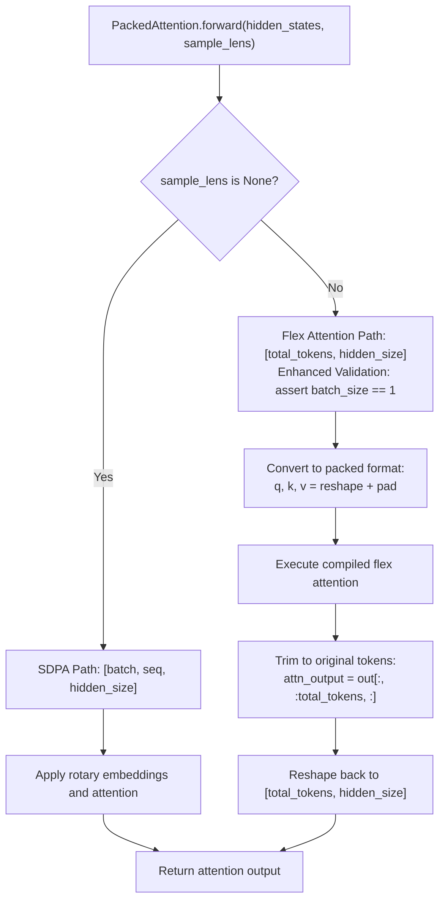

**Diagram sources**
- [utils_graphgpt.py:68-99](file://src/models/graphgpt/utils_graphgpt.py#L68-L99)

**Section sources**
- [utils_graphgpt.py:68-99](file://src/models/graphgpt/utils_graphgpt.py#L68-L99)

### Enhanced Packed Attention Mechanisms
PackedAttention class provides specialized attention for variable-length sequences with improved token packing:
- Inherits from LlamaAttention with enhanced forward_train method
- Processes packed sequences with shape [total_tokens, hidden_size] without batch dimension
- Uses sample_lens parameter to distinguish between actual content tokens and padding tokens
- Supports both SDPA and flex_attention implementations
- Manages rotary position embeddings for packed sequences
- Handles grouped-query attention (GQA) with per-sample attention masks

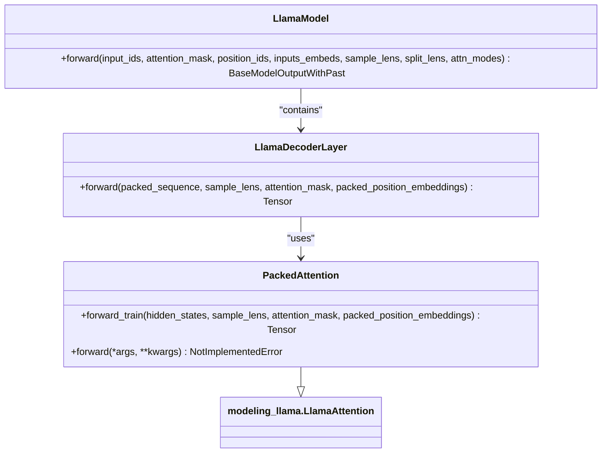

**Diagram sources**
- [utils_graphgpt.py:65-121](file://src/models/graphgpt/utils_graphgpt.py#L65-L121)
- [utils_graphgpt.py:153-201](file://src/models/graphgpt/utils_graphgpt.py#L153-L201)
- [utils_graphgpt.py:204-291](file://src/models/graphgpt/utils_graphgpt.py#L204-L291)

**Section sources**
- [utils_graphgpt.py:65-121](file://src/models/graphgpt/utils_graphgpt.py#L65-L121)
- [utils_graphgpt.py:153-201](file://src/models/graphgpt/utils_graphgpt.py#L153-L201)
- [utils_graphgpt.py:204-291](file://src/models/graphgpt/utils_graphgpt.py#L204-L291)

### Enhanced Position Embedding Handling
Improved position embedding handling with enhanced edge case management for rotary embedding computation:

#### Enhanced LlamaModel Forward Method:
- Robust Position IDs Handling: When position_ids is None, automatically generates sequential position indices
- Edge Case Management: Handles both batched and packed sequence scenarios with proper shape management
- Consistent Position Embedding Creation: Ensures position embeddings are created consistently across different attention paths

#### Enhanced PackedAttention Forward Method:
- Improved Position Embedding Processing: Better handling of packed position embeddings for flex attention
- Shape Consistency: Maintains proper tensor shapes for both SDPA and flex attention paths
- Edge Case Robustness: Handles various input configurations without shape mismatches

#### Enhanced Position Embedding Generation:
- Automatic Position ID Generation: Creates position_ids when not explicitly provided
- Batch Size Validation: Ensures batch_size == 1 for packed sequence processing
- Shape Management: Properly handles [batch, seq, hidden_size] vs [total_tokens, hidden_size] conversions

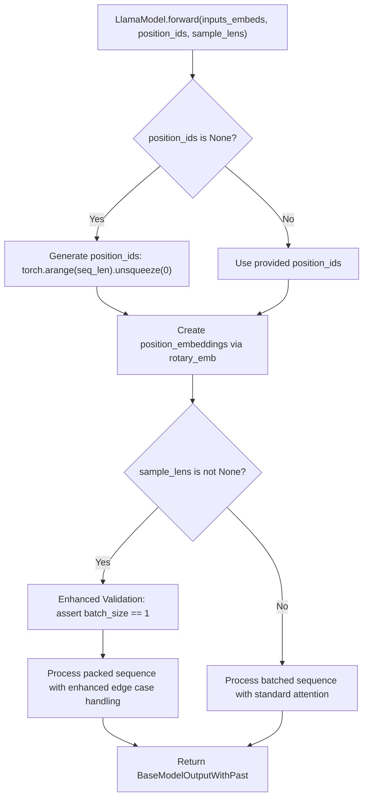

**Diagram sources**
- [utils_graphgpt.py:215-224](file://src/models/graphgpt/utils_graphgpt.py#L215-L224)
- [utils_graphgpt.py:209-216](file://src/models/graphgpt/utils_graphgpt.py#L209-L216)

**Section sources**
- [utils_graphgpt.py:215-224](file://src/models/graphgpt/utils_graphgpt.py#L215-L224)
- [utils_graphgpt.py:209-216](file://src/models/graphgpt/utils_graphgpt.py#L209-L216)

### Model Initialization Helpers
Shared initialization utilities:
- init_backbone selects dropout-enabled or standard LlamaModel based on dropout settings
- init_embed_dropout sets up embedding dropout module conditionally
- StackedFeatAggregation performs gated or sum-based aggregation of stacked features

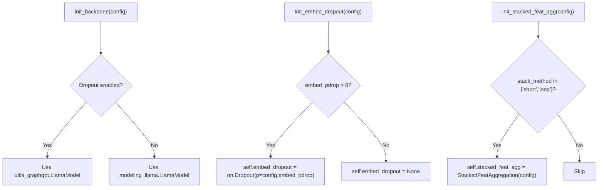

**Diagram sources**
- [modeling_common.py:160-185](file://src/models/graphgpt/modeling_common.py#L160-L185)

**Section sources**
- [modeling_common.py:160-185](file://src/models/graphgpt/modeling_common.py#L160-L185)

### Integration with Training Pipeline
The training pipeline orchestrates configuration-to-model creation with enhanced attention support and debugging capabilities:
- Extracts tokenization, model, training, data, schedule, and optimizer configs
- Initializes stacked features and embedding dimensions
- Creates model using mode-selected constructor and applies dropout-enabled backbone
- Loads checkpoints and prepares optimizer and logging
- Enhanced debugging: Comprehensive print statements for debugging and monitoring
- Handles flexible attention metadata including sample_lens, split_lens, and attn_modes
- Integrates enhanced position embedding handling with robust edge case management

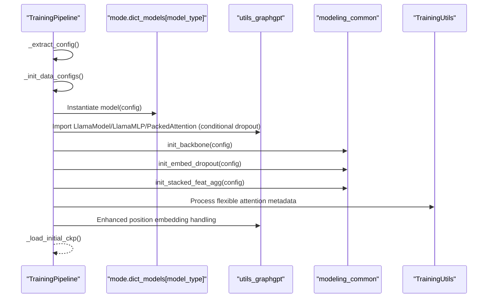

**Diagram sources**
- [pipeline.py:101-165](file://src/training/pipeline.py#L101-L165)
- [utils_graphgpt.py:176-194](file://src/models/graphgpt/utils_graphgpt.py#L176-L194)
- [modeling_common.py:160-185](file://src/models/graphgpt/modeling_common.py#L160-L185)
- [training_utils.py:30-33](file://src/utils/training_utils.py#L30-L33)

**Section sources**
- [pipeline.py:101-165](file://src/training/pipeline.py#L101-L165)

### Concrete Examples and Workflows
- Model configuration workflow:
  - Build modular GraphGPTModelConfig with enhanced validation
  - Convert to legacy GraphGPTConfig if needed
  - Apply set_model_config to derive attention heads and vocab-related parameters
  - Initialize model via TrainingPipeline and dropout-enabled backbones
- Parameter initialization patterns:
  - Use set_up_model_architect to compute intermediate_size and num_attention_heads from hidden_size
  - Use MLP for downstream classification heads with configurable widths and dropout
- Fine-tuning strategies:
  - Use freeze_llama_layers to preserve pre-trained embeddings and freeze selected layers with debugging output
  - Configure ft_head.mlp and dropout for task-specific classification heads
- Enhanced flexible attention workflows:
  - Configure attn_implementation='flex_attention' in GraphGPTModelConfig for advanced attention patterns
  - Use dropout_settings.attention_dropout for attention layer dropout regularization
  - Implement custom dropout score modulation with get_flex_dropout_mod for flex attention
  - Utilize _compiled_flex_attention for efficient GPU execution with dynamic=False compilation
- Enhanced training pipeline workflows:
  - Pass sample_lens, split_lens, and attn_modes as flexible attention metadata
  - Handle both SDPA and flex attention paths based on configuration
  - Support complex attention patterns including causal, full, and noise modes per split
- Enhanced attention mechanism selection:
  - Use reliable configuration detection with getattr(config, '_attn_implementation', 'sdpa')
  - Ensure consistent attention type detection across all model components
  - Default to SDPA when attention implementation is not explicitly configured
- Fixed packed sequence processing workflows:
  - Corrected conditional logic ensures proper handling of batched vs packed sequences
  - Improved hidden state shape management maintains compatibility across attention implementations
  - Enhanced error handling prevents batch size violations in packed sequence processing
- Enhanced position embedding handling workflows:
  - Automatic position_ids generation when not provided
  - Robust edge case management for both batched and packed sequence scenarios
  - Improved shape consistency across different attention implementation paths

**Section sources**
- [model_configs.py:246-326](file://src/conf/model/model_configs.py#L246-L326)
- [configuration_graphgpt.py:212-345](file://src/models/graphgpt/configuration_graphgpt.py#L212-L345)
- [modules_utils.py:37-55](file://src/utils/modules_utils.py#L37-L55)
- [modules_utils.py:8-35](file://src/utils/modules_utils.py#L8-L35)
- [modules_utils.py:45-55](file://src/utils/modules_utils.py#L45-L55)
- [base_configs.py:57-81](file://src/conf/base_configs.py#L57-L81)
- [pipeline.py:149-165](file://src/training/pipeline.py#L149-L165)
- [utils_graphgpt.py:204-291](file://src/models/graphgpt/utils_graphgpt.py#L204-L291)
- [modeling_helpers.py:43-84](file://src/models/graphgpt/modeling_helpers.py#L43-L84)
- [training_utils.py:30-33](file://src/utils/training_utils.py#L30-L33)

## Enhanced Error Handling and Debugging

### Enhanced Layer Freezing Debugging
The layer freezing utility now provides comprehensive debugging output:
- Each frozen parameter prints its name and layer information
- Clear indication of which parameters are being frozen during the process
- Useful for monitoring and debugging fine-tuning strategies

**Section sources**
- [modules_utils.py:45-55](file://src/utils/modules_utils.py#L45-L55)

### Robust Batch Size Validation
Enhanced validation in packed sequence processing:
- `assert batch_size == 1` ensures proper packed sequence handling
- Prevents runtime errors when batch_size is not 1
- Improves error reporting for debugging purposes

**Section sources**
- [utils_graphgpt.py:248-251](file://src/models/graphgpt/utils_graphgpt.py#L248-L251)

### Enhanced Configuration Validation
Post-initialization validation in configuration classes:
- Generation configuration validates algorithm types and parameter bounds
- Raises explicit errors for invalid configurations
- Provides clear error messages for debugging

**Section sources**
- [generation_configs.py:74-97](file://src/conf/generation/generation_configs.py#L74-L97)

### Comprehensive Debugging Capabilities
Enhanced debugging throughout the system:
- Layer freezing prints parameter names and layer information
- Position embedding generation includes automatic position_ids creation
- Training utilities record input shapes and sample data for inspection
- Attention mechanisms include detailed shape management and validation

**Section sources**
- [modules_utils.py:48-54](file://src/utils/modules_utils.py#L48-L54)
- [utils_graphgpt.py:262-268](file://src/models/graphgpt/utils_graphgpt.py#L262-L268)
- [training_utils.py:104-109](file://src/utils/training_utils.py#L104-L109)

## Flexible Attention Infrastructure

### Enhanced Flexible Attention Implementation
The flexible attention system provides advanced attention mechanisms with improved configuration handling and dropout regularization:

#### Key Features:
- Improved Configuration Detection: Uses `getattr(config, '_attn_implementation', 'sdpa')` for reliable attention type detection
- Dropout Score Modulation: Sophisticated dropout scoring using MurmurHash3 finalizer logic for consistent dropout patterns
- Dynamic Threshold Calculation: Pre-computed dropout thresholds for efficient GPU execution
- Seed-Based Randomization: Random seeds captured in closure variables for reproducible dropout patterns
- Compiled Flex Attention: _compiled_flex_attention with dynamic=False for optimal performance
- Multi-Modal Attention: Support for causal, full, and noise attention modes per split
- Memory-Efficient Execution: BlockMask creation with 128-block alignment for optimal memory access

#### Enhanced Attention Mechanism Selection:
1. Reliable Configuration Detection: Uses `getattr(config, '_attn_implementation', 'sdpa')` to detect attention implementation type
2. Conditional Layer Selection: Automatically selects appropriate attention layer based on configuration
3. Consistent Behavior: Ensures attention type detection is consistent across all model components
4. Robust Fallback: Defaults to SDPA when attention implementation is not explicitly configured

#### Dropout Score Modulation Algorithm:
1. Threshold Calculation: Calculate dropout threshold based on probability and bit manipulation
2. Seed Generation: Generate random seed for each forward pass to vary dropout patterns
3. Hash-Based Scoring: Use MurmurHash3 finalizer logic to create deterministic pseudo-random scores
4. Conditional Masking: Apply dropout based on hash values compared to threshold
5. Efficient Implementation: Minimize tensor creation during kernel execution

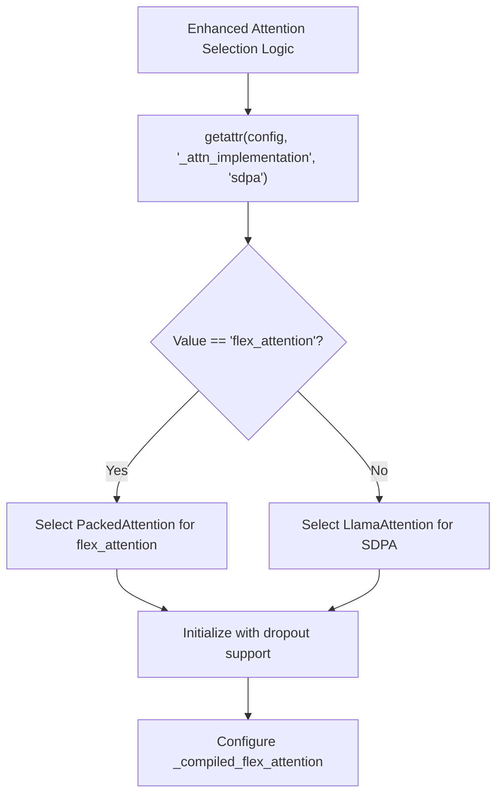

**Diagram sources**
- [utils_graphgpt.py:123-132](file://src/models/graphgpt/utils_graphgpt.py#L123-L132)
- [modeling_helpers.py:43-84](file://src/models/graphgpt/modeling_helpers.py#L43-L84)

**Section sources**
- [utils_graphgpt.py:123-132](file://src/models/graphgpt/utils_graphgpt.py#L123-L132)
- [modeling_helpers.py:43-84](file://src/models/graphgpt/modeling_helpers.py#L43-L84)
- [modeling_helpers.py:96-104](file://src/models/graphgpt/modeling_helpers.py#L96-L104)

### Unified Attention Mask Building Utilities
Comprehensive mask building utilities supporting both SDPA and flex attention paths:

#### SDPA Path Utilities:
- build_4d_from_splits: Creates 4D attention masks from split_lens and attn_modes
- prepare_attention_mask_per_sample: Generates 2D masks for individual samples
- Complex Split Handling: Supports bi-causal prefixes and noise removal patterns
- Padding Extension: Extends masks to full sequence length with -inf padding

#### Enhanced Flex Attention Path Utilities:
- build_flex_block_mask: Creates BlockMask for GPU-accelerated attention with improved configuration handling
- build_packed_flex_block_mask: Specialized for packed sequences with B=1
- build_packed_sdpa_masks: Per-sample SDPA masks for packed sequences
- Block Alignment: 128-block alignment for optimal memory access patterns
- CUDA Fallback: Automatic fallback to 4D masks when CUDA is unavailable

#### Enhanced Attention Mode Support:
- Causal Attention: Standard autoregressive attention with diagonal masking
- Full Attention: Within-split attention without causal constraints
- Noise Attention: Special noise removal patterns with mask modification
- Mixed Modes: Complex combinations of attention modes per split structure

**Section sources**
- [flex_attn_utils.py:20-111](file://src/utils/flex_attn_utils.py#L20-L111)
- [flex_attn_utils.py:118-158](file://src/utils/flex_attn_utils.py#L118-L158)
- [flex_attn_utils.py:161-205](file://src/utils/flex_attn_utils.py#L161-L205)
- [flex_attn_utils.py:211-286](file://src/utils/flex_attn_utils.py#L211-L286)

### Enhanced Attention Mask Update Mechanism
Dynamic attention mask selection based on configuration with improved reliability:
- Enhanced Path Selection: Automatically chooses flex_attention or sdpa based on _attn_implementation with reliable configuration detection
- Parameter Validation: Ensures required parameters (sample_lens, split_lens, attn_modes) are present for flex attention
- Unified Interface: Single interface for both attention implementations
- Enhanced Fallback Support: Graceful fallback to SDPA when flex attention parameters are missing
- Training-Only Flex Attention: Flex attention is only used during training for optimal performance

**Section sources**
- [modeling_helpers.py:110-124](file://src/models/graphgpt/modeling_helpers.py#L110-L124)

## Enhanced Training Pipeline Support

### Enhanced Flexible Attention Metadata Handling
Comprehensive support for flexible attention metadata in training workflows with improved reliability:
- Enhanced Metadata Extraction: TrainingUtils extracts sample_lens, split_lens, and attn_modes from data batches
- Model Integration: Flexible attention metadata passed through model forward methods with improved configuration handling
- Batch Processing: Support for both batched and packed sequence processing
- Enhanced Configuration Propagation: Attention configuration automatically applied to model layers with reliable detection
- Training-Only Flex Attention: Flex attention is only activated during training for optimal performance

#### Enhanced Training Data Flow:
1. Enhanced Data Preparation: Flexible attention metadata prepared alongside standard training data
2. Model Forward Pass: Metadata propagated through attention layers with dropout support and improved configuration handling
3. Loss Computation: Attention patterns influence downstream loss computation
4. Backward Pass: Gradients computed with respect to attention parameters and dropout

#### Enhanced Configuration Integration:
- Enhanced Model-Level: attn_implementation controls attention path selection with reliable configuration detection
- Layer-Level: attention_dropout controls dropout strength for attention layers
- Training-Level: Flexible attention metadata enables complex attention patterns

**Section sources**
- [training_utils.py:30-33](file://src/utils/training_utils.py#L30-L33)
- [training_utils.py:7-110](file://src/utils/training_utils.py#L7-L110)
- [modeling_helpers.py:110-124](file://src/models/graphgpt/modeling_helpers.py#L110-L124)

### Enhanced Model Integration Patterns
Seamless integration of flexible attention into model architecture with improved reliability:
- Enhanced Conditional Layer Selection: LlamaDecoderLayer automatically selects PackedAttention for flex_attention with reliable configuration detection
- Enhanced Dropout Integration: Attention dropout integrated with compiled flex attention
- Position Embedding Support: Rotary position embeddings adapted for packed sequences
- Gradient Checkpointing: Compatible with gradient checkpointing for memory efficiency
- Consistent Attention Type Detection: Reliable attention implementation type detection across all model components

#### Enhanced Integration Points:
- Enhanced Layer Construction: Automatic selection of attention implementation based on configuration with fallback support
- Forward Pass: Unified interface for both SDPA and flex attention paths with improved reliability
- Enhanced Dropout Application: Consistent dropout application across attention mechanisms
- Metadata Handling: Transparent propagation of flexible attention metadata

**Section sources**
- [utils_graphgpt.py:133-185](file://src/models/graphgpt/utils_graphgpt.py#L133-L185)
- [utils_graphgpt.py:188-247](file://src/models/graphgpt/utils_graphgpt.py#L188-L247)

## Dependency Analysis
Key relationships among components:
- Configuration drives model creation and dropout selection with enhanced reliability
- Utilities compute architecture parameters and construct MLP heads with dropout support
- Model internals depend on configuration for attention type, stacking, and positional tokenization
- Training pipeline orchestrates the integration of configuration, utilities, and model internals
- Enhanced flexible attention utilities depend on modeling_helpers for dropout score modulation and compiled attention
- Training pipeline depends on flexible attention metadata for advanced attention patterns
- Enhanced attention mechanism selection ensures reliable configuration detection across all components
- Fixed packed sequence processing ensures proper integration between attention implementations and hidden state management
- Enhanced position embedding handling ensures robust integration across different attention implementations
- Enhanced error handling and debugging capabilities provide comprehensive monitoring and troubleshooting

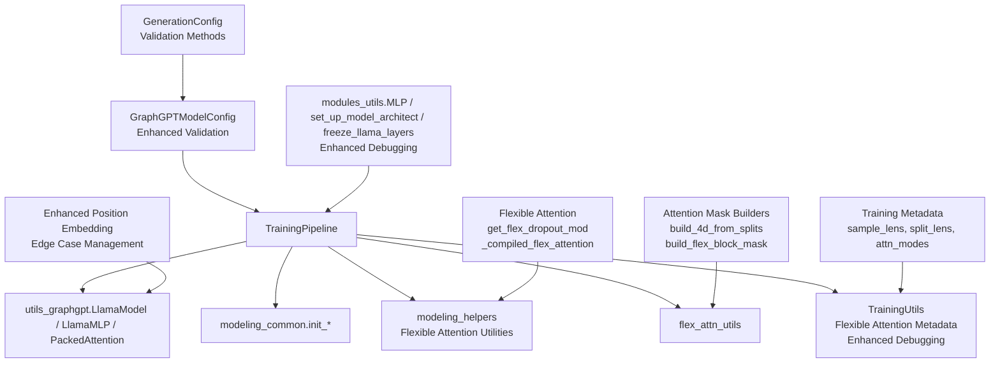

**Diagram sources**
- [model_configs.py:246-326](file://src/conf/model/model_configs.py#L246-L326)
- [modules_utils.py:8-55](file://src/utils/modules_utils.py#L8-L55)
- [utils_graphgpt.py:69-194](file://src/models/graphgpt/utils_graphgpt.py#L69-L194)
- [modeling_common.py:160-185](file://src/models/graphgpt/modeling_common.py#L160-L185)
- [modeling_helpers.py:38-48](file://src/models/graphgpt/modeling_helpers.py#L38-L48)
- [pipeline.py:149-165](file://src/training/pipeline.py#L149-L165)
- [flex_attn_utils.py:213-289](file://src/utils/flex_attn_utils.py#L213-L289)
- [training_utils.py:30-33](file://src/utils/training_utils.py#L30-L33)
- [generation_configs.py:74-97](file://src/conf/generation/generation_configs.py#L74-L97)

**Section sources**
- [model_configs.py:246-326](file://src/conf/model/model_configs.py#L246-L326)
- [modules_utils.py:8-55](file://src/utils/modules_utils.py#L8-L55)
- [utils_graphgpt.py:69-194](file://src/models/graphgpt/utils_graphgpt.py#L69-L194)
- [modeling_common.py:160-185](file://src/models/graphgpt/modeling_common.py#L160-L185)
- [modeling_helpers.py:38-48](file://src/models/graphgpt/modeling_helpers.py#L38-L48)
- [pipeline.py:149-165](file://src/training/pipeline.py#L149-L165)
- [flex_attn_utils.py:213-289](file://src/utils/flex_attn_utils.py#L213-L289)
- [training_utils.py:30-33](file://src/utils/training_utils.py#L30-L33)
- [generation_configs.py:74-97](file://src/conf/generation/generation_configs.py#L74-L97)

## Performance Considerations
- Conditional dropout: Only enable dropout-enabled backbones when dropout settings require it to avoid unnecessary overhead
- Stochastic depth: LlamaDecoderLayer uses DropPath with increasing probabilities along the depth for regularization
- Attention type: Non-causal attention can increase compute; configure carefully for your task
- MLP head efficiency: Use the MLP utility to build compact classification heads tailored to downstream tasks
- Enhanced flexible attention benefits:
  - Improved configuration detection ensures reliable attention type selection
  - Sophisticated dropout regularization with MurmurHash3-based scoring for improved training stability
  - Compiled flex attention with dynamic=False for optimal GPU performance
  - BlockMask creation with 128-block alignment for memory-efficient attention computation
  - Automatic CUDA fallback to SDPA when flex attention is unavailable
  - Unified mask building utilities reduce code duplication and improve maintainability
  - Enhanced training pipeline support enables complex attention patterns without performance overhead
  - Reliable attention mechanism selection reduces configuration-related errors
- Fixed packed sequence processing benefits:
  - Corrected conditional logic eliminates runtime errors in batched vs packed sequence handling
  - Improved hidden state shape management ensures compatibility across attention implementations
  - Enhanced error handling prevents batch size violations and maintains model stability
- Enhanced position embedding handling benefits:
  - Improved edge case management ensures robust rotary embedding computation across different scenarios
  - Automatic position_ids generation prevents shape mismatches and configuration errors
  - Enhanced shape consistency across attention implementations improves model reliability
  - Better error handling prevents runtime failures in edge cases
- Enhanced error handling and debugging benefits:
  - Comprehensive debugging output for layer freezing operations
  - Robust batch size validation prevents runtime errors
  - Post-initialization validation in configuration classes improves reliability
  - Detailed error messages facilitate troubleshooting and development

## Troubleshooting Guide
- Unexpected attention mask shapes: Use helper functions to expand masks from 2D or 3D to 4D as required
- Incorrect sequence lengths for pooling: Ensure pad_token_id is set and helper functions compute sequence lengths correctly
- Loss computation mismatches: Use helper functions to flatten logits and labels and apply appropriate weighting
- Position tokenization issues: Verify bin counts and range settings for line/cube token transformations
- Enhanced flexible attention issues:
  - Verify attn_implementation is set to 'flex_attention' in GraphGPTModelConfig for flex attention features
  - Check dropout_settings.attention_dropout is properly configured for attention layer dropout
  - Ensure sample_lens, split_lens, and attn_modes are provided when using flexible attention metadata
  - Validate that _compiled_flex_attention is available and properly compiled with dynamic=False
  - Confirm get_flex_dropout_mod returns proper score_mod functions for dropout regularization
  - Check CUDA availability for flex attention BlockMask creation; fallback to SDPA when unavailable
  - Verify attention mask utilities handle both SDPA and flex attention paths correctly
  - Ensure reliable attention mechanism selection with proper configuration detection
- Enhanced training pipeline issues:
  - Ensure flexible attention metadata is properly extracted in TrainingUtils.batch_training
  - Check that model.forward methods accept and process flexible attention parameters
  - Validate attention configuration propagation through model layers
  - Verify training-only flex attention activation during training mode
- Fixed packed sequence processing issues:
  - Verify sample_lens parameter is None for batched sequences and contains proper lengths for packed sequences
  - Check that batch_size equals 1 for packed sequence processing to prevent assertion errors
  - Ensure hidden state shape management maintains compatibility between SDPA and flex attention paths
  - Validate proper handling of [batch, seq, hidden_size] vs [total_tokens, hidden_size] shape conversions
  - Confirm conditional logic correctly distinguishes between batched and packed sequence processing
- Enhanced position embedding handling issues:
  - Verify automatic position_ids generation when position_ids is None
  - Check batch size validation for packed sequence processing
  - Ensure proper shape management across different attention implementation paths
  - Validate edge case handling for both batched and packed sequence scenarios
  - Confirm consistent position embedding creation across different attention modes
- Enhanced error handling and debugging issues:
  - Verify layer freezing debugging output shows parameter names and layer information
  - Check batch size validation assertions trigger appropriate error messages
  - Ensure configuration validation methods catch invalid parameter values
  - Validate that debugging print statements provide useful information for troubleshooting

**Section sources**
- [modeling_helpers.py:38-48](file://src/models/graphgpt/modeling_helpers.py#L38-L48)
- [modeling_helpers.py:78-86](file://src/models/graphgpt/modeling_helpers.py#L78-L86)
- [modeling_helpers.py:145-177](file://src/models/graphgpt/modeling_helpers.py#L145-L177)
- [modeling_helpers.py:233-260](file://src/models/graphgpt/modeling_helpers.py#L233-L260)
- [utils_graphgpt.py:240-291](file://src/models/graphgpt/utils_graphgpt.py#L240-L291)
- [flex_attn_utils.py:213-289](file://src/utils/flex_attn_utils.py#L213-L289)
- [training_utils.py:30-33](file://src/utils/training_utils.py#L30-L33)

## Conclusion
The Graph-GPT model utilities and configuration system provide a modular, dynamic framework for constructing neural networks with customizable architectures, activations, and dropout. The MLP class, architecture setup helpers, and layer freezing utilities enable flexible model designs, while the configuration system and training pipeline integrate these components seamlessly for both pretraining and fine-tuning scenarios. The enhanced flexible attention infrastructure with improved configuration handling and fixed attention mechanism selection logic significantly improves the model's attention capabilities, providing advanced regularization techniques, improved training stability, and efficient GPU execution through compiled flex attention. The refactored attention utilities unify SDPA and flex attention paths, while the enhanced training pipeline support enables complex attention patterns through flexible attention metadata handling. The improved attention mechanism selection logic ensures reliable configuration detection across all model components, reducing configuration-related errors and improving overall system reliability. The fixed packed sequence processing addresses critical bugs in batched vs packed sequence handling, ensuring proper hidden state shape management and preventing runtime errors. The enhanced position embedding handling with improved edge case management ensures robust rotary embedding computation across different sequence processing scenarios, providing better reliability and preventing configuration-related errors. The enhanced error handling and debugging capabilities provide comprehensive monitoring and troubleshooting support throughout the system. These improvements collectively enhance the model's ability to process variable-length sequences with sophisticated attention mechanisms, providing better memory utilization, computational performance, and handling of sequences with highly variable lengths for diverse sequence processing tasks.

## Appendices
- Relationship to configuration system: Modular sub-configurations feed into set_model_config and legacy conversion to ensure runtime parameter-driven construction with enhanced validation
- Integration with training modes: Pretrain and finetune models leverage shared helpers and initialization routines to maintain consistency across tasks
- Enhanced flexible attention infrastructure: The enhanced flexible attention system with improved configuration handling, dropout regularization, compiled attention execution, and unified mask building utilities enable sophisticated attention patterns while maintaining performance and compatibility
- Enhanced training pipeline integration: The enhanced training pipeline seamlessly incorporates flexible attention metadata, enabling complex attention patterns without disrupting existing workflows
- Enhanced dropout regularization: The sophisticated dropout score modulation using MurmurHash3 finalizer logic provides consistent and efficient dropout patterns for improved training stability
- Improved attention mechanism selection: The reliable configuration detection and conditional attention layer selection ensure consistent attention type handling across all model components
- Fixed packed sequence processing: The corrected conditional logic and improved hidden state shape management ensure reliable batched vs packed sequence handling, preventing runtime errors and maintaining model stability
- Enhanced position embedding handling: The improved edge case management and automatic position_ids generation ensure robust rotary embedding computation across different attention implementation paths and sequence processing scenarios
- Enhanced error handling and debugging: Comprehensive debugging capabilities provide detailed monitoring and troubleshooting support throughout the entire system
- Enhanced configuration validation: Post-initialization validation methods in configuration classes improve reliability and prevent runtime errors from invalid configurations
