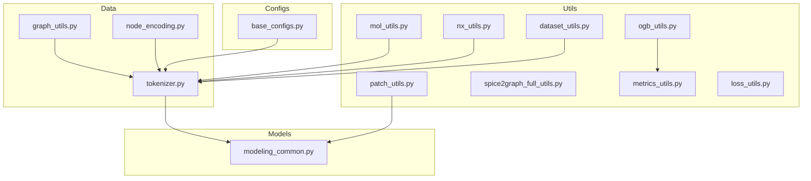
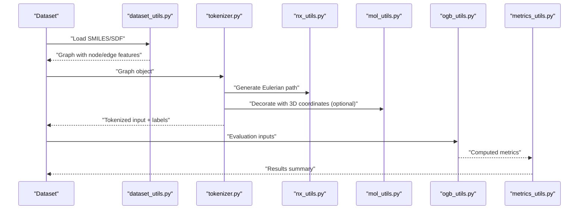
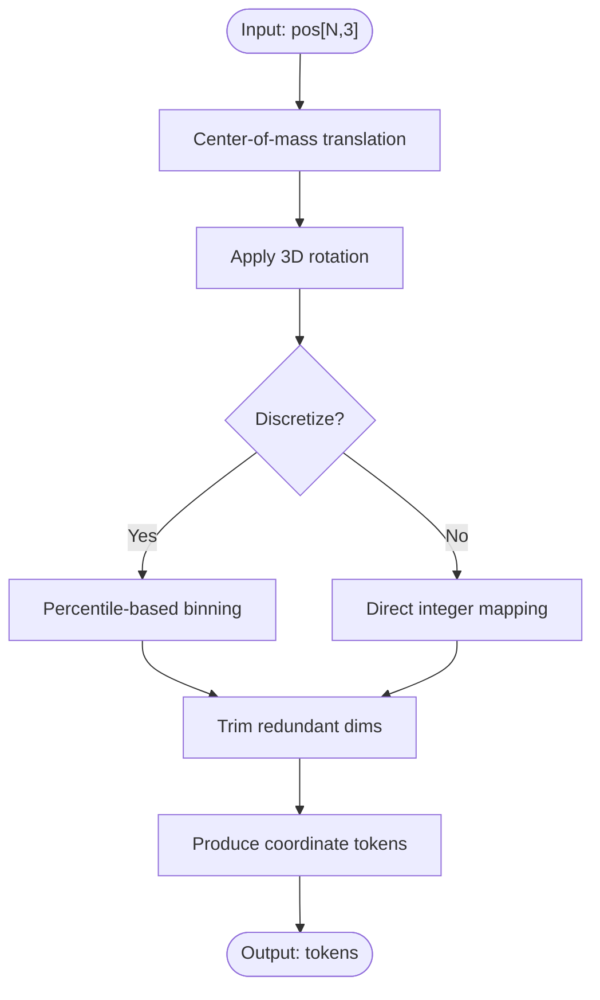
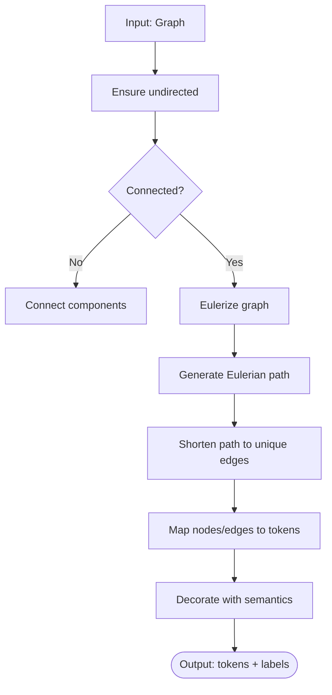
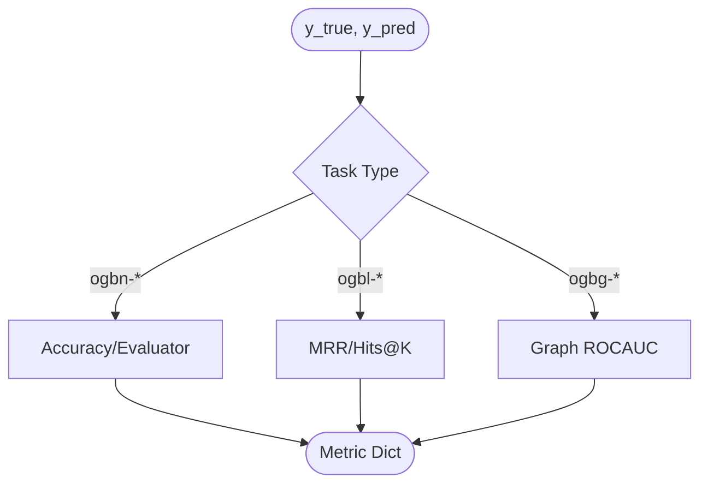
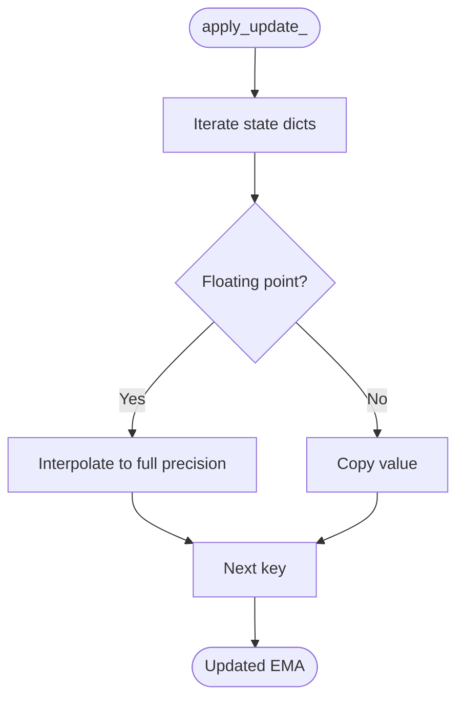
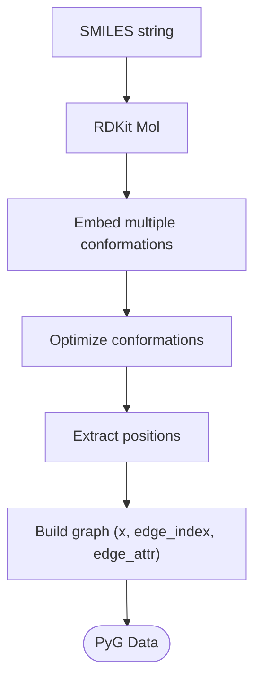
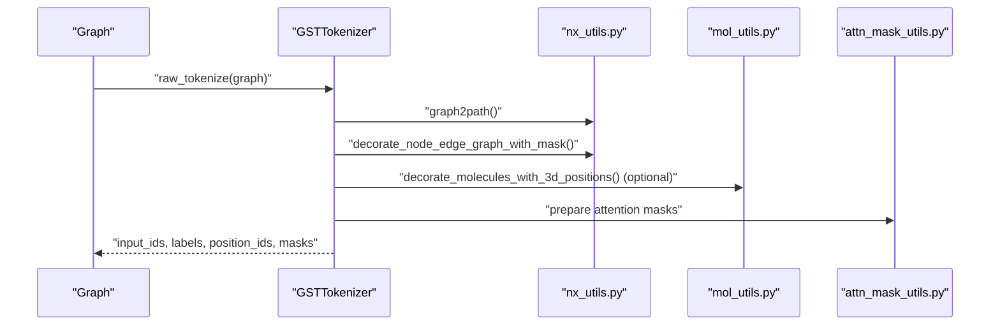
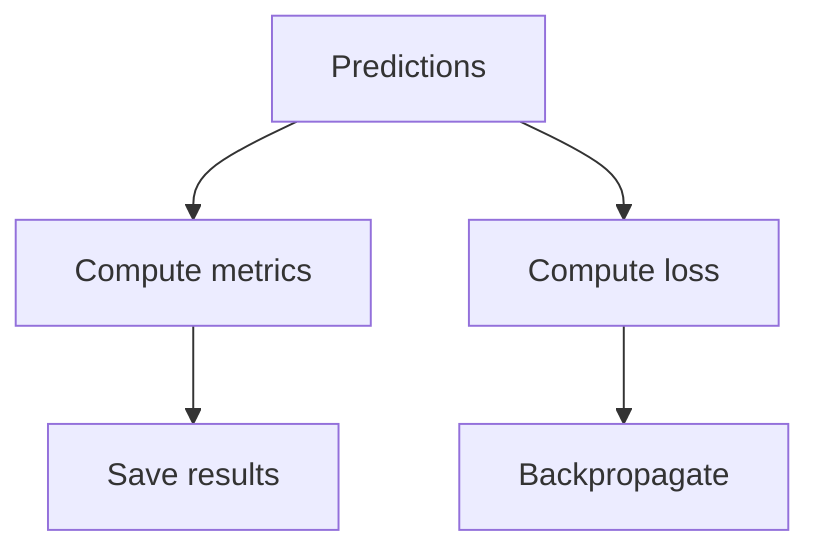
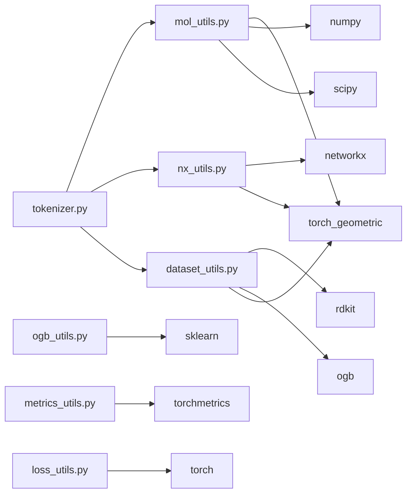

# Scientific Computing

<cite>
**Referenced Files in This Document**
- [mol_utils.py](file://src/utils/mol_utils.py)
- [nx_utils.py](file://src/utils/nx_utils.py)
- [ogb_utils.py](file://src/utils/ogb_utils.py)
- [patch_utils.py](file://src/utils/patch_utils.py)
- [spice2graph_full_utils.py](file://src/utils/spice2graph_full_utils.py)
- [dataset_utils.py](file://src/data/_helpers/dataset_utils.py)
- [graph_utils.py](file://src/data/_helpers/graph_utils.py)
- [node_encoding.py](file://src/data/_helpers/node_encoding.py)
- [tokenizer.py](file://src/data/tokenizer.py)
- [metrics_utils.py](file://src/utils/metrics_utils.py)
- [loss_utils.py](file://src/utils/loss_utils.py)
- [modeling_common.py](file://src/models/graphgpt/modeling_common.py)
- [base_configs.py](file://src/conf/base_configs.py)
</cite>

## Table of Contents
1. [Introduction](#introduction)
2. [Project Structure](#project-structure)
3. [Core Components](#core-components)
4. [Architecture Overview](#architecture-overview)
5. [Detailed Component Analysis](#detailed-component-analysis)
6. [Dependency Analysis](#dependency-analysis)
7. [Performance Considerations](#performance-considerations)
8. [Troubleshooting Guide](#troubleshooting-guide)
9. [Conclusion](#conclusion)
10. [Appendices](#appendices)

## Introduction
This document presents a comprehensive guide to the scientific computing utilities in Graph-GPT, focusing on molecular graph processing, network analysis, OGB dataset integration, and custom patch operations. It explains mathematical computations, geometric transformations, and scientific data processing functions, and demonstrates how they integrate with external libraries such as RDKit, NetworkX, SciPy, and OGB. Practical guidance is provided for numerical precision, performance optimization, and specialized use cases in scientific computing.

## Project Structure
The scientific computing utilities are primarily located under src/utils and src/data, with supporting configurations and model components. The key areas include:
- Molecular graph utilities and 3D geometry processing
- NetworkX-based graph structure analysis and tokenization
- OGB dataset evaluators and metrics
- Custom patch operations for training stability
- Scientific data loaders and graph preprocessing helpers
- Tokenization pipeline integrating structure, semantics, and instructions

**Diagram sources**
- [mol_utils.py:1-256](file://src/utils/mol_utils.py#L1-L256)
- [nx_utils.py:1-631](file://src/utils/nx_utils.py#L1-L631)
- [ogb_utils.py:1-214](file://src/utils/ogb_utils.py#L1-L214)
- [patch_utils.py:1-43](file://src/utils/patch_utils.py#L1-L43)
- [spice2graph_full_utils.py:1-564](file://src/utils/spice2graph_full_utils.py#L1-L564)
- [dataset_utils.py:1-800](file://src/data/_helpers/dataset_utils.py#L1-L800)
- [graph_utils.py:1-87](file://src/data/_helpers/graph_utils.py#L1-L87)
- [node_encoding.py:1-85](file://src/data/_helpers/node_encoding.py#L1-L85)
- [tokenizer.py:1-800](file://src/data/tokenizer.py#L1-L800)
- [metrics_utils.py:1-349](file://src/utils/metrics_utils.py#L1-L349)
- [loss_utils.py:1-413](file://src/utils/loss_utils.py#L1-L413)
- [modeling_common.py:1-204](file://src/models/graphgpt/modeling_common.py#L1-L204)
- [base_configs.py:1-302](file://src/conf/base_configs.py#L1-L302)

**Section sources**
- [mol_utils.py:1-256](file://src/utils/mol_utils.py#L1-L256)
- [nx_utils.py:1-631](file://src/utils/nx_utils.py#L1-L631)
- [ogb_utils.py:1-214](file://src/utils/ogb_utils.py#L1-L214)
- [patch_utils.py:1-43](file://src/utils/patch_utils.py#L1-L43)
- [spice2graph_full_utils.py:1-564](file://src/utils/spice2graph_full_utils.py#L1-L564)
- [dataset_utils.py:1-800](file://src/data/_helpers/dataset_utils.py#L1-L800)
- [graph_utils.py:1-87](file://src/data/_helpers/graph_utils.py#L1-L87)
- [node_encoding.py:1-85](file://src/data/_helpers/node_encoding.py#L1-L85)
- [tokenizer.py:1-800](file://src/data/tokenizer.py#L1-L800)
- [metrics_utils.py:1-349](file://src/utils/metrics_utils.py#L1-L349)
- [loss_utils.py:1-413](file://src/utils/loss_utils.py#L1-L413)
- [modeling_common.py:1-204](file://src/models/graphgpt/modeling_common.py#L1-L204)
- [base_configs.py:1-302](file://src/conf/base_configs.py#L1-L302)

## Core Components
- Molecular graph utilities: 3D rotation, translation, discretization, and coordinate decoration for tokenization.
- NetworkX integration: Eulerian path generation, graph connectivity augmentation, and structure-aware tokenization.
- OGB dataset handling: Evaluators and metric formatting for node/link/graph tasks.
- Custom patch operations: EMA weight updates tailored for mixed precision training.
- Scientific datasets: RDKit-based SMILES/SDF conversion, chiral centers, and position augmentation.
- Tokenization pipeline: Structure semantics mapping, masking strategies, and attention mask preparation.

**Section sources**
- [mol_utils.py:55-256](file://src/utils/mol_utils.py#L55-L256)
- [nx_utils.py:17-631](file://src/utils/nx_utils.py#L17-L631)
- [ogb_utils.py:1-214](file://src/utils/ogb_utils.py#L1-L214)
- [patch_utils.py:1-43](file://src/utils/patch_utils.py#L1-L43)
- [dataset_utils.py:40-720](file://src/data/_helpers/dataset_utils.py#L40-L720)
- [tokenizer.py:30-620](file://src/data/tokenizer.py#L30-L620)

## Architecture Overview
The scientific computing pipeline integrates molecular and graph data with tokenization and evaluation:

**Diagram sources**
- [dataset_utils.py:344-720](file://src/data/_helpers/dataset_utils.py#L344-L720)
- [tokenizer.py:425-612](file://src/data/tokenizer.py#L425-L612)
- [nx_utils.py:351-422](file://src/utils/nx_utils.py#L351-L422)
- [mol_utils.py:210-256](file://src/utils/mol_utils.py#L210-L256)
- [ogb_utils.py:173-204](file://src/utils/ogb_utils.py#L173-L204)
- [metrics_utils.py:16-349](file://src/utils/metrics_utils.py#L16-L349)

## Detailed Component Analysis

### Molecular Graph Utilities
This module provides:
- 3D rotation matrices and randomized rotations for conformational invariance
- Coordinate discretization using percentile-based binning
- Decorative tokenization of 3D coordinates with structure-aware trimming

Key functions and behaviors:
- Rotation matrices and randomized rotations for 3D coordinates
- Discretization with configurable bins and bounds
- Coordinate decoration pipeline for tokenization with trimming of redundant dimensions

**Diagram sources**
- [mol_utils.py:145-180](file://src/utils/mol_utils.py#L145-L180)
- [mol_utils.py:210-256](file://src/utils/mol_utils.py#L210-L256)

**Section sources**
- [mol_utils.py:55-256](file://src/utils/mol_utils.py#L55-L256)

### NetworkX Integration
This module enables:
- Eulerian path generation for graph traversal
- Connectivity augmentation for disconnected graphs
- Structure-aware mapping of nodes/edges to tokens
- Instruction-based and structure-based augmentation

Highlights:
- Path generation via Eulerization and path shortening
- Node/edge mapping to tokens with optional cyclic permutations
- Decoration of nodes/edges/graphs with semantic attributes

**Diagram sources**
- [nx_utils.py:351-422](file://src/utils/nx_utils.py#L351-L422)
- [nx_utils.py:425-437](file://src/utils/nx_utils.py#L425-L437)

**Section sources**
- [nx_utils.py:17-631](file://src/utils/nx_utils.py#L17-L631)

### OGB Dataset Handling
This module provides:
- Evaluation wrappers for multiple OGB tasks (node/link/graph)
- ROC-AUC computation and MRR/Hits@K formatting
- CSV output formatting for leaderboard submission

**Diagram sources**
- [ogb_utils.py:13-29](file://src/utils/ogb_utils.py#L13-L29)
- [ogb_utils.py:173-204](file://src/utils/ogb_utils.py#L173-L204)

**Section sources**
- [ogb_utils.py:1-214](file://src/utils/ogb_utils.py#L1-L214)

### Custom Patch Operations
This module patches Exponential Moving Average (EMA) updates to handle mixed precision training scenarios where model weights are half precision while EMA maintains full precision.

**Diagram sources**
- [patch_utils.py:10-42](file://src/utils/patch_utils.py#L10-L42)

**Section sources**
- [patch_utils.py:1-43](file://src/utils/patch_utils.py#L1-L43)

### Scientific Data Processing Functions
RDKit-based SMILES/SDF processing:
- Embedding and optimizing 3D conformations
- Chiral center feature extraction
- Position augmentation with RDKit-generated coordinates

**Diagram sources**
- [dataset_utils.py:40-73](file://src/data/_helpers/dataset_utils.py#L40-L73)
- [dataset_utils.py:129-167](file://src/data/_helpers/dataset_utils.py#L129-L167)

Additional helpers:
- Converting directed graphs to undirected with edge type preservation
- Removing self-loops and cycles
- Global/local node ID enumeration

**Section sources**
- [dataset_utils.py:40-720](file://src/data/_helpers/dataset_utils.py#L40-L720)
- [graph_utils.py:5-87](file://src/data/_helpers/graph_utils.py#L5-L87)
- [node_encoding.py:5-85](file://src/data/_helpers/node_encoding.py#L5-L85)

### Tokenization Pipeline
The tokenizer orchestrates:
- Eulerian path generation and structure mapping
- Semantics-to-tokens mapping for nodes/edges/graphs
- Masking strategies and attention mask preparation
- Instruction and structure augmentation
- Packing multiple sequences with EOS separators

**Diagram sources**
- [tokenizer.py:425-612](file://src/data/tokenizer.py#L425-L612)
- [nx_utils.py:554-591](file://src/utils/nx_utils.py#L554-L591)
- [mol_utils.py:210-256](file://src/utils/mol_utils.py#L210-L256)

**Section sources**
- [tokenizer.py:30-800](file://src/data/tokenizer.py#L30-L800)

### Metrics and Loss Utilities
- Metrics: AUROC, accuracy, MAE/MSE, clustering recall/precision
- Loss: Contrastive-like loss variants, cosine similarity scoring, distributed gather
- Schedulers: Warmup/Cosine/OneCycle/LR range test

**Diagram sources**
- [metrics_utils.py:16-349](file://src/utils/metrics_utils.py#L16-L349)
- [loss_utils.py:25-167](file://src/utils/loss_utils.py#L25-L167)

**Section sources**
- [metrics_utils.py:1-349](file://src/utils/metrics_utils.py#L1-L349)
- [loss_utils.py:1-413](file://src/utils/loss_utils.py#L1-L413)

### Model-Level Scientific Constants
- Position-type masks for molecular 3D tokens
- Attention mask preparation helpers for causal masking

**Section sources**
- [modeling_common.py:44-48](file://src/models/graphgpt/modeling_common.py#L44-L48)
- [modeling_common.py:41-43](file://src/models/graphgpt/modeling_common.py#L41-L43)

## Dependency Analysis
The scientific computing utilities exhibit low coupling and high cohesion:
- mol_utils.py depends on torch, numpy, scipy.spatial.transform, and torch_geometric
- nx_utils.py depends on networkx, torch, and torch_geometric utilities
- ogb_utils.py depends on sklearn metrics and OGB evaluators
- dataset_utils.py integrates RDKit, OGB, and torch_geometric
- tokenizer.py orchestrates utilities and prepares inputs for training

**Diagram sources**
- [mol_utils.py:1-7](file://src/utils/mol_utils.py#L1-L7)
- [nx_utils.py:1-11](file://src/utils/nx_utils.py#L1-L11)
- [ogb_utils.py:1-6](file://src/utils/ogb_utils.py#L1-L6)
- [dataset_utils.py:23-28](file://src/data/_helpers/dataset_utils.py#L23-L28)
- [tokenizer.py:10-18](file://src/data/tokenizer.py#L10-L18)
- [metrics_utils.py:1-6](file://src/utils/metrics_utils.py#L1-L6)
- [loss_utils.py:1-6](file://src/utils/loss_utils.py#L1-L6)

**Section sources**
- [mol_utils.py:1-7](file://src/utils/mol_utils.py#L1-L7)
- [nx_utils.py:1-11](file://src/utils/nx_utils.py#L1-L11)
- [ogb_utils.py:1-6](file://src/utils/ogb_utils.py#L1-L6)
- [dataset_utils.py:23-28](file://src/data/_helpers/dataset_utils.py#L23-L28)
- [tokenizer.py:10-18](file://src/data/tokenizer.py#L10-L18)
- [metrics_utils.py:1-6](file://src/utils/metrics_utils.py#L1-L6)
- [loss_utils.py:1-6](file://src/utils/loss_utils.py#L1-L6)

## Performance Considerations
- Mixed precision training: Use EMA patch to maintain fp32 weights during fp16 training.
- Distributed training: Utilize gather layers and all-reduce for contrastive losses.
- Memory-efficient conversions: Prefer torch-based undirected graph conversion to avoid large intermediate copies.
- Token packing: Pack multiple sequences with EOS separators to improve throughput.
- Numerical stability: Use epsilon constants and clamp operations to prevent overflow/underflow.

[No sources needed since this section provides general guidance]

## Troubleshooting Guide
Common issues and resolutions:
- OGB evaluator failures: Ensure correct task names and shapes for predictions.
- 3D coordinate inconsistencies: Verify node counts match between RDKit and processed graphs.
- NetworkX path generation: Handle disconnected graphs by connecting components before Eulerization.
- EMA weight updates: Apply patched EMA to avoid silent weight drift in mixed precision.

**Section sources**
- [ogb_utils.py:13-29](file://src/utils/ogb_utils.py#L13-L29)
- [dataset_utils.py:667-700](file://src/data/_helpers/dataset_utils.py#L667-L700)
- [nx_utils.py:326-328](file://src/utils/nx_utils.py#L326-L328)
- [patch_utils.py:10-42](file://src/utils/patch_utils.py#L10-L42)

## Conclusion
Graph-GPT’s scientific computing utilities provide a robust foundation for molecular and network science tasks. They combine geometric transformations, graph traversal strategies, and standardized evaluation protocols with modern training techniques. By leveraging these components, researchers can efficiently process scientific data, integrate with external libraries, and optimize performance for large-scale experiments.

[No sources needed since this section summarizes without analyzing specific files]

## Appendices
- Configuration synchronization and initialization helpers for stacked features and embedding dimensions.

**Section sources**
- [base_configs.py:206-248](file://src/conf/base_configs.py#L206-L248)
