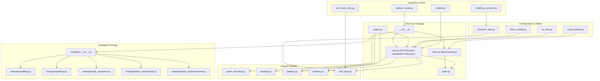
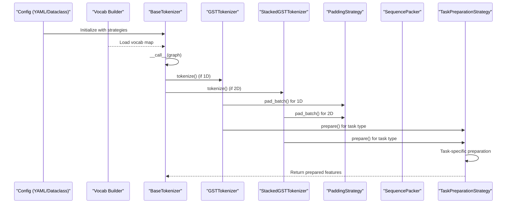
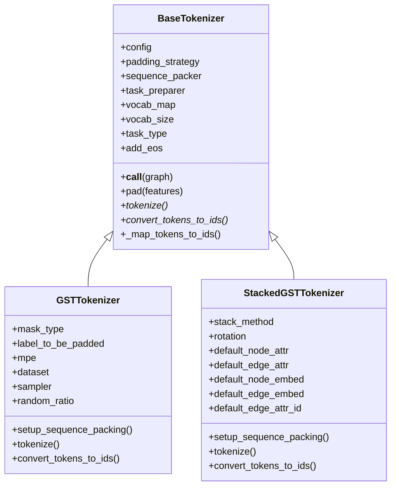
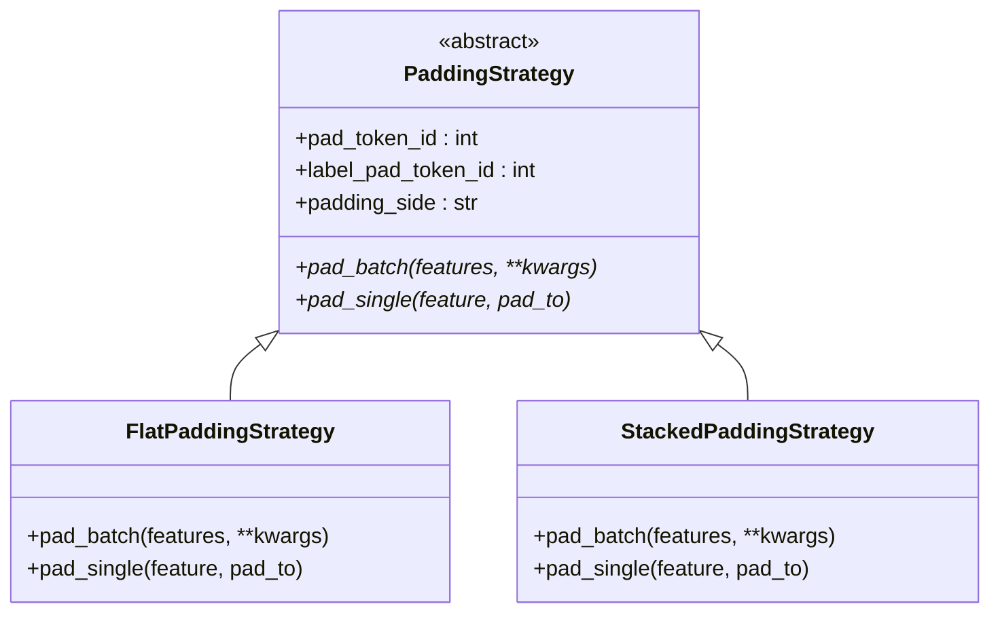
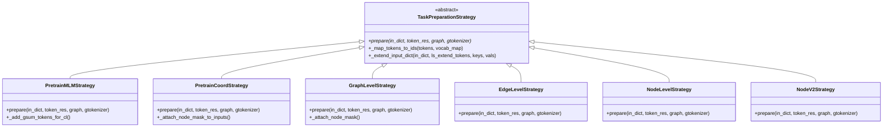
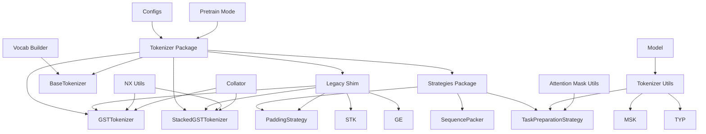

# Tokenization Support

<cite>
**Referenced Files in This Document**
- [base.py](file://src/data/tokenizer/base.py)
- [core.py](file://src/data/tokenizer/core.py)
- [__init__.py](file://src/data/tokenizer/__init__.py)
- [_legacy.py](file://src/data/tokenizer/_legacy.py)
- [strategies/__init__.py](file://src/data/tokenizer/strategies/__init__.py)
- [strategies/padding.py](file://src/data/tokenizer/strategies/padding.py)
- [strategies/packing.py](file://src/data/tokenizer/strategies/packing.py)
- [strategies/task_prep/base.py](file://src/data/tokenizer/strategies/task_prep/base.py)
- [strategies/task_prep/pretrain.py](file://src/data/tokenizer/strategies/task_prep/pretrain.py)
- [strategies/task_prep/supervised.py](file://src/data/tokenizer/strategies/task_prep/supervised.py)
- [types.py](file://src/data/tokenizer/types.py)
- [graph_encoding.py](file://src/data/tokenizer/graph_encoding.py)
- [stacking.py](file://src/data/tokenizer/stacking.py)
- [padding.py](file://src/data/tokenizer/padding.py)
- [masking.py](file://src/data/tokenizer/masking.py)
- [task_prep.py](file://src/data/tokenizer/task_prep.py)
- [tokenizer_utils.py](file://src/utils/tokenizer_utils.py)
- [token_configs.py](file://src/conf/tokenization/token_configs.py)
- [vocab_builder.py](file://src/data/vocab_builder.py)
- [base.yaml](file://configs/tokenization/base.yaml)
- [pcqm4m-v2.yaml](file://configs/tokenization/graph_lvl/pcqm4m-v2.yaml)
- [nx_utils.py](file://src/utils/nx_utils.py)
- [attn_mask_utils.py](file://src/utils/attn_mask_utils.py)
- [modeling_common.py](file://src/models/graphgpt/modeling_common.py)
- [pretrain_mode.py](file://src/training/pretrain_mode.py)
- [utils_graphgpt.py](file://src/models/graphgpt/utils_graphgpt.py)
- [collator.py](file://src/data/collator.py)
</cite>

## Update Summary
**Changes Made**
- Updated to reflect Enhanced performance considerations with detailed explanations of the new optimization techniques in SequencePacker
- Added comprehensive documentation of memory allocation reduction through batch extend() operations
- Enhanced computational efficiency improvements for large datasets
- Updated performance considerations section with specific optimization techniques
- Added detailed analysis of SequencePacker's memory-efficient design patterns

## Table of Contents
1. [Introduction](#introduction)
2. [Project Structure](#project-structure)
3. [Core Components](#core-components)
4. [Architecture Overview](#architecture-overview)
5. [Detailed Component Analysis](#detailed-component-analysis)
6. [Strategy Pattern Implementation](#strategy-pattern-implementation)
7. [Dependency Analysis](#dependency-analysis)
8. [Performance Considerations](#performance-considerations)
9. [Migration Guide](#migration-guide)
10. [Troubleshooting Guide](#troubleshooting-guide)
11. [Conclusion](#conclusion)
12. [Appendices](#appendices)

## Introduction
This document explains the Graph-GPT tokenization support utilities with a focus on the new composition-based architecture featuring the BaseTokenizer abstract foundation and strategy pattern implementation. The system has evolved from a monolithic GSTTokenizer implementation to a modular design that separates concerns through pluggable strategies for padding, sequence packing, and task preparation. It covers tokenizer configuration, special token handling, and sequence encoding/decoding operations with comprehensive strategy composition support.

**Updated** The tokenization system now uses a composition-based architecture with BaseTokenizer as the abstract foundation and specialized strategy components for different aspects of tokenization, with enhanced performance optimizations in SequencePacker for memory efficiency and computational speed.

## Project Structure
The tokenization system is organized around a composition-based architecture with clear separation of concerns through strategy pattern implementation. The system maintains backward compatibility while providing a modern, extensible design with performance optimizations.



**Diagram sources**
- [__init__.py:1-124](file://src/data/tokenizer/__init__.py#L1-L124)
- [_legacy.py:1-42](file://src/data/tokenizer/_legacy.py#L1-L42)
- [base.py:1-187](file://src/data/tokenizer/base.py#L1-L187)
- [core.py:1-545](file://src/data/tokenizer/core.py#L1-L545)
- [strategies/__init__.py:1-30](file://src/data/tokenizer/strategies/__init__.py#L1-L30)
- [strategies/padding.py:1-239](file://src/data/tokenizer/strategies/padding.py#L1-L239)
- [strategies/packing.py:1-144](file://src/data/tokenizer/strategies/packing.py#L1-L144)
- [strategies/task_prep/base.py:1-83](file://src/data/tokenizer/strategies/task_prep/base.py#L1-L83)
- [strategies/task_prep/pretrain.py:1-223](file://src/data/tokenizer/strategies/task_prep/pretrain.py#L1-L223)
- [strategies/task_prep/supervised.py:1-253](file://src/data/tokenizer/strategies/task_prep/supervised.py#L1-L253)

**Section sources**
- [__init__.py:1-124](file://src/data/tokenizer/__init__.py#L1-L124)
- [_legacy.py:1-42](file://src/data/tokenizer/_legacy.py#L1-L42)
- [base.py:1-187](file://src/data/tokenizer/base.py#L1-L187)
- [core.py:1-545](file://src/data/tokenizer/core.py#L1-L545)
- [strategies/__init__.py:1-30](file://src/data/tokenizer/strategies/__init__.py#L1-L30)

## Core Components
The tokenization system is built around the BaseTokenizer abstract foundation with specialized concrete implementations and strategy components:

- **BaseTokenizer (Abstract)**: Abstract base class defining the composition-based architecture with strategy pattern implementation
- **GSTTokenizer**: Concrete tokenizer for 1D token sequences suitable for pre-training, node-level, and edge-level tasks
- **StackedGSTTokenizer**: Concrete tokenizer for 2D stacked token sequences suitable for graph-level tasks with advanced attribute stacking
- **Strategy Components**: Pluggable components for padding, sequence packing, and task preparation
- **Composition Architecture**: Clear separation of concerns through strategy pattern with BaseTokenizer as the foundation

Key responsibilities:
- Abstract base class defining common interface and composition pattern
- Strategy-based tokenization pipeline with pluggable components
- Backward compatibility through legacy shim layer
- Comprehensive vocabulary management and special token handling
- Integration with model input preparation and attention mask utilities

**Updated** The system now uses a composition-based architecture with BaseTokenizer as the abstract foundation and strategy pattern for modularity, with enhanced performance optimizations in SequencePacker.

**Section sources**
- [base.py:13-187](file://src/data/tokenizer/base.py#L13-L187)
- [core.py:13-545](file://src/data/tokenizer/core.py#L13-L545)
- [strategies/padding.py:9-239](file://src/data/tokenizer/strategies/padding.py#L9-L239)
- [strategies/packing.py:12-144](file://src/data/tokenizer/strategies/packing.py#L12-L144)
- [strategies/task_prep/base.py:11-83](file://src/data/tokenizer/strategies/task_prep/base.py#L11-L83)

## Architecture Overview
The tokenization pipeline follows a composition-based architecture with BaseTokenizer as the abstract foundation and specialized strategy components for different aspects of tokenization.



**Diagram sources**
- [base.py:137-187](file://src/data/tokenizer/base.py#L137-L187)
- [core.py:100-183](file://src/data/tokenizer/core.py#L100-L183)
- [core.py:330-448](file://src/data/tokenizer/core.py#L330-L448)
- [strategies/padding.py:24-138](file://src/data/tokenizer/strategies/padding.py#L24-L138)
- [strategies/padding.py:144-238](file://src/data/tokenizer/strategies/padding.py#L144-L238)
- [strategies/task_prep/base.py:14-34](file://src/data/tokenizer/strategies/task_prep/base.py#L14-L34)

## Detailed Component Analysis

### BaseTokenizer: Abstract Foundation
BaseTokenizer serves as the abstract foundation for all tokenizer implementations with composition-based architecture:

- **Abstract Interface**: Defines common methods and properties for all tokenizers
- **Strategy Composition**: Manages padding_strategy, sequence_packer, and task_preparer instances
- **Vocabulary Management**: Centralized vocabulary loading and token ID mapping
- **Task Type Validation**: Ensures supported task types and proper configuration
- **Pipeline Execution**: Coordinates full tokenization process through __call__ method

Key methods and responsibilities:
- Strategy management: __init__(), pad(), _map_tokens_to_ids()
- Abstract methods: tokenize(), convert_tokens_to_ids()
- Special tokens: get_*_token(), get_*_token_id()
- Pipeline orchestration: __call__() method



**Diagram sources**
- [base.py:13-187](file://src/data/tokenizer/base.py#L13-L187)
- [core.py:13-54](file://src/data/tokenizer/core.py#L13-L54)
- [core.py:198-328](file://src/data/tokenizer/core.py#L198-L328)

**Section sources**
- [base.py:13-187](file://src/data/tokenizer/base.py#L13-L187)
- [core.py:13-545](file://src/data/tokenizer/core.py#L13-L545)

### GSTTokenizer: 1D Tokenization Implementation
GSTTokenizer implements the BaseTokenizer abstract interface for 1D token sequences:

- **1D Sequence Processing**: Handles flat token sequences for pre-training and level tasks
- **Sequence Packing**: Optional integration with SequencePacker for efficient training
- **Task-Specific Preparation**: Delegates to appropriate task preparation strategies
- **Special Token Handling**: Comprehensive special token management and positioning

Key methods and responsibilities:
- Tokenization: tokenize() for 1D sequences, convert_tokens_to_ids() for ID conversion
- Sequence packing: setup_sequence_packing() for pre-training optimization
- Masking: _get_label_token_id_to_be_padded() for label token handling
- Integration: works with FlatPaddingStrategy and various task preparation strategies

**Section sources**
- [core.py:13-100](file://src/data/tokenizer/core.py#L13-L100)
- [core.py:100-183](file://src/data/tokenizer/core.py#L100-L183)

### StackedGSTTokenizer: 2D Tokenization Implementation
StackedGSTTokenizer extends BaseTokenizer for 2D stacked token sequences:

- **2D Sequence Processing**: Handles stacked token sequences with multiple feature components
- **Attribute Stacking**: Advanced stacking strategies for node and edge attributes
- **Rotation Support**: 3D coordinate rotation for molecular and structural tasks
- **Embedding Integration**: Supports embedding vectors alongside token sequences

Key methods and responsibilities:
- Tokenization: tokenize() for 2D stacked sequences, convert_tokens_to_ids() for ID conversion
- Default attributes: get_default_node_attr(), get_default_edge_attr() for compatibility
- Rotation: DICT_pos_func for 3D coordinate transformations
- Sequence packing: setup_sequence_packing() for stacked sequences
- Integration: works with StackedPaddingStrategy and specialized task preparation strategies

**Section sources**
- [core.py:198-328](file://src/data/tokenizer/core.py#L198-L328)
- [core.py:330-448](file://src/data/tokenizer/core.py#L330-L448)

## Strategy Pattern Implementation

### Padding Strategy Components
The padding strategy provides flexible sequence padding for different tokenization scenarios:

- **FlatPaddingStrategy**: Handles 1D token sequences with standard padding
- **StackedPaddingStrategy**: Handles 2D stacked token sequences with component-wise padding
- **Flexible Configuration**: Configurable padding side, token IDs, and tensor formats



**Diagram sources**
- [strategies/padding.py:9-40](file://src/data/tokenizer/strategies/padding.py#L9-L40)
- [strategies/padding.py:42-138](file://src/data/tokenizer/strategies/padding.py#L42-L138)
- [strategies/padding.py:141-238](file://src/data/tokenizer/strategies/padding.py#L141-L238)

**Section sources**
- [strategies/padding.py:1-239](file://src/data/tokenizer/strategies/padding.py#L1-L239)

### Sequence Packing Strategy
SequencePacker enables efficient training through sequence packing with enhanced performance optimizations:

- **Packing Algorithm**: Combines multiple short sequences into longer sequences
- **Random Sampling**: Configurable random ratio for diverse sequence mixing
- **Separator Tokens**: Automatic insertion of separator tokens between packed sequences
- **Embedding Support**: Handles embedding vectors during sequence packing
- **Memory Optimization**: Batch extend operations reduce memory allocation overhead
- **Computational Efficiency**: Pre-computed separators and cached token components minimize repeated calculations

**Enhanced Performance Features**:
- **Batch Extend Operations**: Uses `extend()` method to append multiple elements at once, reducing individual memory allocations
- **Pre-computed Separators**: Creates separator tokens once and caches them for all iterations
- **Token Component Caching**: Caches token dimensionality to avoid repeated type checking
- **Efficient Length Tracking**: Maintains running token count to prevent unnecessary operations
- **Memory-Efficient Packing**: Reduces memory fragmentation through batched operations

**Section sources**
- [strategies/packing.py:1-144](file://src/data/tokenizer/strategies/packing.py#L1-L144)

### Task Preparation Strategy Components
Task preparation strategies handle task-specific input preparation:

- **PretrainMLMStrategy**: Masked language model pre-training with scheduled masking
- **PretrainCoordStrategy**: Coordinate prediction pre-training with node masking
- **GraphLevelStrategy**: Graph-level classification and regression tasks
- **EdgeLevelStrategy**: Edge-level link prediction tasks
- **NodeLevelStrategy**: Node-level classification and regression tasks
- **NodeV2Strategy**: Advanced node-level token classification tasks



**Diagram sources**
- [strategies/task_prep/base.py:11-83](file://src/data/tokenizer/strategies/task_prep/base.py#L11-L83)
- [strategies/task_prep/pretrain.py:7-143](file://src/data/tokenizer/strategies/task_prep/pretrain.py#L7-L143)
- [strategies/task_prep/pretrain.py:169-223](file://src/data/tokenizer/strategies/task_prep/pretrain.py#L169-L223)
- [strategies/task_prep/supervised.py:7-52](file://src/data/tokenizer/strategies/task_prep/supervised.py#L7-L52)
- [strategies/task_prep/supervised.py:55-186](file://src/data/tokenizer/strategies/task_prep/supervised.py#L55-L186)
- [strategies/task_prep/supervised.py:189-253](file://src/data/tokenizer/strategies/task_prep/supervised.py#L189-L253)

**Section sources**
- [strategies/task_prep/base.py:1-83](file://src/data/tokenizer/strategies/task_prep/base.py#L1-L83)
- [strategies/task_prep/pretrain.py:1-223](file://src/data/tokenizer/strategies/task_prep/pretrain.py#L1-L223)
- [strategies/task_prep/supervised.py:1-253](file://src/data/tokenizer/strategies/task_prep/supervised.py#L1-L253)

## Dependency Analysis
The tokenization system exhibits clear module boundaries with composition-based architecture and lazy loading for backward compatibility:

- **Abstract Foundation**: BaseTokenizer defines common interface and composition pattern
- **Concrete Implementations**: GSTTokenizer and StackedGSTTokenizer implement specific tokenization strategies
- **Strategy Components**: Pluggable components for padding, packing, and task preparation
- **Legacy Compatibility**: _legacy.py maintains backward compatibility for existing imports
- **Configuration Driven**: All components rely on configuration dataclasses and YAML files



**Diagram sources**
- [__init__.py:1-124](file://src/data/tokenizer/__init__.py#L1-L124)
- [_legacy.py:1-42](file://src/data/tokenizer/_legacy.py#L1-L42)
- [base.py:1-187](file://src/data/tokenizer/base.py#L1-L187)
- [core.py:1-545](file://src/data/tokenizer/core.py#L1-L545)
- [strategies/__init__.py:1-30](file://src/data/tokenizer/strategies/__init__.py#L1-L30)

**Section sources**
- [__init__.py:1-124](file://src/data/tokenizer/__init__.py#L1-L124)
- [_legacy.py:1-42](file://src/data/tokenizer/_legacy.py#L1-L42)
- [base.py:1-187](file://src/data/tokenizer/base.py#L1-L187)
- [core.py:1-545](file://src/data/tokenizer/core.py#L1-L545)
- [strategies/__init__.py:1-30](file://src/data/tokenizer/strategies/__init__.py#L1-L30)

## Performance Considerations
The composition-based architecture provides several performance benefits with enhanced optimizations in SequencePacker:

### Memory Allocation Reduction
**SequencePacker Optimizations**:
- **Batch Extend Operations**: Uses `extend()` method to append multiple elements at once, significantly reducing individual memory allocations and improving cache locality
- **Pre-computed Separators**: Creates separator tokens once and caches them for all iterations, avoiding repeated token creation overhead
- **Token Component Caching**: Caches token dimensionality to avoid repeated type checking and isinstance operations
- **Efficient Length Tracking**: Maintains running token count to prevent unnecessary operations and reduce computational overhead

### Computational Efficiency Improvements
- **Modular Design**: Each strategy component can be optimized independently for specific use cases
- **Lazy Loading**: __init__.py prevents circular imports and reduces startup time
- **Strategy Reusability**: Common strategies can be shared across different tokenizer implementations
- **Memory Efficiency**: Clear separation of concerns reduces memory overhead through optimized data structures
- **Extensibility**: New strategies can be added without modifying existing components, maintaining performance characteristics

### Large Dataset Optimization
- **Streaming Support**: SequencePacker handles both Dataset and IterableDataset seamlessly
- **Memory-Constrained Packing**: Efficiently manages memory usage during sequence packing for large datasets
- **Random Sampling**: Configurable random ratio balances diversity and computational efficiency
- **Embedding Vector Optimization**: Special handling for embedding vectors reduces memory overhead during packing operations

**Enhanced Performance Features**:
- **Reduced Memory Allocations**: Batch operations minimize Python object creation overhead
- **Improved Cache Performance**: Pre-computed values and cached results improve CPU cache utilization
- **Optimized Data Structures**: Efficient list operations and minimal copying during sequence packing
- **Scalable Memory Usage**: Memory usage scales linearly with sequence length rather than exponentially

**Section sources**
- [strategies/packing.py:82-97](file://src/data/tokenizer/strategies/packing.py#L82-L97)
- [strategies/packing.py:114-125](file://src/data/tokenizer/strategies/packing.py#L114-L125)
- [strategies/packing.py:127-143](file://src/data/tokenizer/strategies/packing.py#L127-L143)

## Migration Guide
Migration from the old monolithic GSTTokenizer to the new composition-based architecture:

### From Old Monolithic Tokenizer
**Before (Legacy):**
```python
from src.data.tokenizer import GSTTokenizer

tokenizer = GSTTokenizer(config)
tokenizer.mpe = 512  # For packing
tokenizer.dataset = train_dataset
```

**After (New):**
```python
from src.data.tokenizer import GSTTokenizer
from src.data.tokenizer.strategies import SequencePacker

tokenizer = GSTTokenizer(config)
tokenizer.setup_sequence_packing(mpe=512, dataset=train_dataset)
```

### Using Custom Strategies
```python
from src.data.tokenizer import BaseTokenizer
from src.data.tokenizer.strategies import (
    FlatPaddingStrategy,
    get_task_strategy,
)

# Create with custom strategies
tokenizer = BaseTokenizer(
    config,
    padding_strategy=FlatPaddingStrategy(padding_side="left"),
    task_preparer=get_task_strategy("node")(),
)
```

**Updated** The migration maintains backward compatibility while providing more flexible strategy composition options with enhanced performance optimizations.

**Section sources**
- [__init__.py:108-122](file://src/data/tokenizer/__init__.py#L108-L122)
- [core.py:82-98](file://src/data/tokenizer/core.py#L82-L98)
- [core.py:312-328](file://src/data/tokenizer/core.py#L312-L328)

## Troubleshooting Guide
Common issues and resolutions for the new composition-based architecture:

- **Import Issues**: Use the new package structure with proper imports from src.data.tokenizer
- **Tokenizer Class Availability**: Both GSTTokenizer and StackedGSTTokenizer are available through the package interface
- **Strategy Access**: New strategies are available directly from src.data.tokenizer.strategies
- **Legacy Import Problems**: The _legacy.py shim maintains backward compatibility for existing import patterns
- **Strategy Configuration**: Configure strategies through BaseTokenizer constructor or setup methods
- **Custom Strategy Development**: Implement abstract strategy classes from the base strategy modules
- **Performance Issues**: SequencePacker optimizations provide significant memory and computational improvements for large datasets

**Updated** The system now uses a cleaner import structure with proper package organization and comprehensive strategy pattern support, with enhanced performance optimizations in SequencePacker.

**Section sources**
- [__init__.py:116-122](file://src/data/tokenizer/__init__.py#L116-L122)
- [base.py:23-50](file://src/data/tokenizer/base.py#L23-L50)
- [strategies/__init__.py:1-30](file://src/data/tokenizer/strategies/__init__.py#L1-L30)

## Conclusion
The Graph-GPT tokenization system provides a modern, composition-based framework built around the BaseTokenizer abstract foundation and strategy pattern implementation. The transition from a monolithic GSTTokenizer to a modular architecture with BaseTokenizer as the abstract foundation offers improved maintainability, flexibility, and performance. The system supports multiple tokenizer types through strategy composition, comprehensive vocabulary management, and seamless integration with various model architectures and task types.

**Enhanced Performance Features**: The new composition-based architecture with BaseTokenizer foundation provides better separation of concerns, strategy reusability, and extensibility while preserving all functionality from the previous implementation. The SequencePacker component includes significant performance optimizations including batch extend operations, pre-computed separators, and memory-efficient packing algorithms that reduce memory allocation overhead and improve computational efficiency for large datasets.

**Updated** The new composition-based architecture with BaseTokenizer foundation provides better separation of concerns, strategy reusability, and extensibility while preserving all functionality from the previous implementation, with enhanced performance optimizations in SequencePacker for memory efficiency and computational speed.

## Appendices

### Configuration Reference
The tokenization system uses structured configuration through dataclasses and YAML files with strategy-based approach:

- **TokenizationConfig**: Main configuration dataclass with structure and semantics settings
- **Strategy Configuration**: Individual configuration for padding, packing, and task preparation strategies
- **YAML Configuration**: Environment-specific configurations for different datasets and task types

**Section sources**
- [token_configs.py:49-126](file://src/conf/tokenization/token_configs.py#L49-L126)
- [base.yaml:1-117](file://configs/tokenization/base.yaml#L1-L117)
- [pcqm4m-v2.yaml:1-114](file://configs/tokenization/graph_lvl/pcqm4m-v2.yaml#L1-L114)

### Tokenizer Package Structure
The tokenizer package provides organized access to all tokenization functionality with composition-based design:

- **Public Interface**: Clean API through __init__.py with proper exports
- **Abstract Foundation**: BaseTokenizer as the abstract foundation for all implementations
- **Concrete Implementations**: GSTTokenizer and StackedGSTTokenizer for specific use cases
- **Strategy Components**: Pluggable components for different aspects of tokenization
- **Legacy Support**: Backward compatibility maintained through _legacy.py

**Section sources**
- [__init__.py:1-124](file://src/data/tokenizer/__init__.py#L1-L124)
- [_legacy.py:1-42](file://src/data/tokenizer/_legacy.py#L1-L42)
- [base.py:1-187](file://src/data/tokenizer/base.py#L1-L187)

### Strategy Pattern Benefits
The composition-based architecture with strategy pattern provides:

- **Separation of Concerns**: Clear separation between tokenization logic and strategy components
- **Flexibility**: Easy swapping and configuration of different strategies
- **Extensibility**: Simple addition of new strategies without modifying existing code
- **Testability**: Independent testing of strategy components
- **Reusability**: Shared strategies across different tokenizer implementations
- **Performance Optimization**: Strategy-specific optimizations without affecting other components

**Section sources**
- [base.py:13-50](file://src/data/tokenizer/base.py#L13-L50)
- [strategies/padding.py:9-40](file://src/data/tokenizer/strategies/padding.py#L9-L40)
- [strategies/task_prep/base.py:11-34](file://src/data/tokenizer/strategies/task_prep/base.py#L11-L34)
