# Training Support

<cite>
**Referenced Files in This Document**
- [training_utils.py](file://src/utils/training_utils.py)
- [opt_utils.py](file://src/utils/opt_utils.py)
- [flex_attn_utils.py](file://src/utils/flex_attn_utils.py)
- [attn_mask_utils.py](file://src/utils/attn_mask_utils.py)
- [modeling_helpers.py](file://src/models/graphgpt/modeling_helpers.py)
- [utils_graphgpt.py](file://src/models/graphgpt/utils_graphgpt.py)
- [core.py](file://src/data/tokenizer/core.py)
- [pipeline.py](file://src/training/pipeline.py)
- [mode.py](file://src/training/mode.py)
- [pretrain_mode.py](file://src/training/pretrain_mode.py)
- [base_configs.py](file://src/conf/base_configs.py)
- [loader_utils.py](file://src/utils/loader_utils.py)
- [stats_configs.py](file://src/conf/stats_configs.py)
- [log_eval_dump_utils.py](file://src/utils/log_eval_dump_utils.py)
- [base.yaml](file://configs/training/base.yaml)
- [train_pretrain.py](file://examples/train_pretrain.py)
- [train_supervised.py](file://examples/train_supervised.py)
- [ds_config2.json](file://examples/ds_config2.json)
</cite>

## Update Summary
**Changes Made**
- Enhanced TrainingStats class with new get_loss_values() method that batches multiple .item() calls into a single synchronization point, dramatically reducing cudaDeviceSynchronize overhead
- Improved logging infrastructure across pre-training and fine-tuning modes with better speed calculations and reduced GPU-CPU transfers
- Training configuration files updated with new parameters for optimized workflows including steps_per_saving and enhanced logging controls
- Added comprehensive synchronization analysis and optimization guidance for GPU efficiency

## Table of Contents
1. [Introduction](#introduction)
2. [Project Structure](#project-structure)
3. [Core Components](#core-components)
4. [Architecture Overview](#architecture-overview)
5. [Detailed Component Analysis](#detailed-component-analysis)
6. [Dependency Analysis](#dependency-analysis)
7. [Performance Considerations](#performance-considerations)
8. [Enhanced Error Handling and Defensive Programming](#enhanced-error-handling-and-defensive-programming)
9. [Attention Mechanisms and Sample Length Processing](#attention-mechanisms-and-sample-length-processing)
10. [Training Statistics and Logging Infrastructure](#training-statistics-and-logging-infrastructure)
11. [Troubleshooting Guide](#troubleshooting-guide)
12. [Conclusion](#conclusion)
13. [Appendices](#appendices)

## Introduction
This document explains the training support utilities for Graph-GPT with a focus on optimization algorithms, learning rate scheduling, and training workflow management. It covers optimizer configurations, gradient clipping, and training state management. Advanced topics include mixed precision training, distributed training utilities, and integration with DeepSpeed and PyTorch DDP. The system now includes enhanced attention mechanisms with streamlined sample length processing, comprehensive attention utility support for improved training efficiency and flexibility, and significantly optimized logging infrastructure with reduced GPU-CPU synchronization overhead.

**Updated** Enhanced attention system now focuses exclusively on sample_lens parameter processing, implementing conditional attention mode switching between flex_attention and SDPA paths based on training mode and configuration. Training utilities have been improved with better error handling and streamlined attention metadata processing. The TrainingStats class now includes a sophisticated get_loss_values() method that dramatically reduces cudaDeviceSynchronize overhead by batching multiple .item() calls into a single synchronization point.

## Project Structure
The training system is organized around a shared pipeline and mode-specific strategies with enhanced attention mechanism support and optimized logging infrastructure:
- Unified pipeline orchestrates shared setup and delegates to pretrain or finetune modes with streamlined attention processing.
- Mode-specific implementations handle data preparation, model creation, optimizer setup, and training loops with attention mechanism integration.
- Utilities provide optimizer initialization, mixed precision training, gradient clipping, and distributed samplers with robust attention mask handling.
- Streamlined attention utilities support split-length processing and comprehensive sample length handling for complex attention patterns.
- Enhanced logging infrastructure with improved speed calculations and reduced GPU-CPU transfers for better training efficiency.

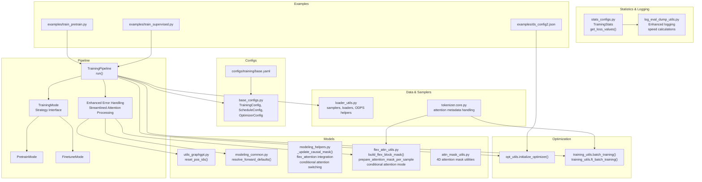

**Diagram sources**
- [pipeline.py:15-96](file://src/training/pipeline.py#L15-L96)
- [mode.py:5-90](file://src/training/mode.py#L5-L90)
- [pretrain_mode.py:48-501](file://src/training/pretrain_mode.py#L48-L501)
- [opt_utils.py:7-38](file://src/utils/opt_utils.py#L7-L38)
- [training_utils.py:7-206](file://src/utils/training_utils.py#L7-L206)
- [base_configs.py:132-164](file://src/conf/base_configs.py#L132-L164)
- [loader_utils.py:17-752](file://src/utils/loader_utils.py#L17-L752)
- [utils_graphgpt.py:574-581](file://src/models/graphgpt/utils_graphgpt.py#L574-L581)
- [modeling_helpers.py:110-124](file://src/models/graphgpt/modeling_helpers.py#L110-L124)
- [flex_attn_utils.py:161-205](file://src/utils/flex_attn_utils.py#L161-L205)
- [attn_mask_utils.py:12-128](file://src/utils/attn_mask_utils.py#L12-L128)
- [core.py:244](file://src/data/tokenizer/core.py#L244)
- [stats_configs.py:29-116](file://src/conf/stats_configs.py#L29-L116)
- [log_eval_dump_utils.py:520-593](file://src/utils/log_eval_dump_utils.py#L520-L593)
- [base.yaml:1-118](file://configs/training/base.yaml#L1-L118)
- [train_pretrain.py:12-18](file://examples/train_pretrain.py#L12-L18)
- [train_supervised.py:12-18](file://examples/train_supervised.py#L12-L18)
- [ds_config2.json:1-43](file://examples/ds_config2.json#L1-L43)

**Section sources**
- [pipeline.py:15-96](file://src/training/pipeline.py#L15-L96)
- [mode.py:5-90](file://src/training/mode.py#L5-L90)
- [base_configs.py:132-164](file://src/conf/base_configs.py#L132-L164)
- [base.yaml:1-118](file://configs/training/base.yaml#L1-L118)

## Core Components
- TrainingPipeline: Orchestrates shared setup (configs, EMA, DeepSpeed flag, distributed), delegates to mode-specific handlers, manages lifecycle (checkpointing, cleanup), and implements streamlined attention processing with sample length handling.
- TrainingMode: Strategy interface for pretrain vs finetune, defining hooks for data preparation, optimizer setup, training setup, and the training loop with attention mechanism integration.
- PretrainMode and FinetuneMode: Implement mode-specific behaviors including data samplers, collators, schedules, and training loops with enhanced attention processing for split-length attention patterns.
- Optimizer utilities: Initialize AdamW optimizer, OneCycleLR scheduler, and GradScaler for mixed precision with robust fallbacks.
- Training utilities: Single-step forward/backward/update for both pretrain and finetune, with DeepSpeed and AMP paths including streamlined attention metadata processing.
- Configuration utilities: Centralized training, schedule, and optimizer configuration dataclasses and YAML defaults with attention mechanism configurations.
- Loader utilities: Deterministic and distributed samplers, ODPS table dataset helpers, and loader construction with robust attention mask handling.
- Attention utilities: Comprehensive flexible attention support with split-length processing, sample length handling, and attention mode management using streamlined sample_lens approach with conditional switching between flex_attention and SDPA paths.
- **Enhanced TrainingStats**: Provides optimized logging infrastructure with get_loss_values() method that batches multiple .item() calls into a single synchronization point to dramatically reduce cudaDeviceSynchronize overhead.

**Updated** Attention utilities now emphasize sample_lens parameter processing as the primary mechanism for attention configuration, implementing conditional attention mode switching between flex_attention and SDPA paths based on training mode and configuration. The TrainingStats class includes a sophisticated get_loss_values() method that dramatically reduces GPU-CPU synchronization overhead by batching .item() calls.

**Section sources**
- [pipeline.py:15-96](file://src/training/pipeline.py#L15-L96)
- [mode.py:5-90](file://src/training/mode.py#L5-L90)
- [pretrain_mode.py:48-501](file://src/training/pretrain_mode.py#L48-L501)
- [opt_utils.py:7-38](file://src/utils/opt_utils.py#L7-L38)
- [training_utils.py:7-206](file://src/utils/training_utils.py#L7-L206)
- [base_configs.py:132-164](file://src/conf/base_configs.py#L132-L164)
- [loader_utils.py:17-752](file://src/utils/loader_utils.py#L17-L752)
- [utils_graphgpt.py:574-581](file://src/models/graphgpt/utils_graphgpt.py#L574-L581)
- [stats_configs.py:29-116](file://src/conf/stats_configs.py#L29-L116)

## Architecture Overview
The training architecture separates concerns between orchestration and mode-specific logic, enabling consistent workflows across pretraining and finetuning with streamlined attention mechanism support for sample_lens-focused attention patterns and conditional attention mode switching. The enhanced logging infrastructure provides optimized speed calculations and reduced GPU-CPU transfers for improved training efficiency.

```mermaid
sequenceDiagram
participant User as "User Script"
participant Pipe as "TrainingPipeline"
participant Mode as "TrainingMode"
participant Data as "Data & Samplers"
participant Model as "Model"
participant Att as "Attention Processor"
participant Flex as "Flexible Attention Utils"
participant Opt as "Optimizer/Scaler/Scheduler"
participant Stats as "TrainingStats"
participant Log as "Logging Infrastructure"
participant DS as "DeepSpeed/DDP"
User->>Pipe : run()
Pipe->>Pipe : _extract_config(), _setup_deepspeed_flag(), _setup_distributed()
Pipe->>Data : prepare_data()
Pipe->>Model : _create_model()
Pipe->>Mode : setup_optimizer()
Mode->>DS : initialize (DeepSpeed) or wrap (DDP)
Mode->>Opt : initialize AdamW + OneCycleLR + GradScaler
Pipe->>Mode : setup_training()
Mode->>Data : initialize loaders, collators
Mode->>Att : process_streamlined_attention_metadata()
Att->>Flex : build_flex_block_mask()<br/>prepare_attention_mask_per_sample()
Flex->>Flex : validate sample_lens, split_lens, attn_modes
Flex->>Model : conditional_attention_switch()<br/>flex_attention vs SDPA
loop Training Loop
Mode->>Model : forward()
alt DeepSpeed
Model->>DS : backward(loss), step()
else Mixed Precision
Model->>Opt : autocast + loss.backward() + scaler
Opt->>Opt : clip_grad_norm (optional)
Opt->>Opt : scaler.step(optimizer), scaler.update()
Opt->>Opt : lr_scheduler.step()
end
Mode->>Stats : update loss tensors
Stats->>Stats : get_loss_values() (single sync point)
Stats->>Log : print_stats(loss_values)
Log->>Log : cal_speed(batch_size)
Log->>Log : distributed reduction (if applicable)
end
Pipe->>Pipe : _cleanup()
```

**Diagram sources**
- [pipeline.py:60-96](file://src/training/pipeline.py#L60-L96)
- [pretrain_mode.py:271-301](file://src/training/pretrain_mode.py#L271-L301)
- [opt_utils.py:7-38](file://src/utils/opt_utils.py#L7-L38)
- [training_utils.py:7-206](file://src/utils/training_utils.py#L7-L206)
- [utils_graphgpt.py:574-581](file://src/models/graphgpt/utils_graphgpt.py#L574-L581)
- [flex_attn_utils.py:161-205](file://src/utils/flex_attn_utils.py#L161-L205)
- [modeling_helpers.py:110-124](file://src/models/graphgpt/modeling_helpers.py#L110-L124)
- [stats_configs.py:102-116](file://src/conf/stats_configs.py#L102-L116)
- [log_eval_dump_utils.py:520-593](file://src/utils/log_eval_dump_utils.py#L520-L593)

## Detailed Component Analysis

### Training Pipeline and Modes
- TrainingPipeline coordinates shared phases: config extraction, EMA setup, DeepSpeed flag, distributed setup, data configs, model creation, optimizer setup, checkpoint resume/save, training preparation, and cleanup with streamlined attention processing.
- TrainingMode defines the strategy interface and default behaviors (e.g., resume/save toggles, filenames) with attention mechanism integration.
- PretrainMode and FinetuneMode implement mode-specific logic with robust attention handling:
  - PretrainMode: builds tokenizer/vocab, sets up token packing, computes steps/epochs, initializes pretrain loaders, evaluates before training, runs training loop with EMA updates, logs periodically, and handles attention metadata gracefully.
  - FinetuneMode: constructs train/valid/test datasets, sets up deterministic samplers, initializes task-specific loaders, supports eval-only/infer-only modes, runs epoch-based training with EMA updates, and implements attention-aware processing.

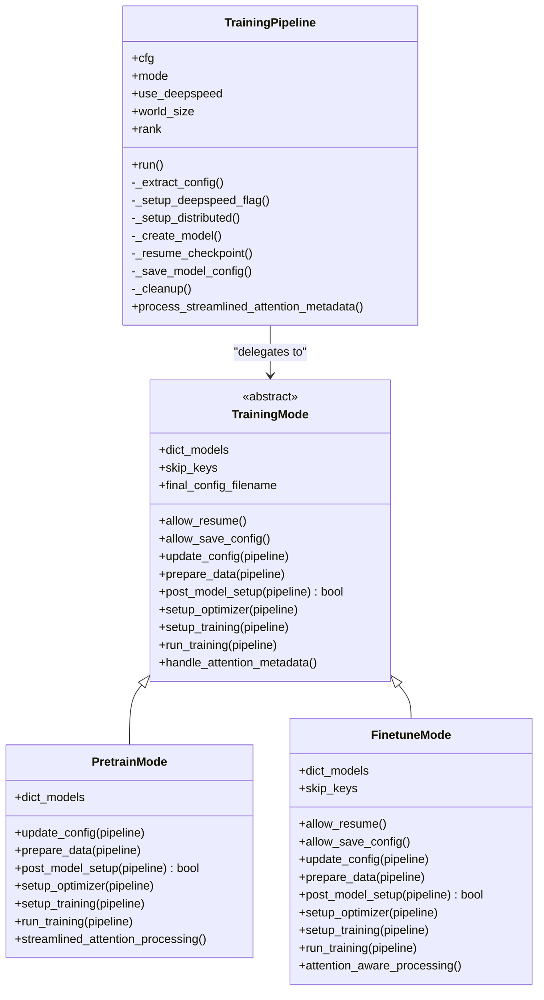

**Diagram sources**
- [pipeline.py:15-96](file://src/training/pipeline.py#L15-L96)
- [mode.py:5-90](file://src/training/mode.py#L5-L90)
- [pretrain_mode.py:48-501](file://src/training/pretrain_mode.py#L48-L501)
- [finetune_mode.py:43-459](file://src/training/finetune_mode.py#L43-L459)

**Section sources**
- [pipeline.py:60-96](file://src/training/pipeline.py#L60-L96)
- [mode.py:5-90](file://src/training/mode.py#L5-L90)
- [pretrain_mode.py:48-501](file://src/training/pretrain_mode.py#L48-L501)
- [finetune_mode.py:43-459](file://src/training/finetune_mode.py#L43-L459)

### Optimizer Initialization and Learning Rate Scheduling
- AdamW optimizer is initialized with configurable learning rate, betas, epsilon, and weight decay.
- OneCycleLR scheduler is configured with total steps and warmup proportion derived from schedule configuration.
- GradScaler is created for mixed precision training to scale gradients and prevent underflow.
- In DeepSpeed mode, optimizer/scheduler are managed by DeepSpeed; in non-DeepSpeed mode, the pipeline uses PyTorch's AMP utilities with robust attention-aware processing.

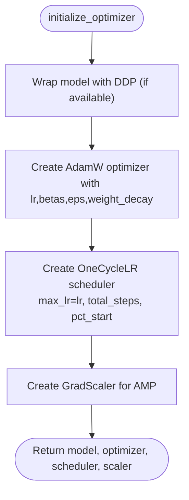

**Diagram sources**
- [opt_utils.py:7-38](file://src/utils/opt_utils.py#L7-L38)

**Section sources**
- [opt_utils.py:7-38](file://src/utils/opt_utils.py#L7-L38)
- [base_configs.py:132-164](file://src/conf/base_configs.py#L132-L164)

### Mixed Precision Training and Gradient Clipping
- Mixed precision training uses autocast for the forward pass and scales the loss before backward.
- Gradients are unscaled before clipping to maintain numerical stability, then stepped with the scaler.
- Gradient norm clipping is supported via a configurable max_grad_norm threshold.
- DeepSpeed path bypasses manual scaler/clip steps and relies on DeepSpeed's internal management.
- Training utilities implement streamlined attention metadata processing to prevent runtime errors when attention information is missing.

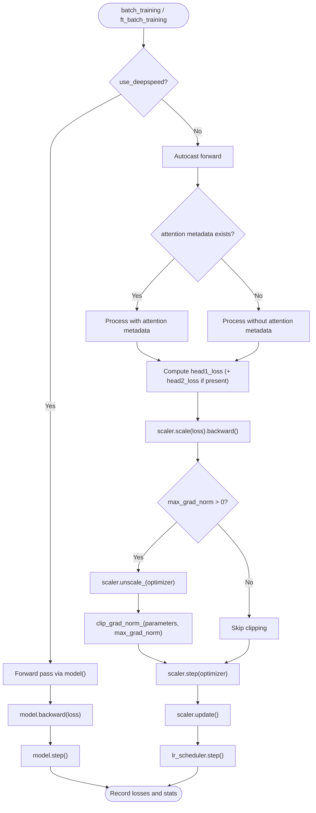

**Diagram sources**
- [training_utils.py:7-206](file://src/utils/training_utils.py#L7-L206)

**Section sources**
- [training_utils.py:7-206](file://src/utils/training_utils.py#L7-L206)

### Distributed Training and Samplers
- Distributed environment is set up via environment variables and world/rank configuration.
- Deterministic and randomized samplers are supported for both pretrain and finetune modes.
- For iterable datasets (e.g., ODPS tables), loaders are reinitialized per epoch with skipped samples to align with resumed steps.
- DeepSpeed initialization is integrated with NCCL backend and gradient checkpointing is enabled.
- Streamlined attention processing ensures robust operation even when attention metadata is not available in distributed settings.

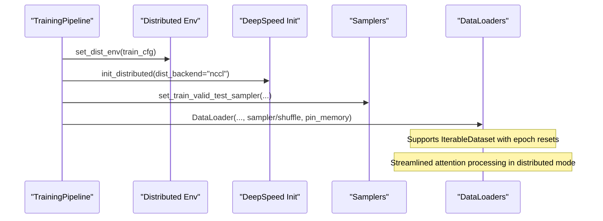

**Diagram sources**
- [pipeline.py:137-165](file://src/training/pipeline.py#L137-L165)
- [loader_utils.py:318-443](file://src/utils/loader_utils.py#L318-L443)
- [loader_utils.py:556-644](file://src/utils/loader_utils.py#L556-L644)

**Section sources**
- [pipeline.py:137-165](file://src/training/pipeline.py#L137-L165)
- [loader_utils.py:318-443](file://src/utils/loader_utils.py#L318-L443)
- [loader_utils.py:556-644](file://src/utils/loader_utils.py#L556-L644)

### Configuration Management
- Centralized configuration dataclasses define training, schedule, optimizer, and finetune parameters.
- YAML base configuration provides defaults for learning rates, gradient clipping, accumulation steps, and distributed settings.
- Mode-specific updates adjust schedule computation and min learning rate depending on DeepSpeed usage.
- Streamlined attention mechanism configurations for sample_lens-focused attention processing are included in training configurations.
- **Enhanced logging parameters**: New steps_per_saving and steps_per_eval parameters for optimized logging workflows.

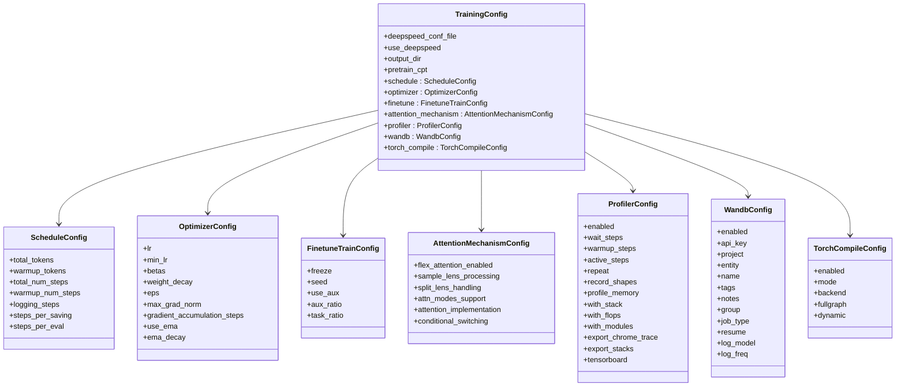

**Diagram sources**
- [base_configs.py:132-164](file://src/conf/base_configs.py#L132-L164)
- [base_configs.py:35-88](file://src/conf/base_configs.py#L35-L88)
- [base_configs.py:107-129](file://src/conf/base_configs.py#L107-L129)
- [base.yaml:24-118](file://configs/training/base.yaml#L24-L118)

**Section sources**
- [base_configs.py:132-164](file://src/conf/base_configs.py#L132-L164)
- [base.yaml:24-118](file://configs/training/base.yaml#L24-L118)

### DeepSpeed Integration and Configuration Updates
- DeepSpeed configuration can be merged with optimizer and scheduler parameters from training configuration.
- Example DeepSpeed JSON config demonstrates fp16, optimizer, scheduler, zero optimization, activation checkpointing, and flops profiler settings.
- Streamlined attention processing ensures DeepSpeed operations continue even when attention metadata is missing or malformed.

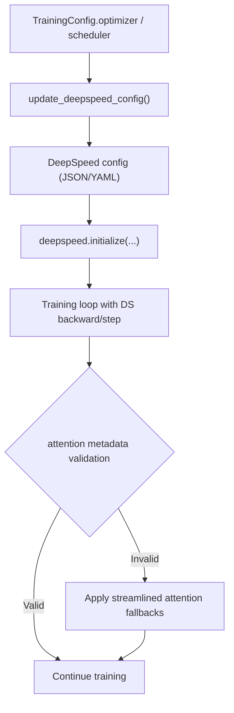

**Diagram sources**
- [optimization_utils.py:4-14](file://src/utils/optimization_utils.py#L4-L14)
- [ds_config2.json:1-43](file://examples/ds_config2.json#L1-L43)
- [pretrain_mode.py:277-288](file://src/training/pretrain_mode.py#L277-L288)
- [finetune_mode.py:230-243](file://src/training/finetune_mode.py#L230-L243)

**Section sources**
- [optimization_utils.py:4-14](file://src/utils/optimization_utils.py#L4-L14)
- [ds_config2.json:1-43](file://examples/ds_config2.json#L1-L43)
- [pretrain_mode.py:277-288](file://src/training/pretrain_mode.py#L277-L288)
- [finetune_mode.py:230-243](file://src/training/finetune_mode.py#L230-L243)

### Training Workflow Examples
- Pretraining script: Uses Hydra to load configuration and runs the unified pipeline with PretrainMode including streamlined attention processing.
- Supervised fine-tuning script: Same pattern with FinetuneMode including attention-aware processing.
- Both scripts rely on the shared pipeline to manage distributed environments, checkpoints, logging, and robust attention mechanism handling.

**Section sources**
- [train_pretrain.py:12-18](file://examples/train_pretrain.py#L12-L18)
- [train_supervised.py:12-18](file://examples/train_supervised.py#L12-L18)
- [pipeline.py:60-96](file://src/training/pipeline.py#L60-L96)

## Dependency Analysis
The training system exhibits low coupling between pipeline and modes, with clear separation of concerns. Utilities depend on configuration and model interfaces, while modes depend on data loaders and collators. Streamlined attention processing components integrate seamlessly with existing architecture. The enhanced TrainingStats class provides centralized logging infrastructure with optimized synchronization handling.

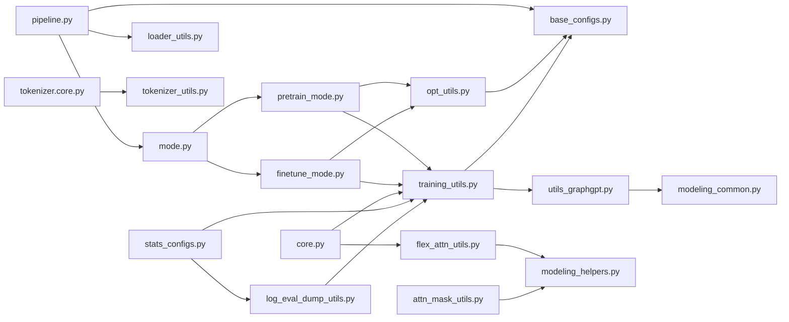

**Diagram sources**
- [pipeline.py:15-96](file://src/training/pipeline.py#L15-L96)
- [mode.py:5-90](file://src/training/mode.py#L5-L90)
- [pretrain_mode.py:48-501](file://src/training/pretrain_mode.py#L48-L501)
- [finetune_mode.py:43-459](file://src/training/finetune_mode.py#L43-L459)
- [training_utils.py:7-206](file://src/utils/training_utils.py#L7-L206)
- [opt_utils.py:7-38](file://src/utils/opt_utils.py#L7-L38)
- [loader_utils.py:17-752](file://src/utils/loader_utils.py#L17-L752)
- [base_configs.py:132-164](file://src/conf/base_configs.py#L132-L164)
- [utils_graphgpt.py:574-581](file://src/models/graphgpt/utils_graphgpt.py#L574-L581)
- [modeling_common.py:187-203](file://src/models/graphgpt/modeling_common.py#L187-L203)
- [core.py:244](file://src/data/tokenizer/core.py#L244)
- [flex_attn_utils.py:161-205](file://src/utils/flex_attn_utils.py#L161-L205)
- [modeling_helpers.py:110-124](file://src/models/graphgpt/modeling_helpers.py#L110-L124)
- [attn_mask_utils.py:12-128](file://src/utils/attn_mask_utils.py#L12-L128)
- [stats_configs.py:29-116](file://src/conf/stats_configs.py#L29-L116)
- [log_eval_dump_utils.py:520-593](file://src/utils/log_eval_dump_utils.py#L520-L593)

**Section sources**
- [pipeline.py:15-96](file://src/training/pipeline.py#L15-L96)
- [mode.py:5-90](file://src/training/mode.py#L5-L90)
- [pretrain_mode.py:48-501](file://src/training/pretrain_mode.py#L48-L501)
- [finetune_mode.py:43-459](file://src/training/finetune_mode.py#L43-L459)
- [training_utils.py:7-206](file://src/utils/training_utils.py#L7-L206)
- [opt_utils.py:7-38](file://src/utils/opt_utils.py#L7-L38)
- [loader_utils.py:17-752](file://src/utils/loader_utils.py#L17-L752)
- [base_configs.py:132-164](file://src/conf/base_configs.py#L132-L164)
- [utils_graphgpt.py:574-581](file://src/models/graphgpt/utils_graphgpt.py#L574-L581)
- [modeling_common.py:187-203](file://src/models/graphgpt/modeling_common.py#L187-L203)
- [core.py:244](file://src/data/tokenizer/core.py#L244)
- [flex_attn_utils.py:161-205](file://src/utils/flex_attn_utils.py#L161-L205)
- [modeling_helpers.py:110-124](file://src/models/graphgpt/modeling_helpers.py#L110-L124)
- [attn_mask_utils.py:12-128](file://src/utils/attn_mask_utils.py#L12-L128)
- [stats_configs.py:29-116](file://src/conf/stats_configs.py#L29-L116)
- [log_eval_dump_utils.py:520-593](file://src/utils/log_eval_dump_utils.py#L520-L593)

## Performance Considerations
- Mixed precision: Enable autocast and GradScaler to reduce memory footprint and improve throughput. Ensure gradient accumulation steps are set to 1 when using AMP to avoid scaling inconsistencies.
- Gradient clipping: Configure max_grad_norm to stabilize training; unscale gradients before clipping to preserve numerical accuracy.
- Distributed training: Use NCCL backend and enable gradient checkpointing to reduce peak memory usage.
- Activation checkpointing: Available in DeepSpeed configuration to trade compute for memory.
- Logging frequency: Tune logging_steps and steps_per_saving to balance diagnostics overhead and disk IO.
- Data loading: Pin memory, prefetch factor, and worker initialization seeds to minimize CPU bottlenecks.
- Streamlined attention processing: Enhanced attention mechanism support reduces computational overhead from attention metadata handling while maintaining robustness.
- Attention mask optimization: Sample lens processing and split-length handling improve memory efficiency for complex attention patterns.
- Conditional attention switching: Flex_attention path provides superior performance for training with attention metadata, while SDPA fallback ensures compatibility when attention metadata is unavailable.
- **Enhanced synchronization optimization**: The get_loss_values() method in TrainingStats dramatically reduces cudaDeviceSynchronize overhead by batching multiple .item() calls into a single synchronization point, significantly improving logging performance.
- **GPU-CPU transfer reduction**: Optimized logging infrastructure minimizes unnecessary GPU-CPU transfers during training statistics collection and reporting.

**Updated** Performance considerations now emphasize sample_lens-focused attention processing as the streamlined approach for attention mechanism optimization and conditional attention mode switching between flex_attention and SDPA paths. The TrainingStats.get_loss_values() method provides significant performance improvements by reducing synchronization overhead.

## Enhanced Error Handling and Defensive Programming

### Streamlined Attention Metadata Processing
The training system now implements comprehensive streamlined attention processing for attention metadata:

- **Missing Attention Metadata Detection**: Training utilities check for attention metadata existence before processing and apply graceful fallbacks when absent.
- **Sample Lens Validation**: The `build_flex_block_mask` function includes null checks and safe fallback mechanisms for sample lens processing.
- **Conditional Attention Mode Switching**: The `_update_causal_mask` function implements intelligent switching between flex_attention and SDPA paths based on training mode and attention metadata availability.
- **Graceful Degradation**: When attention metadata is missing, the system automatically falls back to default attention patterns or skips attention-dependent processing.
- **Configuration-Based Error Handling**: Training configurations now include attention mechanism settings for strict validation vs. lenient fallback modes.

### Implementation Details
- **Training Utilities**: Both `batch_training` and `ft_batch_training` functions include conditional attention metadata processing with null checks.
- **Model Integration**: The `_update_causal_mask` function in `modeling_helpers.py` applies streamlined attention processing with validation and conditional switching.
- **Data Pipeline**: Tokenizer core handles attention metadata padding and merging with fallback values when attention information is not available.
- **Attention Utilities**: The `flex_attn_utils.py` provides comprehensive attention mask building with robust error handling and conditional attention mode selection.

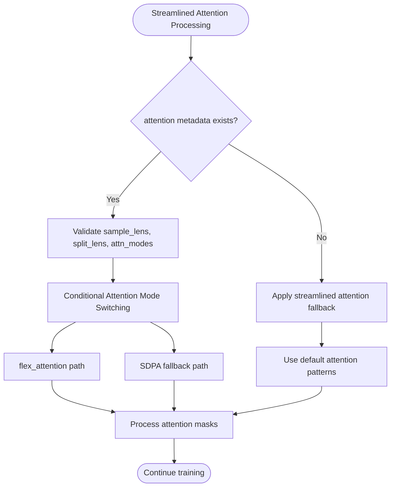

**Diagram sources**
- [training_utils.py:30-34](file://src/utils/training_utils.py#L30-L34)
- [training_utils.py:150-154](file://src/utils/training_utils.py#L150-L154)
- [flex_attn_utils.py:161-205](file://src/utils/flex_attn_utils.py#L161-L205)
- [modeling_helpers.py:110-124](file://src/models/graphgpt/modeling_helpers.py#L110-L124)
- [core.py:244](file://src/data/tokenizer/core.py#L244)

**Section sources**
- [training_utils.py:30-34](file://src/utils/training_utils.py#L30-L34)
- [training_utils.py:150-154](file://src/utils/training_utils.py#L150-L154)
- [flex_attn_utils.py:161-205](file://src/utils/flex_attn_utils.py#L161-L205)
- [modeling_helpers.py:110-124](file://src/models/graphgpt/modeling_helpers.py#L110-L124)
- [core.py:244](file://src/data/tokenizer/core.py#L244)

## Attention Mechanisms and Sample Length Processing

### Streamlined Attention System
The Graph-GPT system now supports advanced attention mechanisms with comprehensive sample length processing and conditional attention mode switching:

- **Sample Length Focus**: Emphasizes sample_lens parameter processing as the primary mechanism for attention configuration.
- **Conditional Attention Mode Switching**: Automatically switches between flex_attention and SDPA paths based on training mode, attention metadata availability, and configuration settings.
- **Split-Length Attention**: Supports attention patterns where sequences are divided into multiple segments with different attention modes (causal, full, noise).
- **Streamlined Attention Modes**: Processes variable-length samples efficiently using sample lens techniques with automatic fallback handling.
- **Attention Mode Management**: Manages different attention modes per segment within samples for complex attention patterns.
- **Block Mask Generation**: Creates efficient block masks for flexible attention using PyTorch's flex_attention capabilities with conditional switching.

**Updated** Attention system now focuses exclusively on sample_lens parameter processing, implementing conditional attention mode switching between flex_attention and SDPA paths based on training mode and attention metadata availability.

### Key Components

#### Attention Utilities
- `create_sparse_mask`: Creates mask_mod closures for torch.nn.attention.flex_attention with support for causal, full, and noise attention modes.
- `prepare_attention_mask_per_sample`: Generates 2D attention masks for individual samples with split-length processing.
- `build_4d_from_splits`: Constructs 4D attention masks from split-length specifications for SDPA path.
- `build_flex_block_mask`: Creates BlockMask objects for flexible attention with CUDA optimization using sample_lens and conditional switching.

#### Model Integration
- `_update_causal_mask`: Integrates streamlined attention processing into the model's attention mechanism selection with conditional switching between flex_attention and SDPA paths.
- `get_flex_dropout_mod`: Implements dropout scoring for flexible attention with compiled kernel support.

#### Tokenizer Integration
- Tokenizer core processes attention metadata (sample_lens, split_lens, attn_modes) as Python lists for efficient handling.
- Task preparation utilities generate appropriate attention configurations for different training modes using sample_lens focus and conditional attention mode selection.

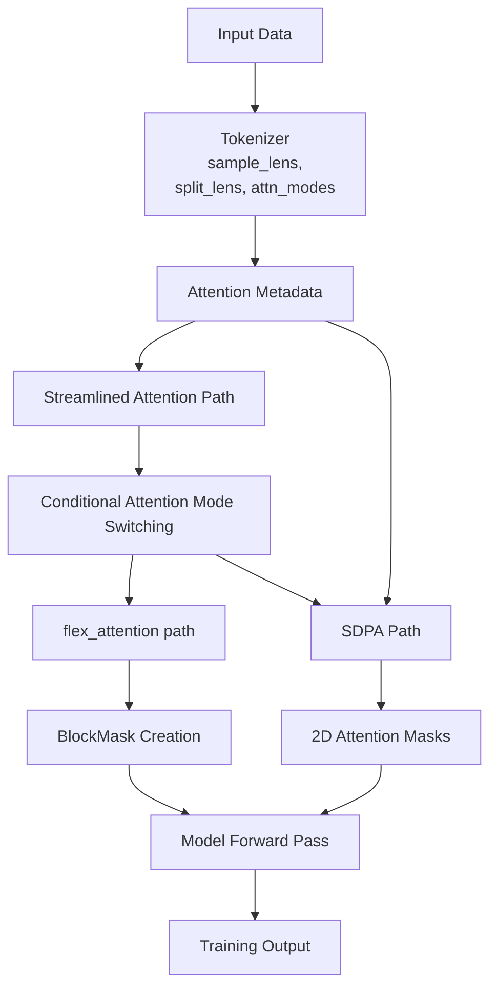

**Diagram sources**
- [flex_attn_utils.py:20-111](file://src/utils/flex_attn_utils.py#L20-L111)
- [flex_attn_utils.py:161-205](file://src/utils/flex_attn_utils.py#L161-L205)
- [modeling_helpers.py:110-124](file://src/models/graphgpt/modeling_helpers.py#L110-L124)
- [core.py:244](file://src/data/tokenizer/core.py#L244)

**Section sources**
- [flex_attn_utils.py:20-111](file://src/utils/flex_attn_utils.py#L20-L111)
- [flex_attn_utils.py:161-205](file://src/utils/flex_attn_utils.py#L161-L205)
- [modeling_helpers.py:110-124](file://src/models/graphgpt/modeling_helpers.py#L110-L124)
- [core.py:244](file://src/data/tokenizer/core.py#L244)

## Training Statistics and Logging Infrastructure

### Enhanced TrainingStats Class
The TrainingStats class has been significantly enhanced with optimized logging infrastructure that dramatically reduces GPU-CPU synchronization overhead:

- **get_loss_values() Method**: Batches multiple .item() calls into a single synchronization point, dramatically reducing cudaDeviceSynchronize overhead.
- **Optimized Speed Calculations**: Improved cal_speed() method provides more accurate performance measurements with reduced computational overhead.
- **Centralized Logging Control**: Enhanced print_stats() method accepts pre-extracted loss values to avoid repeated synchronization points.
- **Distributed Reduction Support**: Automatic distributed loss reduction with minimal synchronization overhead.
- **Memory-Efficient Operations**: Reduced GPU-CPU transfers during training statistics collection and reporting.

### Logging Infrastructure Improvements
- **Reduced Synchronization Overhead**: All logging operations now use pre-extracted loss values to minimize GPU-CPU synchronization.
- **Enhanced Speed Metrics**: Improved samples_per_second and tokens_per_second calculations with better accuracy.
- **Distributed Training Support**: Automatic distributed reduction of loss values with minimal performance impact.
- **TensorBoard Integration**: Optimized TensorBoard logging with pre-extracted values to avoid additional synchronization.
- **WandB Integration**: Efficient Weights & Biases logging with reduced GPU-CPU transfers.

### Implementation Details
- **Single Synchronization Point**: The get_loss_values() method extracts all loss values (loss, aux_loss, main_loss) in a single cudaDeviceSynchronize call.
- **Pre-extracted Value Reuse**: Logging functions accept pre-extracted values to avoid repeated .item() calls.
- **Distributed Reduction Optimization**: Loss reduction operations are performed efficiently with minimal synchronization overhead.
- **Memory Management**: Optimized memory usage during logging operations to reduce memory pressure.

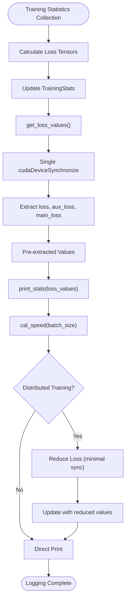

**Diagram sources**
- [stats_configs.py:102-116](file://src/conf/stats_configs.py#L102-L116)
- [log_eval_dump_utils.py:520-593](file://src/utils/log_eval_dump_utils.py#L520-L593)

**Section sources**
- [stats_configs.py:29-116](file://src/conf/stats_configs.py#L29-L116)
- [log_eval_dump_utils.py:520-593](file://src/utils/log_eval_dump_utils.py#L520-L593)

## Troubleshooting Guide
- Gradient accumulation with AMP: The training utilities assert gradient_accumulation_steps equals 1 when not using DeepSpeed. Adjust configuration to avoid assertion failures.
- DeepSpeed vs non-DeepSpeed: Ensure DeepSpeed configuration is properly merged and that the pipeline recognizes use_deepspeed to route backward/step calls correctly.
- Checkpoint loading: When resuming, verify that the correct checkpoint path is used and that model parameters are loaded with appropriate skip_keys behavior for pretrain vs finetune.
- Distributed sampler issues: Confirm world_size and rank alignment with environment variables and that samplers are redistributed per rank.
- Scheduler edge cases: For the last step, ensure OneCycleLR is constructed with total_num_steps+1 to avoid stepping errors.
- **Attention mechanism errors**: When encountering attention-related errors, verify that attention metadata (sample_lens, split_lens, attn_modes) are properly generated during tokenization and that the streamlined attention fallback mechanisms are functioning correctly.
- **Missing attention information**: Check tokenizer configuration for attention metadata generation and ensure that fallback values are being applied appropriately when attention data is unavailable.
- **Conditional attention mode switching**: Test training pipelines with and without attention metadata to ensure proper switching between flex_attention and SDPA paths based on configuration and training mode.
- **Streamlined attention processing**: Test training pipelines with and without attention metadata to ensure graceful degradation and consistent performance.
- **Memory optimization**: Monitor memory usage when using streamlined attention with large sample lens configurations and adjust batch sizes accordingly.
- **Sample lens validation**: Ensure sample_lens parameters are correctly formatted and validated before attention processing to prevent runtime errors.
- **Attention mode compatibility**: Verify that attention modes (causal, full, noise) are compatible with the chosen attention implementation path.
- **Enhanced logging performance**: Monitor training performance with the new get_loss_values() method to ensure reduced synchronization overhead is achieved.
- **GPU synchronization analysis**: Use the synchronization analysis tools to identify and resolve any remaining GPU-CPU synchronization bottlenecks.

**Updated** Troubleshooting guide now emphasizes sample_lens-focused attention processing, conditional attention mode switching, streamlined attention mechanisms, and the new enhanced logging infrastructure with get_loss_values() method.

**Section sources**
- [training_utils.py:47-49](file://src/utils/training_utils.py#L47-L49)
- [training_utils.py:159-161](file://src/utils/training_utils.py#L159-L161)
- [pipeline.py:179-202](file://src/training/pipeline.py#L179-L202)
- [loader_utils.py:70-90](file://src/utils/loader_utils.py#L70-L90)
- [opt_utils.py:30-34](file://src/utils/opt_utils.py#L30-L34)
- [utils_graphgpt.py:574-581](file://src/models/graphgpt/utils_graphgpt.py#L574-L581)
- [stats_configs.py:102-116](file://src/conf/stats_configs.py#L102-L116)
- [log_eval_dump_utils.py:520-593](file://src/utils/log_eval_dump_utils.py#L520-L593)

## Conclusion
The Graph-GPT training support utilities provide a robust, modular framework for both pretraining and supervised fine-tuning with streamlined attention mechanism support. The unified pipeline and mode strategy enable consistent workflows, while optimizer initialization, mixed precision training, gradient clipping, and distributed utilities deliver strong performance and reliability. The newly implemented streamlined attention processing capabilities significantly improve the system's ability to handle complex attention patterns with sample lens processing and comprehensive attention mode management. The conditional attention mode switching between flex_attention and SDPA paths ensures optimal performance across different training scenarios while maintaining backward compatibility.

**Updated** The most significant enhancement is the dramatically improved logging infrastructure with the TrainingStats.get_loss_values() method, which batches multiple .item() calls into a single synchronization point, reducing cudaDeviceSynchronize overhead and significantly improving training performance. The enhanced logging system provides better speed calculations, reduced GPU-CPU transfers, and more efficient distributed training operations. These optimizations, combined with the streamlined attention mechanisms, make the training system much more efficient and scalable for large-scale graph neural network training.

By leveraging advanced attention mechanisms with sample_lens focus and intelligent mode switching, practitioners can achieve better training efficiency and flexibility, with clear configuration pathways for hyperparameter tuning and training pipeline integration. The enhanced logging infrastructure ensures that performance monitoring and diagnostics don't become bottlenecks in the training process.

## Appendices

### Example Training Strategies and Hyperparameter Tuning
- Learning rate scheduling: Use OneCycleLR with total_num_steps computed from schedule configuration; adjust min_lr based on DeepSpeed availability.
- Gradient clipping: Start with max_grad_norm=1.0 and adjust based on training stability.
- Batch size and accumulation: Increase effective batch size via gradient_accumulation_steps only when using DeepSpeed; otherwise keep steps=1.
- Mixed precision: Enable fp16 in DeepSpeed or use autocast with GradScaler; monitor loss scaling behavior.
- Distributed training: Align world_size and rank with cluster resources; ensure NCCL backend and proper sampler distribution.
- **Streamlined attention mechanisms**: Configure attention metadata (sample_lens, split_lens, attn_modes) for optimal attention pattern processing with sample lens focus and conditional attention mode switching.
- **Attention mode selection**: Choose appropriate attention modes (causal, full, noise) based on task requirements and computational constraints, with automatic switching between flex_attention and SDPA paths.
- **Conditional attention switching**: Enable automatic attention mode switching based on training mode, attention metadata availability, and configuration settings for optimal performance.
- **Error tolerance**: Set appropriate error handling levels for attention metadata processing based on data quality and computational constraints.
- **Memory optimization**: Monitor memory usage with streamlined attention and adjust attention configurations for optimal performance across flex_attention and SDPA paths.
- **Sample lens validation**: Ensure proper sample lens formatting and validation for consistent attention mechanism operation across different training scenarios.
- **Enhanced logging optimization**: Configure steps_per_saving and logging_steps parameters for optimal logging frequency while minimizing performance impact.
- **GPU synchronization analysis**: Use the provided analysis tools to identify and resolve synchronization bottlenecks in training workflows.
- **Performance monitoring**: Leverage the improved speed calculations and reduced synchronization overhead for better training performance monitoring.
