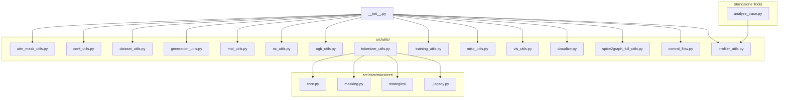
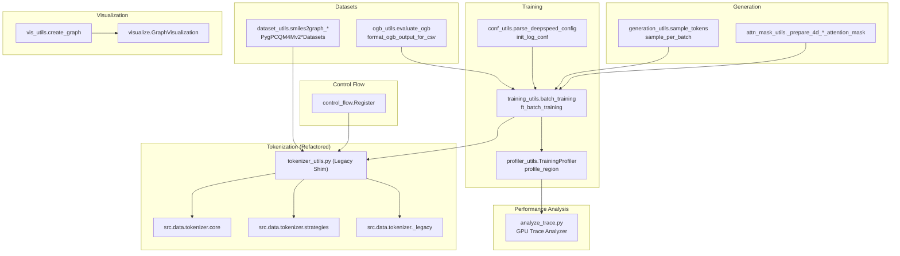
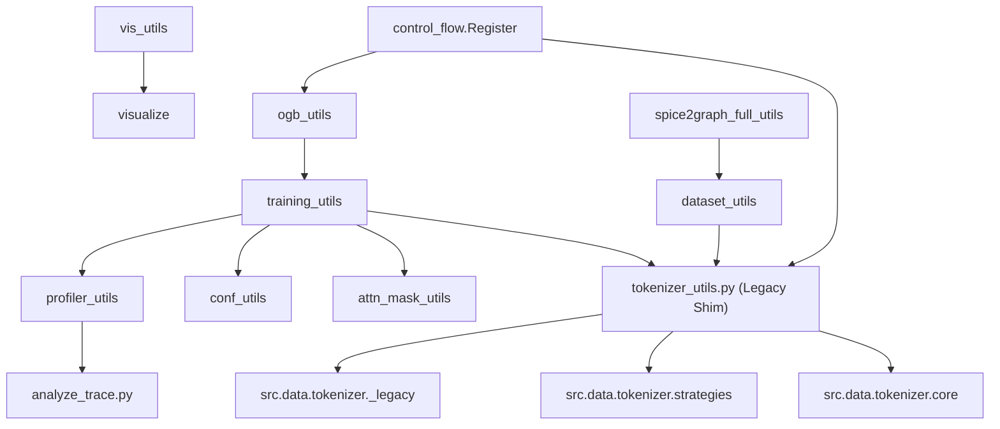

# Utility Functions

<cite>
**Referenced Files in This Document**
- [src/utils/__init__.py](file://src/utils/__init__.py)
- [src/utils/attn_mask_utils.py](file://src/utils/attn_mask_utils.py)
- [src/utils/conf_utils.py](file://src/utils/conf_utils.py)
- [src/utils/dataset_utils.py](file://src/utils/dataset_utils.py)
- [src/utils/generation_utils.py](file://src/utils/generation_utils.py)
- [src/utils/mol_utils.py](file://src/utils/mol_utils.py)
- [src/utils/nx_utils.py](file://src/utils/nx_utils.py)
- [src/utils/ogb_utils.py](file://src/utils/ogb_utils.py)
- [src/utils/tokenizer_utils.py](file://src/utils/tokenizer_utils.py)
- [src/utils/training_utils.py](file://src/utils/training_utils.py)
- [src/utils/misc_utils.py](file://src/utils/misc_utils.py)
- [src/utils/vis_utils.py](file://src/utils/vis_utils.py)
- [src/utils/visualize.py](file://src/utils/visualize.py)
- [src/utils/spice2graph_full_utils.py](file://src/utils/spice2graph_full_utils.py)
- [src/utils/control_flow.py](file://src/utils/control_flow.py)
- [src/utils/profiler_utils.py](file://src/utils/profiler_utils.py)
- [analyze_trace.py](file://analyze_trace.py)
- [src/data/tokenizer/__init__.py](file://src/data/tokenizer/__init__.py)
- [src/data/tokenizer/_legacy.py](file://src/data/tokenizer/_legacy.py)
- [src/data/tokenizer/strategies/task_prep/__init__.py](file://src/data/tokenizer/strategies/task_prep/__init__.py)
</cite>

## Update Summary
**Changes Made**
- Added comprehensive documentation for the new PyTorch Profiler Trace Analyzer tool (analyze_trace.py)
- Updated profiler utilities section to highlight the complementary relationship between TrainingProfiler and analyze_trace.py
- Enhanced performance analysis section to cover both in-training profiling and post-training trace analysis
- Added new section on GPU performance analysis tools and their integration workflow

## Table of Contents
1. [Introduction](#introduction)
2. [Project Structure](#project-structure)
3. [Core Components](#core-components)
4. [Architecture Overview](#architecture-overview)
5. [Detailed Component Analysis](#detailed-component-analysis)
6. [Dependency Analysis](#dependency-analysis)
7. [Performance Considerations](#performance-considerations)
8. [Troubleshooting Guide](#troubleshooting-guide)
9. [Conclusion](#conclusion)
10. [Appendices](#appendices)

## Introduction
This document provides a comprehensive guide to the Graph-GPT utility functions that power helper modules and specialized functionality across the framework. It explains how utilities are organized into domains such as attention mask utilities, configuration helpers, dataset utilities, generation tools, molecular graph processing, networkx utilities, OGB dataset integration, visualization tools, and performance analysis utilities. The framework has undergone significant refactoring to streamline the tokenizer utilities, moving from a monolithic structure to a modular architecture while maintaining backward compatibility. A new PyTorch Profiler Trace Analyzer tool has been added to provide standalone GPU performance analysis capabilities.

## Project Structure
The utilities reside primarily under src/utils/, with submodules grouped by domain. The package initializer has been streamlined to remove deprecated tokenizer exports and focuses on core utility functions. The tokenizer utilities have been migrated to a new modular structure under src/data/tokenizer/. A new standalone analyzer tool (analyze_trace.py) complements the existing profiler utilities for GPU performance analysis.



**Diagram sources**
- [src/utils/__init__.py:1-56](file://src/utils/__init__.py#L1-L56)
- [src/utils/tokenizer_utils.py:1-26](file://src/utils/tokenizer_utils.py#L1-L26)
- [src/utils/profiler_utils.py:1-503](file://src/utils/profiler_utils.py#L1-L503)
- [analyze_trace.py:1-593](file://analyze_trace.py#L1-L593)
- [src/data/tokenizer/__init__.py:1-124](file://src/data/tokenizer/__init__.py#L1-L124)
- [src/data/tokenizer/_legacy.py:1-41](file://src/data/tokenizer/_legacy.py#L1-L41)

**Section sources**
- [src/utils/__init__.py:1-56](file://src/utils/__init__.py#L1-L56)

## Core Components
This section highlights the primary utility modules and their responsibilities:

- **Attention mask utilities**: Expand and combine attention masks for causal/bidirectional and padding contexts.
- **Configuration helpers**: Parse and adapt configuration objects, DeepSpeed configs, and logging/resume states.
- **Dataset utilities**: Convert molecules to graphs, augment with 3D positions, and manage OGB datasets.
- **Generation tools**: Implement token sampling strategies and iterative decoding for diffusion-like generation.
- **Molecular utilities**: Rotation, discretization, and 3D-position decoration for tokenization.
- **NetworkX utilities**: Eulerian path construction, shortest path extraction, and graph-to-path transformations.
- **OGB utilities**: Evaluation wrappers for node/link/graph tasks and CSV formatting.
- **Training utilities**: Batch training loops for pretraining and finetuning with gradient accumulation and AMP.
- **Miscellaneous utilities**: Checkpointing, distributed setup, inference dumping, and token estimation.
- **Visualization utilities**: Plotly-based graph visualization and helper for node text mapping.
- **Spice2graph utilities**: Netlist parsing and SPICE circuit-to-graph conversion.
- **Profiler utilities**: Comprehensive training-time GPU performance profiling with TrainingProfiler and memory monitoring.
- **Trace analyzer**: Standalone GPU kernel analysis and bottleneck identification from Chrome trace files.

**Updated** Added new PyTorch Profiler Trace Analyzer tool for standalone GPU performance analysis.

**Section sources**
- [src/utils/attn_mask_utils.py:1-156](file://src/utils/attn_mask_utils.py#L1-L156)
- [src/utils/conf_utils.py:1-232](file://src/utils/conf_utils.py#L1-L232)
- [src/utils/dataset_utils.py:1-1810](file://src/utils/dataset_utils.py#L1-L1810)
- [src/utils/generation_utils.py:1-464](file://src/utils/generation_utils.py#L1-L464)
- [src/utils/mol_utils.py:1-256](file://src/utils/mol_utils.py#L1-L256)
- [src/utils/nx_utils.py:1-631](file://src/utils/nx_utils.py#L1-L631)
- [src/utils/ogb_utils.py:1-214](file://src/utils/ogb_utils.py#L1-L214)
- [src/utils/training_utils.py:1-206](file://src/utils/training_utils.py#L1-L206)
- [src/utils/misc_utils.py:1-540](file://src/utils/misc_utils.py#L1-L540)
- [src/utils/vis_utils.py:1-31](file://src/utils/vis_utils.py#L1-L31)
- [src/utils/visualize.py:1-233](file://src/utils/visualize.py#L1-L233)
- [src/utils/spice2graph_full_utils.py:1-564](file://src/utils/spice2graph_full_utils.py#L1-L564)
- [src/utils/profiler_utils.py:1-503](file://src/utils/profiler_utils.py#L1-L503)
- [analyze_trace.py:1-593](file://analyze_trace.py#L1-L593)

## Architecture Overview
The utilities integrate with the broader framework via tokenization, data preparation, training orchestration, and evaluation. The control-flow register pattern centralizes dispatch for dynamic evaluation and input preparation. The tokenizer utilities have been refactored to use a strategy-based approach with backward compatibility maintained through the legacy shim. The new trace analyzer complements the existing profiler utilities by providing standalone analysis capabilities for GPU performance bottlenecks.



**Diagram sources**
- [src/utils/control_flow.py:1-33](file://src/utils/control_flow.py#L1-L33)
- [src/utils/tokenizer_utils.py:1-26](file://src/utils/tokenizer_utils.py#L1-L26)
- [src/data/tokenizer/__init__.py:1-124](file://src/data/tokenizer/__init__.py#L1-L124)
- [src/data/tokenizer/_legacy.py:1-41](file://src/data/tokenizer/_legacy.py#L1-L41)
- [src/utils/training_utils.py:1-206](file://src/utils/training_utils.py#L1-L206)
- [src/utils/conf_utils.py:1-232](file://src/utils/conf_utils.py#L1-L232)
- [src/utils/dataset_utils.py:1-1810](file://src/utils/dataset_utils.py#L1-L1810)
- [src/utils/ogb_utils.py:1-214](file://src/utils/ogb_utils.py#L1-L214)
- [src/utils/generation_utils.py:1-464](file://src/utils/generation_utils.py#L1-L464)
- [src/utils/attn_mask_utils.py:1-156](file://src/utils/attn_mask_utils.py#L1-L156)
- [src/utils/vis_utils.py:1-31](file://src/utils/vis_utils.py#L1-L31)
- [src/utils/visualize.py:1-233](file://src/utils/visualize.py#L1-L233)
- [src/utils/profiler_utils.py:1-503](file://src/utils/profiler_utils.py#L1-L503)
- [analyze_trace.py:1-593](file://analyze_trace.py#L1-L593)

## Detailed Component Analysis

### Attention Mask Utilities
Purpose:
- Expand 2D attention masks into 4D causal/bidirectional/padding masks.
- Merge boundary masks and padding masks consistently.

Key functions:
- _prepare_4d_causal_bi_attention_mask: Builds a 4D mask combining causal and bidirectional constraints, optionally masking boundaries.
- _prepare_4d_attention_mask: Expands a 2D mask to 4D for padding.
- _prepare_4d_bi_causal_attention_mask: Creates a 4D mask from a causal length and attention mask.

Usage patterns:
- Used during training/inference to construct attention masks for transformer-style models.
- Boundary masking supports structured token sequences (e.g., graph tokenization).

Integration points:
- Training loops and model forward passes rely on these masks for correct attention computation.

**Section sources**
- [src/utils/attn_mask_utils.py:1-156](file://src/utils/attn_mask_utils.py#L1-L156)

### Configuration Helpers
Purpose:
- Parse and adapt configuration objects for training and tokenization.
- Integrate DeepSpeed configurations and schedulers.
- Manage logging and resume checkpoints.

Key functions:
- parse_space_separated_args: Converts CLI arguments to a config dictionary.
- convert_to_legacy_tokenization_config: Builds legacy tokenization config from OmegaConf.
- parse_deepspeed_config / parse_deepspeed_config_for_ft: Populate DeepSpeed JSON with runtime parameters and scheduler.
- init_log_conf / init_log_conf_for_ft: Initialize logging and resume states for pretraining/finetuning.

Integration points:
- Training pipeline reads these helpers to configure optimizers, schedulers, and logging.

**Section sources**
- [src/utils/conf_utils.py:1-232](file://src/utils/conf_utils.py#L1-L232)

### Dataset Utilities
Purpose:
- Convert molecules to graphs, augment with 3D coordinates, and manage OGB datasets.
- Provide PyTorch Geometric datasets for PCQM4Mv2 variants and custom molecules.

Key functions:
- smiles2graph_* and mol2graph_*: RDKit-based conversions to node/edge features and positions.
- PygPCQM4Mv2*Datasets: In-memory datasets with preprocessing and caching.
- PygCustomMolDataset: Custom SMILES dataset builder.
- smiles2graph_with_try: Safe wrapper to handle conversion errors.

Integration points:
- Tokenizer utilities depend on these to assemble graph inputs and labels.

**Section sources**
- [src/utils/dataset_utils.py:1-1810](file://src/utils/dataset_utils.py#L1-L1810)

### Generation Tools
Purpose:
- Implement token sampling strategies and iterative decoding for diffusion-like generation.
- Support multiple algorithms (origin, topk_margin, entropy) and confidence-based unmasking.

Key functions:
- top_p_logits / top_k_logits: Apply nucleus/top-k filtering to logits.
- sample_tokens: Temperature, top-p, top-k, margin confidence, and negative entropy sampling.
- sample_per_batch / sample_per_example: Iterative decoding with configurable algorithms.
- cal_gen_acc_per_sample / cal_gen_acc_batch: Compute generation accuracy.

Integration points:
- Generation utilities are invoked by generation modes and evaluation routines.

**Section sources**
- [src/utils/generation_utils.py:1-464](file://src/utils/generation_utils.py#L1-L464)

### Molecular Utilities
Purpose:
- Provide rotation, discretization, and 3D-position decoration for tokenization.
- Offer complete feature sets for molecule and device datasets.

Key functions:
- rotate_3d / rotate_3d_v2 / rotate_3d_v3: Random and deterministic 3D rotations.
- discrete_pos / discrete_pos_v2: Discretize continuous coordinates using fixed or percentile bounds.
- decorate_molecules_with_3d_positions: Convert 3D coordinates into tokens respecting symmetries.

Integration points:
- Tokenizer utilities use these to embed 3D geometry into token sequences.

**Section sources**
- [src/utils/mol_utils.py:1-256](file://src/utils/mol_utils.py#L1-L256)

### NetworkX Utilities
Purpose:
- Construct Eulerian paths, shortest paths, and graph traversals for tokenization.
- Decorate nodes/edges with structure-aware tokens and labels.

Key functions:
- graph2path / graph2path_v2: Convert graphs to paths with optional connected components handling.
- get_paths / add_paths: Precompute and store paths for small-medium graphs.
- decorate_node_edge_graph_with_mask: Assemble token sequences with structure and semantics.
- get_labels_from_input_tokens: Generate next-token prediction labels respecting structure.

Integration points:
- Tokenizer utilities rely on these to produce structure-aware sequences.

**Section sources**
- [src/utils/nx_utils.py:1-631](file://src/utils/nx_utils.py#L1-L631)

### OGB Utilities
Purpose:
- Evaluate predictions against OGB benchmarks for node/link/graph tasks.
- Format evaluation outputs for CSV reporting.

Key functions:
- evaluate_ogb: Dispatch evaluation by dataset name.
- format_ogb_output_for_csv: Serialize evaluation results.

Supported tasks:
- Reddit threads, ogbn-arxiv/products/proteins, ogbl-ppa/citation2/wikikg2/ddi, ogbg-molhiv/pcba, PCQM4Mv2.

**Section sources**
- [src/utils/ogb_utils.py:1-214](file://src/utils/ogb_utils.py#L1-L214)

### Profiler Utilities
Purpose:
- Provide comprehensive GPU performance profiling during training with TrainingProfiler.
- Monitor CUDA memory usage and identify performance bottlenecks in real-time.
- Support both integrated profiling within training loops and standalone trace analysis.

Key components:
- **TrainingProfiler**: Context manager for profiling training loops with automatic step scheduling and TensorBoard integration.
- **ProfilerConfig**: Configuration dataclass for profiler settings.
- **profile_region**: Context manager for annotating code regions in profiler traces.
- **Memory monitoring**: Functions for CUDA memory statistics and peak memory tracking.

Key functions:
- TrainingProfiler.step: Context manager for individual training steps.
- TrainingProfiler.export_summary: Export profiling summary statistics.
- profile_region: Annotate code regions for detailed trace analysis.
- get_cuda_memory_stats: Retrieve current CUDA memory usage statistics.

Integration points:
- Training orchestrators use TrainingProfiler to monitor performance during training.
- Memory monitoring functions help identify memory-related bottlenecks.

**Updated** Enhanced to include integration with standalone trace analyzer for comprehensive performance analysis.

**Section sources**
- [src/utils/profiler_utils.py:1-503](file://src/utils/profiler_utils.py#L1-L503)

### PyTorch Profiler Trace Analyzer
Purpose:
- Provide standalone analysis of PyTorch Profiler Chrome trace files (.pt.trace.json).
- Identify GPU kernel bottlenecks and synchronization overhead without requiring active training.
- Generate detailed performance reports and recommendations for GPU optimization.

Key capabilities:
- **GPU Kernel Analysis**: Analyze CUDA kernel execution patterns and identify slow operations.
- **Synchronization Detection**: Identify CPU-GPU synchronization points causing performance bottlenecks.
- **Timeline Gap Analysis**: Detect idle periods in GPU execution timeline.
- **Memory Event Analysis**: Track memory allocation patterns and identify memory-related issues.
- **Call Stack Analysis**: Correlate synchronization events with Python call stacks for root cause analysis.

Key functions:
- load_trace: Load Chrome trace JSON files for analysis.
- analyze_gpu_kernels: Extract and analyze GPU kernel execution statistics.
- analyze_cpu_phases: Categorize CPU operations and calculate phase statistics.
- analyze_call_stacks: Identify synchronization sources through call stack correlation.
- analyze_timeline_gaps: Detect GPU idle periods between kernel executions.
- analyze_memory_events: Track memory allocation patterns and usage.
- print_summary: Generate comprehensive performance analysis report.

Analysis features:
- **Synchronization Analysis**: Critical for GPU efficiency - identifies excessive .item() calls, .cpu() transfers, and dist.reduce() operations.
- **Bottleneck Diagnosis**: Automatically detects performance issues like small kernel sizes, excessive synchronization, and data transfer overhead.
- **Recommendations**: Provides actionable optimization suggestions including batch processing, async data loading, and kernel fusion.

Usage patterns:
- Run during training to generate Chrome trace files.
- Use standalone analyzer for post-mortem performance analysis.
- Integrate with CI/CD pipelines for automated performance regression detection.

**New Section** Added comprehensive documentation for the standalone GPU performance analysis tool.

**Section sources**
- [analyze_trace.py:1-593](file://analyze_trace.py#L1-L593)

### Tokenizer Utilities - Refactored Architecture
**Updated** The tokenizer utilities have been completely refactored and moved to a modular architecture under `src/data/tokenizer/`.

#### Legacy Shim Layer
The old `src/utils/tokenizer_utils.py` now serves as a backward-compatibility shim that re-exports all public functions from the new modular structure:

```python
# Backward-compatibility shim
from src.data.tokenizer.types import TokenizationOutput, MOL_ENERGY_BIN_LEN, MOL_ENERGY_SCALE
from src.data.tokenizer.masking import _mask_ids, _get_keys, _mask_stacked_input_ids, etc.
```

#### New Modular Structure
The tokenizer utilities are now organized into specialized modules:

- **Core Tokenizers**: `src/data/tokenizer/core.py` - Main tokenizer classes (GSTTokenizer, StackedGSTTokenizer)
- **Masking Strategies**: `src/data/tokenizer/masking.py` - Token masking and padding utilities
- **Strategy Framework**: `src/data/tokenizer/strategies/` - Task-specific preparation strategies
- **Legacy Compatibility**: `src/data/tokenizer/_legacy.py` - Maintains backward compatibility

#### Strategy-Based Approach
The new architecture uses a factory pattern for task preparation:

```python
from src.data.tokenizer.strategies.task_prep import get_task_strategy

strategy = get_task_strategy("pretrain-mlm")  # Returns PretrainMLMStrategy
strategy = get_task_strategy("graph")        # Returns GraphLevelStrategy
strategy = get_task_strategy("nodev2")       # Returns NodeV2Strategy
```

#### Migration Benefits
- **Modular Design**: Each component can be imported independently
- **Lazy Loading**: Heavy legacy components are only loaded when accessed
- **Clean Public API**: Simplified imports without circular dependencies
- **Backward Compatibility**: Existing code continues to work unchanged

**Section sources**
- [src/utils/tokenizer_utils.py:1-26](file://src/utils/tokenizer_utils.py#L1-L26)
- [src/data/tokenizer/__init__.py:1-124](file://src/data/tokenizer/__init__.py#L1-L124)
- [src/data/tokenizer/_legacy.py:1-41](file://src/data/tokenizer/_legacy.py#L1-L41)
- [src/data/tokenizer/strategies/task_prep/__init__.py:1-46](file://src/data/tokenizer/strategies/task_prep/__init__.py#L1-L46)

### Training Utilities
Purpose:
- Execute training steps for pretraining and finetuning with gradient accumulation and AMP.
- Support DeepSpeed and PyTorch DDP training.

Key functions:
- batch_training: Single training step with optional auxiliary losses.
- ft_batch_training: Finetuning step with task-specific labels and optional pretraining labels.

Integration points:
- Training orchestrators invoke these for each batch.

**Section sources**
- [src/utils/training_utils.py:1-206](file://src/utils/training_utils.py#L1-L206)

### Miscellaneous Utilities
Purpose:
- Manage checkpoints, distributed setup, inference dumping, and token estimation.
- Encode/decode NumPy arrays for lightweight serialization.

Key functions:
- save_ckp / save_all / load_all: Save/load model, optimizer, scheduler, and logs.
- dump_infer_results: Write inference outputs to CSV partitions.
- estimate_tokens_per_sample: Estimate average tokens per sample across ranks.
- set_dist_env: Initialize distributed training and seed randomness.

Integration points:
- Training and evaluation scripts rely on these for reproducibility and artifact management.

**Section sources**
- [src/utils/misc_utils.py:1-540](file://src/utils/misc_utils.py#L1-L540)

### Visualization Utilities
Purpose:
- Visualize graphs using Plotly with customizable node/edge attributes.
- Provide helper to map node IDs to text for interactive plots.

Key functions:
- get_node_txt: Map nodes to IDs for labeling.
- create_graph: Build a GraphVisualization and render a figure.

Integration points:
- Debugging and exploratory analysis pipelines use these.

**Section sources**
- [src/utils/vis_utils.py:1-31](file://src/utils/vis_utils.py#L1-L31)
- [src/utils/visualize.py:1-233](file://src/utils/visualize.py#L1-L233)

### Spice2Graph Utilities
Purpose:
- Convert SPICE netlists to connection matrices and CSV graphs.
- Normalize component symbols for downstream processing.

Key functions:
- read_netlist / read_ports: Parse netlist and port definitions.
- build_connection_matrix: Construct adjacency-like matrix and track connections.
- normalize_*: Regex-based normalization for component types.

Integration points:
- Circuit-to-graph conversion for node-level tasks.

**Section sources**
- [src/utils/spice2graph_full_utils.py:1-564](file://src/utils/spice2graph_full_utils.py#L1-L564)

## Dependency Analysis
Utilities leverage a small set of shared patterns and modules:

- **Control-flow register**: Centralized decorator-based registry for evaluation and input preparation functions.
- **Tokenization and generation**: Interact with training utilities and attention mask utilities.
- **Datasets and OGB**: Feed tokenization and evaluation pipelines.
- **Profiler utilities**: Integrated into training loops for real-time performance monitoring.
- **Trace analyzer**: Complements profiler utilities by providing standalone analysis capabilities.
- **Visualization**: Independent module used for debugging and presentation.
- **Legacy Migration**: Tokenizer utilities now depend on the new modular structure while maintaining backward compatibility.



**Diagram sources**
- [src/utils/control_flow.py:1-33](file://src/utils/control_flow.py#L1-L33)
- [src/utils/tokenizer_utils.py:1-26](file://src/utils/tokenizer_utils.py#L1-L26)
- [src/data/tokenizer/__init__.py:1-124](file://src/data/tokenizer/__init__.py#L1-L124)
- [src/data/tokenizer/_legacy.py:1-41](file://src/data/tokenizer/_legacy.py#L1-L41)
- [src/utils/dataset_utils.py:1-1810](file://src/utils/dataset_utils.py#L1-L1810)
- [src/utils/ogb_utils.py:1-214](file://src/utils/ogb_utils.py#L1-L214)
- [src/utils/training_utils.py:1-206](file://src/utils/training_utils.py#L1-L206)
- [src/utils/attn_mask_utils.py:1-156](file://src/utils/attn_mask_utils.py#L1-L156)
- [src/utils/conf_utils.py:1-232](file://src/utils/conf_utils.py#L1-L232)
- [src/utils/vis_utils.py:1-31](file://src/utils/vis_utils.py#L1-L31)
- [src/utils/visualize.py:1-233](file://src/utils/visualize.py#L1-L233)
- [src/utils/profiler_utils.py:1-503](file://src/utils/profiler_utils.py#L1-L503)
- [analyze_trace.py:1-593](file://analyze_trace.py#L1-L593)

**Section sources**
- [src/utils/__init__.py:1-56](file://src/utils/__init__.py#L1-L56)

## Performance Considerations
- **Attention masks**:
  - Prefer vectorized mask creation and minimal broadcasting to reduce memory footprint.
  - Use boundary masking judiciously to avoid excessive unmasking overhead.
- **Tokenization**:
  - Batch molecule conversions using multiprocessing pools to accelerate SMILES-to-graph transforms.
  - Cache precomputed paths for small graphs to avoid recomputation.
  - Leverage lazy loading in the new tokenizer architecture to minimize import overhead.
- **Training**:
  - Enable gradient accumulation and AMP to improve throughput on GPU.
  - Clip gradients appropriately to stabilize training.
  - Use TrainingProfiler to monitor GPU utilization and identify bottlenecks during training.
- **Generation**:
  - Use top-k/top-p sampling efficiently; avoid repeated softmax computations by reusing logits where possible.
- **Profiling Workflow**:
  - **Integrated Profiling**: Use TrainingProfiler during training for real-time performance monitoring.
  - **Post-Mortem Analysis**: Use analyze_trace.py for standalone analysis of Chrome trace files.
  - **Complementary Analysis**: Combine both approaches for comprehensive performance understanding.
- **Visualization**:
  - Limit node/edge counts for interactive plots; consider subsampling for large graphs.

**Updated** Enhanced performance considerations to include the new profiling workflow combining integrated and standalone analysis.

## Troubleshooting Guide
Common issues and resolutions:
- **DeepSpeed configuration mismatch**:
  - Verify optimizer/scheduler parameters and zero-stage compatibility before training.
- **Resume training inconsistencies**:
  - Ensure checkpoint directories and step indices align with logs and results.
- **OGB evaluation failures**:
  - Confirm task-specific evaluator availability and input shapes.
- **Tokenization errors**:
  - Wrap conversions with safe handlers to skip problematic molecules and log failures.
  - Check that legacy tokenizer imports are still working through the shim layer.
- **Distributed training**:
  - Check NCCL initialization and world size; ensure seeds are set per-rank.
- **Migration Issues**:
  - If encountering import errors, verify that the new modular tokenizer structure is being used correctly.
  - Legacy imports should continue to work through the backward compatibility shim.
- **Profiling Issues**:
  - **TrainingProfiler**: Ensure proper context manager usage with profiler.step() blocks.
  - **Trace Analysis**: Verify Chrome trace files are properly formatted and accessible.
  - **Memory Monitoring**: Check CUDA availability and permissions for memory statistics.
- **Trace Analyzer Errors**:
  - **File Access**: Ensure trace files have proper read permissions.
  - **JSON Format**: Verify trace files are valid JSON format generated by PyTorch Profiler.
  - **Analysis Timeout**: Large trace files may take time to process; consider splitting analysis.

**Updated** Added troubleshooting guidance for the new profiler utilities and trace analyzer.

**Section sources**
- [src/utils/conf_utils.py:1-232](file://src/utils/conf_utils.py#L1-L232)
- [src/utils/misc_utils.py:1-540](file://src/utils/misc_utils.py#L1-L540)
- [src/utils/ogb_utils.py:1-214](file://src/utils/ogb_utils.py#L1-L214)
- [src/utils/dataset_utils.py:1-1810](file://src/utils/dataset_utils.py#L1-L1810)
- [src/utils/tokenizer_utils.py:1-26](file://src/utils/tokenizer_utils.py#L1-L26)
- [src/utils/profiler_utils.py:1-503](file://src/utils/profiler_utils.py#L1-L503)
- [analyze_trace.py:1-593](file://analyze_trace.py#L1-L593)

## Conclusion
The Graph-GPT utility suite provides robust, modular helpers spanning attention masking, configuration management, dataset processing, generation, molecular and graph transformations, evaluation, training orchestration, visualization, and comprehensive performance analysis. The recent refactoring has streamlined the tokenizer utilities while maintaining backward compatibility, resulting in a cleaner, more maintainable architecture. The addition of the PyTorch Profiler Trace Analyzer tool completes the performance analysis toolkit by providing standalone GPU kernel analysis capabilities that complement the existing integrated profiling approach. By leveraging shared control-flow patterns, consistent integration points, and the complementary profiling workflow, these utilities enable scalable and maintainable extensions to the framework.

## Appendices

### Usage Patterns and Integration Examples
- **Pretraining with masking**:
  - Use tokenizer utilities to prepare inputs with MLM/SMTP/DLM strategies; feed into training utilities for a single step.
- **Finetuning with auxiliary losses**:
  - Combine pretraining labels with task-specific labels; execute finetuning training loop.
- **Evaluating OGB tasks**:
  - Dispatch evaluation via OGB utilities and format results for CSV.
- **Generating sequences**:
  - Select sampling algorithm and temperature; iterate decoding until completion.
- **Visualizing graphs**:
  - Convert PyG graphs to NetworkX, compute positions, and render with visualization utilities.
- **Migration to New Tokenizer**:
  - Import from `src.data.tokenizer` instead of `src.utils.tokenizer_utils` for new code.
  - Legacy imports continue to work through the backward compatibility shim.
- **Performance Profiling Workflow**:
  - **Integrated Analysis**: Use TrainingProfiler during training for real-time monitoring.
  - **Standalone Analysis**: Use analyze_trace.py for post-mortem performance analysis.
  - **Combined Approach**: Use both tools for comprehensive performance understanding.

### Migration Guide for Deprecated Functions
**Deprecated Functions Removed**:
- `prepare_inputs_for_task`: Replaced by the strategy-based approach using `get_task_strategy()`
- `get_inputs_preparation_func`: No longer exported from the public API

**New Migration Pattern**:
```python
# Old way (deprecated)
from src.utils.tokenizer_utils import prepare_inputs_for_task
inputs = prepare_inputs_for_task("pretrain", data, config)

# New way (recommended)
from src.data.tokenizer.strategies.task_prep import get_task_strategy
strategy = get_task_strategy("pretrain")
inputs = strategy.prepare(data, config)
```

**New Performance Analysis Workflow**:
```python
# Integrated profiling during training
from src.utils.profiler_utils import TrainingProfiler

profiler = TrainingProfiler(active_steps=20)
for step, batch in enumerate(train_loader):
    with profiler.step(step):
        # training code
        pass

# Standalone trace analysis
# python analyze_trace.py path/to/trace.json
```

**Section sources**
- [src/data/tokenizer/strategies/task_prep/__init__.py:29-33](file://src/data/tokenizer/strategies/task_prep/__init__.py#L29-L33)
- [src/utils/tokenizer_utils.py:1-26](file://src/utils/tokenizer_utils.py#L1-L26)
- [src/utils/profiler_utils.py:1-503](file://src/utils/profiler_utils.py#L1-L503)
- [analyze_trace.py:1-593](file://analyze_trace.py#L1-L593)
