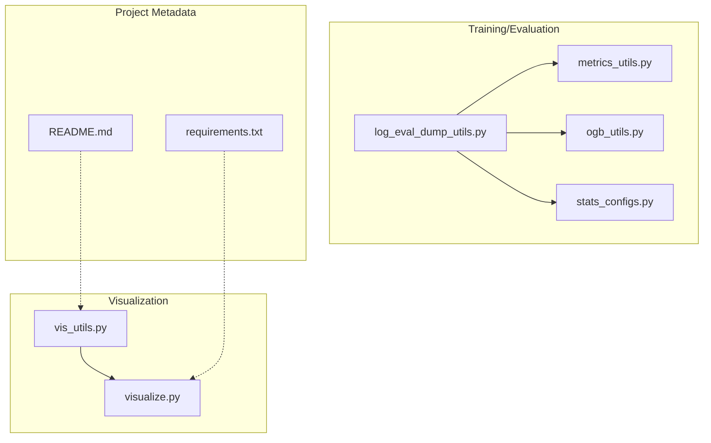
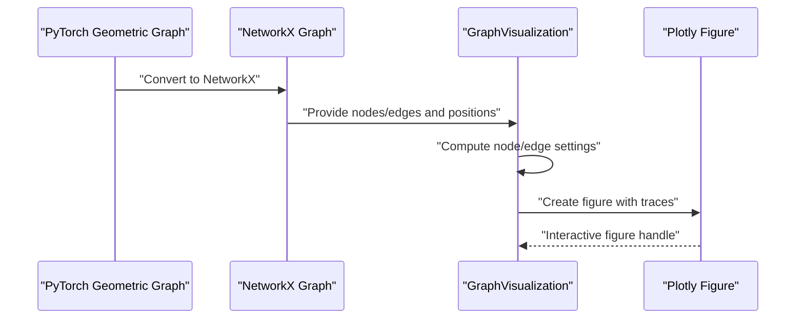
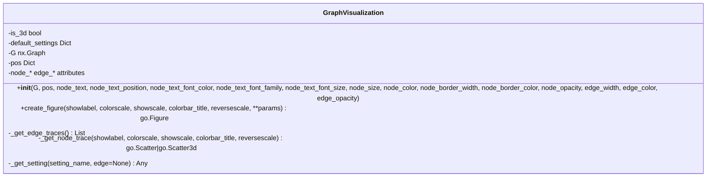
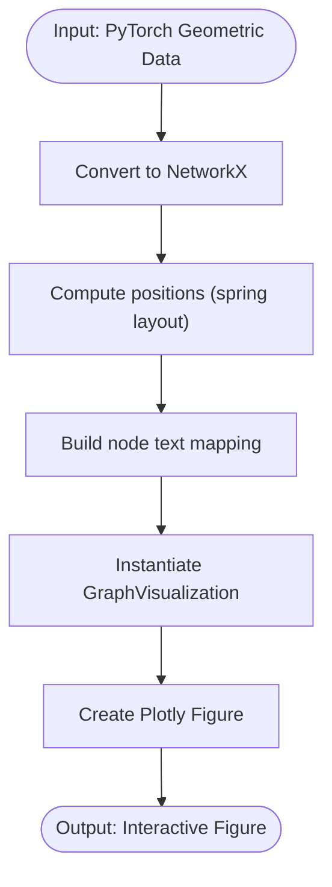
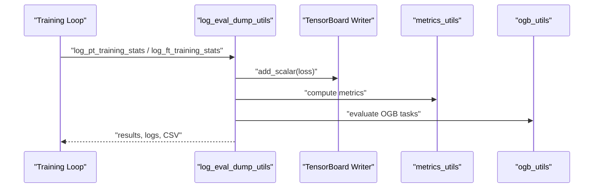
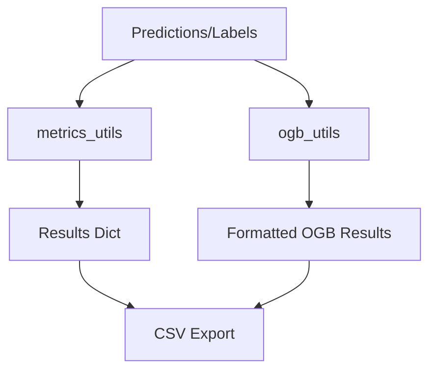
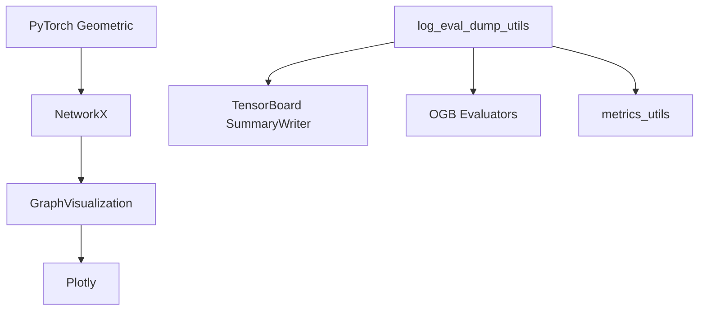

# Visualization Tools

<cite>
**Referenced Files in This Document**
- [visualize.py](file://src/utils/visualize.py)
- [vis_utils.py](file://src/utils/vis_utils.py)
- [log_eval_dump_utils.py](file://src/utils/log_eval_dump_utils.py)
- [metrics_utils.py](file://src/utils/metrics_utils.py)
- [ogb_utils.py](file://src/utils/ogb_utils.py)
- [stats_configs.py](file://src/conf/stats_configs.py)
- [README.md](file://README.md)
- [requirements.txt](file://requirements.txt)
</cite>

## Table of Contents
1. [Introduction](#introduction)
2. [Project Structure](#project-structure)
3. [Core Components](#core-components)
4. [Architecture Overview](#architecture-overview)
5. [Detailed Component Analysis](#detailed-component-analysis)
6. [Dependency Analysis](#dependency-analysis)
7. [Performance Considerations](#performance-considerations)
8. [Troubleshooting Guide](#troubleshooting-guide)
9. [Conclusion](#conclusion)
10. [Appendices](#appendices)

## Introduction
This document describes the Graph-GPT visualization utilities that enable data visualization, model analysis, and result presentation. It focuses on:
- Plotting functions for graph structures
- Interactive visualizations via Plotly
- Analytical chart generation for training and evaluation
- Integration with visualization libraries and reporting pipelines
- Practical visualization workflows, interpretation tips, and presentation optimization

The visualization stack centers around a dedicated graph visualization class and helper utilities that convert PyTorch Geometric graphs into interactive figures suitable for research and presentation.

## Project Structure
The visualization ecosystem is primarily located under the utils package:
- Graph visualization engine: visualize.py
- Helper utilities for graph creation and node labeling: vis_utils.py
- Training and evaluation logging/reporting: log_eval_dump_utils.py
- Metrics computation and OGB evaluation: metrics_utils.py, ogb_utils.py
- Training statistics and EMA support: stats_configs.py
- Top-level project and dependency metadata: README.md, requirements.txt

**Diagram sources**
- [visualize.py:1-233](file://src/utils/visualize.py#L1-L233)
- [vis_utils.py:1-31](file://src/utils/vis_utils.py#L1-L31)
- [log_eval_dump_utils.py:1-929](file://src/utils/log_eval_dump_utils.py#L1-L929)
- [metrics_utils.py:1-349](file://src/utils/metrics_utils.py#L1-L349)
- [ogb_utils.py:1-214](file://src/utils/ogb_utils.py#L1-L214)
- [stats_configs.py:1-158](file://src/conf/stats_configs.py#L1-L158)
- [README.md](file://README.md)
- [requirements.txt](file://requirements.txt)

**Section sources**
- [visualize.py:1-233](file://src/utils/visualize.py#L1-L233)
- [vis_utils.py:1-31](file://src/utils/vis_utils.py#L1-L31)
- [log_eval_dump_utils.py:1-929](file://src/utils/log_eval_dump_utils.py#L1-L929)
- [metrics_utils.py:1-349](file://src/utils/metrics_utils.py#L1-L349)
- [ogb_utils.py:1-214](file://src/utils/ogb_utils.py#L1-L214)
- [stats_configs.py:1-158](file://src/conf/stats_configs.py#L1-L158)
- [README.md](file://README.md)
- [requirements.txt](file://requirements.txt)

## Core Components
- GraphVisualization: A flexible class that renders NetworkX graphs into Plotly figures with customizable node/edge attributes, supports 2D and 3D layouts, and aggregates traces efficiently.
- vis_utils: Provides helpers to convert PyTorch Geometric graphs to NetworkX, compute node text labels, and produce ready-to-render figures.

Key capabilities:
- Automatic dimension detection (2D vs 3D) from node positions
- Per-vertex/per-edge customization of text, size, color, border, and opacity
- Efficient grouping of edges by color/width to minimize trace count
- Configurable color scales and optional colorbars
- Clean layout defaults optimized for presentations

**Section sources**
- [visualize.py:13-233](file://src/utils/visualize.py#L13-L233)
- [vis_utils.py:9-31](file://src/utils/vis_utils.py#L9-L31)

## Architecture Overview
The visualization pipeline converts PyTorch Geometric graphs into NetworkX graphs, computes positions, and renders them into Plotly figures. Evaluation and training utilities integrate metrics and OGB evaluators to produce reports consumable by TensorBoard or CSV.

**Diagram sources**
- [vis_utils.py:19-31](file://src/utils/vis_utils.py#L19-L31)
- [visualize.py:181-233](file://src/utils/visualize.py#L181-L233)

## Detailed Component Analysis

### GraphVisualization Class
The GraphVisualization class encapsulates rendering logic:
- Initialization validates positional dimensionality and sets defaults for node/edge appearance.
- Edge traces are grouped by color/width to reduce overhead.
- Node trace supports optional text labels, color scaling, and colorbar.
- Layout defaults emphasize clean visuals with transparent backgrounds and minimal axes.

**Diagram sources**
- [visualize.py:13-233](file://src/utils/visualize.py#L13-L233)

**Section sources**
- [visualize.py:13-233](file://src/utils/visualize.py#L13-L233)

### Visualization Helpers
The vis_utils module provides:
- Node text mapping from graph IDs to node labels for readable figures.
- A convenience function to build a figure from a PyTorch Geometric graph using NetworkX spring layout.

**Diagram sources**
- [vis_utils.py:9-31](file://src/utils/vis_utils.py#L9-L31)

**Section sources**
- [vis_utils.py:9-31](file://src/utils/vis_utils.py#L9-L31)

### Training/Evaluation Logging and Reporting
The logging utilities orchestrate training and evaluation, including:
- Loss and metric logging
- TensorBoard writer integration
- OGB evaluation for benchmark datasets
- CSV-based result dumps for downstream reporting

**Diagram sources**
- [log_eval_dump_utils.py:504-866](file://src/utils/log_eval_dump_utils.py#L504-L866)
- [metrics_utils.py:16-349](file://src/utils/metrics_utils.py#L16-L349)
- [ogb_utils.py:1-214](file://src/utils/ogb_utils.py#L1-L214)

**Section sources**
- [log_eval_dump_utils.py:504-866](file://src/utils/log_eval_dump_utils.py#L504-L866)
- [metrics_utils.py:16-349](file://src/utils/metrics_utils.py#L16-L349)
- [ogb_utils.py:1-214](file://src/utils/ogb_utils.py#L1-L214)

### Metrics and OGB Evaluation
- Metrics utilities provide classification and regression metrics with GPU-aware aggregation.
- OGB evaluators wrap dataset-specific evaluators and format outputs for CSV export.

**Diagram sources**
- [metrics_utils.py:16-349](file://src/utils/metrics_utils.py#L16-L349)
- [ogb_utils.py:1-214](file://src/utils/ogb_utils.py#L1-L214)

**Section sources**
- [metrics_utils.py:16-349](file://src/utils/metrics_utils.py#L16-L349)
- [ogb_utils.py:1-214](file://src/utils/ogb_utils.py#L1-L214)

## Dependency Analysis
- GraphVisualization depends on NetworkX and Plotly for graph conversion and interactive rendering.
- vis_utils bridges PyTorch Geometric and NetworkX, enabling seamless figure creation.
- Training/logging utilities depend on TensorBoard (via SummaryWriter) and OGB packages for evaluation.

**Diagram sources**
- [vis_utils.py:1-7](file://src/utils/vis_utils.py#L1-L7)
- [visualize.py:1-11](file://src/utils/visualize.py#L1-L11)
- [log_eval_dump_utils.py:34-38](file://src/utils/log_eval_dump_utils.py#L34-L38)

**Section sources**
- [vis_utils.py:1-7](file://src/utils/vis_utils.py#L1-L7)
- [visualize.py:1-11](file://src/utils/visualize.py#L1-L11)
- [log_eval_dump_utils.py:34-38](file://src/utils/log_eval_dump_utils.py#L34-L38)

## Performance Considerations
- Prefer grouping edges by color/width to minimize trace count; GraphVisualization already performs this grouping internally.
- Use 2D layouts for quick exploratory plots; switch to 3D only when spatial insights require it.
- Limit label density on nodes to avoid clutter; adjust node sizes and font sizes accordingly.
- For large graphs, consider subsampling or hierarchical layouts to improve readability.
- When exporting figures, choose appropriate image formats and resolutions for presentations.

[No sources needed since this section provides general guidance]

## Troubleshooting Guide
Common issues and remedies:
- Dimension mismatch in positions: Ensure all node positions have consistent dimensionality (2D or 3D) to avoid errors.
- Missing node IDs: If graph lacks an ID attribute, node text labels will be disabled; attach IDs or supply a custom mapping.
- OGB evaluation failures: Verify dataset names match registered evaluators and that predictions/labels are shaped correctly.
- TensorBoard writer not available: Install the appropriate TensorBoard package; the code gracefully falls back if unavailable.

**Section sources**
- [visualize.py:34-41](file://src/utils/visualize.py#L34-L41)
- [vis_utils.py:9-16](file://src/utils/vis_utils.py#L9-L16)
- [ogb_utils.py:1-214](file://src/utils/ogb_utils.py#L1-L214)
- [log_eval_dump_utils.py:34-38](file://src/utils/log_eval_dump_utils.py#L34-L38)

## Conclusion
The Graph-GPT visualization tools provide a robust foundation for rendering graph structures, integrating metrics and OGB evaluations, and generating interactive figures suitable for research and presentations. By leveraging GraphVisualization and vis_utils, teams can quickly transform PyTorch Geometric graphs into insightful visual artifacts and incorporate them into broader training and evaluation pipelines.

[No sources needed since this section summarizes without analyzing specific files]

## Appendices

### Visualization Workflows
- Graph rendering workflow: Convert PyG graph → NetworkX → GraphVisualization → Plotly figure.
- Evaluation reporting workflow: Run training/evaluation → log metrics → export CSV/OGB results → visualize trends.

**Section sources**
- [vis_utils.py:19-31](file://src/utils/vis_utils.py#L19-L31)
- [log_eval_dump_utils.py:504-866](file://src/utils/log_eval_dump_utils.py#L504-L866)

### Best Practices
- Keep node labels concise; reserve detailed annotations for hover info.
- Use color scales thoughtfully; ensure sufficient contrast for accessibility.
- For presentations, export static images at high resolution; for exploration, keep interactive figures.

[No sources needed since this section provides general guidance]
