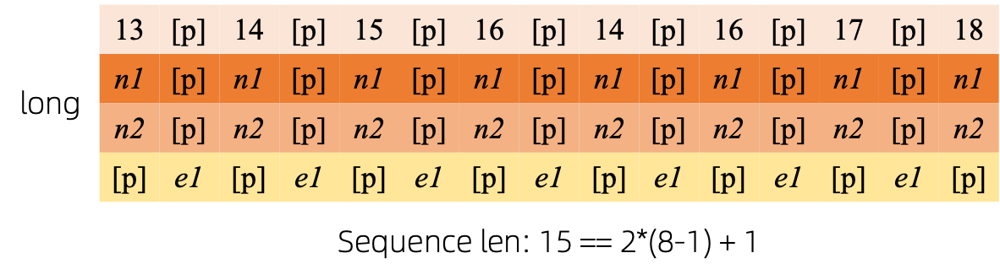

# GraphGPT: Generative Pre-trained Graph Eulerian Transformer

This repository is the official implementation of “[GraphGPT: Generative Pre-trained Graph Eulerian Transformer](https://arxiv.org/abs/2401.00529)” in [PyTorch](https://github.com/pytorch/pytorch).

> GraphGPT: Generative Pre-trained Graph Eulerian Transformer
>
> Qifang Zhao, Weidong Ren, Tianyu Li, Hong Liu, Xingsheng He, Xiaoxiao Xu

## Update:

***05/08/2025***
1. v0.5.0 released. Check `CHANGELOG.md` for details.
2. Four check-points for PCQM4M-v2 is available in [ModelScope](https://www.modelscope.cn/organization/Alibaba-DT), including pre-trained and fine-tuned models.
3. Achieving SOTA/closed-to-SOTA in 3 large scale ogb datasets:
   - PCQM4M-v2 (no 3D): 0.0802 (previous SOTA 0.0821)
   - PCQM4M-v2 (use 3D): 0.0709 (current SOTA 0.0683)
   - ogbl-ppa: 76.55 (previous SOTA 73.74)
   - ogbl-citation2: 93.05 (previous SOTA 90.72)
4. Paper updated to [v2](https://arxiv.org/abs/2401.00529).

***10/13/2024***
1. v0.4.0 released. Check `CHANGELOG.md` for details.
2. Achieving SOTA in 3 large scale ogb datasets:
   - PCQM4M-v2 (no 3D): 0.0802 (previous SOTA 0.0821)
   - ogbl-ppa: 68.76 (previous SOTA 65.24)
   - ogbl-citation2: 91.15 (previous SOTA 90.72)

***08/18/2024***
1. v0.3.1 released. Check `CHANGELOG.md` for details.

***07/09/2024***
1. v0.3.0 released.

***03/19/2024***
  1. v0.2.0 released.
  2. Implement `permute_nodes` for graph-level map-style dataset, in order to increase variations of Eulerian paths,
     and result in better and robust results.
  3. Add `StackedGSTTokenizer` so that semantics (i.e., node/edge attrs) tokens can be stacked together with structural 
     tokens, and the length of sequence would be reduced a lot.
  4. refactor codes.

***01/23/2024***
  1. v0.1.1, fix bugs of common-io package.

***01/03/2024***
  1. Initial release of codes.

## Future Directions

### Scaling Law: What’s the Scaling Limit of GraphGPT Models?  

- GPT models trained on text data can scale to hundreds of billions of parameters while continually improving their capabilities.  
- Text data provides trillions of tokens with high complexity, embedding rich social and natural knowledge.  
- In contrast, graph data without node/edge attributes contains only structural information, which is far more limited than text. Much of the hidden information (e.g., degrees, substructure counts, etc.) in graphs can be calculated exactly using tools like NetworkX. Consequently, structural information alone may not support scaling models to billions of parameters.  
    - Preliminary experiments on large-scale graph datasets show that GraphGPT scales to 200M+ parameters with performance gains but plateaus beyond this. While insufficient experimentation could be a factor, inherent limitations in graph data complexity may contribute.  
- Large graph datasets (e.g., one massive graph or numerous small graphs) with node/edge attributes might provide sufficient information for training large GraphGPT models. However, diverse datasets may be necessary to train a universal model.  
    - A key challenge is designing a universal tokenizer for heterogeneous node/edge attributes across datasets.  

### High-Quality Graph Data: What Defines High-Quality Graph Data for Training General-Purpose GraphGPT?  

- **Example: Training a model for molecule understanding/generation tasks**  
    - Adding ZINC (4.6M) and CEPDB (2.3M) datasets during pretraining yielded no improvement on the PCQM4M-v2 HOMO-LUMO gap prediction task. Potential reasons:  
        - **Structure**: Molecule graphs exhibit simple patterns (e.g., chains, 5/6-node rings).  
            - Atoms average 2 bonds per node.  
        - **Semantics**: Chemical rules are straightforward (e.g., carbon = 4 bonds, nitrogen = 3 bonds). Satisfying bond counts enables valid molecule generation.  
        - These simple structural/semantic rules allow medium-sized models to learn effectively from modest datasets. Pretraining small/medium/base/large models on 3.7M molecules resulted in similar loss values, suggesting diminishing returns from scaling.  

- **Training a universal graph structure understanding model**  
    - Should training data include real-world graphs (social/citation networks) or synthetic graphs (Erdős–Rényi)?  
    - Pretraining on synthetic graphs improves structural understanding but shows instability. Performance likely depends on alignment between pretraining and fine-tuning graph distributions (e.g., node/edge counts).  
    - **Key Question**: How can GraphGPT achieve universal understanding of arbitrary graph structures?  
- This ties back to scaling laws: Identifying rich, diverse graph data is critical for scaling GraphGPT to handle varied tasks.  

### Few-Shot Learning: Can GraphGPT Achieve Few-Shot Capability?  

- **Designing training data for few-shot learning**  
- Preliminary tests on PCQM4M-v2 show no few-shot ability, but this could stem from:  
    - **Model size**: The base model (~100M parameters) may be too small.  
    - **Data volume**: 3.7M molecules may offer insufficient tokens for robust learning.  
    - **Data format**: Current pretraining formats may not encourage few-shot generalization.


## Overview:


We introduce GraphGPT, a novel self-supervised generative pre-trained model for graph learning based on the Graph Eulerian Transformer (GET).
First, we propose GET, which combines a standard transformer encoder or decoder architecture with an innovative graph-to-sequence transformation method.
This method converts graphs or sampled subgraphs into sequences of tokens representing nodes, edges, and attributes in a reversible manner using Eulerian paths.
We pre-train GET using either of the two self-supervised tasks: next-token prediction ([NTP](https://cdn.openai.com/research-covers/language-unsupervised/language_understanding_paper.pdf))
and scheduled maskedtoken prediction ([SMTP](https://arxiv.org/abs/2202.04200)). 
The pre-trained model is then fine-tuned for downstream tasks such as graph-, edge-, and node-level prediction.
Despite its simplicity, GraphGPT achieves performance comparable to or surpassing state-of-the-art methods on multiple large-scale Open Graph Benchmark (OGB) datasets.
It demonstrates exceptional results on the molecular property prediction dataset PCQM4Mv2 and the protein-protein interaction dataset ogbl-ppa. 
Notably, generative pretraining enables scaling GraphGPT to 2 billion parameters while maintaining performance gains — a breakthrough that overcomes the scalability
limitations of traditional Graph Neural Networks (GNNs) and prior graph transformers (GTs).
To advance research in graph foundation models and facilitate scientific discovery in chemistry, materials science, and related fields, 
we will release the [source code](https://github.com/alibaba/graph-gpt) and pre-trained [checkpoints](https://www.modelscope.cn/organization/Alibaba-DT).

### Graph to Sequences

After converting Eulerized graphs to sequences, there are several different ways to attach node and edge attributes to
the sequences. We name these methods as `short`, `long` and `prolonged`.

Given the graph, we Eulerize it first, and then turn it into an equivalent sequence. And then, we re-index the nodes
cyclically.


Assume the graph has one node attributes and one edge attributes, and then the `short`, `long` and `prolong` method 
are shown above.

[//]: # (attaches the attributes)

[//]: # (as follows:)

[//]: # ()
[//]: # ()

[//]: # ()
[//]: # (And the `long` method as follows:)

[//]: # ()
[//]: # ()

[//]: # ()
[//]: # (And the `prolong` method as below:)

[//]: # ()
[//]: # (![prolong]&#40;pic/prolong.png&#41;)

In the above figures, `n1`, `n2` and `e1` represents the tokens of node and edge attributes, and `[p]` represents the
padding token.

#### Cyclical node re-index

A straightforward way to re-index the sequence of nodes is to start with 0 and add 1 incrementally. By this way, tokens
of small indices will be sufficiently trained, and the large indices won't. To overcome this, we propose
`cyclical re-index`, which starts with a random number in the given range, say `[0, 255]`, and increment by 1.
After hitting the boundary, e.g., `255`, the next node index will be 0.


## Results updated @ 2025-05-15

### Graph-level task: PCQM4M-v2 and ogbg-molpcba


### Edge-level tasks: ogbl-ppa and ogbl-citation2


### Node-level-task: ogbn-proteins and ogbn-products


## Installation

- Clone this repository

```shell
git clone https://github.com/alibaba/graph-gpt.git
```

- Install the dependencies in requirements.txt (Using [Anaconda](https://www.anaconda.com/), tested with py38, pytorch-1131 and CUDA-11.7, 11.8 and 12.1 on GPU V100 and A100)

```shell
conda create -n graph_gpt python=3.8 pytorch==1.13.1 torchvision==0.14.1 torchaudio==0.13.1 pytorch-cuda=11.7 -c pytorch -c nvidia
conda activate graph_gpt
cd graph-gpt
pip install -r ./requirements.txt
pip install torch-scatter torch-sparse -f https://data.pyg.org/whl/torch-1.13.1+cpu.html
sudo apt-get install bc
```


## Datasets

The datasets are downloaded using python package [ogb](https://pypi.org/project/ogb/).

When you run scripts in `./examples`, the dataset will be automatically downloaded.

However, the dataset PCQM4M-v2 is huge, and downloading and
preprocessing might be problematic. We suggest `cd ./src/utils/` and `python dataset_utils.py`
to download and preprocess dataset separately.


## Run

1. Pre-train: Modify parameters in `./examples/graph_lvl/pcqm4m_v2_pretrain.sh`, e.g., `dataset_name`, `model_name`,
  `batch_size`, `workerCount` and etc, and then run `./examples/graph_lvl/pcqm4m_v2_pretrain.sh` to pretrain
  the model with the PCQM4M-v2 dataset. 
   - To run toy example, run `./examples/toy_examples/reddit_pretrain.sh` directly.
2. Fine-tune: Modify parameters in `./examples/graph_lvl/pcqm4m_v2_supervised.sh`, e.g., `dataset_name`, `model_name`,
  `batch_size`, `workerCount`, `pretrain_cpt` and etc, and then run `./examples/graph_lvl/pcqm4m_v2_supervised.sh`
  to fine-tune with downstream tasks.
   - To run toy example, run `./examples/toy_examples/reddit_supervised.sh` directly.


## Code Norm
### Pre-commit
- Check the [official website](https://pre-commit.com/) for details
- `.pre-commit-config.yaml`: create the file with following content for python
  - ```yaml
    repos:
    -   repo: https://github.com/pre-commit/pre-commit-hooks
        rev: v4.4.0
        hooks:
        -   id: check-yaml
        -   id: end-of-file-fixer
        -   id: trailing-whitespace
    -   repo: https://github.com/psf/black
        rev: 23.7.0
        hooks:
        -   id: black
    ```
- `pre-commit install`: install pre-commit into your git hooks.
  - pre-commit will now run on every commit.
  - Every time you clone a project using pre-commit running `pre-commit install` should always be the first thing you do.
- `pre-commit run --all-files`: run all pre-commit hooks on a repository
- `pre-commit autoupdate`: update your hooks to the latest version automatically
- `git commit -n`: pre-commit checks can be disabled for a particular commit with the command


## Citation

If you find this work useful, please kindly cite following papers:

```latex
@article{zhao2024graphgpt,
  title={GraphGPT: Generative Pre-trained Graph Eulerian Transformer},
  author={Zhao, Qifang and Ren, Weidong and Li, Tianyu and Liu, Hong and He, Xingsheng and Xu, Xiaoxiao},
  journal={arXiv preprint arXiv:2401.00529},
  year={2024}
}
```

## Contact

Qifang Zhao (james.zqf@alibaba-inc.com)

Sincerely appreciate your suggestions on our work!

## License

Released under the MIT license (see `LICENSE`):

```text
Ali-GraphGPT-project is an AI project on training large scale transformer with graph datasets,
developed by Alibaba and licensed under the MIT License.
```
