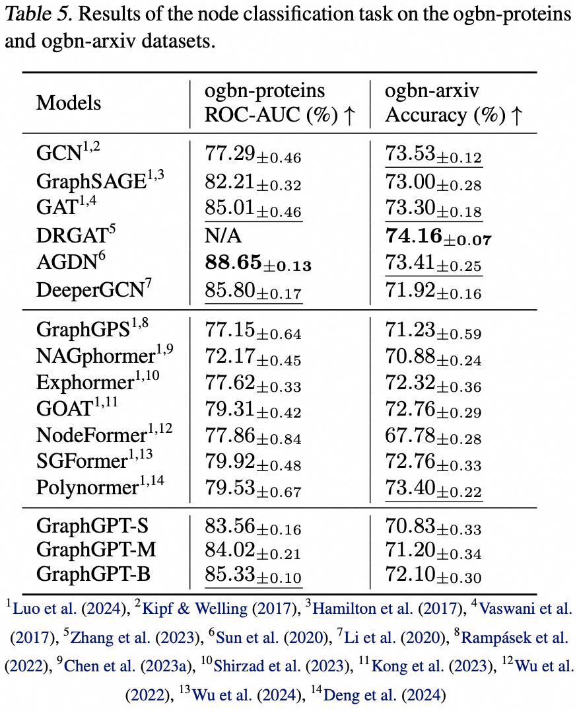

# GraphGPT: Graph Learning with Generative Pre-trained Transformers

This repository is the official implementation of “[GraphGPT: Graph Learning with Generative Pre-trained Transformers](https://arxiv.org/abs/2401.00529)” in [PyTorch](https://github.com/pytorch/pytorch).

> GraphGPT: Graph Learning with Generative Pre-trained Transformers
>
> Qifang Zhao, Weidong Ren, Tianyu Li, Xiaoxiao Xu, Hong Liu

## Update:

***10/13/2024***
1. v0.4.0 released. Check `CHANGELOG.md` for details.
2. Achieving SOTA in 3 large scale ogb datasets:
   - PCQM4M-v2 (no 3D): 0.0802 (previous SOTA 0.0821)
   - ogbl-ppa: 68.76 (previous SOTA 65.24)
   - ogbl-citation2: 91.15 (previous SOTA 90.72)

***08/18/2024***
1. v0.3.1 released. Check `CHANGELOG.md` for details.

***07/09/2024***
1. v0.3.0 released.

***03/19/2024***
  1. v0.2.0 released.
  2. Implement `permute_nodes` for graph-level map-style dataset, in order to increase variations of Eulerian paths,
     and result in better and robust results.
  3. Add `StackedGSTTokenizer` so that semantics (i.e., node/edge attrs) tokens can be stacked together with structural 
     tokens, and the length of sequence would be reduced a lot.
  4. refactor codes.

***01/23/2024***
  1. v0.1.1, fix bugs of common-io package.

***01/03/2024***
  1. Initial release of codes.

## Future Directions

### Scaling law: what’s the scaling limit of GraphGPT models?

- As we know, GPT trained with text data can scale to hundreds of billions of parameters, and keep improving its capability.
- Text data can provide trillions of tokens, and has very high complexity, and it possess lots of knowledge, including social and natural knowledge. 
- In contrast, graph data without node/edge attributes contains only structure information, which is quite limited compared to text data. Most hidden information （e.g, degrees, count of substructures and etc.） behind the structure can be calculated exactly using packages like networkx. Therefore, information from graph structure might not be able to support the scaling of model size till billions of parameters.
    - Our preliminary experiments with various large-scale graph datasets show that we can scale GraphGPT up to 400M+ parameters with improving performance. But we cannot improve the results further. It could be due to our insufficient experiments. But it is possible that the inherent limitations of graph data caused this.
- Large graph datasets (either one big graph or huge amounts of small graphs) with node/edge attributes might be able to provide enough information for us to train a big GraphGPT model. Even so, one graph dataset may not be enough, and we may need to collect various graph datasets to train one GraphGPT.
    - The problem here is how to define a universal tokenizer for edge/node attributes from various graph datasets.

### High quality graph data: What are high quality graph data for training a GraphGPT for general tasks?

- For example, if we want to train one model for all kinds of molecule understanding and generation tasks, what kind of data shall we use?
    - From our preliminary investigation, we add ZINC (4.6M) and CEPDB (2.3M) to pre-train, has observed no gains when fine-tuning PCQM4M-v2 for the homo-lumo gap prediction task. The possible reasons could be as follows:
        - #structure# The graph patterns behind the molecule graph is relatively simple. 
            - Graph patterns like chains or 5/6-node rings are very common.
            - On average 2 edges per node, meaning that atoms have 2 bonds on average.
        - #semantics# The chemical rules for constructing organic small molecules are simple: the carbon atom has 4 bonds, the nitrogen atom has 3 bonds, the oxygen atom has 2 bonds and the hydrogen atom has 1 bond, and so on. Simply speaking, as long as we have the atoms’ bond counts satisfied, we can generate any molecules. 
        - The rules from both structure and semantics are so simple that even a medium model can learn from the medium-size dataset. So adding extra data does not help. We pre-train small/medium/base/large models using 3.7M molecule data, and their loss are very close, indicating limited gains from enlarging model sizes in the pre-train stage.
- Second, if we want to train one model for any types of graph structure understanding tasks, what kind of data shall we use?
    - Shall we use true graph data from social networks, citation networks and etc, or just use synthetic graph data, such as random Erdos-Renyi graphs?
    - Our preliminary experiments show that using random graphs to pre-train GraphGPT is helpful for the model to understand graph structures, but it is unstable. We suspect that it is related to the distributions of the graph structures in the pre-train and fine-tune stages. For example, it they have similar number of edges per node, similar number of nodes, then the pre-train & fine-tune paradigm works well.
    - #Universality# So, how to train a GraphGPT model to understand any graph structure universally?
- This goes back to previous questions about scaling law: what are the proper and high quality graph data to keep scaling up GraphGPT so that it can do various graph tasks well?

### Few-shot: Can GraphGPT gain few-shot capability?

- If possible, how to design the training data to enable GraphGPT to learn it?
- From our preliminary experiments with the PCQM4M-v2 dataset, no few shot learning ability is observed! But it does not mean it cannot. It could be due to the following reasons:
    - The model is not  large enough. We use base model with ~100M params.
    - The training data is not enough. We only use 3.7M molecules, which provides only limited tokens for training.
    - The format of training data is not suitable for the model to gain few-shot capability.


## Overview:


We propose GraphGPT, a novel model for Graph learning by self-supervised Generative Pre-training Graph Eulerian Transformers (GET).
We first introduce GET, which consists of a vanilla transformer encoder/decoder backbone and a transformation that 
turns each graph or sampled subgraph into a sequence of tokens representing the node, edge and attributes reversibly 
using the Eulerian path. 
Then we pre-train the GET with either the next-token-prediction (NTP) task or scheduled 
masked-token-prediction (SMTP) task. 
Lastly, we fine-tune the model with the supervised tasks.
This intuitive, yet effective model achieves superior or close results to the state-of-the-art methods for the graph-, 
edge- and node-level tasks on the large scale molecular dataset PCQM4Mv2, the protein-protein association dataset 
ogbl-ppa, citation network dataset ogbl-citation2 and the ogbn-proteins dataset from the Open Graph Benchmark (OGB).
Furthermore, the generative pre-training enables us to train GraphGPT up to 2B+ parameters with consistently 
increasing performance, which is beyond the capability of GNNs and previous graph transformers.

### Graph to Sequences

After converting Eulerized graphs to sequences, there are several different ways to attach node and edge attributes to
the sequences. We name these methods as `short`, `long` and `prolonged`.

Given the graph, we Eulerize it first, and then turn it into an equivalent sequence. And then, we re-index the nodes
cyclically.


Assume the graph has one node attributes and one edge attributes, and then the `short`, `long` and `prolong` method 
are shown above.

[//]: # (attaches the attributes)

[//]: # (as follows:)

[//]: # ()
[//]: # ()

[//]: # ()
[//]: # (And the `long` method as follows:)

[//]: # ()
[//]: # ()

[//]: # ()
[//]: # (And the `prolong` method as below:)

[//]: # ()
[//]: # (![prolong]&#40;pic/prolong.png&#41;)

In the above figures, `n1`, `n2` and `e1` represents the tokens of node and edge attributes, and `[p]` represents the
padding token.

#### Cyclical node re-index

A straightforward way to re-index the sequence of nodes is to start with 0 and add 1 incrementally. By this way, tokens
of small indices will be sufficiently trained, and the large indices won't. To overcome this, we propose
`cyclical re-index`, which starts with a random number in the given range, say `[0, 255]`, and increment by 1.
After hitting the boundary, e.g., `255`, the next node index will be 0.


## Results

Outdated. To be updated soon. 

### Graph-level-task: PCQM4M-v2 dataset


### Edge-level-task: ogbl-ppa dataset


### Node-level-task: ogbn-proteins dataset



## Installation

- Clone this repository

```shell
git clone https://github.com/alibaba/graph-gpt.git
```

- Install the dependencies in requirements.txt (Using [Anaconda](https://www.anaconda.com/), tested with py38, pytorch-1131 and CUDA-11.7, 11.8 and 12.1 on GPU V100 and A100)

```shell
conda create -n graph_gpt python=3.8 pytorch==1.13.1 torchvision==0.14.1 torchaudio==0.13.1 pytorch-cuda=11.7 -c pytorch -c nvidia
conda activate graph_gpt
cd graph-gpt
pip install -r ./requirements.txt
pip install torch-scatter torch-sparse -f https://data.pyg.org/whl/torch-1.13.1+cpu.html
sudo apt-get install bc
```


## Datasets

The datasets are downloaded using python package [ogb](https://pypi.org/project/ogb/).

When you run scripts in `./examples`, the dataset will be automatically downloaded.

However, the dataset PCQM4M-v2 is huge, and downloading and
preprocessing might be problematic. We suggest `cd ./src/utils/` and `python dataset_utils.py`
to download and preprocess dataset separately.


## Run

1. Pre-train: Modify parameters in `./examples/graph_lvl/pcqm4m_v2_pretrain.sh`, e.g., `dataset_name`, `model_name`,
  `batch_size`, `workerCount` and etc, and then run `./examples/graph_lvl/pcqm4m_v2_pretrain.sh` to pretrain
  the model with the PCQM4M-v2 dataset. 
   - To run toy example, run `./examples/toy_examples/reddit_pretrain.sh` directly.
2. Fine-tune: Modify parameters in `./examples/graph_lvl/pcqm4m_v2_supervised.sh`, e.g., `dataset_name`, `model_name`,
  `batch_size`, `workerCount`, `pretrain_cpt` and etc, and then run `./examples/graph_lvl/pcqm4m_v2_supervised.sh`
  to fine-tune with downstream tasks.
   - To run toy example, run `./examples/toy_examples/reddit_supervised.sh` directly.


## Code Norm
### Pre-commit
- Check the [official website](https://pre-commit.com/) for details
- `.pre-commit-config.yaml`: create the file with following content for python
  - ```yaml
    repos:
    -   repo: https://github.com/pre-commit/pre-commit-hooks
        rev: v4.4.0
        hooks:
        -   id: check-yaml
        -   id: end-of-file-fixer
        -   id: trailing-whitespace
    -   repo: https://github.com/psf/black
        rev: 23.7.0
        hooks:
        -   id: black
    ```
- `pre-commit install`: install pre-commit into your git hooks.
  - pre-commit will now run on every commit.
  - Every time you clone a project using pre-commit running `pre-commit install` should always be the first thing you do.
- `pre-commit run --all-files`: run all pre-commit hooks on a repository
- `pre-commit autoupdate`: update your hooks to the latest version automatically
- `git commit -n`: pre-commit checks can be disabled for a particular commit with the command


## Citation

If you find this work useful, please kindly cite following papers:

```latex
@article{zhao2024graphgpt,
  title={GraphGPT: Graph Learning with Generative Pre-trained Transformers},
  author={Zhao, Qifang and Ren, Weidong and Li, Tianyu and Xu, Xiaoxiao and Liu, Hong},
  journal={arXiv preprint arXiv:2401.00529},
  year={2024}
}
```

## Contact

Qifang Zhao (james.zqf@alibaba-inc.com)

Sincerely appreciate your suggestions on our work!

## License

Released under the MIT license (see `LICENSE`):

```text
Ali-GraphGPT-project is an AI project on training large scale transformer decoder with graph datasets,
developed by Alibaba and licensed under the MIT License.
```
